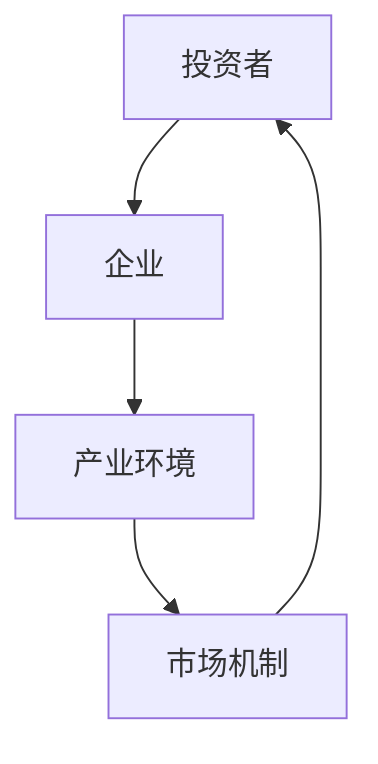
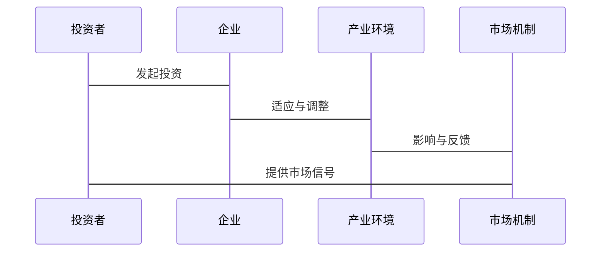

                 


# 特价股票投资中的动态产业生态系统模型应用

## 关键词：
- 特价股票投资
- 动态产业生态系统模型
- 系统架构设计
- 算法原理
- 项目实战

## 摘要：
本文深入探讨了动态产业生态系统模型在特价股票投资中的应用，从背景介绍、核心概念、算法原理到系统架构设计、项目实战，全面分析了该模型在股票投资中的价值和实现方式。文章通过详细的技术分析和实际案例，展示了如何利用动态产业生态系统模型帮助投资者做出更明智的决策。

---

## 第一部分: 特价股票投资中的动态产业生态系统模型概述

### 第1章: 特价股票投资与动态产业生态系统模型背景

#### 1.1 特价股票投资的定义与特点

##### 1.1.1 特价股票的定义
特价股票通常指价格被市场低估的股票，具有较高的投资潜力。这类股票可能因市场波动、公司暂时性问题或行业周期性调整而被低估。

##### 1.1.2 特价股票投资的特点
- **低估值**：市盈率、市净率等指标低于行业平均水平。
- **高潜力**：公司基本面良好，未来增长潜力大。
- **周期性**：通常出现在经济周期的底部阶段。

##### 1.1.3 特价股票投资的市场现状
近年来，随着市场波动加剧，越来越多的投资者开始关注特价股票投资，尤其是在经济下行周期中，低价股票往往具备更高的安全边际。

#### 1.2 动态产业生态系统模型的定义与特点

##### 1.2.1 动态产业生态系统模型的定义
动态产业生态系统模型是一种用于分析产业内部和外部动态关系的系统模型，强调企业、产业环境和市场机制之间的互动。

##### 1.2.2 动态产业生态系统模型的核心特点
- **动态性**：能够实时捕捉产业环境的变化。
- **系统性**：从整体角度分析产业生态系统的结构和功能。
- **交互性**：强调企业与企业、企业与产业环境之间的互动关系。

#### 1.3 特价股票投资与动态产业生态系统模型的联系

##### 1.3.1 特价股票投资中的产业动态分析
通过动态产业生态系统模型，投资者可以识别行业周期变化，判断公司是否处于困境反转阶段。

##### 1.3.2 动态产业生态系统模型在股票投资中的应用价值
- **风险控制**：帮助投资者识别潜在风险。
- **投资机会发现**：识别具有成长潜力的低价股票。
- **决策支持**：提供多维度的分析支持。

---

### 第2章: 动态产业生态系统模型的核心概念与联系

#### 2.1 动态产业生态系统模型的核心要素

##### 2.1.1 企业主体
- **企业规模**：企业的收入、利润、员工数量等指标。
- **企业盈利能力**：净利润率、ROE等指标。

##### 2.1.2 产业环境
- **产业发展阶段**：成熟期、成长期、衰退期。
- **产业政策**：政府政策对企业的影响。

##### 2.1.3 市场机制
- **供需关系**：市场的供给与需求动态。
- **价格机制**：价格波动对市场的影响。

##### 2.1.4 产业网络
- **产业链**：从上游到下游的产业价值链。
- **产业关联**：企业之间的上下游关系。

#### 2.2 动态产业生态系统模型的属性特征对比

##### 2.2.1 企业间的竞争与合作关系
- **竞争关系**：行业内竞争加剧。
- **合作关系**：企业间的协同效应。

##### 2.2.2 产业链的动态调整
- **调整方向**：从上游到下游的动态调整。
- **调整速度**：快速调整 vs. 慢速调整。

##### 2.2.3 市场供需的动态平衡
- **供大于求**：价格下跌。
- **求大于供**：价格上涨。

#### 2.3 动态产业生态系统模型的ER实体关系图

```
```mermaid
erDiagram
    投资者 --> 特价股票 : 投资行为
    特价股票 --> 企业 : 股权关系
    企业 --> 产业环境 : 适应与调整
    产业环境 --> 市场机制 : 影响与反馈
```
```

---

## 第二部分: 动态产业生态系统模型的算法原理与实现

### 第3章: 算法原理与实现

#### 3.1 动态产业生态系统模型的算法原理

##### 3.1.1 算法概述
动态产业生态系统模型基于系统动力学理论，通过构建微分方程组模拟产业生态系统的动态变化。

##### 3.1.2 算法流程
1. 数据采集：收集企业、产业环境、市场机制等数据。
2. 模型构建：建立产业生态系统的系统动力学模型。
3. 模拟运行：通过数值模拟分析系统的动态行为。
4. 结果分析：根据模拟结果制定投资策略。

#### 3.2 算法实现

##### 3.2.1 Python代码实现
```python
import numpy as np
import matplotlib.pyplot as plt

def dynamic_industry_model(initial_conditions, parameters, steps):
    # 初始化变量
    t = np.linspace(0, steps, steps+1)
    x = np.zeros(steps+1)
    x[0] = initial_conditions['x0']
    
    for i in range(steps):
        dxdt = parameters['a'] * x[i] * (1 - x[i]/parameters['K'])
        x[i+1] = x[i] + dxdt * (t[i+1] - t[i])
    
    return t, x

# 示例：模拟产业生态系统的动态变化
initial_conditions = {'x0': 0.1}
parameters = {'a': 1, 'K': 1}
steps = 50

t, x = dynamic_industry_model(initial_conditions, parameters, steps)
plt.plot(t, x)
plt.xlabel('时间')
plt.ylabel('系统状态')
plt.show()
```

##### 3.2.2 数学模型与公式
动态产业生态系统模型的数学表达式如下：
$$
\frac{dx}{dt} = r x \left(1 - \frac{x}{K}\right)
$$
其中：
- \( x \) 表示系统的状态变量（如企业数量）。
- \( r \) 表示增长速率。
- \( K \) 表示系统的承载能力。

---

## 第三部分: 系统分析与架构设计

### 第4章: 系统分析与架构设计

#### 4.1 系统架构设计

##### 4.1.1 系统架构图


#### 4.2 接口设计

##### 4.2.1 系统接口设计


---

## 第四部分: 项目实战

### 第5章: 项目实战

#### 5.1 环境安装

##### 5.1.1 环境要求
- Python 3.8+
- numpy、pandas、matplotlib库

#### 5.2 核心代码实现

##### 5.2.1 特价股票筛选代码
```python
import pandas as pd

# 数据加载
data = pd.read_csv('stock_data.csv')

# 特价股票筛选条件
low_valuation_stocks = data[(data['市盈率'] < data['市盈率'].mean()) &
                              (data['市净率'] < data['市净率'].mean())]

print(low_valuation_stocks.head())
```

##### 5.2.2 动态产业模型模拟代码
```python
import numpy as np
import matplotlib.pyplot as plt

def dynamic_industry_model(initial_conditions, parameters, steps):
    t = np.linspace(0, steps, steps+1)
    x = np.zeros(steps+1)
    x[0] = initial_conditions['x0']
    
    for i in range(steps):
        dxdt = parameters['a'] * x[i] * (1 - x[i]/parameters['K'])
        x[i+1] = x[i] + dxdt * (t[i+1] - t[i])
    
    return t, x

# 示例
initial_conditions = {'x0': 0.1}
parameters = {'a': 1, 'K': 1}
steps = 50

t, x = dynamic_industry_model(initial_conditions, parameters, steps)
plt.plot(t, x)
plt.xlabel('时间')
plt.ylabel('系统状态')
plt.show()
```

---

## 第五部分: 最佳实践与总结

### 第6章: 最佳实践与总结

#### 6.1 小结
动态产业生态系统模型为特价股票投资提供了系统性的分析工具，帮助投资者更好地理解市场动态。

#### 6.2 注意事项
- 数据的准确性和及时性是模型分析的基础。
- 模型结果需结合市场实际情况进行调整。

#### 6.3 拓展阅读
- 《系统动力学在金融中的应用》
- 《产业生态学导论》

---

## 作者：AI天才研究院 & 禅与计算机程序设计艺术

---

以上是文章的完整目录结构和部分正文内容，涵盖了从背景介绍、核心概念、算法原理到系统架构设计、项目实战和最佳实践的全过程。希望这篇文章能为特价股票投资中的动态产业生态系统模型应用提供清晰的思路和实践指导。

