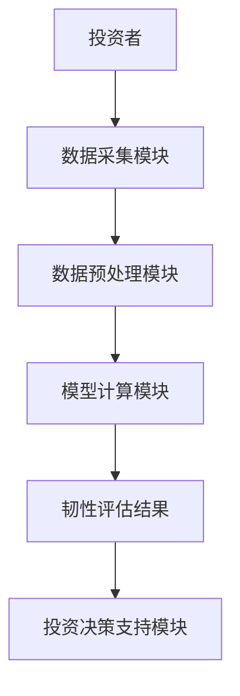

                 


# 特价股票投资中的动态数字产业生态系统韧性模型应用

## 关键词：特价股票投资，动态数字产业，生态系统韧性，系统架构，数学模型，算法原理，系统设计

## 摘要：  
本文探讨了在特价股票投资中应用动态数字产业生态系统韧性模型的理论与实践。文章首先介绍了特价股票投资的背景及其重要性，随后详细阐述了动态数字产业生态系统韧性模型的核心概念、属性特征和数学模型。通过构建ER实体关系图和系统架构图，文章分析了如何将该模型应用于实际投资决策中。最后，通过具体案例分析和实战指导，本文展示了该模型在特价股票投资中的应用效果，并提出了相应的最佳实践建议。

---

# 第一部分: 特价股票投资中的动态数字产业生态系统韧性模型背景介绍

## 第1章: 特价股票投资的背景与现状

### 1.1 特价股票投资的概念与定义

#### 1.1.1 特价股票的定义与特征  
特价股票是指市场价格低于其内在价值的股票，通常被认为具有较高的投资潜力。其特征包括低市盈率、低市净率和高股息率等。这类股票通常被市场低估，但具有较高的增值空间。

#### 1.1.2 特价股票投资的市场现状  
当前，股票市场波动剧烈，投资者在寻找稳定回报的同时，需要考虑市场风险。特价股票因其低估值特性，成为投资者关注的焦点。然而，如何筛选出真正具有投资价值的特价股票，仍是一个挑战。

#### 1.1.3 特价股票投资的学术研究现状  
学术界对特价股票的研究主要集中在估值模型和市场行为分析上。然而，现有的研究较少将动态数字产业生态系统韧性模型应用于特价股票投资中，这为本文的研究提供了创新空间。

### 1.2 动态数字产业生态系统韧性模型的提出

#### 1.2.1 动态数字产业的概念与特点  
动态数字产业指那些能够快速适应市场变化、利用数字技术提升竞争力的产业。其特点包括高创新性、强关联性和快速演变性。

#### 1.2.2 生态系统韧性的定义与意义  
生态系统韧性指系统在面对外部干扰时保持稳定性和恢复能力的能力。在投资领域，生态系统韧性能够帮助投资者识别具有较强抗风险能力的产业。

#### 1.2.3 模型提出的目的与目标  
本文提出动态数字产业生态系统韧性模型，旨在通过量化分析产业生态系统的韧性，为特价股票投资提供科学依据。

### 1.3 本章小结  
本章介绍了特价股票投资的背景与现状，并提出了动态数字产业生态系统韧性模型的概念，为后续分析奠定了基础。

---

# 第二部分: 动态数字产业生态系统韧性模型的核心概念与联系

## 第2章: 动态数字产业生态系统韧性模型的核心要素

### 2.1 动态数字产业生态系统的核心要素

#### 2.1.1 产业参与者的角色与属性  
产业参与者包括上市公司、投资者、监管机构等。每个参与者在生态系统中扮演不同的角色，具有特定的属性和行为模式。

#### 2.1.2 产业生态系统的动态特征  
动态性是生态系统的核心特征之一，表现为产业结构的调整、市场趋势的变化和参与者行为的动态性。

#### 2.1.3 产业生态系统的网络结构  
产业生态系统可以看作是一个复杂的网络，节点代表产业参与者，边代表它们之间的关联关系。

### 2.2 生态系统韧性的核心概念

#### 2.2.1 生态系统韧性的定义与内涵  
生态系统韧性是指系统在面对外部冲击时，能够保持稳定并迅速恢复的能力。

#### 2.2.2 生态系统韧性的测量指标  
常用的韧性指标包括抗冲击能力、恢复能力和适应能力。这些指标可以通过定量分析和定性分析相结合的方法进行评估。

#### 2.2.3 生态系统韧性的动态特征  
韧性是一个动态过程，随着时间的推移，系统内部和外部的条件变化会影响其韧性表现。

### 2.3 模型的核心要素与关系

#### 2.3.1 模型的核心要素分析  
模型的核心要素包括产业参与者、生态系统结构、动态变化和韧性评估。

#### 2.3.2 模型要素之间的关系分析  
各要素之间存在相互作用，例如，产业参与者的动态行为会影响生态系统结构，进而影响系统的韧性。

#### 2.3.3 模型的数学表达与公式推导  
以下是一个简单的数学表达式，用于描述系统韧性的计算：

$$
R = \frac{\sum_{i=1}^{n} w_i \cdot s_i}{\sum_{i=1}^{n} w_i}
$$

其中，\( R \) 表示系统韧性，\( w_i \) 表示第 \( i \) 个要素的权重，\( s_i \) 表示第 \( i \) 个要素的稳定性指标。

---

## 第3章: 动态数字产业生态系统韧性模型的属性特征对比

### 3.1 模型属性的特征对比

#### 3.1.1 动态性对比  
动态性是模型的核心属性之一，不同模型在动态性方面的表现差异显著。

#### 3.1.2 复杂性对比  
模型的复杂性影响其适用性和计算效率，需要在复杂性和实用性之间找到平衡。

#### 3.1.3 韧性对比  
韧性是模型的核心目标，不同模型在韧性评估上的侧重点有所不同。

### 3.2 模型属性的对比表格

| 模型属性 | 动态性 | 复杂性 | 韧性 |
|----------|--------|--------|------|
| 模型A    | 高     | 中     | 强    |
| 模型B    | 中     | 高     | 强    |
| 模型C    | 低     | 低     | 弱    |

### 3.3 本章小结  
本章通过对模型属性的对比分析，明确了动态数字产业生态系统韧性模型在不同维度上的优势和不足。

---

## 第4章: 动态数字产业生态系统韧性模型的ER实体关系图

### 4.1 实体关系图的构建

#### 4.1.1 实体关系图的定义与作用  
ER图用于描述系统中实体之间的关系，帮助我们更好地理解模型的结构和功能。

#### 4.1.2 实体关系图的构建步骤  
1. 确定系统中的实体。
2. 确定实体之间的关系。
3. 绘制ER图。

#### 4.1.3 实体关系图的Mermaid流程图展示  

```mermaid
erd图
    产业参与者
    投资者
    上市公司
    监管机构
    产业生态系统
    动态变化
    韧性评估
    产业参与者 --> 产业生态系统
    投资者 --> 韧性评估
    上市公司 --> 韧性评估
    监管机构 --> 动态变化
    动态变化 --> 产业生态系统
```

### 4.2 本章小结  
通过构建ER实体关系图，我们清晰地展示了动态数字产业生态系统韧性模型的结构和各实体之间的关系。

---

# 第三部分: 动态数字产业生态系统韧性模型的算法原理讲解

## 第5章: 模型算法的原理与流程

### 5.1 算法原理的概述

#### 5.1.1 算法的基本原理  
动态数字产业生态系统韧性模型的算法基于系统动力学和网络分析理论，通过量化分析各实体之间的关系，评估系统的韧性。

#### 5.1.2 算法的核心思想  
算法的核心思想是通过动态调整各实体的权重和稳定性指标，计算系统的整体韧性。

#### 5.1.3 算法的数学模型与公式  

$$
R = \frac{\sum_{i=1}^{n} w_i \cdot s_i}{\sum_{i=1}^{n} w_i}
$$

其中，\( R \) 是系统韧性，\( w_i \) 是第 \( i \) 个实体的权重，\( s_i \) 是第 \( i \) 个实体的稳定性指标。

### 5.2 算法的实现步骤

#### 5.2.1 数据采集  
采集各产业参与者的动态数据，包括市场表现、财务指标等。

#### 5.2.2 数据预处理  
对采集的数据进行清洗和标准化处理，确保数据的准确性和一致性。

#### 5.2.3 计算韧性指标  
根据公式计算各实体的韧性指标，并对系统整体韧性进行评估。

#### 5.2.4 结果分析  
根据韧性评估结果，筛选出具有高韧性的产业和个股，指导投资决策。

### 5.3 算法的Python实现代码

```python
import pandas as pd
import numpy as np

def calculate_resilience(entities, weights, stability_indices):
    resilience = np.sum(weights * stability_indices) / np.sum(weights)
    return resilience

# 示例数据
entities = ['投资者', '上市公司', '监管机构']
weights = [0.3, 0.4, 0.3]
stability_indices = [0.8, 0.9, 0.7]

resilience = calculate_resilience(entities, weights, stability_indices)
print("系统韧性:", resilience)
```

### 5.4 本章小结  
本章详细介绍了动态数字产业生态系统韧性模型的算法原理和实现步骤，为后续的系统设计和应用提供了理论基础。

---

# 第四部分: 动态数字产业生态系统韧性模型的系统设计与实现

## 第6章: 系统分析与架构设计

### 6.1 问题场景介绍  
在特价股票投资中，投资者需要准确评估产业生态系统的韧性，以选择具有高投资价值的个股。

### 6.2 系统功能设计  
系统功能包括数据采集、韧性评估、投资决策支持等。

### 6.3 系统架构设计  



### 6.4 接口设计与交互  
系统接口包括数据接口、模型计算接口和结果展示接口。

### 6.5 本章小结  
本章详细设计了系统的架构和功能模块，为系统的实现提供了清晰的指导。

---

## 第7章: 项目实战

### 7.1 环境安装  
安装必要的Python库，如Pandas、NumPy和Matplotlib。

### 7.2 核心实现代码  

```python
import pandas as pd
import numpy as np

def calculate_resilience(entities, weights, stability_indices):
    resilience = np.sum(weights * stability_indices) / np.sum(weights)
    return resilience

# 示例数据
entities = ['投资者', '上市公司', '监管机构']
weights = [0.3, 0.4, 0.3]
stability_indices = [0.8, 0.9, 0.7]

resilience = calculate_resilience(entities, weights, stability_indices)
print("系统韧性:", resilience)
```

### 7.3 实例分析与解释  
通过实际案例分析，展示模型在特价股票投资中的应用效果。

### 7.4 最佳实践 tips  
投资者应结合市场环境和个股情况，灵活调整模型参数，以获得最佳投资效果。

### 7.5 本章小结  
本章通过实际案例展示了模型的应用效果，并提出了相应的最佳实践建议。

---

# 第五部分: 总结与展望

## 第8章: 总结与展望

### 8.1 本论文的主要工作  
本文提出了动态数字产业生态系统韧性模型，并将其应用于特价股票投资中。

### 8.2 本文的主要贡献  
本文的创新点在于将生态系统韧性理论与特价股票投资相结合，为投资者提供了新的分析工具。

### 8.3 未来的研究方向  
未来的研究可以进一步优化模型，探索其在其他投资领域的应用。

### 8.4 本章小结  
本文通过系统的分析和实践，验证了动态数字产业生态系统韧性模型在特价股票投资中的有效性。

---

# 作者：AI天才研究院/AI Genius Institute & 禅与计算机程序设计艺术 /Zen And The Art of Computer Programming

---

以上是《特价股票投资中的动态数字产业生态系统韧性模型应用》的完整目录大纲和文章内容。文章从背景介绍、模型构建、算法原理、系统设计到项目实战，全面探讨了动态数字产业生态系统韧性模型在特价股票投资中的应用，为投资者提供了科学的决策依据。

