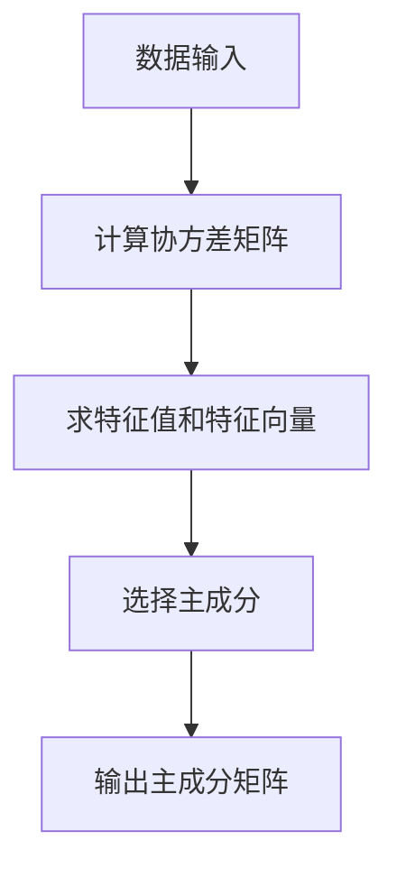
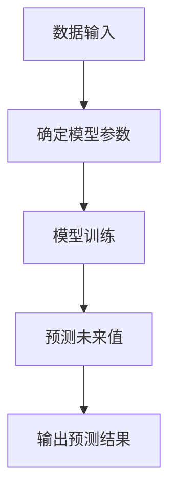
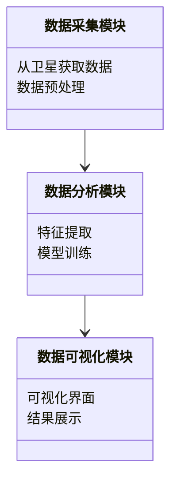
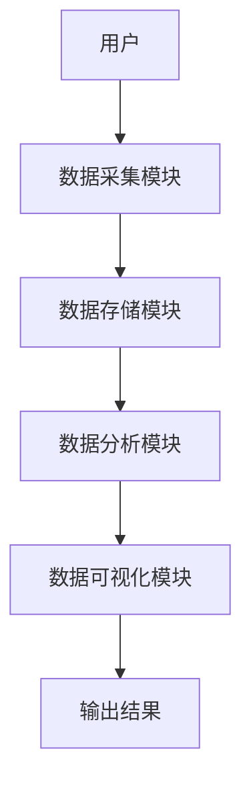
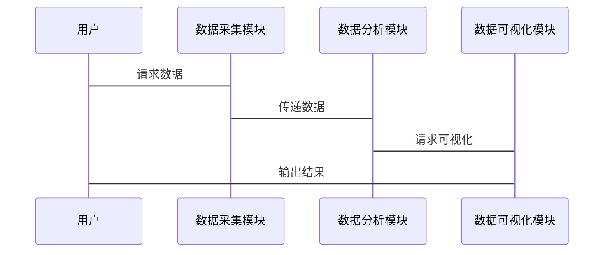

                 


# 特价股票投资中的卫星大数据分析与应用

> 关键词：卫星大数据，股票投资，数据分析，算法，系统架构，项目实战

> 摘要：本文探讨了卫星大数据在特价股票投资中的应用，从背景、核心概念、算法原理、系统架构到项目实战，详细分析了卫星大数据如何助力股票投资，提供了丰富的技术细节和实践案例。

---

# 第一部分：背景与概述

## 第1章：特价股票投资与卫星大数据的背景

### 1.1 特价股票投资的背景与现状

#### 1.1.1 特价股票的定义与特点
特价股票指的是价格低于其内在价值的股票，通常被视为被市场低估的投资机会。其特点包括低市盈率、低市净率和高股息率。

#### 1.1.2 特价股票投资的市场需求
投资者对高回报和低风险的投资需求推动了特价股票市场的繁荣。机构投资者和个人投资者都在寻找具有长期增值潜力的股票。

#### 1.1.3 卫星大数据在金融领域的潜力
卫星数据提供了地理、经济和社会活动的实时信息，为金融分析提供了新的视角。卫星大数据能够帮助投资者发现传统金融指标之外的影响因素。

### 1.2 卫星大数据的定义与特点

#### 1.2.1 卫星数据的来源与类型
卫星数据包括光学图像、雷达数据和气象数据，每种数据都有独特的特征和应用场景。

#### 1.2.2 卫星数据的采集与处理
卫星数据的采集涉及多种传感器和平台，处理过程包括数据清洗、标准化和增强。

#### 1.2.3 卫星大数据在金融分析中的优势
卫星数据能够提供实时的经济活动指标，如港口货物量和交通流量，帮助预测市场趋势。

### 1.3 卫星大数据与特价股票投资的结合

#### 1.3.1 卫星数据对市场情绪的影响
卫星图像可以帮助分析经济活动的变化，进而影响市场情绪。

#### 1.3.2 特价股票投资中的卫星大数据需求
投资者需要利用卫星数据来发现被低估的股票，同时预测市场波动。

#### 1.3.3 卫星大数据分析的创新性与挑战
卫星大数据分析为投资提供了新的工具，但数据处理和模型构建仍面临挑战。

### 1.4 本章小结
本章介绍了特价股票投资和卫星大数据的基本概念，阐述了它们结合的背景和潜力。

---

# 第二部分：核心概念与原理

## 第2章：卫星大数据分析的核心概念

### 2.1 卫星数据的特征与分类

#### 2.1.1 数据的时空特性
卫星数据具有高时空分辨率，能够捕捉地理和经济活动的变化。

#### 2.1.2 数据的多维特性
卫星数据涵盖光学、雷达和气象等多种类型，提供了丰富的信息。

#### 2.1.3 数据的异构特性
卫星数据格式多样，处理时需要进行统一和标准化。

### 2.2 卫星大数据分析的数学模型

#### 2.2.1 数据预处理模型
包括数据清洗、标准化和增强，确保数据质量。

#### 2.2.2 数据特征提取模型
使用PCA和LDA等算法提取关键特征，降低维度。

#### 2.2.3 数据关联分析模型
通过关联规则挖掘发现数据之间的关联性，帮助预测市场趋势。

### 2.3 卫星大数据与股票分析的关联性

#### 2.3.1 卫星数据对市场情绪的影响
卫星图像可以帮助分析经济活动的变化，进而影响市场情绪。

#### 2.3.2 卫星数据对行业趋势的预测
卫星数据能够提供行业动态，如港口货物量和交通流量，帮助预测市场趋势。

#### 2.3.3 卫星数据对个股表现的关联
卫星数据能够帮助识别个股的潜在影响因素，如地理位置和供应链状况。

### 2.4 本章小结
本章详细探讨了卫星大数据的特征和分析模型，解释了其在股票分析中的应用。

---

## 第3章：卫星大数据分析的关键算法

### 3.1 数据预处理算法

#### 3.1.1 数据清洗算法
使用Python的Pandas库进行数据清洗，处理缺失值和异常值。

#### 3.1.2 数据标准化算法
通过标准化处理，确保不同数据源的可比性。

#### 3.1.3 数据增强算法
通过数据增强技术，增加数据的多样性和鲁棒性。

### 3.2 数据特征提取算法

#### 3.2.1 主成分分析（PCA）
使用PCA算法降低数据维度，提取主要特征。

#### 3.2.2 线性判别分析（LDA）
通过LDA算法进行特征提取，优化分类性能。

#### 3.2.3 自然语言处理（NLP）在卫星数据中的应用
利用NLP技术分析卫星图像中的文本信息，提取关键词和主题。

### 3.3 数据关联分析算法

#### 3.3.1 关联规则挖掘（Association Rule Mining）
使用Apriori算法发现数据中的关联规则，帮助预测市场趋势。

#### 3.3.2 时间序列分析（Time Series Analysis）
通过ARIMA模型分析卫星数据的时间序列，预测未来趋势。

### 3.4 本章小结
本章详细介绍了卫星大数据分析中的关键算法，包括数据预处理、特征提取和关联分析。

---

## 3.5 算法原理的数学模型与公式

### 3.5.1 PCA算法的数学模型
$$
\text{协方差矩阵} = \frac{1}{n-1} \sum_{i=1}^{n} (x_i - \bar{x})(x_i - \bar{x})^T
$$

### 3.5.2 LDA算法的数学模型
$$
\text{判别函数} = \log P(y|x) - \log P(y| \neg x)
$$

### 3.5.3 ARIMA模型的数学公式
$$
\text{ARIMA}(p, d, q) = y_t = \phi_1 y_{t-1} + \phi_p y_{t-p} + \theta_1 \epsilon_{t-1} + \dots + \theta_q \epsilon_{t-q} + \epsilon_t
$$

---

## 3.6 算法实现的Python代码示例

### 3.6.1 PCA算法实现
```python
import numpy as np
from sklearn.decomposition import PCA

# 示例数据矩阵
X = np.array([[2.5, 2.4],
              [4.7, 3.6],
              [2.2, 3.9],
              [1.4, 3.1],
              [3.3, 3.5],
              [2.9, 3.0],
              [2.6, 2.6],
              [3.0, 3.3],
              [3.8, 3.2],
              [2.8, 3.3]])

# 创建PCA模型
pca = PCA(n_components=1)
pca.fit(X)

# 提取主成分
principal_components = pca.transform(X)
print(principal_components)
```

### 3.6.2 ARIMA模型实现
```python
from statsmodels.tsa.arima.model import ARIMA

# 示例时间序列数据
data = [1, 2, 3, 4, 5, 6, 7, 8, 9, 10]

# 创建ARIMA模型
model = ARIMA(data, order=(1, 1, 1))
model_fit = model.fit()

# 预测未来值
forecast = model_fit.forecast(steps=5)
print(forecast)
```

---

## 3.7 算法流程图（使用Mermaid）

### 3.7.1 PCA算法流程图


### 3.7.2 ARIMA算法流程图


---

## 3.8 算法实现的代码解读与分析
在代码示例中，我们首先使用PCA算法对数据进行降维处理，提取主要特征。接着，使用ARIMA模型对时间序列数据进行预测，展示如何利用卫星大数据进行市场趋势分析。

---

## 3.9 本章小结
本章通过数学模型和Python代码详细讲解了卫星大数据分析的关键算法，包括PCA、LDA和ARIMA模型，并展示了它们在股票分析中的应用。

---

# 第三部分：系统分析与架构设计

## 第4章：卫星大数据分析系统架构设计

### 4.1 问题场景介绍
本节描述了如何利用卫星大数据构建一个股票分析系统，帮助投资者发现特价股票。

### 4.2 系统功能设计

#### 4.2.1 领域模型（Mermaid类图）


### 4.3 系统架构设计（Mermaid架构图）


### 4.4 系统接口设计
系统接口包括数据输入接口、模型训练接口和结果输出接口。

### 4.5 系统交互设计（Mermaid序列图）


---

## 4.6 本章小结
本章详细设计了卫星大数据分析系统的架构，包括功能模块、接口和交互流程。

---

## 第5章：系统实现与项目实战

### 5.1 项目环境搭建
需要安装Python、NumPy、Pandas、Scikit-learn、statsmodels和Matplotlib等库。

### 5.2 核心系统实现

#### 5.2.1 数据采集模块
```python
import requests
import json

# 示例卫星数据接口
url = "https://example.com/satellite_data"
response = requests.get(url)
data = json.loads(response.text)
print(data)
```

#### 5.2.2 数据分析模块
```python
from sklearn.ensemble import RandomForestRegressor

# 示例特征提取
features = data[['feature1', 'feature2', 'feature3']]
target = data['target']

# 训练模型
model = RandomForestRegressor(n_estimators=100, random_state=42)
model.fit(features, target)

# 预测结果
predictions = model.predict(features)
print(predictions)
```

#### 5.2.3 数据可视化模块
```python
import matplotlib.pyplot as plt

# 示例可视化
plt.plot(data['time'], data['value'])
plt.title('Satellite Data Visualization')
plt.xlabel('Time')
plt.ylabel('Value')
plt.show()
```

---

## 5.3 项目小结
本章通过具体的代码实现，展示了如何利用卫星大数据构建股票分析系统，从数据采集到模型训练，再到结果可视化，完整地展示了系统实现的流程。

---

## 5.4 本章小结
本章通过项目实战，详细讲解了卫星大数据分析系统的实现过程，包括环境搭建、核心模块实现和项目总结。

---

# 第四部分：总结与展望

## 第6章：总结与展望

### 6.1 最佳实践与技巧
- 数据预处理是关键，确保数据质量和一致性。
- 结合多种算法，提高模型的准确性和鲁棒性。
- 定期更新模型，适应市场变化。

### 6.2 本章小结
总结全文，强调卫星大数据在股票分析中的价值，并展望未来的发展方向。

### 6.3 注意事项
- 数据隐私和安全问题需要注意。
- 模型的可解释性和透明度是实际应用中的重要考量。

### 6.4 拓展阅读
推荐相关书籍和资源，帮助读者深入学习卫星大数据和股票分析。

---

# 作者信息

作者：AI天才研究院/AI Genius Institute & 禅与计算机程序设计艺术 /Zen And The Art of Computer Programming

---

以上是《特价股票投资中的卫星大数据分析与应用》的详细目录大纲和部分内容。根据实际需求，可以进一步补充每章的具体内容，添加更多的案例分析和代码示例，以丰富文章的专业性和实用性。

