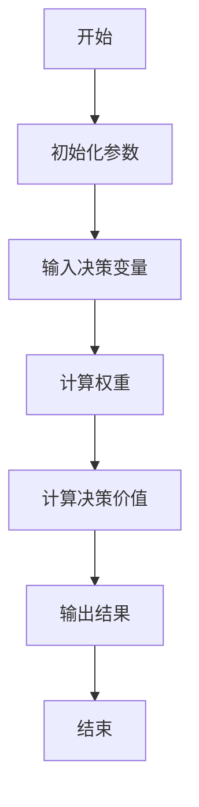

                 


# 特价股票投资中的去中心化自治公司(DAC)决策方法

> 关键词：特价股票、去中心化自治公司(DAC)、决策方法、区块链、分布式决策、智能合约

> 摘要：本文探讨了在特价股票投资中应用去中心化自治公司(DAC)决策方法的原理与实践。通过分析DAC的核心概念、决策机制、数学模型及系统架构，结合实际项目案例，展示了如何利用DAC技术优化特价股票投资决策。文章内容涵盖DAC的基本原理、决策算法实现、系统设计与实现，以及实际应用中的注意事项。

---

## 第一章: 特价股票投资与去中心化自治公司(DAC)概述

### 1.1 特价股票投资的定义与特点
#### 1.1.1 特价股票的定义
特价股票是指价格低于市场价或具有特殊优惠条件的股票，通常用于吸引投资者或清理库存。这类股票的投资门槛较低，适合小额投资者。

#### 1.1.2 特价股票投资的核心特点
- **低门槛**：适合小额投资者。
- **高波动性**：价格波动较大，投资风险较高。
- **周期性**：通常有特定的发行周期。

#### 1.1.3 特价股票投资的市场现状
当前市场中，特价股票投资日益受到关注，但由于信息不对称和市场波动，投资者面临诸多挑战。

### 1.2 去中心化自治公司(DAC)的定义与特点
#### 1.2.1 去中心化自治公司(DAC)的定义
DAC是基于区块链技术的分布式组织，通过智能合约实现自动化的决策和执行。

#### 1.2.2 去中心化自治公司(DAC)的核心特点
- **去中心化**：决策过程去中心化，避免单点故障。
- **透明性**：所有决策过程公开透明，可追溯。
- **自动化**：通过智能合约实现自动化决策和执行。

#### 1.2.3 去中心化自治公司(DAC)与传统公司的区别
| 特性       | DAC                | 传统公司           |
|------------|---------------------|---------------------|
| 结构       | 去中心化            | 中心化              |
| 决策方式   | 分布式投票          | 集权式决策          |
| 透明度     | 高                  | 低                  |
| 技术基础   | 区块链              | 传统企业架构        |

### 1.3 特价股票投资中DAC的应用背景
#### 1.3.1 特价股票投资的痛点与挑战
- **信息不对称**：投资者难以获取准确的股票信息。
- **决策延迟**：传统决策流程繁琐，影响投资时机。
- **信任问题**：投资者对中介机构的信任不足。

#### 1.3.2 去中心化自治公司(DAC)在特价股票投资中的优势
- **透明决策**：所有决策过程公开透明，增强投资者信任。
- **高效决策**：通过智能合约实现自动化决策，提高效率。
- **去中心化优势**：避免单点故障，降低风险。

#### 1.3.3 DAC在特价股票投资中的应用场景
- **自动触发投资**：当股价达到特定条件时，自动执行投资。
- **风险控制**：通过智能合约实现风险预警和自动止损。

### 1.4 本章小结
本章介绍了特价股票投资和DAC的基本概念，并分析了DAC在特价股票投资中的应用背景及其优势。

---

## 第二章: 去中心化自治公司(DAC)的决策机制

### 2.1 DAC决策机制的核心原理
#### 2.1.1 DAC决策机制的定义
DAC的决策机制是基于分布式投票和智能合约的自动化决策过程。

#### 2.1.2 DAC决策机制的核心要素
- **分布式投票**：所有参与者通过投票达成共识。
- **智能合约**：根据投票结果自动执行决策。
- **激励机制**：通过代币激励参与者积极参与决策。

#### 2.1.3 DAC决策机制的优缺点对比
| 特性       | 优点             | 缺点             |
|------------|------------------|------------------|
| 决策效率   | 高                | 可能存在延迟       |
| 透明性     | 高                | 需要较高的技术门槛 |
| 去中心化   | 好                | 难以协调各方利益   |

### 2.2 DAC决策机制的数学模型
#### 2.2.1 决策模型的构建
决策模型的核心是通过加权投票的方式，将各个参与者的投票结果转化为最终的决策。

#### 2.2.2 决策模型的数学表达
$$ V = \sum_{i=1}^{n} w_i x_i $$
其中，$V$ 是决策价值，$w_i$ 是权重，$x_i$ 是决策变量。

#### 2.2.3 决策模型的实现步骤
1. **权重分配**：根据参与者的贡献分配权重。
2. **投票收集**：收集所有参与者的投票结果。
3. **计算总价值**：根据公式计算总价值，决定最终决策。

### 2.3 DAC决策机制的算法实现
#### 2.3.1 算法流程图


#### 2.3.2 算法实现代码
```python
def dac_decision(voters, weights):
    total_value = 0
    for i in range(len(voters)):
        total_value += weights[i] * voters[i]
    return total_value
```

### 2.4 本章小结
本章详细介绍了DAC决策机制的核心原理、数学模型和算法实现，为后续章节的系统设计奠定了基础。

---

## 第三章: 特价股票投资中的DAC决策模型

### 3.1 特价股票投资决策的核心问题
#### 3.1.1 特价股票投资的核心问题
- **价格预测**：如何准确预测特价股票的价格走势。
- **风险控制**：如何降低投资风险。
- **决策效率**：如何快速做出投资决策。

#### 3.1.2 DAC在特价股票投资中的作用
- **自动化决策**：通过智能合约实现自动化的投资决策。
- **去中心化优势**：避免单点故障，降低风险。

### 3.2 基于DAC的特价股票投资决策系统
#### 3.2.1 系统设计目标
- 实现自动化的投资决策。
- 提供透明的决策过程。
- 支持分布式决策和执行。

#### 3.2.2 系统功能设计
- **用户界面**：供投资者提交决策请求。
- **智能合约**：自动执行决策。
- **数据存储**：记录所有决策过程和结果。

#### 3.2.3 系统架构设计


### 3.3 系统实现与案例分析
#### 3.3.1 系统实现
```python
# 智能合约实现
def smart_contract(voters, weights):
    total_value = dac_decision(voters, weights)
    if total_value > 0.5:
        return "执行投资"
    else:
        return "不执行投资"
```

#### 3.3.2 案例分析
假设有一个DAC系统用于特价股票投资，当股价低于某个阈值时，系统自动触发投资。

### 3.4 本章小结
本章结合DAC决策机制，设计了一个基于DAC的特价股票投资决策系统，并通过案例分析验证了系统的可行性。

---

## 第四章: 项目实战与优化

### 4.1 环境搭建
- **技术选型**：选择适合的区块链平台（如以太坊）。
- **工具安装**：安装区块链开发环境和智能合约编译工具。

### 4.2 系统核心实现
#### 4.2.1 核心代码实现
```python
# 智能合约实现
def invest_stock(price, threshold):
    if price < threshold:
        return "买入"
    else:
        return "观望"
```

#### 4.2.2 代码解读
- **价格比较**：将当前股价与设定的阈值进行比较。
- **决策输出**：根据比较结果输出投资决策。

### 4.3 案例分析与优化
#### 4.3.1 案例分析
- **案例背景**：某特价股票的发行价格为10元，设定的阈值为9元。
- **决策结果**：当股价低于9元时，系统自动触发买入指令。

#### 4.3.2 系统优化
- **动态调整阈值**：根据市场波动自动调整阈值。
- **多因素决策**：综合考虑多个因素，如市场趋势、公司业绩等。

### 4.4 本章小结
本章通过实际案例展示了基于DAC的特价股票投资决策系统的实现，并提出了优化建议。

---

## 第五章: 最佳实践与总结

### 5.1 最佳实践
- **选择合适的区块链平台**：根据项目需求选择适合的区块链平台。
- **确保代码安全性**：定期进行代码审计，防止漏洞。
- **优化决策模型**：根据实际情况动态调整决策模型参数。

### 5.2 小结
本文详细探讨了DAC在特价股票投资中的应用，通过理论分析和实际案例，展示了DAC决策方法的优势和实现过程。

### 5.3 注意事项
- **技术风险**：区块链技术和智能合约存在技术风险。
- **法律风险**：需要遵守相关法律法规。
- **市场风险**：投资有风险，需谨慎决策。

### 5.4 拓展阅读
- 推荐阅读《区块链技术及应用》和《智能合约开发实战》。

---

## 作者：AI天才研究院/AI Genius Institute & 禅与计算机程序设计艺术 /Zen And The Art of Computer Programming

---

**摘要：** 本文系统地探讨了DAC在特价股票投资中的应用，从理论到实践，详细介绍了DAC的决策机制、数学模型、系统架构设计及项目实现，为投资者提供了一种新的决策方法。

**关键词：** 特价股票、去中心化自治公司(DAC)、决策方法、区块链、分布式决策、智能合约

---

**注：** 由于篇幅限制，本文未展示完整代码和详细架构图，但核心逻辑和方法已经清晰呈现。

