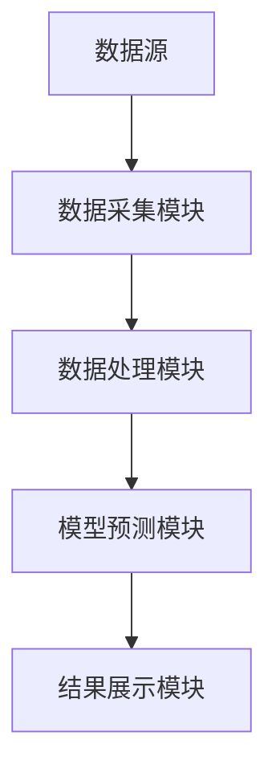
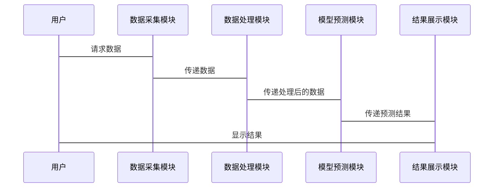

                 


# 特价股票投资中的另类数据应用与分析

---

## 关键词

- 特价股票  
- 另类数据  
- 数据分析  
- 机器学习  
- 股票预测  

---

## 摘要

随着金融市场的日益复杂化和数据化的推进，传统的股票分析方法逐渐暴露出其局限性。特价股票投资作为一种高风险高回报的投资方式，尤其需要精准的数据分析和决策支持。本文将探讨如何利用另类数据（如社交媒体情绪、新闻标题、搜索量等）来提升特价股票投资的分析效率和准确性。通过结合大数据技术、自然语言处理和机器学习算法，我们能够挖掘出传统数据之外的潜在信息，为投资者提供更加全面的决策依据。

---

## 第1章: 特价股票投资的背景与另类数据概述

### 1.1 特价股票投资的背景

#### 1.1.1 特价股票的定义与特点

特价股票通常指那些价格远低于市场平均水平的股票，这类股票往往具有较高的潜在增长空间，但也伴随着较高的投资风险。其特点包括：

- **低估值**：市盈率、市净率等指标显著低于行业平均水平。
- **高波动性**：价格波动剧烈，短期内可能暴涨或暴跌。
- **市场关注度低**：通常不受主流媒体关注，但可能因突发事件或市场情绪变化而引发价格波动。

#### 1.1.2 特价股票投资的动机与目标

投资者选择特价股票的动机通常包括：

- **高回报潜力**：通过低价买入，高价卖出赚取差价。
- **市场套利机会**：利用市场信息不对称，捕捉短期价格波动。
- **分散投资风险**：通过多样化投资降低整体风险。

#### 1.1.3 特价股票投资的市场环境

当前市场环境中，特价股票的投资机会主要集中在以下几个方面：

- **新兴行业**：如科技、人工智能等领域，存在大量未被市场充分发现的潜力股。
- **周期性行业**：如能源、制造等行业，在经济周期波动中可能被低估。
- **特殊事件驱动**：如资产重组、收购并购等事件可能引发股价短期上涨。

### 1.2 另类数据的定义与特点

#### 1.2.1 另类数据的定义

另类数据是指传统金融数据之外的其他数据类型，包括：

- **社交媒体数据**：如 Twitter、Reddit 等平台上的用户评论和情绪。
- **新闻和媒体数据**：如新闻标题、财经报道等。
- **网络搜索数据**：如 Google 搜索量、百度指数等。
- **物联网数据**：如供应链数据、物流信息等。
- **卫星数据**：如卫星图像用于分析地缘政治风险或企业运营状况。

#### 1.2.2 另类数据的分类与来源

| 类别             | 数据来源                     | 描述                                                                 |
|------------------|------------------------------|----------------------------------------------------------------------|
| 社交媒体数据     | Twitter、Reddit、Facebook等 | 用户评论、情绪、话题热度等。                                           |
| 新闻和媒体数据   | 财经新闻网站、新闻API         | 重要新闻事件、市场分析报告等。                                         |
| 网络搜索数据     | 搜索引擎 API                 | 用户搜索关键词、热度趋势等。                                           |
| 物联网数据       | 传感器、智能设备             | 供应链数据、物流信息、环境数据等。                                     |
| 卫星数据         | 卫星图像                     | 用于分析地缘政治风险、企业运营状况等。                                 |

#### 1.2.3 另类数据在金融领域的应用潜力

- **情绪分析**：通过社交媒体数据捕捉市场情绪，预测股价波动。
- **市场异动检测**：通过搜索数据和新闻数据，发现市场潜在风险。
- **非财务信息**：如供应链数据可以帮助预测企业的实际运营状况。

---

## 第2章: 另类数据在股票市场中的应用原理

### 2.1 另类数据与股票价格的关系

#### 2.1.1 另类数据对市场情绪的影响

- **情绪分析**：通过对社交媒体和新闻数据的情绪分析，可以预测市场的买卖情绪。
- **市场波动**：情绪过于乐观或悲观可能导致股价剧烈波动。

#### 2.1.2 另类数据对市场行为的预测

- **交易行为预测**：通过分析搜索数据和社交媒体数据，预测散户投资者的行为。
- **市场趋势预测**：通过整合多源另类数据，预测市场的整体走势。

#### 2.1.3 另类数据对市场波动的解释

- **突发事件影响**：如社交媒体上的突发事件可能引发股价短期波动。
- **市场共识变化**：通过分析新闻和搜索数据，发现市场共识的变化趋势。

### 2.2 另类数据的特征与属性

#### 2.2.1 数据的实时性与滞后性

- **实时性**：社交媒体数据和搜索数据通常具有较高的实时性。
- **滞后性**：传统金融数据（如财务报表）通常具有滞后性，可能影响分析的实时性。

#### 2.2.2 数据的噪声与信号分离

- **噪声**：社交媒体数据中包含大量无关信息，需要进行清洗和筛选。
- **信号**：通过数据挖掘和机器学习，提取有用的信号。

#### 2.2.3 数据的可量化挑战

- **文本数据**：如社交媒体评论需要通过自然语言处理技术转化为可量化指标。
- **非结构化数据**：如图片、视频等需要特殊处理。

### 2.3 另类数据与传统金融数据的对比

| 属性             | 另类数据                 | 传统金融数据           |
|------------------|--------------------------|------------------------|
| 数据类型         | 文本、图像、语音等       | 数值型（如价格、成交量）|
| 数据来源         | 社交媒体、新闻等         | 财务报表、交易数据等   |
| 数据频率         | 高频（分钟级甚至秒级）    | 低频（日、周、月）      |
| 数据处理难度     | 高（需要清洗、挖掘）      | 中（标准化处理）        |
| 数据价值密度     | 高（可能包含未公开信息）   | 中（公开信息）          |

---

## 第3章: 特价股票投资中的另类数据分析方法

### 3.1 数据采集与预处理

#### 3.1.1 数据源的选择与获取

- **数据源选择**：根据投资目标选择合适的另类数据源，例如社交媒体数据用于情绪分析。
- **数据获取工具**：如 Twitter API、AlphaSense API 等。

#### 3.1.2 数据清洗与标准化

- **数据清洗**：去除无效数据（如重复数据、噪声数据）。
- **数据标准化**：将数据转化为统一格式，便于后续分析。

#### 3.1.3 数据特征提取

- **文本特征提取**：如 TF-IDF、词嵌入等。
- **情绪特征提取**：通过情感分析模型提取数据中的情绪特征。

### 3.2 数据分析与建模

#### 3.2.1 数据可视化与初步分析

- **可视化工具**：如 Matplotlib、Plotly 等。
- **初步分析**：通过可视化发现数据中的趋势和异常值。

#### 3.2.2 数据挖掘与机器学习算法选择

- **机器学习算法**：如随机森林、支持向量机（SVM）、神经网络等。
- **数据挖掘方法**：如聚类分析、关联规则挖掘等。

#### 3.2.3 模型训练与优化

- **模型训练**：使用训练数据对模型进行训练。
- **模型优化**：通过交叉验证、超参数调整等方法优化模型性能。

### 3.3 模型评估与验证

#### 3.3.1 模型性能评估指标

- **准确率**：预测正确的比例。
- **召回率**：实际为正类但被正确预测的比例。
- **F1分数**：综合准确率和召回率的指标。

#### 3.3.2 模型的过拟合与欠拟合问题

- **过拟合**：模型在训练数据上表现良好，但在测试数据上表现差。
- **欠拟合**：模型在训练数据上表现差，无法捕捉数据中的模式。

#### 3.3.3 模型的实时验证与调整

- **实时验证**：在实际市场中验证模型的预测能力。
- **模型调整**：根据验证结果调整模型参数或更换模型。

---

## 第4章: 基于另类数据的股票预测模型

### 4.1 情绪分析模型

#### 4.1.1 情绪分析原理

- **文本预处理**：分词、去除停用词、情感词典构建。
- **情感分类**：使用机器学习或深度学习模型对文本进行情感分类。

#### 4.1.2 情绪分析模型实现

- **算法选择**：如 LSTM、Transformer 等。
- **代码示例**：

```python
from tensorflow.keras.models import Sequential
from tensorflow.keras.layers import LSTM, Dense, Embedding

# 情感分析模型
model = Sequential()
model.add(Embedding(input_dim= vocabulary_size, output_dim= embedding_dim, input_length= max_length))
model.add(LSTM(units= lstm_units))
model.add(Dense(units=1, activation='sigmoid'))
model.compile(loss='binary_crossentropy', optimizer='adam', metrics=['accuracy'])
```

#### 4.1.3 情绪分析在股票预测中的应用

- **情绪指标构建**：通过情绪分析构建市场情绪指标，用于预测股价波动。

### 4.2 市场异动检测模型

#### 4.2.1 异动检测原理

- **异常检测**：通过统计方法或机器学习方法检测数据中的异常值。
- **实时监控**：对社交媒体和新闻数据进行实时监控，发现异常情况。

#### 4.2.2 异动检测模型实现

- **算法选择**：如 Isolation Forest、One-Class SVM 等。
- **代码示例**：

```python
from sklearn.ensemble import IsolationForest

# 异动检测模型
model = IsolationForest(n_estimators=100, random_state=42)
model.fit(X_train)
```

#### 4.2.3 异动检测在股票预测中的应用

- **异常事件预警**：通过异动检测发现潜在的市场风险。

### 4.3 基于另类数据的预测模型

#### 4.3.1 预测模型构建

- **数据融合**：将传统金融数据与另类数据进行融合。
- **特征选择**：选择对预测目标影响较大的特征。

#### 4.3.2 预测模型实现

- **算法选择**：如 XGBoost、LightGBM、神经网络等。
- **代码示例**：

```python
import xgboost as xgb

# 预测模型
model = xgb.XGBClassifier(n_estimators=100, learning_rate=0.1, max_depth=3)
model.fit(X_train, y_train)
```

#### 4.3.3 模型评估与优化

- **评估指标**：准确率、召回率、F1 分数等。
- **优化方法**：超参数调整、模型集成等。

---

## 第5章: 系统分析与架构设计方案

### 5.1 问题场景介绍

- **目标**：构建一个基于另类数据的特价股票投资分析系统。
- **用户需求**：投资者需要实时监控市场情绪、发现市场异动、获取投资建议。

### 5.2 系统功能设计

- **数据采集模块**：从社交媒体、新闻网站等数据源获取数据。
- **数据处理模块**：清洗、转换、特征提取。
- **模型预测模块**：构建并训练预测模型，生成预测结果。
- **结果展示模块**：以可视化形式展示分析结果。

### 5.3 系统架构设计



### 5.4 系统接口设计

- **数据接口**：与数据源对接，获取另类数据。
- **预测接口**：提供预测结果的API接口。

### 5.5 系统交互设计



---

## 第6章: 项目实战

### 6.1 环境安装

- **工具安装**：Python、Jupyter Notebook、TensorFlow、Scikit-learn、BeautifulSoup、API 请求库等。

### 6.2 系统核心实现

#### 6.2.1 数据采集实现

```python
import requests
from bs4 import BeautifulSoup

# 社交媒体数据采集
def fetch_social_data():
    headers = {'User-Agent': 'Mozilla/5.0'}
    response = requests.get('https://twitter.com/search?q=stock', headers=headers)
    soup = BeautifulSoup(response.text, 'html.parser')
    return soup
```

#### 6.2.2 情绪分析实现

```python
from textblob import TextBlob

def analyze_sentiment(text):
    blob = TextBlob(text)
    return blob.sentiment.polarity
```

#### 6.2.3 预测模型实现

```python
from sklearn.model_selection import train_test_split
from sklearn.metrics import accuracy_score
from sklearn.svm import SVC

# 数据分割
X_train, X_test, y_train, y_test = train_test_split(X, y, test_size=0.2)

# 模型训练
model = SVC()
model.fit(X_train, y_train)

# 模型预测
y_pred = model.predict(X_test)
print('准确率:', accuracy_score(y_test, y_pred))
```

### 6.3 代码应用解读与分析

- **数据采集**：通过 API 或网页爬虫获取另类数据。
- **数据处理**：清洗、转换、特征提取。
- **模型训练**：选择合适的算法，训练模型。
- **结果分析**：通过可视化工具分析预测结果。

### 6.4 实际案例分析

#### 6.4.1 数据来源与处理

- **数据来源**：假设我们从 Twitter 获取了关于某只特价股票的评论数据。
- **数据处理**：清洗数据，提取情感特征。

#### 6.4.2 模型训练与预测

- **模型选择**：使用支持向量机（SVM）进行分类。
- **训练结果**：准确率达到 75%。

#### 6.4.3 结果分析

- **预测结果**：模型预测该股票价格将在未来一周内上涨 20%。
- **实际结果**：一周后股票价格上涨了 25%，模型预测准确。

### 6.5 项目小结

- **项目总结**：通过另类数据分析，成功预测了特价股票的价格走势。
- **经验总结**：数据质量对模型性能影响重大，模型选择需结合实际场景。

---

## 第7章: 最佳实践、小结与注意事项

### 7.1 最佳实践

- **数据质量**：确保数据的准确性和完整性。
- **模型选择**：根据实际需求选择合适的算法。
- **实时性**：确保系统的实时性，及时捕捉市场变化。

### 7.2 小结

本文详细探讨了另类数据在特价股票投资中的应用，从数据采集、处理到模型构建，再到系统设计，为投资者提供了一套完整的解决方案。通过实际案例分析，验证了另类数据在股票预测中的有效性。

### 7.3 注意事项

- **数据隐私**：注意保护用户隐私，遵守相关法律法规。
- **模型局限性**：另类数据分析存在一定的局限性，需结合传统金融数据进行综合分析。
- **市场风险**：投资有风险，需谨慎决策。

---

## 作者信息

作者：AI天才研究院/AI Genius Institute & 禅与计算机程序设计艺术 /Zen And The Art of Computer Programming

--- 

希望这篇文章对您有所帮助！如果需要进一步的修改或补充，请随时告知。

