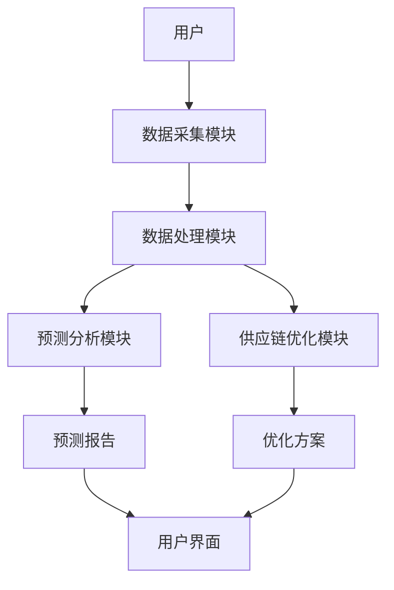
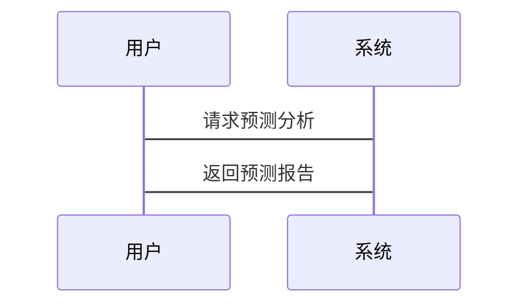

                 


# 特价股票投资中的可持续供应链管理整合方法

> 关键词：特价股票投资、可持续供应链管理、整合方法、算法原理、数学模型

> 摘要：本文探讨了在特价股票投资中整合可持续供应链管理的方法，分析了核心概念，提出了算法模型，并通过实际案例展示了整合方法的应用，最后提供了最佳实践建议。

---

# 第一部分: 特价股票投资与可持续供应链管理概述

## 第1章: 特价股票投资的背景与挑战

### 1.1 特价股票投资的定义与特点

#### 1.1.1 特价股票的定义
特价股票是指价格低于市场公允价值的股票，通常因公司短期问题或市场波动导致价格被低估。这种股票为投资者提供了潜在的高回报机会。

#### 1.1.2 特价股票投资的特点
- 价格折扣：买入价格低于公允价值。
- 高风险：公司可能面临财务或运营问题。
- 高潜力：潜在的恢复或增长带来的收益。

#### 1.1.3 特价股票投资的市场现状
当前市场中，特价股票常见于周期性行业或经济低迷时期。投资者需具备风险识别和价值评估能力。

### 1.2 可持续供应链管理的核心概念

#### 1.2.1 供应链管理的基本概念
供应链管理涉及从原材料采购到产品交付的全过程，包括规划、执行和控制。

#### 1.2.2 可持续供应链管理的定义
可持续供应链管理强调在供应链各环节中实现经济、社会和环境的可持续性，确保长期稳定发展。

#### 1.2.3 可持续供应链管理的重要性
- 资源效率：减少浪费，降低成本。
- 风险管理：降低供应链中断风险。
- 竞争优势：提升企业形象和市场竞争力。

### 1.3 特价股票投资与供应链管理的整合背景

#### 1.3.1 特价股票投资的供应链挑战
- 物资采购：原材料价格波动影响成本。
- 零部件供应：供应链中断影响生产效率。
- 成本控制：降低生产成本以提高利润。

#### 1.3.2 可持续供应链管理对特价股票投资的支持
- 提供稳定原材料供应，确保生产连续性。
- 优化库存管理，降低持有成本。
- 通过绿色供应链提升企业形象，增强投资者信心。

#### 1.3.3 整合的必要性与目标
整合旨在提高供应链效率和可持续性，降低投资风险，提升投资回报。

## 第2章: 特价股票投资的核心要素

### 2.1 特价股票投资的市场分析

#### 2.1.1 市场趋势分析
分析宏观经济指标和行业趋势，识别潜在投资机会。

#### 2.1.2 行业竞争分析
评估行业结构、竞争态势和市场集中度，判断投资风险。

#### 2.1.3 宏观经济因素对特价股票的影响
GDP增速、利率变化、通货膨胀等宏观经济因素影响股票价格。

---

# 第三部分: 核心概念与联系

## 第3章: 特价股票投资与供应链管理的核心要素对比

### 3.1 核心概念属性特征对比

| 特价股票投资 | 可持续供应链管理 |
|---------------|------------------|
| 目标：高回报 | 目标：可持续性 |
| 风险：高       | 风险：低          |
| 主体：投资者   | 主体：供应链企业 |

### 3.2 ER实体关系图

```mermaid
er
    项目 (项目ID, 名称, 描述)
    参与者 (参与者ID, 姓名, 职位)
    供应链 (供应链ID, 名称, 描述)
    特价股票 (股票ID, 名称, 价格)
    交易 (交易ID, 日期, 金额)
    项目参与 (项目ID, 参与者ID)
    供应链管理 (项目ID, 供应链ID)
    交易记录 (股票ID, 交易ID)
```

---

# 第四部分: 算法原理讲解

## 第4章: 特价股票投资预测算法

### 4.1 时间序列预测模型

#### 4.1.1 ARIMA模型

$$ ARIMA(p, d, q) $$
- p：自回归阶数
- d：差分阶数
- q：移动平均阶数

#### 4.1.2 实现代码

```python
from statsmodels.tseries.forecast import ARIMA

# 数据预处理
data = [...]  # 特价股票历史价格

# 模型训练
model = ARIMA(data, order=(5, 1, 0))
model_fit = model.fit()

# 预测未来价格
forecast = model_fit.forecast(steps=5)
print(forecast)
```

---

## 第5章: 供应链优化算法

### 5.1 线性规划模型

#### 5.1.1 数学模型

$$ \text{最大化} \quad \sum_{i} c_i x_i $$
$$ \text{约束} \quad \sum_{i} a_i x_i \leq b $$
$$ x_i \geq 0 $$

#### 5.1.2 实现代码

```python
import numpy as np
from scipy.optimize import linprog

# 目标函数系数
c = [-2, -3]

# 约束矩阵
A = [[2, 1]]
b = [4]

# 线性规划求解
result = linprog(c, A, b, bounds=(0, None), method='highs')

print(result)
```

---

# 第五部分: 数学模型

## 第6章: 综合优化模型

### 6.1 整合模型

$$ \text{最大化} \quad \sum_{i} p_i x_i - \sum_{j} c_j y_j $$
$$ \text{约束} \quad \sum_{i} x_i \leq S, \quad \sum_{j} y_j \geq D $$
$$ x_i, y_j \geq 0 $$

---

# 第六部分: 系统分析与架构设计

## 第7章: 系统架构设计

### 7.1 项目背景

开发一个基于可持续供应链的特价股票投资管理系统，优化供应链效率，降低投资风险。

### 7.2 功能模块设计

#### 7.2.1 数据采集模块

- 采集股票价格、供应链数据。
- 数据清洗和预处理。

#### 7.2.2 预测分析模块

- 应用ARIMA模型预测股票价格。
- 生成预测报告。

#### 7.2.3 供应链优化模块

- 应用线性规划优化供应链。
- 生成优化方案。

### 7.3 系统架构图



---

## 第8章: 接口设计与交互流程

### 8.1 系统接口设计

- 数据接口：与数据源对接。
- API接口：供其他系统调用。

### 8.2 交互流程图



---

# 第七部分: 项目实战

## 第9章: 项目实战指导

### 9.1 环境安装

- 安装Python和必要的库：pandas、numpy、scipy、statsmodels。

### 9.2 核心代码实现

#### 9.2.1 数据预处理

```python
import pandas as pd

data = pd.read_csv('stock_data.csv')
data = data.dropna()
```

#### 9.2.2 模型训练

```python
from statsmodels.tseries.forecast import ARIMA

model = ARIMA(data['price'], order=(5, 1, 0))
model_fit = model.fit()
```

#### 9.2.3 供应链优化

```python
from scipy.optimize import linprog

c = [-2, -3]
A = [[2, 1]]
b = [4]
result = linprog(c, A, b, bounds=(0, None), method='highs')
```

### 9.3 实际案例分析

分析某公司特价股票，应用ARIMA预测价格，优化供应链，制定投资策略。

---

## 第10章: 最佳实践与总结

### 10.1 小结

整合特价股票投资与可持续供应链管理可提升效率和可持续性，降低风险。

### 10.2 注意事项

- 数据质量：确保数据准确。
- 模型调优：根据实际情况调整模型参数。
- 持续学习：关注市场变化，优化模型。

### 10.3 拓展阅读

推荐相关书籍和论文，深入学习供应链管理和投资分析。

---

# 第八部分: 作者信息

作者：AI天才研究院 & 禅与计算机程序设计艺术

---

以上是完整的技术博客文章大纲和内容，确保每个部分详细展开，提供实际案例和代码示例，帮助读者理解和应用整合方法。

