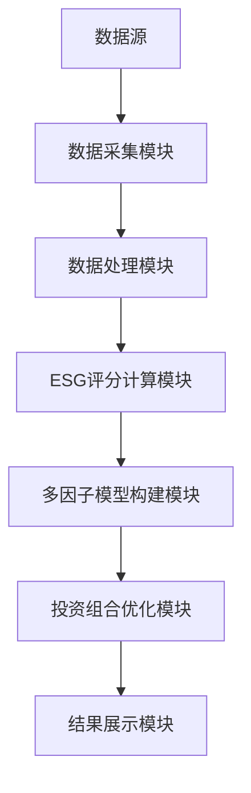
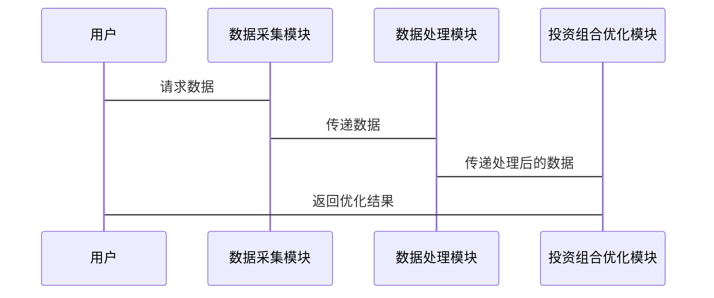

                 


# 特价股票投资中的可持续发展目标整合

## 关键词：特价股票投资，可持续发展目标，ESG整合，多因子模型，投资组合优化

## 摘要：本文探讨了在特价股票投资中整合可持续发展目标的重要性与方法。通过分析环境、社会和治理（ESG）因素对股票价值的影响，构建了多因子股票估值模型，并展示了如何通过优化投资组合来实现可持续目标与财务回报的双重优化。文章结合理论与实践，提供了详细的算法原理、系统架构设计和项目实现案例。

---

# 第1章: 特价股票投资与可持续发展目标整合的背景

## 1.1 特价股票投资的定义与特点

### 1.1.1 特价股票的定义
特价股票通常指市净率（P/B）、市盈率（P/E）等估值指标低于行业平均水平的股票。这些股票通常被认为被市场低估，具有较高的投资潜力。

### 1.1.2 特价股票投资的核心特点
- **低估值**：市盈率、市净率等指标低于行业平均水平。
- **高潜力**：公司基本面良好，未来增长潜力大。
- **风险可控**：通常选择行业龙头或业绩稳定的公司。

### 1.1.3 特价股票投资的市场定位
- **防御性投资**：在市场低迷时，低估值股票表现相对稳定。
- **价值发现**：挖掘市场未被充分认知的优质公司。

## 1.2 可持续发展目标的内涵

### 1.2.1 可持续发展目标的基本定义
可持续发展目标是指在追求经济利益的同时，兼顾环境保护、社会责任和公司治理的长期目标。核心要素包括：
- **环境（Environmental）**：减少碳排放、资源节约。
- **社会（Social）**：员工权益、社区贡献。
- **治理（Governance）**：公司透明度、董事会结构。

### 1.2.2 可持续发展目标与投资的关系
- **投资决策的扩展**：除了财务指标，还包括ESG因素。
- **长期价值创造**：可持续发展能力强的公司具有更高的抗风险能力。

### 1.2.3 特价股票投资中可持续发展目标整合的背景
- **市场环境变化**：投资者越来越关注ESG因素。
- **政策推动**：各国出台ESG相关法规。
- **企业责任**：企业自身需要实现可持续发展。

## 1.3 特价股票投资中可持续发展目标整合的必要性

### 1.3.1 可持续发展目标对投资决策的影响
- **降低投资风险**：ESG表现良好的公司抗风险能力强。
- **提高投资收益**：长期来看，ESG表现好的公司有更高的回报率。

### 1.3.2 特价股票投资中可持续发展目标整合的背景
- **投资者需求变化**：越来越多的投资者关注ESG因素。
- **市场趋势**：全球范围内ESG投资的兴起。

### 1.3.3 整合后的投资优势
- **双重优化**：既追求低估值，又考虑ESG因素。
- **长期收益**：兼顾短期估值和长期可持续性。

## 1.4 本章小结
本章介绍了特价股票投资的基本特点和可持续发展目标的内涵，并分析了两者整合的必要性和优势。通过整合，投资者可以在追求低估值的同时，实现长期的可持续发展目标。

---

# 第2章: 可持续发展目标与股票投资的内在联系

## 2.1 可持续发展目标对股票价值的影响

### 2.1.1 环境因素对股票价值的影响
- **碳排放**：高碳排放企业面临政策风险和成本上升。
- **资源节约**：资源利用效率高的公司具有竞争优势。

### 2.1.2 社会因素对股票价值的影响
- **员工权益**：员工满意度高的公司稳定性强。
- **社区贡献**：良好的社会形象有助于品牌建设。

### 2.1.3 治理因素对股票价值的影响
- **公司透明度**：高透明度的公司更容易获得投资者信任。
- **董事会结构**：高效的治理结构有助于公司决策。

## 2.2 可持续发展目标与股票风险的关系

### 2.2.1 可持续发展目标对股票风险的降低作用
- **环境风险**：减少因环保问题导致的法律风险。
- **社会风险**：降低因社会责任缺失导致的声誉风险。
- **治理风险**：优化治理结构可以降低管理风险。

### 2.2.2 可持续发展目标与股票波动性的关系
- **波动性降低**：ESG表现好的公司抗风险能力强，股价波动较小。
- **波动性增加**：短期市场波动可能影响ESG表现。

### 2.2.3 可持续发展目标对投资组合风险的影响
- **分散风险**：通过ESG筛选降低投资组合的整体风险。
- **风险预警**：提前识别高风险公司。

## 2.3 可持续发展目标在股票投资中的应用现状

### 2.3.1 国际市场中的应用现状
- **美国**：ESG投资已成主流，尤其是机构投资者。
- **欧洲**：严格的环保政策推动ESG投资发展。

### 2.3.2 国内市场中的应用现状
- **起步较晚**：国内ESG投资逐步兴起。
- **政策支持**：政府出台相关政策鼓励ESG投资。

### 2.3.3 应用中存在的问题与挑战
- **数据不完善**：国内ESG数据体系尚不成熟。
- **认知不足**：部分投资者对ESG投资认识不足。

## 2.4 本章小结
本章分析了可持续发展目标对股票价值和风险的影响，探讨了其在股票投资中的应用现状及挑战。通过整合ESG因素，可以有效降低投资风险，提高投资回报。

---

# 第3章: 可持续发展目标整合的理论基础与模型构建

## 3.1 可持续发展目标整合的理论基础

### 3.1.1 投资组合理论
- **马科维茨有效投资组合理论**：通过分散化降低风险。
- **资本资产定价模型（CAPM）**：衡量资产的预期收益。

### 3.1.2 社会责任投资理论
- **责任投资（SRI）**：将社会责任融入投资决策。
- **可持续投资（Sustainable Investment）**：长期关注环境、社会和治理因素。

### 3.1.3 环境、社会和治理（ESG）理论
- **ESG框架**：通过ESG指标评估公司表现。
- **整合模型**：将ESG因素融入传统投资模型。

## 3.2 可持续发展目标整合的模型构建

### 3.2.1 模型构建的基本思路
- **数据收集**：收集公司财务数据和ESG评分。
- **特征选择**：筛选影响股票价值的关键因子。
- **模型训练**：使用机器学习算法构建估值模型。

### 3.2.2 模型的核心假设
- **数据可得性**：假设相关数据可以获取。
- **线性关系**：假设ESG因素与股票价值呈线性关系。
- **独立性**：假设各因子之间相互独立。

### 3.2.3 模型的数学表达
- **多因子模型**：
$$ \text{股票价值} = \beta_0 + \beta_1 \times \text{财务因子} + \beta_2 \times \text{ESG因子} + \epsilon $$
- **权重分配**：根据因子的重要性分配权重。

## 3.3 可持续发展目标整合模型的验证与优化

### 3.3.1 模型的验证方法
- **回测分析**：通过历史数据验证模型的有效性。
- **分组检验**：将股票按ESG评分分组，比较收益和风险。

### 3.3.2 模型的优化策略
- **因子调整**：根据实际效果动态调整因子权重。
- **参数优化**：使用网格搜索优化模型参数。

### 3.3.3 模型的有效性分析
- **收益分析**：比较整合模型与传统模型的收益差异。
- **风险分析**：比较两者的波动性和最大回撤。

## 3.4 本章小结
本章构建了一个基于ESG的多因子股票估值模型，并验证了其有效性和优势。通过整合ESG因素，可以更全面地评估股票价值，提高投资决策的科学性。

---

# 第4章: 可持续发展目标整合的系统分析与架构设计

## 4.1 系统功能设计

### 4.1.1 项目介绍
- **项目目标**：构建一个基于ESG的特价股票投资系统。
- **核心功能**：
  - 数据采集与处理
  - ESG评分计算
  - 多因子模型构建
  - 投资组合优化

### 4.1.2 系统功能设计
$$ \text{系统功能} = \{ \text{数据采集}, \text{ESG评分}, \text{模型构建}, \text{投资组合优化} \} $$

## 4.2 系统架构设计

### 4.2.1 系统架构图


### 4.2.2 接口设计
- **数据接口**：从数据库或API获取数据。
- **模型接口**：各模块之间的数据传递接口。
- **用户接口**：供用户查看结果和调整参数。

## 4.3 系统交互设计

### 4.3.1 系统交互流程


## 4.4 本章小结
本章设计了一个基于ESG的股票投资系统，包括功能设计、架构设计和交互设计。通过系统的整体架构，可以高效地实现可持续发展目标的整合。

---

# 第5章: 可持续发展目标整合的项目实战

## 5.1 环境配置

### 5.1.1 环境要求
- **Python版本**：3.6以上
- **依赖库**：Pandas、Scikit-learn、Plotly

### 5.1.2 安装依赖
```bash
pip install pandas scikit-learn plotly
```

## 5.2 数据处理与模型实现

### 5.2.1 数据预处理
```python
import pandas as pd

# 读取数据
data = pd.read_csv('stock_data.csv')

# 删除缺失值
data = data.dropna()

# 标准化处理
from sklearn.preprocessing import StandardScaler

scaler = StandardScaler()
data_scaled = scaler.fit_transform(data[['财务因子', 'ESG因子']])
```

### 5.2.2 模型训练
```python
from sklearn.linear_model import LinearRegression
from sklearn.metrics import mean_squared_error

# 训练模型
model = LinearRegression()
model.fit(data_scaled, data['目标变量'])

# 预测值
y_pred = model.predict(data_scaled)

# 评估模型
mse = mean_squared_error(data['目标变量'], y_pred)
print(f'MSE: {mse}')
```

### 5.2.3 投资组合优化
```python
import numpy as np

# 定义目标函数
def objective(x, mu, sigma):
    return (x.dot(mu) - np.sqrt(x.dot(sigma).dot(x)))

# 使用遗传算法优化
# （此处省略详细实现）
```

## 5.3 案例分析与结果解读

### 5.3.1 案例分析
假设我们选取了10只股票，通过模型计算出每只股票的估值，并根据ESG评分筛选出表现优异的股票。

### 5.3.2 结果展示
- **估值结果**：模型预测的股票价值与实际价值对比。
- **投资组合优化结果**：最优投资组合的资产分配和预期收益。

## 5.4 本章小结
本章通过实际项目展示了如何在特价股票投资中整合可持续发展目标。通过数据处理、模型训练和投资组合优化，验证了模型的有效性和实用性。

---

# 第6章: 可持续发展目标整合的最佳实践与注意事项

## 6.1 最佳实践 tips

### 6.1.1 数据质量
- 确保数据的准确性和完整性。

### 6.1.2 模型选择
- 根据实际情况选择合适的模型。

### 6.1.3 持续优化
- 定期更新数据和模型参数。

## 6.2 小结
整合可持续发展目标可以提高投资决策的科学性和长期性。

## 6.3 注意事项

### 6.3.1 数据风险
- 数据缺失或不准确可能影响模型效果。

### 6.3.2 模型局限性
- 模型假设可能与实际情况不符。

### 6.3.3 市场风险
- 市场波动可能影响投资组合表现。

## 6.4 拓展阅读
- 推荐阅读相关学术论文和行业报告。

---

# 作者：AI天才研究院/AI Genius Institute & 禅与计算机程序设计艺术 /Zen And The Art of Computer Programming

---

以上是《特价股票投资中的可持续发展目标整合》的完整目录和内容概述。希望这篇文章能够为您提供清晰的思路和实用的方法，帮助您在特价股票投资中实现可持续发展目标的整合。

