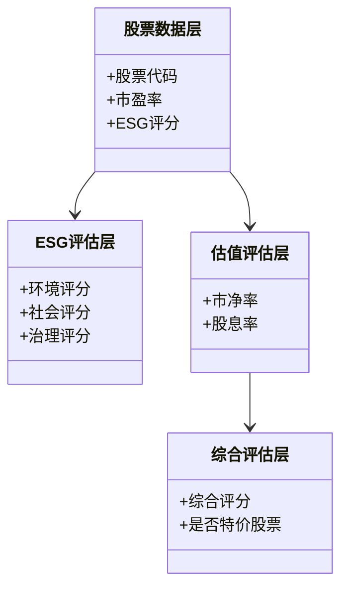

                 


# 特价股票投资中的可持续发展目标整合方法

> 关键词：特价股票，可持续发展目标，投资策略，模型构建，Python代码

> 摘要：本文探讨如何在特价股票投资中整合可持续发展目标，通过构建数学模型和算法，筛选出符合环保和社会责任的低估值股票，实现投资收益与社会责任的双赢。文章详细讲解了整合方法的背景、核心概念、算法原理、系统架构及实际案例，并提供了Python代码实现。

---

## 第一部分: 特价股票投资中的可持续发展目标整合背景介绍

### 第1章: 可持续投资的背景与意义

#### 1.1 可持续投资的核心概念
- **1.1.1 可持续投资的定义与内涵**
  可持续投资（Sustainable Investment）是指在投资决策中考虑环境、社会和治理（ESG）因素的投资方式，旨在实现长期的经济回报和社会价值。
  
- **1.1.2 可持续投资的目标与原则**
  可持续投资的目标是通过投资于具有可持续发展优势的企业，实现资本增值的同时推动社会进步和环境保护。其原则包括长期性、责任性和创新性。

- **1.1.3 可持续投资与传统投资的区别**
  传统投资主要关注企业的财务表现，而可持续投资则额外关注企业的社会责任、治理结构和环境影响。

#### 1.2 特价股票投资的定义与特点
- **1.2.1 特价股票的定义与分类**
  特价股票是指市场价格低于其内在价值的股票，通常具有较高的分红率或较低的市盈率。分类包括周期性股票、困境反转股票等。

- **1.2.2 特价股票投资的策略与方法**
  常见策略包括价值投资、逆向投资等，注重长期持有和低估值企业。

- **1.2.3 特价股票投资的市场现状**
  当前市场中，投资者越来越关注企业的社会责任和环境表现，这为特价股票的可持续投资提供了机会。

#### 1.3 特价股票与可持续发展目标的整合意义
- **1.3.1 可持续发展目标在投资中的重要性**
  将可持续发展目标融入投资策略，有助于降低投资风险，提升企业长期竞争力。

- **1.3.2 特价股票投资与可持续发展目标的契合点**
  特价股票通常处于低估状态，而具有可持续发展优势的企业在未来更具成长性，两者结合可以实现双赢。

- **1.3.3 整合的意义与潜在价值**
  整合后，投资者可以在追求收益的同时，推动社会进步和环境保护，实现长期可持续发展。

### 第2章: 特价股票投资中的可持续发展目标整合方法

#### 2.1 可持续发展目标的筛选标准
- **2.1.1 环境（Environmental）标准**
  包括碳排放、能源消耗、环保合规性等指标。

- **2.1.2 社会（Social）标准**
  包括员工权益、社会责任、劳动条件等。

- **2.1.3 治理（Governance）标准**
  包括公司治理结构、董事会多样性、高管薪酬等。

#### 2.2 特价股票的筛选与评估
- **2.2.1 特价股票的筛选指标**
  包括低市盈率、低市净率、高股息率等。

- **2.2.2 可持续发展目标的评估方法**
  通过ESG评分系统评估企业表现。

- **2.2.3 综合评估模型的构建**
  结合股票的估值指标和ESG评分，构建综合评分模型。

#### 2.3 特价股票与可持续发展目标整合的实现路径
- **2.3.1 数据收集与处理**
  收集企业的财务数据、ESG评分和市场数据。

- **2.3.2 综合评估模型的构建与验证**
  使用回归分析或机器学习算法验证模型的有效性。

- **2.3.3 模型的应用与优化**
  根据实际效果调整模型参数，提高预测准确性。

---

## 第二部分: 特价股票投资中的可持续发展目标整合的核心概念与联系

### 第3章: 可持续发展目标与特价股票的整合模型

#### 3.1 可持续发展目标与特价股票的整合模型概述
- **模型的构成**
  包括数据输入层、评估层和决策层。

#### 3.2 概念属性对比表格
| 属性       | 可持续发展目标         | 特价股票           |
|------------|-----------------------|-------------------|
| 定义       | 环境、社会、治理因素   | 市场价格低于内在价值|
| 目标       | 长期可持续发展         | 追求超额收益       |
| 方法       | ESG评分               | 估值指标           |

#### 3.3 ER实体关系图
```mermaid
erd
    股票
    行业
    ESG评分
    财务指标
    可持续发展目标
    特价股票筛选
    股票属于行业
    ESG评分与股票关联
    财务指标与股票关联
    可持续发展目标与股票关联
```

---

## 第三部分: 特价股票投资中的可持续发展目标整合的算法原理

### 第4章: 整合模型的算法实现

#### 4.1 数据收集与预处理
- **数据来源**
  包括股票市场数据、ESG评分数据、行业数据等。

#### 4.2 特征选择
- **关键特征**
  包括市盈率、市净率、ESG评分、行业地位等。

#### 4.3 模型训练
- **算法选择**
  使用逻辑回归或随机森林进行分类或回归分析。

#### 4.4 模型评估
- **评估指标**
  包括准确率、召回率、F1分数等。

#### 4.5 模型优化
- **超参数调优**
  使用网格搜索或随机搜索优化模型性能。

#### 4.6 代码实现
```python
import pandas as pd
from sklearn.model import LogisticRegression
from sklearn.metrics import accuracy_score

# 数据加载与预处理
data = pd.read_csv('stock_data.csv')
X = data[['市盈率', 'ESG评分', '行业地位']]
y = data['是否特价股票']

# 模型训练
model = LogisticRegression()
model.fit(X, y)

# 模型评估
预测 = model.predict(X)
准确率 = accuracy_score(y, 预测)
print(f'准确率: {准确率}')
```

---

## 第四部分: 特价股票投资中的可持续发展目标整合的数学模型

### 第5章: 综合评估模型的数学表示

#### 5.1 模型构建
$$
\text{综合评分} = \alpha \times \text{ESG评分} + \beta \times \text{估值指标}
$$

其中，$\alpha$ 和 $\beta$ 是权重系数，通常通过回归分析确定。

#### 5.2 模型应用
以某企业为例，假设其ESG评分为85，市盈率为10，计算综合评分：
$$
\text{综合评分} = 0.6 \times 85 + 0.4 \times 10 = 57 + 4 = 61
$$

#### 5.3 模型验证
通过历史数据验证模型的预测能力，计算准确率和召回率。

---

## 第五部分: 特价股票投资中的可持续发展目标整合的系统分析与架构设计

### 第6章: 系统架构设计

#### 6.1 系统功能设计


#### 6.2 系统架构图


---

## 第六部分: 特价股票投资中的可持续发展目标整合的项目实战

### 第7章: 项目实战

#### 7.1 环境配置
- **工具安装**
  安装Python、Pandas、Scikit-learn等工具。

#### 7.2 核心代码实现
```python
import pandas as pd
from sklearn import metrics

# 加载数据
data = pd.read_csv('stock_data.csv')

# 特征选择
X = data[['市盈率', 'ESG评分', '行业地位']]
y = data['是否特价股票']

# 划分训练集和测试集
from sklearn.model_selection import train_test_split
X_train, X_test, y_train, y_test = train_test_split(X, y, test_size=0.2)

# 模型训练
from sklearn.linear_model import LogisticRegression
model = LogisticRegression()
model.fit(X_train, y_train)

# 模型预测
y_pred = model.predict(X_test)

# 模型评估
print("准确率:", metrics.accuracy_score(y_test, y_pred))
print("召回率:", metrics.recall_score(y_test, y_pred))
```

#### 7.3 案例分析
以环保行业为例，筛选出符合低估值且ESG评分高的股票，分析其投资价值和潜在收益。

---

## 第七部分: 特价股票投资中的可持续发展目标整合的最佳实践

### 第8章: 最佳实践

#### 8.1 小结
整合可持续发展目标与特价股票投资，不仅提升了投资收益，还推动了社会责任的实现。

#### 8.2 注意事项
- 数据的准确性和及时性
- 模型的动态优化
- 风险管理

#### 8.3 拓展阅读
推荐相关书籍和资源，帮助读者深入学习。

---

## 作者信息

作者：AI天才研究院/AI Genius Institute & 禅与计算机程序设计艺术 /Zen And The Art of Computer Programming

---

通过以上结构，文章详细讲解了如何在特价股票投资中整合可持续发展目标，从背景、核心概念、算法原理到系统架构和项目实战，为投资者提供了实用的方法和工具。

