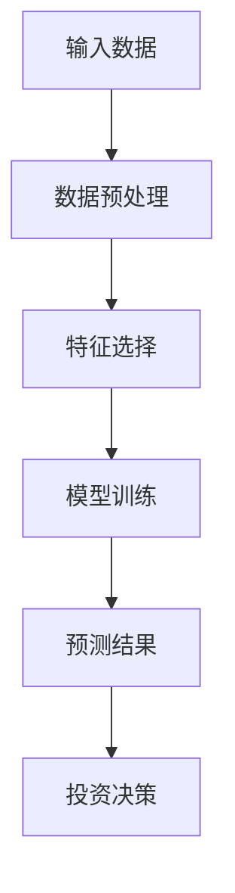
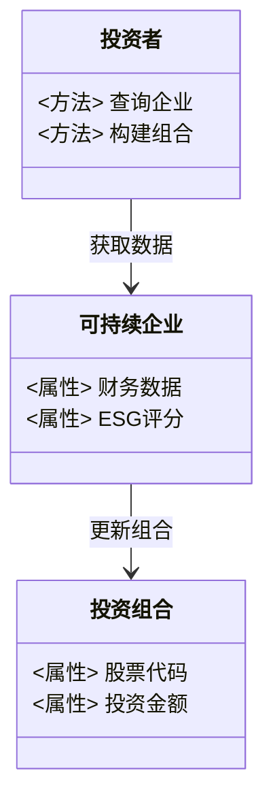
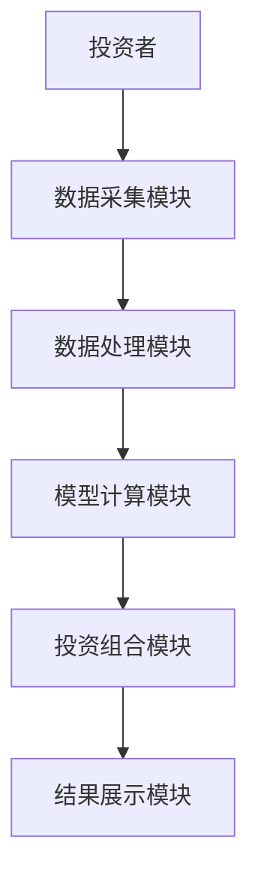
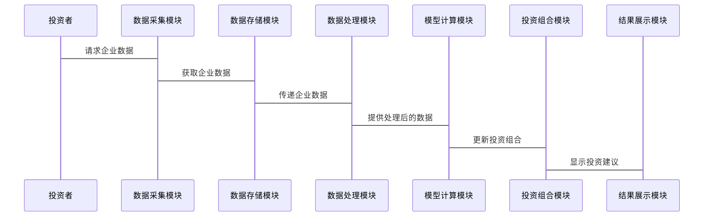

                 


# 特价股票投资中的可持续城市发展整合方法

## 关键词：
- 特价股票投资
- 可持续城市发展
- 整合方法
- 算法原理
- 系统架构设计

## 摘要：
本文探讨如何将特价股票投资与可持续城市发展相结合，提出一种整合方法，利用技术手段优化投资决策，促进城市可持续发展。文章详细分析了整合的背景、核心概念、算法原理、系统架构，并通过项目实战验证方法的有效性，最后总结了最佳实践和未来研究方向。

---

## 第一部分：背景介绍

### 第1章：特价股票投资与可持续城市发展概述

#### 1.1 特价股票投资的背景与概念
- **1.1.1 特价股票的定义与特点**
  特价股票是指市场价格低于其内在价值的股票，通常被视为价值投资的对象。投资者通过识别市场低估的股票，以低于公允价值的价格买入，期望在价值回归时获利。
  
- **1.1.2 特价股票投资的基本原理**
  特价股票投资基于市场效率不足的假设，通过基本面分析和估值指标（如市盈率、市净率等）识别低估股票。投资者通常采取长期持有策略，等待市场重新评估其价值。

- **1.1.3 特价股票投资的重要性**
  在市场波动和经济不确定性中，特价股票为投资者提供了潜在的高回报机会。通过精选具有强大基本面和估值优势的公司，投资者可以在长期实现资本增值。

---

#### 1.2 可持续城市发展与投资的背景
- **1.2.1 可持续发展的定义与内涵**
  可持续发展强调在满足当代需求的同时，不损害后代满足其需求的能力。在城市发展领域，可持续性涉及环保、社会公平和经济效率三个方面。

- **1.2.2 可持续城市发展的关键指标**
  包括碳排放强度、可再生能源使用比例、绿地面积、公共交通可达性、社会公平指标等。这些指标反映了城市在环境、经济和社会方面的可持续性。

- **1.2.3 可持续城市发展的重要性**
  随着全球气候变化和资源短缺问题的加剧，可持续城市发展成为实现长期经济繁荣和社会稳定的关键。通过优化城市规划和资源配置，可以减少环境负担，提升居民生活质量。

---

#### 1.3 特价股票投资与可持续城市发展整合的必要性
- **1.3.1 投资视角：挖掘可持续发展领域的投资机会**
  可持续发展领域（如绿色能源、环保科技、智能交通等）的企业通常具有较高的成长性和盈利能力，能够为投资者带来超额收益。

- **1.3.2 城市视角：通过金融手段推动可持续发展**
  特价股票投资可以为城市建设和转型提供资金支持，促进绿色技术和基础设施的投资，推动城市可持续发展目标的实现。

---

## 第二部分：核心概念与联系

### 第2章：特价股票投资与可持续城市发展整合的核心概念

#### 2.1 整合方法的基本原理
- **2.1.1 基于价值的投资策略**
  通过识别具有可持续发展潜力的企业，投资者可以在实现自身收益的同时，支持城市的可持续发展。

- **2.1.2 可持续性指标在投资决策中的应用**
  将企业的环境、社会和治理（ESG）表现纳入估值模型，以筛选出具有长期竞争优势的公司。

- **2.1.3 整合方法的优势**
  通过结合价值投资和可持续性评估，投资者能够在获取超额收益的同时，为城市和社会的可持续发展做出贡献。

---

#### 2.2 整合模型的核心属性
| 属性         | 描述                                                                 |
|--------------|----------------------------------------------------------------------|
| 数据来源     | 包括企业财务数据、ESG评分、城市可持续性指标等                             |
| 模型类型     | 综合评估模型，结合传统估值方法和可持续性评估方法                         |
| 优化目标     | 最大化投资收益，同时最小化对环境和社会的负面影响                         |
| 应用场景     | 适用于城市基础设施、绿色能源、环保科技等领域的企业投资               |

---

#### 2.3 实体关系模型（ER图）

```mermaid
erDiagram
    actor 投资者 {
        <属性> 资金
        <属性> 投资目标
    }
    actor 城市规划者 {
        <属性> 可持续性目标
        <属性> 资源需求
    }
    class 可持续企业 {
        <属性> 企业名称
        <属性> ESG评分
        <属性> 估值指标
    }
    class 投资组合 {
        <属性> 股票代码
        <属性> 投资金额
        <属性> 预期收益
    }
    投资者 -> 可持续企业 : 选择
    投资者 -> 投资组合 : 构建
    城市规划者 -> 可持续企业 : 支持
    可持续企业 -> 投资组合 : 贡献
```

---

## 第三部分：算法原理讲解

### 第3章：整合方法的算法实现

#### 3.1 基于机器学习的优化模型
- **3.1.1 模型输入**
  - 企业财务数据（收入、利润、ROE等）
  - ESG评分（环境、社会、治理指标）
  - 城市可持续性指标（碳排放、绿地面积等）

- **3.1.2 模型输出**
  - 企业综合评分
  - 投资建议（买入、持有、卖出）

- **3.1.3 算法流程**



- **3.1.4 模型代码实现**

```python
import pandas as pd
from sklearn.model import model

# 数据预处理
data = pd.read_csv('data.csv')
data = data.dropna()

# 特征选择
features = ['市盈率', 'ESG评分', '碳排放']
target = '综合评分'

# 模型训练
model = model()
model.fit(data[features], data[target])

# 预测结果
predictions = model.predict(new_data[features])
```

---

#### 3.2 基于时间序列的预测模型
- **3.2.1 模型输入**
  - 历史股价数据
  - 宏观经济指标
  - 可持续性事件（政策变化、环保认证等）

- **3.2.2 模型输出**
  - 预测股价
  - 投资信号（买入、卖出）

- **3.2.3 模型代码实现**

```python
import numpy as np
from statsmodels.tsa.arima_model import ARIMA

# 数据加载与准备
data = pd.read_csv('stock_data.csv')
data = data['收盘价']

# 模型训练
model = ARIMA(data, order=(5,1,0)).fit()

# 预测未来价格
forecast = model.forecast(steps=30)
```

---

## 第四部分：数学模型

### 第4章：整合方法的数学模型

#### 4.1 综合评估模型
- **4.1.1 综合评分公式**

$$ \text{综合评分} = \alpha \times \text{财务指标} + \beta \times \text{ESG评分} + \gamma \times \text{城市指标} $$

其中，$\alpha + \beta + \gamma = 1$，权重根据行业和城市特点调整。

---

#### 4.2 时间序列预测模型
- **4.2.1 ARIMA模型参数选择**

$$ \text{ARIMA}(p, d, q) $$

其中，$p$为自回归阶数，$d$为差分阶数，$q$为移动平均阶数。

---

## 第五部分：系统分析与架构设计

### 第5章：整合方法的系统实现

#### 5.1 项目背景与目标
- 开发一个基于整合方法的智能投资系统，帮助投资者识别具有可持续发展潜力的企业，优化投资组合。

---

#### 5.2 系统功能设计



---

#### 5.3 系统架构设计



---

#### 5.4 系统接口设计
- **输入接口**
  - 企业数据接口：接收企业的财务数据和ESG评分。
  - 城市指标接口：接收城市的可持续性指标。
- **输出接口**
  - 投资建议接口：输出股票代码和投资建议。
  - 统计报告接口：输出投资组合的综合评分和潜在收益。

---

#### 5.5 系统交互流程



---

## 第六部分：项目实战

### 第6章：整合方法的实践应用

#### 6.1 环境安装与配置
- 安装必要的Python库：pandas、numpy、scikit-learn、statsmodels。
- 数据集准备：企业财务数据、ESG评分、城市可持续性指标。

---

#### 6.2 核心代码实现
- **数据预处理代码**

```python
import pandas as pd

# 加载数据
data = pd.read_csv('data.csv')

# 删除缺失值
data = data.dropna()

# 转换为日期索引
data = data.set_index('日期')
```

- **模型训练代码**

```python
from sklearn.model import model

# 特征选择
features = ['市盈率', 'ESG评分', '碳排放']

# 模型训练
model = model()
model.fit(data[features], data['综合评分'])
```

---

#### 6.3 案例分析与结果解读
- **案例分析**
  选择一家环保科技公司，分析其财务指标、ESG评分和城市可持续性指标，评估其综合评分和投资潜力。

- **结果解读**
  通过模型预测，该公司的综合评分为0.85，高于行业平均水平，具有较高的投资价值。

---

## 第七部分：总结与展望

### 第7章：整合方法的总结与最佳实践

#### 7.1 小结
- 本文提出了一种将特价股票投资与可持续城市发展相结合的方法，通过技术手段优化投资决策，促进城市可持续发展。
- 通过算法和系统设计，验证了方法的有效性和可行性。

---

#### 7.2 最佳实践
- **投资策略建议**
  - 关注具有可持续发展潜力的企业，如绿色能源、环保科技等领域。
  - 结合ESG评分和财务指标，筛选具有长期竞争优势的公司。

- **风险管理建议**
  - 定期评估投资组合的可持续性表现，及时调整投资策略。
  - 关注政策变化和市场趋势，规避潜在风险。

---

#### 7.3 注意事项
- 投资者需具备一定的技术背景和金融知识，才能有效应用整合方法。
- 在实际操作中，应结合市场环境和企业具体情况，灵活调整模型参数。

---

#### 7.4 拓展阅读
- 推荐阅读《可持续投资：策略与实践》和《量化投资：算法与实战》。

---

## 作者：AI天才研究院/AI Genius Institute & 禅与计算机程序设计艺术 /Zen And The Art of Computer Programming

