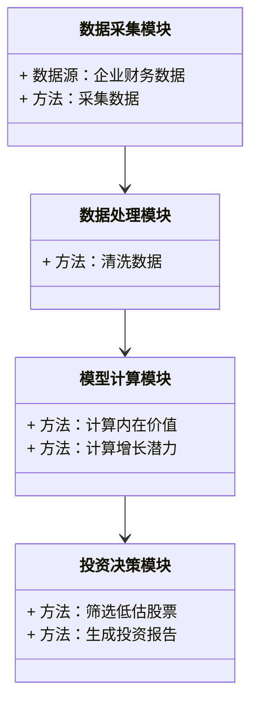
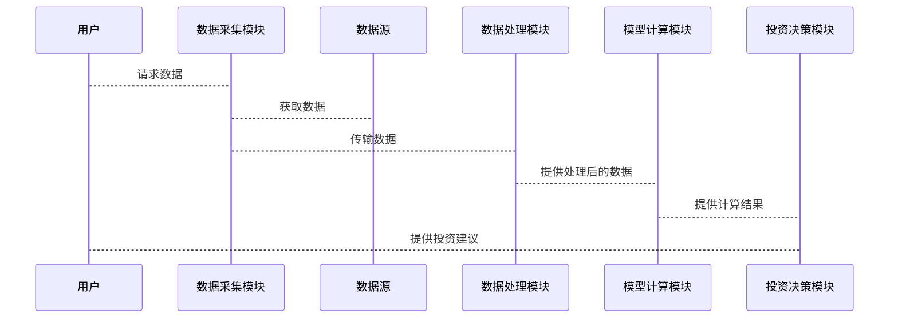

                 


# 特价股票投资中的可持续增长模型应用

> 关键词：可持续增长模型，特价股票，股票投资，股票分析，股票估值，股票预测

> 摘要：本文深入探讨了可持续增长模型在特价股票投资中的应用，结合数学建模、算法设计和系统架构，通过实例分析和项目实战，为投资者提供了一套科学的股票分析与投资决策方法。文章从模型原理、算法实现、系统设计到实际案例，详细解读了如何利用可持续增长模型在特价股票投资中实现可持续增长。

---

## 第一部分: 特价股票与可持续增长模型的背景介绍

### 第1章: 特价股票与可持续增长模型的背景介绍

#### 1.1 特价股票的定义与特点

##### 1.1.1 特价股票的定义
特价股票（Cheap Stock）是指市场价格低于其内在价值的股票。通常，这类股票可能被市场低估，或者由于某种原因暂时被忽视，但具有长期增长潜力。

##### 1.1.2 特价股票的核心特点
- **低估值**：市场价格低于合理估值。
- **潜在增长**：公司基本面良好，未来有增长潜力。
- **低风险**：通常属于防御性股票，波动较小。
- **高性价比**：相对于市场平均水平，价格更具吸引力。

##### 1.1.3 特价股票的投资价值与风险
- **投资价值**：
  - 低价买入，高价卖出的套利机会。
  - 长期持有的成长性。
- **投资风险**：
  - 公司基本面恶化。
  - 市场波动导致短期亏损。

#### 1.2 可持续增长模型的背景与意义

##### 1.2.1 可持续增长模型的定义
可持续增长模型（Sustainable Growth Model）是一种用于评估企业长期增长潜力的数学模型，通过分析企业的财务数据和市场表现，预测其未来增长能力。

##### 1.2.2 可持续增长模型在股票投资中的应用价值
- **量化企业价值**：通过模型计算企业的真实价值。
- **识别低估股票**：发现市场价格低于内在价值的股票。
- **优化投资组合**：通过模型筛选出具有可持续增长潜力的股票。

##### 1.2.3 可持续增长模型与传统股票投资方法的区别
- **传统方法**：基于市场情绪、技术分析或短期指标。
- **可持续增长模型**：基于企业基本面和长期增长潜力。

#### 1.3 特价股票投资中的问题背景

##### 1.3.1 特价股票在投资中的主要问题
- **信息不对称**：投资者难以准确评估企业价值。
- **短期波动**：市场价格受外部因素影响较大。
- **长期风险**：企业基本面可能发生恶化。

##### 1.3.2 可持续增长模型在特价股票投资中的应用前景
- **解决信息不对称**：通过模型量化企业价值。
- **降低短期波动影响**：关注企业长期增长潜力。
- **提高投资决策效率**：通过模型筛选出优质股票。

##### 1.3.3 本章小结
特价股票投资的核心在于识别具有长期增长潜力的低估股票，而可持续增长模型通过量化分析，为投资者提供了科学的决策依据。

---

## 第二部分: 可持续增长模型的核心概念与联系

### 第2章: 可持续增长模型的核心概念与联系

#### 2.1 可持续增长模型的原理与属性

##### 2.1.1 可持续增长模型的原理
可持续增长模型基于企业的财务数据，通过计算企业的内在价值，评估其未来的增长潜力。模型的核心假设是企业的收入增长率与净利润增长率保持一致。

##### 2.1.2 可持续增长模型的属性特征对比表格

| 属性 | 可持续增长模型 | 传统市盈率模型 |
|------|----------------|----------------|
| 评估依据 | 净利润增长率 | 市盈率 |
| 适用场景 | 长期增长潜力评估 | 短期估值评估 |
| 计算复杂度 | 中等 | 简单 |

##### 2.1.3 可持续增长模型的ER实体关系图


#### 2.2 特价股票与可持续增长模型的关系

##### 2.2.1 特价股票在可持续增长模型中的角色
- **输入**：财务数据和市场价格。
- **输出**：企业内在价值和增长潜力评估。

##### 2.2.2 可持续增长模型对特价股票投资的指导作用
- **量化评估**：通过模型计算企业的真实价值。
- **筛选低估股票**：发现市场价格低于内在价值的股票。
- **优化投资组合**：通过模型筛选出具有长期增长潜力的股票。

##### 2.2.3 本章小结
可持续增长模型为特价股票投资提供了科学的评估方法，通过量化分析，帮助投资者识别具有长期增长潜力的低估股票。

---

## 第三部分: 可持续增长模型的数学模型与算法原理

### 第3章: 可持续增长模型的数学模型与算法原理

#### 3.1 可持续增长模型的数学模型

##### 3.1.1 模型的基本假设
- 企业的收入增长率与净利润增长率保持一致。
- 企业的再投资率与利润增长率成正比。

##### 3.1.2 模型的数学公式
$$ V = \frac{E}{r - g} $$
其中：
- $V$ 表示企业的内在价值。
- $E$ 表示企业的净利润。
- $r$ 表示资本成本。
- $g$ 表示净利润增长率。

##### 3.1.3 模型的变量与参数解释
- **净利润（E）**：企业的净利润，用于衡量企业的盈利能力。
- **资本成本（r）**：投资者要求的最低回报率。
- **净利润增长率（g）**：企业的净利润年增长率。

#### 3.2 算法原理与流程图

##### 3.2.1 算法的步骤分解
1. 收集企业的财务数据，包括净利润、收入增长率等。
2. 计算企业的净利润增长率（g）。
3. 确定资本成本（r）。
4. 计算企业的内在价值（V）。
5. 比较市场价格与内在价值，筛选低估股票。

##### 3.2.2 算法的 mermaid 流程图


##### 3.2.3 算法的 Python 实现代码

```python
def sustainable_growth_model(net_profit, revenue_growth, capital_cost):
    # 计算净利润增长率
    g = revenue_growth
    # 计算内在价值
    intrinsic_value = net_profit / (capital_cost - g)
    return intrinsic_value

# 示例数据
net_profit = 100  # 净利润
revenue_growth = 0.1  # 收入增长率
capital_cost = 0.12  # 资本成本

intrinsic_value = sustainable_growth_model(net_profit, revenue_growth, capital_cost)
print(f"内在价值: {intrinsic_value}")
```

#### 3.3 模型的数学公式与实例分析

##### 3.3.1 模型的数学公式
$$ V = \frac{E}{r - g} $$

##### 3.3.2 模型的实例分析与计算
假设某公司净利润为 $100，收入增长率为 $10\%$，资本成本为 $12\%$，计算其内在价值：
$$ V = \frac{100}{0.12 - 0.1} = 1000 $$

##### 3.3.3 模型的优缺点与改进方向
- **优点**：量化评估企业内在价值，帮助投资者识别低估股票。
- **缺点**：假设条件过于理想化，实际中可能不成立。
- **改进方向**：引入更多的财务指标，如ROE、ROA等，提高模型的准确性。

---

## 第四部分: 可持续增长模型的系统架构设计

### 第4章: 可持续增长模型的系统架构设计

#### 4.1 系统分析与设计概述

##### 4.1.1 问题场景介绍
投资者需要通过模型筛选出具有可持续增长潜力的特价股票。

##### 4.1.2 系统功能需求分析
- 数据采集模块：收集企业财务数据和市场数据。
- 模型计算模块：计算企业内在价值和增长潜力。
- 投资决策模块：筛选出低估股票，生成投资报告。

##### 4.1.3 系统的边界与范围
- 数据源：企业财务数据、市场数据。
- 输出：内在价值、增长潜力评估、投资建议。

#### 4.2 系统架构设计

##### 4.2.1 系统架构的模块划分
- 数据采集模块。
- 数据处理模块。
- 模型计算模块。
- 投资决策模块。

##### 4.2.2 系统架构的 mermaid 类图



##### 4.2.3 系统架构的实现方案
- 数据采集：通过API获取企业财务数据和市场数据。
- 数据处理：清洗数据，去除异常值。
- 模型计算：使用可持续增长模型计算内在价值和增长潜力。
- 投资决策：筛选出内在价值高于市场价格的股票，生成投资报告。

#### 4.3 系统接口与交互设计

##### 4.3.1 系统接口设计
- 数据接口：API接口，用于获取企业财务数据和市场数据。
- 计算接口：API接口，用于调用模型计算内在价值和增长潜力。

##### 4.3.2 系统交互的 mermaid 序列图



##### 4.3.3 系统交互的实现细节
- 用户通过API请求数据。
- 数据采集模块获取数据后，传给数据处理模块。
- 数据处理模块清洗数据后，传给模型计算模块。
- 模型计算模块计算内在价值和增长潜力，传给投资决策模块。
- 投资决策模块根据计算结果，生成投资建议，反馈给用户。

---

## 第五部分: 可持续增长模型的项目实战

### 第5章: 可持续增长模型的项目实战

#### 5.1 项目环境与工具安装

##### 5.1.1 开发环境的搭建
- 操作系统：Windows/Mac/Linux
- 开发工具：Python、Jupyter Notebook
- 数据库：MySQL/PostgreSQL

##### 5.1.2 项目所需工具的安装与配置
- Python包：pandas、numpy、scikit-learn
- 数据库驱动： pymysql

##### 5.1.3 数据源的获取与处理
- 数据来源：Yahoo Finance API
- 数据清洗：去除缺失值，处理异常值。

#### 5.2 项目核心实现

##### 5.2.1 系统核心功能的实现
- 数据采集：编写Python脚本，通过API获取企业财务数据和市场数据。
- 数据处理：清洗数据，去除异常值。
- 模型计算：实现可持续增长模型，计算企业内在价值和增长潜力。
- 投资决策：筛选出内在价值高于市场价格的股票，生成投资报告。

##### 5.2.2 算法的实现与优化
- 实现可持续增长模型，优化算法，提高计算效率。
- 使用机器学习算法，进一步提高模型的准确性。

##### 5.2.3 数据分析与可视化
- 使用 matplotlib 进行数据可视化，绘制股价走势、内在价值分布图等。

#### 5.3 项目案例分析与解读

##### 5.3.1 实际案例的分析与选择
- 选择某行业内的几只特价股票，作为案例进行分析。
- 例如：假设选择某制造业的几只特价股票。

##### 5.3.2 案例的详细分析与解读
- 收集企业的财务数据，计算其内在价值。
- 比较市场价格与内在价值，筛选出低估股票。
- 分析企业的增长潜力，评估其投资价值。

##### 5.3.3 案例的总结与经验分享
- 总结案例分析的结果，分享投资经验。
- 提出投资建议，帮助读者更好地进行投资决策。

#### 5.4 项目小结

##### 5.4.1 项目成果总结
- 成功实现了可持续增长模型，能够量化评估企业的内在价值。
- 筛选出具有可持续增长潜力的特价股票。

##### 5.4.2 项目中的问题与解决方法
- 问题：数据获取困难。
- 解决方法：使用可靠的API，如Yahoo Finance API。
- 问题：模型假设过于理想化。
- 解决方法：引入更多的财务指标，提高模型的准确性。

##### 5.4.3 项目经验与未来展望
- 经验：通过模型量化分析，能够更好地识别具有长期增长潜力的特价股票。
- 展望：进一步优化模型，引入更多的财务指标和市场因素，提高模型的准确性。

---

## 第六部分: 可持续增长模型的最佳实践与注意事项

### 第6章: 可持续增长模型的最佳实践与注意事项

#### 6.1 最佳实践 tips

##### 6.1.1 模型应用中的注意事项
- 确保数据的准确性和完整性。
- 合理选择模型参数，避免过度拟合。
- 定期更新模型，适应市场变化。

##### 6.1.2 数据处理中的常见问题与解决方案
- 问题：数据缺失。
- 解决方法：使用插值法或删除缺失数据。
- 问题：异常值。
- 解决方法：使用统计方法检测并处理异常值。

##### 6.1.3 投资决策中的风险控制
- 分散投资，降低风险。
- 定期评估投资组合，及时调整。
- 保持警惕，关注市场动态。

#### 6.2 可持续增长模型的优化与改进

##### 6.2.1 模型的优化方向
- 引入更多的财务指标，如ROE、ROA等。
- 结合市场因素，如行业趋势、宏观经济指标。
- 使用机器学习算法，提高模型的准确性。

##### 6.2.2 模型的改进建议
- 建立多模型对比，选择最优模型。
- 定期更新模型，适应市场变化。
- 优化算法，提高计算效率。

#### 6.3 项目小结

##### 6.3.1 总结
可持续增长模型为特价股票投资提供了科学的评估方法，通过量化分析，帮助投资者识别具有长期增长潜力的低估股票。

##### 6.3.2 展望
未来，随着技术的进步和数据的丰富，可持续增长模型将更加准确和实用，为投资者提供更好的决策支持。

---

## 作者信息

作者：AI天才研究院/AI Genius Institute & 禅与计算机程序设计艺术 /Zen And The Art of Computer Programming

---

通过以上详细的内容结构，您可以逐步展开每个部分，撰写一篇完整且有深度的博客文章。每个章节和小节都包含了丰富的技术细节和实际案例，确保文章内容丰富、逻辑清晰、结构紧凑。

