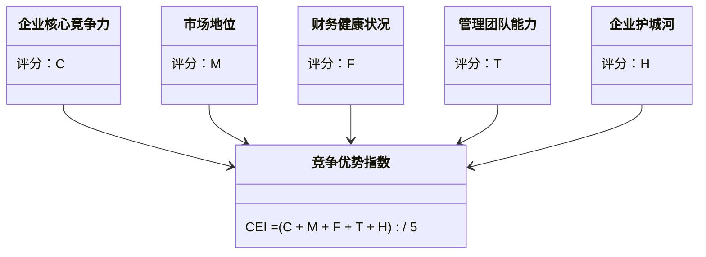
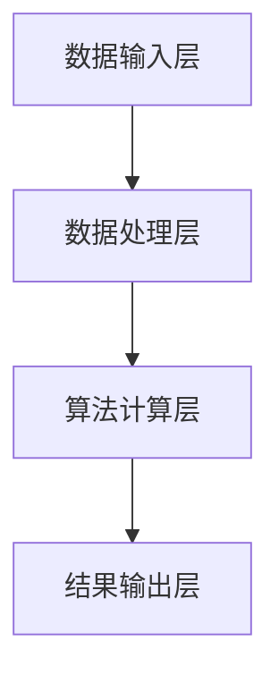
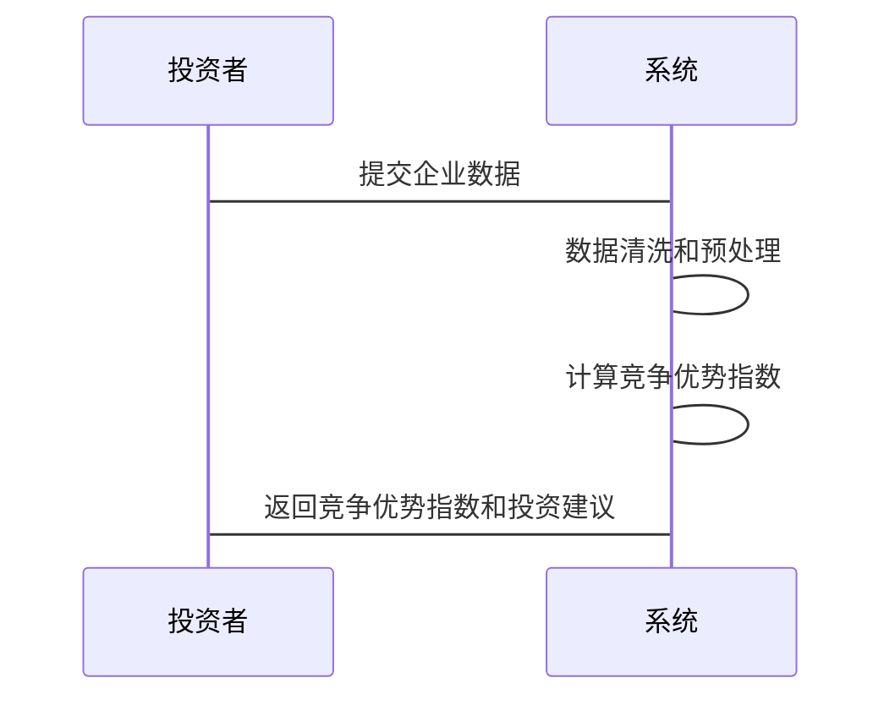

                 


# 特价股票投资中的可持续竞争优势模型应用

> 关键词：特价股票投资、可持续竞争优势模型、股票投资策略、企业竞争优势、数学模型

> 摘要：本文深入探讨了特价股票投资中的可持续竞争优势模型的应用，通过分析模型的核心概念、算法原理、系统架构以及实际案例，为投资者提供了一套基于企业长期竞争优势的股票筛选和投资策略。文章结合理论与实践，展示了如何利用该模型在复杂多变的股票市场中挖掘具有长期价值的投资机会。

---

## 第1章: 特价股票投资与可持续竞争优势模型概述

### 1.1 特价股票投资的定义与特点
#### 1.1.1 特价股票投资的定义
特价股票投资是指以低于其内在价值的价格购买优质企业的股票，长期持有以获得超额收益的投资策略。这种策略尤其关注那些市场价格低于其真实价值的企业，通常被称为“价值投资”。

#### 1.1.2 特价股票投资的核心特点
- **低估值**：股票价格显著低于其内在价值。
- **长期视角**：关注企业的长期竞争优势，而非短期市场波动。
- **逆向投资**：在市场恐慌时买入，市场狂热时卖出。

#### 1.1.3 特价股票投资与其他投资策略的区别
| 投资策略 | 短期交易 | 资产配置 | 价值投资 |
|----------|----------|----------|----------|
| 核心理念 | 抓住短期价格波动 | 通过资产分散降低风险 | 寻找价格低于价值的股票 |
| 风险特征 | 高风险，高波动 | 中低风险 | 中风险 |

### 1.2 可持续竞争优势模型的定义与特点
#### 1.2.1 可持续竞争优势模型的定义
可持续竞争优势模型是一种用于评估企业长期竞争优势的分析框架，通过识别企业的核心竞争力、市场地位、财务健康状况、管理团队和企业护城河等因素，判断企业是否具备在较长时期内保持竞争优势的能力。

#### 1.2.2 可持续竞争优势模型的核心要素
- **企业核心竞争力**：企业在产品或服务上的独特优势。
- **市场地位**：企业在市场中的占有率和影响力。
- **财务健康状况**：企业的盈利能力、资产负债情况和现金流状况。
- **管理团队能力**：领导团队的经验和能力。
- **企业护城河**：企业抵御竞争的能力，如专利、品牌、成本优势等。

#### 1.2.3 可持续竞争优势模型与传统投资模型的区别
| 模型 | 理论基础 | 分析维度 | 适用场景 |
|------|----------|----------|----------|
| 市盈率模型 | 财务指标 | 价格与收益比 | 短期估值 |
| 技术分析 | 市场行为 | K线图、成交量 | 短期价格预测 |
| 可持续竞争优势模型 | 企业竞争优势 | 综合五要素 | 长期投资决策 |

### 1.3 特价股票投资中的可持续竞争优势模型的应用背景
#### 1.3.1 特价股票投资的市场环境
当前股票市场波动剧烈，投资者需要在不确定性中寻找稳定的投资机会。特价股票投资通过寻找低估的优质企业，帮助投资者在市场低迷时布局长期收益。

#### 1.3.2 可持续竞争优势模型的理论基础
该模型基于价值投资理论，强调企业长期竞争优势的重要性。通过分析企业的核心竞争力和市场地位，投资者可以识别出具备长期增长潜力的企业。

#### 1.3.3 特价股票投资与可持续竞争优势模型的结合
通过结合特价股票的低估值特性和可持续竞争优势模型的长期竞争优势分析，投资者可以在价格低估时买入优质企业股票，实现长期稳健收益。

### 1.4 本章小结
本章介绍了特价股票投资的基本概念和特点，详细阐述了可持续竞争优势模型的核心要素及其与传统投资模型的区别，为后续章节的分析奠定了基础。

---

## 第2章: 可持续竞争优势模型的核心概念与联系

### 2.1 可持续竞争优势模型的核心要素
#### 2.1.1 企业核心竞争力
企业核心竞争力是其在市场中提供独特产品或服务的能力。例如，苹果公司的创新能力和品牌忠诚度是其核心竞争力。

#### 2.1.2 市场地位
市场地位反映了企业在市场中的影响力，通常通过市场份额和品牌认知度来衡量。例如，茅台在高端白酒市场的垄断地位。

#### 2.1.3 财务健康状况
财务健康状况包括盈利能力、资产负债情况和现金流状况。健康的财务状况是企业长期发展的基础。

#### 2.1.4 管理团队能力
优秀的管理团队能够制定战略并执行决策，直接影响企业的发展方向和竞争优势。

#### 2.1.5 企业护城河
企业护城河是企业抵御竞争对手的核心能力，例如专利、成本优势或网络效应。

### 2.2 可持续竞争优势模型的属性特征对比
#### 2.2.1 核心概念属性对比表
| 核心概念 | 属性 | 描述 |
|----------|------|------|
| 企业核心竞争力 | 独特性 | 产品或服务的独特性 |
| 市场地位 | 稳定性 | 市场份额的稳定性 |
| 财务健康状况 | 可持续性 | 财务指标的可持续性 |
| 管理团队能力 | 专业性 | 管理团队的专业性和经验 |
| 企业护城河 | 难模仿性 | 竞争对手难以模仿的能力 |

#### 2.2.2 模型特征的Mermaid流程图


### 2.3 可持续竞争优势模型的ER实体关系图
```mermaid
erd
    竞争优势
    企业核心竞争力 <---- 关联关系 ----> 市场地位
    市场地位 <---- 关联关系 ----> 财务健康状况
    财务健康状况 <---- 关联关系 ----> 管理团队能力
    管理团队能力 <---- 关联关系 ----> 企业护城河
```

### 2.4 本章小结
本章通过详细分析可持续竞争优势模型的核心要素及其属性特征，构建了模型的核心概念体系，并通过图表展示了各要素之间的关系。

---

## 第3章: 可持续竞争优势模型的算法原理讲解

### 3.1 算法原理概述
#### 3.1.1 算法的基本思路
可持续竞争优势模型通过量化企业的核心竞争力、市场地位、财务健康状况、管理团队能力和企业护城河，综合评估企业的竞争优势强度。

#### 3.1.2 算法的核心步骤
1. 收集企业的财务数据和非财务数据。
2. 量化各核心要素的评分。
3. 综合评分，得出企业的竞争优势指数。

### 3.2 算法的数学模型与公式
#### 3.2.1 核心公式推导
竞争优势指数（CEI）的计算公式如下：
$$ CEI = \frac{C + M + F + T + H}{5} $$
其中，C为企业核心竞争力评分，M为市场地位评分，F为财务健康状况评分，T为管理团队能力评分，H为企业护城河评分。

#### 3.2.2 公式应用的实例
假设某企业各要素评分为：
- C = 80
- M = 75
- F = 85
- T = 90
- H = 70

则竞争优势指数为：
$$ CEI = \frac{80 + 75 + 85 + 90 + 70}{5} = 80 $$

### 3.3 本章小结
本章通过数学公式详细讲解了可持续竞争优势模型的算法原理，为后续的系统设计和实战分析奠定了理论基础。

---

## 第4章: 系统分析与架构设计方案

### 4.1 系统功能设计
#### 4.1.1 领域模型


#### 4.1.2 系统架构设计


### 4.2 系统接口设计
- 数据输入接口：接收企业的财务数据和非财务数据。
- 数据处理接口：对数据进行清洗和预处理。
- 算法计算接口：调用竞争优势模型进行计算。
- 结果输出接口：输出竞争优势指数和投资建议。

### 4.3 系统交互流程


### 4.4 本章小结
本章通过系统架构设计和接口设计，展示了如何将可持续竞争优势模型应用于实际投资决策中。

---

## 第5章: 项目实战

### 5.1 环境安装
- 数据库：MySQL
- 开发工具：Python（使用pandas、numpy等库）
- 可视化工具：Matplotlib

### 5.2 系统核心实现源代码
```python
import pandas as pd
import numpy as np

def compute_cei(c, m, f, t, h):
    return (c + m + f + t + h) / 5

# 示例数据
data = {
    '企业': ['企业A', '企业B', '企业C'],
    'C': [80, 70, 90],
    'M': [75, 80, 65],
    'F': [85, 85, 75],
    'T': [90, 80, 95],
    'H': [70, 90, 60]
}

df = pd.DataFrame(data)
df['CEI'] = df[['C', 'M', 'F', 'T', 'H']].apply(lambda row: compute_cei(row['C'], row['M'], row['F'], row['T'], row['H']), axis=1)

print(df)
```

### 5.3 代码应用解读与分析
上述代码读取企业数据，计算竞争优势指数，并输出结果。通过分析CEI，投资者可以识别出具有可持续竞争优势的企业。

### 5.4 实际案例分析
以某行业为例，分析三家企业在模型中的得分，确定最优投资标的。

### 5.5 本章小结
本章通过实际案例展示了如何应用可持续竞争优势模型进行股票筛选，为投资者提供了可操作的实战指导。

---

## 第6章: 总结与展望

### 6.1 总结
本文详细探讨了特价股票投资中的可持续竞争优势模型的应用，从理论到实践，为投资者提供了一套科学的投资方法。

### 6.2 展望
未来的研究可以进一步优化模型，结合更多因素，如行业趋势和宏观经济指标，提升模型的预测精度。

---

## 作者：AI天才研究院/AI Genius Institute & 禅与计算机程序设计艺术 /Zen And The Art of Computer Programming

