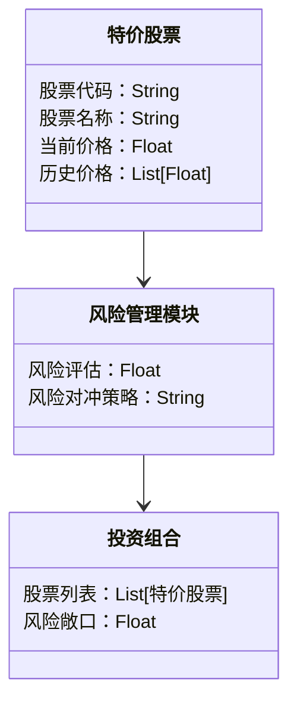

                 


```
# 特价股票投资中的国际化风险管理

## 关键词：
- 特价股票
- 国际化风险管理
- 投资策略
- 风险评估
- 数学模型
- 系统架构
- 实战案例

## 摘要：
本文深入探讨了特价股票投资中的国际化风险管理，结合背景介绍、核心概念、算法原理、系统架构和实战案例，系统地分析了如何在全球化市场中有效管理投资风险。通过数学模型和实际案例的详细解读，本文为投资者提供了科学的决策支持和风险管理策略。

---

## 第1章: 特价股票投资与国际化风险管理的背景概述

### 1.1 特价股票投资的基本概念
#### 1.1.1 特价股票的定义与特点
- 特价股票的定义：低于市场价的股票，通常在特定条件下发行或交易。
- 特价股票的特点：高波动性、高风险、高潜在收益。

#### 1.1.2 特价股票投资的市场背景
- 全球化市场的兴起：国际化投资的普及。
- 特价股票的市场环境：经济周期、政策变化、市场波动。

#### 1.1.3 特价股票与传统股票投资的区别
- 投资方式：特价股票通常采用特定策略，如事件驱动、折价收购等。
- 风险特征：高风险与高收益并存。

### 1.2 国际化风险管理的定义与重要性
#### 1.2.1 国际化风险管理的定义
- 定义：在全球化市场中，识别、量化和控制跨国投资风险的过程。

#### 1.2.2 国际化风险管理的核心要素
- 风险识别：识别影响投资的潜在风险。
- 风险量化：通过数学模型评估风险程度。
- 风险控制：制定应对策略以降低风险。

#### 1.2.3 国际化风险管理在投资中的作用
- 保护投资本金：避免重大损失。
- 提高收益稳定性：通过分散风险实现长期稳健收益。

### 1.3 特价股票投资中的国际化风险管理的必要性
#### 1.3.1 全球化市场对风险管理的新要求
- 跨国市场的波动性：不同市场的联动效应。
- 政治经济风险：汇率波动、政策变化对投资的影响。

#### 1.3.2 特价股票投资中的风险来源
- 市场风险：股票价格波动。
- 汇率风险：外汇波动对投资收益的影响。
- 政治风险：政策变化或地缘政治风险。

#### 1.3.3 国际化风险管理在特价股票投资中的应用价值
- 提高投资决策的科学性。
- 降低投资风险，实现稳健收益。

### 1.4 本章小结
- 介绍了特价股票投资和国际化风险管理的基本概念。
- 强调了国际化风险管理在特价股票投资中的重要性。

---

## 第2章: 特价股票投资的背景与现状

### 2.1 特价股票投资的市场背景
#### 2.1.1 特价股票投资的市场环境
- 经济周期：经济衰退期或复苏期的特价股票投资机会。
- 市场情绪：投资者情绪波动对特价股票的影响。

#### 2.1.2 特价股票投资的驱动因素
- 市场波动：突发事件引发的股价波动。
- 公司基本面：公司业绩不佳或重组导致股价折价。

#### 2.1.3 特价股票投资的市场参与者
- 投资者：个人投资者、机构投资者。
- 中介机构：券商、基金公司、投资顾问。

### 2.2 特价股票投资的核心概念与属性
#### 2.2.1 特价股票投资的定义与分类
- 定义：以低于市场价买入股票的投资策略。
- 分类：按投资策略分为事件驱动型、价值发现型等。

#### 2.2.2 特价股票投资的关键特征
- 高波动性：股价波动大，风险高。
- 高潜在收益：成功投资可能带来高额回报。
- 短期性：通常为短线投资。

#### 2.2.3 特价股票投资的优劣势对比
| 优势 | 劣势 |
|------|------|
| 高潜在收益 | 高风险 |
| 短期机会 | 需要频繁监控市场 |
| 事件驱动 | 市场流动性差 |

### 2.3 特价股票投资的现状与发展趋势
#### 2.3.1 特价股票投资的现状分析
- 市场规模：全球范围内特价股票投资的市场规模。
- 主要参与者：机构投资者和个人投资者的分布。

#### 2.3.2 特价股票投资的未来趋势
- 技术驱动：大数据和人工智能在投资决策中的应用。
- 市场国际化：跨国投资的增加。

#### 2.3.3 特价股票投资的挑战与机遇
- 挑战：市场波动大、信息不对称、监管不确定性。
- 机遇：技术进步、市场多元化。

### 2.4 本章小结
- 分析了特价股票投资的市场背景和核心概念。
- 探讨了其现状、发展趋势及面临的挑战与机遇。

---

## 第3章: 国际化风险管理的核心概念与原理

### 3.1 国际化风险管理的定义与分类
#### 3.1.1 国际化风险管理的定义
- 定义：在全球化市场中，对跨国投资风险的管理。

#### 3.1.2 国际化风险管理的分类
- 市场风险：汇率、利率波动带来的风险。
- 政治风险：政策变化、地缘政治风险。
- 操作风险：交易、结算过程中的风险。

#### 3.1.3 国际化风险管理的核心要素
- 风险识别：确定潜在风险来源。
- 风险量化：评估风险对投资的影响。
- 风险控制：制定应对策略。

### 3.2 国际化风险管理的原理与机制
#### 3.2.1 风险识别与评估
- 风险识别方法：SWOT分析、PEST分析。
- 风险评估指标：VaR（Value at Risk）、CVaR（Conditional Value at Risk）。

#### 3.2.2 风险量化与测量
- 数学模型：CAPM（资本资产定价模型）、APT（套利定价理论）。
- 风险度量方法：方差、标准差、协方差。

#### 3.2.3 风险控制与应对策略
- 风险分散：通过多元化投资降低风险。
- 风险对冲：利用衍生工具（如期货、期权）进行对冲。
- 风险规避：通过调整投资组合避免高风险资产。

### 3.3 国际化风险管理在投资中的应用
#### 3.3.1 风险管理的实施步骤
1. 风险识别：确定潜在风险。
2. 风险量化：评估风险程度。
3. 风险控制：制定应对策略。
4. 风险监控：持续监测风险变化。

#### 3.3.2 国际化风险管理的成功案例
- 案例分析：某跨国公司如何通过风险管理避免重大损失。

### 3.4 本章小结
- 介绍了国际化风险管理的定义、分类和核心要素。
- 探讨了风险管理的原理与实施策略。

---

## 第4章: 特价股票投资中的国际化风险管理的核心概念与联系

### 4.1 特价股票投资与国际化风险管理的定义与联系
#### 4.1.1 特价股票投资与国际化风险管理的定义对比
- 特价股票投资：以低价买入股票的投资策略。
- 国际化风险管理：在全球市场中管理投资风险。

#### 4.1.2 特价股票投资与国际化风险管理的联系
- 投资环境：全球化市场中，特价股票投资需要考虑国际化风险管理。
- 风险来源：国际化市场波动、政策变化等对特价股票投资的影响。

#### 4.1.3 特价股票投资与国际化风险管理的相互作用
- 特价股票投资需要国际化风险管理来降低风险。
- 国际化风险管理通过特价股票投资实现收益。

### 4.2 特价股票投资中的国际化风险管理的核心概念
#### 4.2.1 风险识别与评估
- 特价股票投资中的主要风险：市场风险、流动性风险、政策风险。

#### 4.2.2 风险量化与测量
- 使用VaR模型评估潜在损失。
- 使用协方差分析相关市场的波动性。

#### 4.2.3 风险控制与应对策略
- 通过多元化投资降低风险。
- 使用衍生工具对冲市场波动。

### 4.3 特价股票投资中的国际化风险管理的联系与应用
#### 4.3.1 联系：国际化风险管理如何影响特价股票投资决策
- 风险评估影响投资策略。
- 风险控制影响投资组合的构建。

#### 4.3.2 应用：如何在实际投资中应用国际化风险管理
- 通过VaR模型选择风险可控的特价股票。
- 通过多元化投资降低风险。

### 4.4 本章小结
- 分析了特价股票投资与国际化风险管理的联系。
- 探讨了如何在特价股票投资中应用国际化风险管理。

---

## 第5章: 特价股票投资中的国际化风险管理的算法原理与数学模型

### 5.1 风险评估的算法原理
#### 5.1.1 VaR模型的原理
- VaR定义：在一定置信水平下，可能的最大损失。
- 计算方法：历史模拟法、方差-协方差法、蒙特卡洛模拟法。

#### 5.1.2 VaR模型的优劣势
- 优势：简单易懂，适用于多种资产。
- 劣势：假设资产分布正态，忽略尾部风险。

#### 5.1.3 VaR模型的实现步骤
1. 数据收集：收集历史股价数据。
2. 计算收益率分布。
3. 确定置信水平。
4. 计算VaR值。

### 5.2 风险对冲的算法原理
#### 5.2.1 期权对冲原理
- 期权定义：买方有权以特定价格买卖标的资产。
- 对冲原理：通过卖出期权对冲股价波动风险。

#### 5.2.2 期货对冲原理
- 期货定义：标准化合约，约定未来价格。
- 对冲原理：通过期货合约锁定价格风险。

#### 5.2.3 套利定价理论（APT）的应用
- APT定义：通过多个因素解释资产收益。
- 应用：通过多个因素构建对冲组合。

### 5.3 数学模型与公式
#### 5.3.1 VaR公式
$$ VaR = \mu + z \cdot \sigma $$
其中：
- $\mu$ 是平均收益率。
- $z$ 是标准正态分布的分位数。
- $\sigma$ 是收益率的标准差。

#### 5.3.2 期权定价公式（Black-Scholes模型）
$$ C = S_0 e^{-rT} N(d_1) - K e^{-rT} N(d_2) $$
其中：
- $C$ 是期权价格。
- $S_0$ 是标的资产价格。
- $r$ 是无风险利率。
- $T$ 是时间到期。
- $K$ 是行权价。
- $N(d)$ 是标准正态分布的累积分布函数。

### 5.4 本章小结
- 介绍了VaR模型和期权定价模型的原理与应用。
- 推导了相关数学公式，为风险评估和对冲提供了理论基础。

---

## 第6章: 特价股票投资中的国际化风险管理的系统架构与实现

### 6.1 系统架构设计
#### 6.1.1 领域模型设计
- 领域模型类图：


#### 6.1.2 系统架构设计
- 分层架构：
  1. 数据层：数据存储与访问。
  2. 业务逻辑层：风险评估与对冲策略。
  3. 用户界面层：展示投资组合与风险报告。

#### 6.1.3 接口设计
- 数据接口：与数据源（如股票交易所）对接。
- 风险评估接口：调用VaR模型进行风险评估。
- 对冲策略接口：根据风险评估结果制定对冲策略。

### 6.2 系统实现
#### 6.2.1 环境安装
- Python 3.8+
- 数据库：MySQL或MongoDB。
- 开发工具：PyCharm或VS Code。

#### 6.2.2 核心代码实现
- VaR模型实现：
```python
import numpy as np

def calculate VaR(prices, confidence_level=0.95):
    returns = np.log(prices[1:] / prices[:-1])
    mu = np.mean(returns)
    sigma = np.std(returns)
    z = norm.ppf(1 - confidence_level)
    VaR = mu + z * sigma
    return VaR
```

- 期权定价模型实现：
```python
import numpy as np
from scipy.stats import norm

def black_scholes(S, K, r, T, sigma):
    d1 = (np.log(S/K) + (r + sigma**2/2)*T) / (sigma*np.sqrt(T))
    d2 = d1 - sigma*np.sqrt(T)
    C = S * norm.cdf(d1) - K * np.exp(-r*T) * norm.cdf(d2)
    return C
```

#### 6.2.3 系统功能实现
- 数据获取：从数据库获取历史股价数据。
- 风险评估：调用VaR模型计算风险值。
- 对冲策略：根据风险评估结果生成对冲订单。

### 6.3 系统交互设计
- 交互流程：
  1. 用户输入投资组合。
  2. 系统获取相关股票数据。
  3. 系统计算VaR值。
  4. 系统生成对冲策略。
  5. 用户确认对冲策略并执行。

### 6.4 本章小结
- 设计了系统的架构，包括数据层、业务逻辑层和用户界面层。
- 实现了核心算法，并给出了系统交互流程。

---

## 第7章: 特价股票投资中的国际化风险管理的实战案例与最佳实践

### 7.1 特价股票投资中的国际化风险管理的实战案例
#### 7.1.1 案例背景
- 公司：某跨国企业。
- 股票：XYZ公司股票，股价近期大幅下跌，现价低于市价。

#### 7.1.2 投资策略
- 买入XYZ公司股票，期望股价回升。

#### 7.1.3 风险评估
- 使用VaR模型评估潜在损失：5%置信水平下，可能损失为10%。

#### 7.1.4 对冲策略
- 买入看涨期权，对冲股价波动风险。

#### 7.1.5 实施结果
- 股价回升，期权到期时行权，实现收益。

### 7.2 最佳实践
#### 7.2.1 投资策略建议
- 多元化投资：分散风险。
- 灵活调整：根据市场变化及时调整投资组合。

#### 7.2.2 风险管理建议
- 定期评估风险：持续监控市场变化。
- 灵活使用对冲工具：根据市场情况调整对冲策略。

#### 7.2.3 技术工具建议
- 使用量化工具：如Python、R进行数据分析。
- 使用风险管理软件：如 Bloomberg、Reuters 进行风险评估。

### 7.3 小结与注意事项
- 小结：通过案例分析，验证了国际化风险管理在特价股票投资中的有效性。
- 注意事项：市场波动、政策变化、信息不对称等风险。

---

## 第8章: 总结与展望

### 8.1 本章总结
- 总结了特价股票投资中的国际化风险管理的核心概念、算法原理、系统架构和实战案例。
- 强调了风险管理在投资中的重要性。

### 8.2 未来展望
- 技术进步：人工智能在风险管理中的应用。
- 市场发展：国际化投资的进一步发展。
- 挑战与机遇：如何应对全球化市场中的新风险。

---

## 作者：AI天才研究院/AI Genius Institute & 禅与计算机程序设计艺术 /Zen And The Art of Computer Programming
```

