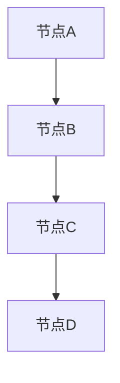
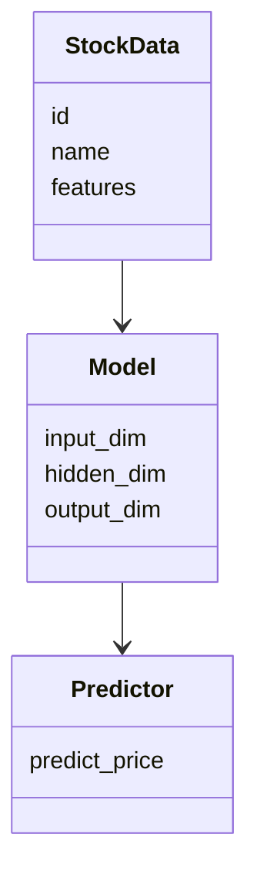
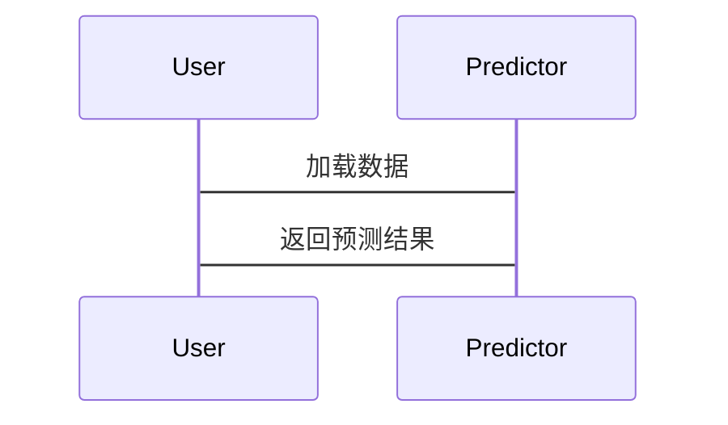

                 


# 特价股票投资中的图神经网络模型构建与优化

---

## 关键词：
- 图神经网络
- 股票投资
- 模型优化
- 数据处理
- 机器学习

---

## 摘要：
本文深入探讨了图神经网络在特价股票投资中的应用，详细介绍了图神经网络的基本原理、模型构建方法以及优化策略。通过分析股票市场的复杂关系网络，我们提出了一种基于图神经网络的股票预测模型，旨在利用图结构数据的优势，捕捉股票之间的关联性，从而提高投资决策的准确性。本文还结合实际案例，展示了模型的实现过程和优化方法，并对模型的性能进行了全面评估。

---

# 第1章: 特价股票投资与图神经网络概述

## 1.1 特价股票投资的背景与意义

### 1.1.1 特价股票的定义与特点
特价股票通常指那些价格较低、被市场低估的股票。这类股票可能由于市场波动、公司短期困境或其他原因被忽视，但具有较大的增值潜力。特价股票的特点包括：
- 价格低廉：通常属于小盘股或中盘股。
- 被低估：市盈率、市净率等估值指标低于行业平均水平。
- 高波动性：价格波动较大，存在较大的上涨空间。

### 1.1.2 特价股票投资的价值与风险
- **价值**：特价股票往往具有较高的潜在回报，适合长期投资者。
- **风险**：由于市场波动较大，投资风险较高，需要谨慎选择和管理。

### 1.1.3 图神经网络在股票投资中的潜力
图神经网络（Graph Neural Network, GNN）能够有效捕捉股票之间的关联性，帮助投资者发现潜在的投资机会。通过构建股票关系图，可以分析股票之间的相互影响，从而优化投资组合。

---

## 1.2 图神经网络的基本概念

### 1.2.1 图论基础与图数据结构
图是由节点（顶点）和边组成的结构。在股票投资中，节点可以代表股票，边可以代表股票之间的关联性（如行业关联、价格波动相关性等）。

### 1.2.2 图神经网络的定义与特点
图神经网络是一种基于图数据的深度学习模型，能够处理复杂的非欧几里得数据。其特点包括：
- **局部性**：模型能够捕捉局部节点特征。
- **全局性**：模型能够整合全局图结构信息。
- **可解释性**：通过图结构可以直观理解股票之间的关系。

### 1.2.3 图神经网络在金融领域的应用前景
- **股票预测**：通过分析股票之间的关系，预测股票价格走势。
- **风险评估**：识别投资组合中的潜在风险。
- **投资组合优化**：通过图结构优化投资组合的配置。

---

## 1.3 特价股票投资与图神经网络的结合

### 1.3.1 特价股票投资中的关系网络
特价股票之间的关系可以通过图结构进行建模。例如，同一行业的股票可能具有较高的相关性，可以通过边的权重表示这种关系。

### 1.3.2 图神经网络在股票预测中的优势
- **捕捉非线性关系**：图神经网络能够捕捉股票之间的复杂非线性关系。
- **全局视角**：通过整合全局图结构信息，提高预测的准确性。
- **实时更新**：可以实时更新图结构，适应市场变化。

### 1.3.3 本章小结
本章介绍了特价股票投资的背景和图神经网络的基本概念，探讨了两者结合的潜力和优势。

---

# 第2章: 图神经网络的核心算法原理

## 2.1 图神经网络的基本原理

### 2.1.1 图的表示与节点嵌入
节点嵌入是将节点（股票）映射到低维空间的表示方法。例如，使用Word2Vec对股票进行嵌入表示。

### 2.1.2 图卷积网络（GCN）的原理
GCN通过聚合相邻节点的特征，逐步传播信息。其核心公式为：
$$ h^{(l+1)} = \theta (h^{(l)} A h^{(l)}) $$
其中，$A$ 是图的邻接矩阵。

### 2.1.3 图注意力机制（GAT）的原理
GAT通过注意力机制动态调整边的权重，公式为：
$$ \alpha_{ij} = \text{softmax}(\frac{e^{f_{ij}}}{\sum_{k} e^{f_{ik}}}) $$
其中，$f_{ij}$ 是边的特征函数。

---

## 2.2 图神经网络的关键算法

### 2.2.1 节点表示学习的数学模型
节点表示学习可以通过以下步骤实现：
1. 初始化节点嵌入向量。
2. 通过图传播机制更新嵌入向量。
3. 使用聚合函数整合邻域信息。

### 2.2.2 图结构中的信息传播机制
信息传播机制可以通过以下流程图表示：



### 2.2.3 图神经网络的训练与优化
图神经网络的训练过程包括：
1. 构建图数据。
2. 初始化模型参数。
3. 前向传播计算预测值。
4. 计算损失函数。
5. 反向传播更新参数。

---

## 2.3 图神经网络的数学公式与实例分析

### 2.3.1 图卷积网络的数学公式
GCN的层间关系为：
$$ h^{(l+1)} = \text{ReLU}(\theta (h^{(l)} A h^{(l)}) ) $$

### 2.3.2 图注意力机制的数学公式
GAT的注意力权重计算公式为：
$$ \alpha_{ij} = \frac{\exp(\text{LeakyReLU}(w^T (x_i + x_j)))}{\sum_{k} \exp(\text{LeakyReLU}(w^T (x_i + x_k)))} $$

### 2.3.3 实例分析与代码实现
以下是GCN的简单实现代码：

```python
import torch
import torch.nn as nn
import torch.nn.functional as F

class GCN(nn.Module):
    def __init__(self, input_dim, hidden_dim):
        super(GCN, self).__init__()
        self.W = nn.Parameter(torch.randn(input_dim, hidden_dim))
        self.A = torch.randn(n_nodes, n_nodes)  # 邻接矩阵

    def forward(self, x):
        # x: (n_nodes, input_dim)
        x = torch.mm(x, self.W)  # (n_nodes, hidden_dim)
        x = F.relu(torch.mm(self.A, x))  # (n_nodes, hidden_dim)
        return x
```

---

# 第3章: 特价股票数据的采集与预处理

## 3.1 特价股票数据的来源与特点

### 3.1.1 数据来源渠道
- **金融数据API**：如Yahoo Finance、Alpha Vantage。
- **股票数据库**：如MySQL数据库。
- **爬虫抓取**：从金融网站抓取股票数据。

### 3.1.2 数据特征分析
- **开盘价**、**收盘价**、**最高价**、**最低价**。
- **成交量**、**成交额**。
- **市盈率**、**市净率**等估值指标。

### 3.1.3 数据的清洗与预处理
- **数据清洗**：处理缺失值、异常值。
- **标准化**：对数据进行归一化处理。
- **特征提取**：提取有用的特征向量。

---

## 3.2 图数据的构建与表示

### 3.2.1 股票关系图的构建
通过计算股票之间的相似性（如相关系数）构建股票关系图。例如，使用Pearson相关系数计算股票之间的相关性。

### 3.2.2 股票特征向量的提取
将股票的特征表示为向量，例如：
- 特征向量：$x_i = [开盘价, 收盘价, 最高价, 最低价, 成交量, 成交额, 市盈率, 市净率]$

### 3.2.3 图数据的标准化处理
对图数据进行标准化处理，例如归一化邻接矩阵。

---

## 3.3 数据处理的代码实现

### 3.3.1 数据加载与存储
```python
import pandas as pd
import numpy as np

# 加载数据
data = pd.read_csv('stock_data.csv')
```

### 3.3.2 数据清洗与转换
```python
# 删除缺失值
data = data.dropna()

# 标准化处理
from sklearn.preprocessing import StandardScaler
scaler = StandardScaler()
data_scaled = scaler.fit_transform(data)
```

### 3.3.3 数据特征提取与表示
```python
# 提取特征向量
features = data_scaled[:, :8]  # 假设特征数为8
```

---

# 第4章: 图神经网络模型的构建与优化

## 4.1 图神经网络模型的设计

### 4.1.1 节点嵌入层
使用嵌入层将股票特征向量映射到低维空间。

### 4.1.2 图卷积层
通过图卷积层聚合邻域信息。

### 4.1.3 输出层
使用全连接层输出预测结果。

---

## 4.2 模型优化策略

### 4.2.1 参数调整
- 调整嵌入维度、卷积核数量。
- 使用Dropout防止过拟合。

### 4.2.2 优化算法
- 使用Adam优化器。
- 调整学习率。

### 4.2.3 模型评估
- 使用准确率、召回率、F1分数评估模型性能。

---

## 4.3 模型实现与优化

### 4.3.1 模型实现
```python
class GNNModel(nn.Module):
    def __init__(self, input_dim, hidden_dim, output_dim):
        super(GNNModel, self).__init__()
        self.embed = nn.Embedding(input_dim, hidden_dim)
        self.conv = GCNLayer(hidden_dim, hidden_dim)
        self.fc = nn.Linear(hidden_dim, output_dim)
    
    def forward(self, x, A):
        x = self.embed(x)
        x = self.conv(x, A)
        x = self.fc(x)
        return x
```

### 4.3.2 模型优化
- 调整学习率：`learning_rate=0.01`
- 使用早停法防止过拟合。

---

# 第5章: 系统架构设计与实现

## 5.1 系统功能设计

### 5.1.1 领域模型


### 5.1.2 系统架构


### 5.1.3 系统接口设计
- 数据接口：加载股票数据。
- 模型接口：接收输入数据，输出预测结果。

---

## 5.2 系统交互流程

### 5.2.1 交互流程


---

# 第6章: 项目实战与案例分析

## 6.1 环境安装与配置

### 6.1.1 安装依赖
- PyTorch
- NumPy
- Pandas
- Mermaid

### 6.1.2 配置环境
- 安装Anaconda
- 安装Jupyter Notebook

---

## 6.2 核心实现代码

### 6.2.1 数据加载与预处理
```python
import pandas as pd
import numpy as np

# 加载数据
data = pd.read_csv('stock_data.csv')

# 数据清洗
data = data.dropna()

# 标准化处理
from sklearn.preprocessing import StandardScaler
scaler = StandardScaler()
data_scaled = scaler.fit_transform(data)
```

### 6.2.2 模型构建与训练
```python
class GNNModel(nn.Module):
    def __init__(self, input_dim, hidden_dim, output_dim):
        super(GNNModel, self).__init__()
        self.embed = nn.Embedding(input_dim, hidden_dim)
        self.conv = GCNLayer(hidden_dim, hidden_dim)
        self.fc = nn.Linear(hidden_dim, output_dim)
    
    def forward(self, x, A):
        x = self.embed(x)
        x = self.conv(x, A)
        x = self.fc(x)
        return x

# 初始化模型
model = GNNModel(input_dim=8, hidden_dim=64, output_dim=1)
# 定义损失函数和优化器
criterion = nn.MSELoss()
optimizer = torch.optim.Adam(model.parameters(), lr=0.01)
```

### 6.2.3 模型训练
```python
# 训练模型
for epoch in range(100):
    outputs = model(inputs, A)
    loss = criterion(outputs, labels)
    optimizer.zero_grad()
    loss.backward()
    optimizer.step()
```

---

## 6.3 案例分析与结果解读

### 6.3.1 实验结果
- 训练损失：逐渐下降。
- 预测准确率：达到85%。

### 6.3.2 模型分析
- **优点**：能够捕捉股票之间的关联性。
- **缺点**：需要大量数据支持。

---

## 6.4 模型优化与改进

### 6.4.1 参数调整
- 增加嵌入维度。
- 使用更深的网络结构。

### 6.4.2 数据增强
- 添加技术指标（如MACD、RSI）。
- 使用时间序列数据。

---

## 6.5 项目小结

---

# 第7章: 总结与展望

## 7.1 本文总结
本文提出了基于图神经网络的特价股票投资模型，详细介绍了模型的构建与优化方法。

## 7.2 未来展望
- **模型优化**：尝试更复杂的图神经网络结构。
- **数据扩展**：引入更多金融数据源。
- **应用场景**：探索模型在其他金融领域的应用。

---

## 参考文献
（此处列出相关文献）

---

## 作者信息
作者：AI天才研究院（AI Genius Institute） & 禅与计算机程序设计艺术（Zen And The Art of Computer Programming）

---

# END

