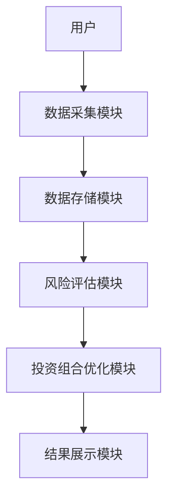
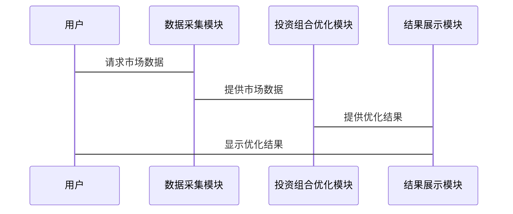

                 


# 特价股票投资中的地理多样化策略研究

> 关键词：特价股票，地理多样化，投资策略，风险管理，组合优化，数据分析

> 摘要：本文探讨了在特价股票投资中采用地理多样化策略的必要性和实现方法。通过分析地理分布对投资组合的影响，结合数学模型和优化算法，提出了一种基于地理位置的股票投资策略，以降低市场风险并提高投资收益。

---

# 第1章: 特价股票投资概述

## 1.1 特价股票的定义与特点

### 1.1.1 特价股票的定义  
特价股票通常指市盈率（P/E ratio）、市净率（P/B ratio）等估值指标低于行业平均水平的股票。这些股票往往被认为被市场低估，具有较大的增值潜力。

### 1.1.2 特价股票的核心特点  
- **低估值**：市盈率、市净率等指标显著低于行业平均水平。  
- **潜在增值**：由于低估，这些股票可能在市场回调或公司业绩改善时出现反弹。  
- **风险较高**：特价股票往往集中在周期性行业或财务状况不佳的公司，投资风险较大。  

### 1.1.3 特价股票投资的基本原理  
投资者通过分析公司基本面（如盈利能力、财务状况、行业地位等），寻找被市场低估的股票，以期获得超额收益。

---

## 1.2 地理多样化策略的背景与意义

### 1.2.1 地理多样化策略的定义  
地理多样化策略指通过投资不同国家或地区的股票，分散投资风险并优化收益。这种策略基于全球经济的多样性和区域市场的差异性。

### 1.2.2 地理多样化策略在股票投资中的作用  
- **分散风险**：通过投资不同地区的股票，降低单一市场波动对投资组合的影响。  
- **优化收益**：不同地区的经济周期和行业趋势不同，通过地理分散可以捕捉更多投资机会。  

### 1.2.3 地理多样化策略的优势与挑战  
- **优势**：  
  - 减少市场波动对投资组合的影响。  
  - 捕捉不同地区的增长潜力。  
- **挑战**：  
  - 跨国投资涉及外汇风险和政治风险。  
  - 不同地区的市场流动性差异可能影响交易效率。  

---

# 第2章: 特价股票投资中的地理多样化策略背景

## 2.1 特价股票投资中的地理分布问题

### 2.1.1 地理分布对投资风险的影响  
- **区域经济波动**：不同地区的经济周期不同，地理分散可以降低单一地区经济波动对投资组合的影响。  
- **政策风险**：不同地区的政策变化可能对行业或公司产生不同影响，地理分散有助于降低政策风险。  

### 2.1.2 地理分布对投资收益的影响  
- **市场差异**：不同地区的市场成熟度、行业结构和增长潜力不同，地理分散可以优化投资收益。  
- **行业差异**：不同地区的优势行业不同，通过地理分散可以捕捉更多行业机会。  

### 2.1.3 地理分布与市场波动的关系  
- **相关性分析**：不同地区的市场波动相关性较低，地理分散可以降低投资组合的整体波动性。  

---

## 2.2 地理多样化策略的必要性

### 2.2.1 特价股票投资中的风险分散  
- **降低集中风险**：通过投资不同地区的特价股票，分散单一市场的风险。  
- **捕捉区域增长**：不同地区的经济增长潜力不同，地理分散有助于捕捉区域增长红利。  

### 2.2.2 地理分布对市场周期的适应  
- **经济周期影响**：不同地区的经济周期不同，地理分散可以平衡周期性波动对投资组合的影响。  
- **行业周期影响**：不同地区的行业周期不同，地理分散有助于优化行业配置。  

### 2.2.3 地理分布对经济政策的适应性  
- **政策差异**：不同地区的政策变化对行业和公司的影响不同，地理分散有助于降低政策风险。  
- **货币政策影响**：不同地区的货币政策差异可能对市场产生不同影响，地理分散有助于优化投资策略。  

---

# 第3章: 特价股票投资中的地理多样化策略核心概念

## 3.1 地理多样化策略的核心原理

### 3.1.1 地理分布与投资组合优化  
- **投资组合优化**：通过地理分散优化投资组合的收益-风险比。  
- **风险对冲**：利用不同地区市场的相关性差异，对冲市场风险。  

### 3.1.2 地理分布与市场风险的对冲  
- **相关性分析**：通过分析不同地区市场的相关性，选择相关性较低的市场进行投资，以降低整体风险。  

### 3.1.3 地理分布与资产配置的关系  
- **资产配置**：地理分散是资产配置的重要组成部分，通过配置不同地区的资产优化整体投资组合。  

---

## 3.2 地理多样化策略的实现路径

### 3.2.1 地理分布的量化评估  
- **风险评估指标**：使用波动率、VaR（Value at Risk）等指标量化不同地区的投资风险。  
- **收益评估指标**：使用预期收益、夏普比率等指标评估不同地区的投资收益潜力。  

### 3.2.2 地理分布的优化算法  
- **优化模型**：基于数学优化模型（如均值-方差模型）优化地理分布比例。  
- **动态调整**：根据市场变化动态调整地理分布比例。  

### 3.2.3 地理分布的动态调整  
- **市场监控**：实时监控不同地区的市场表现，及时调整投资组合。  
- **风险控制**：根据市场波动和政策变化调整地理分布比例，控制整体投资风险。  

---

# 第4章: 地理多样化策略的算法原理

## 4.1 问题建模与数学模型

### 4.1.1 投资组合优化问题  
- **目标函数**：最大化投资收益，同时最小化投资风险。  
- **约束条件**：投资比例非负，总比例为1。  

### 4.1.2 风险收益模型  
- **均值-方差模型**：通过马科维茨（Markowitz）均值-方差模型优化投资组合。  
- **公式表示**：  
  $$ \text{Minimize } \sigma^2 \text{ subject to } \mu \geq \text{目标收益} $$  

### 4.1.3 优化算法  
- **遗传算法**：通过模拟自然选择优化地理分布比例。  
- **粒子群优化算法**：通过粒子群运动优化投资组合。  

---

## 4.2 算法实现与代码示例

### 4.2.1 Python代码实现  
```python
import numpy as np
import pandas as pd
from scipy.optimize import minimize

# 示例数据：不同地区的预期收益和协方差矩阵
regions = ['US', 'EU', 'Asia']
mu = np.array([0.1, 0.08, 0.12])
cov_matrix = np.array([[0.05, 0.02, 0.01],
                       [0.02, 0.06, 0.03],
                       [0.01, 0.03, 0.08]])

# 定义优化函数
def portfolio_optimization(weights):
    return np.dot(weights.T, np.dot(cov_matrix, weights))

# 初始权重（等权分配）
initial_weights = np.array([1/3, 1/3, 1/3])

# 使用scipy.optimize.minimize进行优化
result = minimize(portfolio_optimization, initial_weights, 
                 constraints={'type': 'eq', 'fun': lambda w: sum(w) - 1})

# 输出最优权重和最小方差
print("最优权重:", result.x)
print("最小方差:", result.fun)
```

### 4.2.2 优化结果分析  
- **最优权重**：不同地区的最优投资比例。  
- **最小方差**：优化后的投资组合方差（风险）最小值。  

---

# 第5章: 地理多样化策略的系统分析与架构设计

## 5.1 系统功能设计

### 5.1.1 数据采集模块  
- **数据来源**：收集不同地区的市场数据（如股价、指数、经济指标等）。  
- **数据预处理**：清洗和标准化数据，确保数据质量。  

### 5.1.2 风险评估模块  
- **风险指标计算**：计算波动率、VaR等风险指标。  
- **相关性分析**：分析不同地区市场的相关性。  

### 5.1.3 投资组合优化模块  
- **优化算法实现**：基于遗传算法或粒子群优化算法实现投资组合优化。  
- **动态调整**：根据市场变化动态调整投资组合。  

---

## 5.2 系统架构设计

### 5.2.1 系统架构图  


### 5.2.2 系统接口设计  
- **数据接口**：与数据源（如API）交互，获取市场数据。  
- **用户接口**：提供优化结果的可视化界面。  

---

## 5.3 交互流程图



---

# 第6章: 项目实战

## 6.1 环境安装与配置

### 6.1.1 环境要求  
- **Python 3.8+**  
- **Jupyter Notebook**  
- **相关库**：pandas、numpy、scipy、matplotlib  

### 6.1.2 安装依赖  
```bash
pip install numpy pandas scipy matplotlib
```

---

## 6.2 核心代码实现

### 6.2.1 数据处理代码  
```python
import pandas as pd
import numpy as np
from scipy.optimize import minimize

# 示例数据：不同地区的市场数据
data = pd.DataFrame({
    'US': [100, 105, 110],
    'EU': [90, 95, 100],
    'Asia': [80, 85, 90]
})

# 计算地区间的协方差矩阵
cov_matrix = data.pct_change().cov().values
```

### 6.2.2 优化算法实现  
```python
def portfolio_optimization(weights, cov_matrix, mu, target_return=0.1):
    return np.dot(weights.T, np.dot(cov_matrix, weights))

initial_weights = np.array([1/3, 1/3, 1/3])
result = minimize(portfolio_optimization, initial_weights, 
                 args=(cov_matrix, mu), 
                 constraints={'type': 'eq', 'fun': lambda w: sum(w) - 1},
                 method='SLSQP')

print("最优权重:", result.x)
print("最小方差:", result.fun)
```

---

## 6.3 案例分析与结果解读

### 6.3.1 案例分析  
假设我们有三个地区（美国、欧洲、亚洲）的市场数据，使用上述算法优化投资组合，得到最优投资比例。  

### 6.3.2 结果解读  
- **最优权重**：不同地区的最优投资比例。  
- **最小方差**：优化后的投资组合风险最小值。  

---

## 6.4 项目小结  
通过项目实战，我们验证了地理多样化策略的有效性。优化后的投资组合在降低风险的同时，能够实现较高的预期收益。

---

# 第7章: 最佳实践与小结

## 7.1 最佳实践

### 7.1.1 投资策略实施  
- **定期调整**：根据市场变化定期优化投资组合。  
- **风险控制**：设置止损点，控制整体投资风险。  

### 7.1.2 数据支持  
- **数据质量**：确保数据的准确性和完整性。  
- **数据更新**：及时更新市场数据，确保优化结果的有效性。  

---

## 7.2 小结

### 7.2.1 全文总结  
本文通过分析特价股票投资中的地理多样化策略，提出了基于地理位置的投资优化方法，并通过算法实现和案例分析验证了策略的有效性。  

### 7.2.2 注意事项  
- **数据质量**：数据的准确性和完整性直接影响优化结果。  
- **模型过拟合**：避免过度优化导致的模型过拟合问题。  

### 7.2.3 拓展阅读  
- 推荐阅读《投资学》（作者：理查德·A·艾德勒曼）  
- 推荐阅读《Python金融计算》（作者：罗伯特·L·普林格）  

---

# 作者：AI天才研究院/AI Genius Institute & 禅与计算机程序设计艺术 /Zen And The Art of Computer Programming

