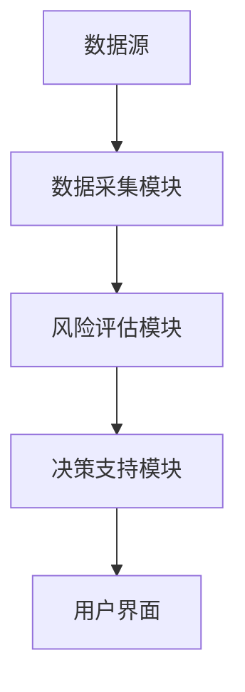
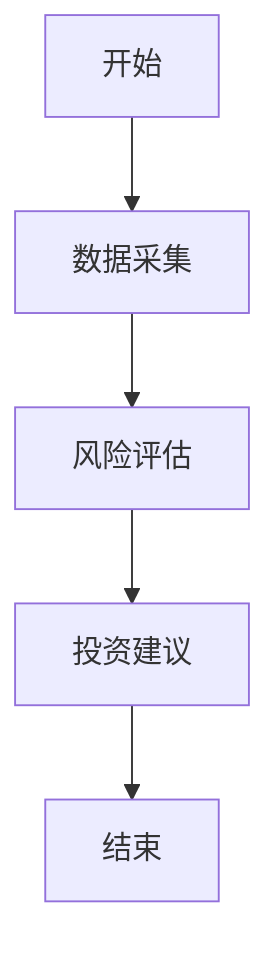

                 


# 特价股票投资中的地缘政治风险动态评估策略

> **关键词**：地缘政治风险，特价股票，风险评估，投资策略，动态评估

> **摘要**：本文系统地探讨了在特价股票投资中如何动态评估地缘政治风险。通过分析地缘政治风险的核心概念、对特价股票投资的影响机制，以及构建动态评估框架和算法模型，本文提出了一种基于层次分析法（AHP）和模糊综合评价法的评估策略。结合实际案例分析和系统设计，本文为投资者提供了实用的风险管理工具和决策支持。

---

# 第1章: 地缘政治风险概述

## 1.1 地缘政治风险的核心概念

### 1.1.1 地缘政治风险的定义与内涵

地缘政治风险是指由于政治、经济、军事等领域的国际关系变化，可能对特定国家、地区或行业造成负面影响的不确定性。这种风险通常与国际冲突、贸易摩擦、政策变化等密切相关，具有高度的复杂性和动态性。

### 1.1.2 地缘政治风险的构成要素

地缘政治风险由多个关键要素构成，包括：
1. **经济制裁**：对特定国家或行业的经济限制措施。
2. **贸易摩擦**：国际贸易中的争端和壁垒。
3. **政治动荡**：政局不稳或政权更迭。
4. **军事冲突**：地区战争或武装冲突。
5. **政策变化**：政府政策的突然调整。

### 1.1.3 地缘政治风险的分类与特征

地缘政治风险可以分为以下几类：
- **国家层面风险**：如战争、政变等。
- **区域层面风险**：如贸易战、地区冲突。
- **行业层面风险**：如针对特定行业的政策限制。

其特征包括：
- **突发性**：往往出人意料，难以预测。
- **复杂性**：涉及多方面的利益关系。
- **连锁反应**：一个小事件可能引发连锁反应，影响多个领域。

---

## 1.2 特价股票投资的特点

### 1.2.1 特价股票的定义与市场定位

特价股票通常指价格低于市场平均市盈率的股票，具有较高的波动性和潜在的高收益。这类股票多出现在中小企业或新兴行业，投资风险较高，但回报潜力大。

### 1.2.2 特价股票市场的波动性分析

特价股票市场波动剧烈，受市场情绪和短期因素影响较大。投资者在追求高收益的同时，也面临更高的风险。

### 1.2.3 特价股票投资的风险与收益平衡

特价股票投资需要在高收益和高风险之间寻找平衡。投资者需要通过动态评估和风险管理来降低潜在损失。

---

## 1.3 地缘政治风险对股票投资的影响

### 1.3.1 地缘政治事件对股市的冲击

地缘政治事件（如战争、制裁）通常会导致股市波动，投资者情绪恐慌，引发抛售潮。

### 1.3.2 特价股票市场对地缘政治风险的敏感性

特价股票市场对地缘政治风险尤为敏感，因为其价格弹性高，市场参与者多为投机性投资者。

### 1.3.3 地缘政治风险与股票价格的动态关系

地缘政治风险与股票价格之间存在动态关系：短期冲击可能导致价格暴跌，长期来看，政策调整和市场修复可能推动价格回升。

---

## 1.4 本章小结

本章从地缘政治风险的基本概念出发，分析了其构成要素和分类特征，重点探讨了特价股票市场的特点及其对地缘政治风险的敏感性。通过理解这些内容，投资者可以更好地把握地缘政治风险对投资决策的影响。

---

# 第2章: 特价股票投资中的地缘政治风险动态评估框架

## 2.1 地缘政治风险动态评估的必要性

### 2.1.1 特价股票投资中的不确定性来源

特价股票投资面临多重不确定性，包括市场波动、政策变化和地缘政治风险等。

### 2.1.2 地缘政治风险对投资决策的影响

地缘政治风险可能引发市场恐慌，导致股票价格大幅波动，影响投资者收益。

### 2.1.3 动态评估框架的构建意义

构建动态评估框架有助于投资者实时监控地缘政治风险，及时调整投资策略。

---

## 2.2 地缘政治风险动态评估的核心要素

### 2.2.1 风险源分析

地缘政治风险源包括国际冲突、政策变化、经济制裁等。

### 2.2.2 风险影响路径

风险影响路径包括直接冲击（如股价下跌）和间接影响（如供应链中断）。

### 2.2.3 风险评估指标体系

构建指标体系时，需要考虑以下指标：
- **冲突强度**：冲突的规模和烈度。
- **影响范围**：影响的行业和区域。
- **市场反应**：股价波动幅度。

---

## 2.3 动态评估框架的设计原则

### 2.3.1 及时性原则

评估框架需要实时更新，捕捉最新的地缘政治事件。

### 2.3.2 客观性原则

评估结果应基于数据和模型，避免主观判断。

### 2.3.3 可操作性原则

框架应易于实施，适合不同投资者的需求。

---

## 2.4 本章小结

本章探讨了构建地缘政治风险动态评估框架的必要性，并分析了核心要素和设计原则，为后续算法设计奠定了基础。

---

# 第3章: 地缘政治风险对特价股票投资的影响机制

## 3.1 地缘政治事件的类型与影响

### 3.1.1 经济制裁与贸易摩擦

经济制裁可能导致特定行业或国家的股票价格下跌，贸易摩擦则可能影响全球市场情绪。

### 3.1.2 军事冲突与政治动荡

军事冲突通常引发市场恐慌，导致股票价格大幅波动。

---

## 3.2 地缘政治风险与股票价格的动态关系

### 3.2.1 短期影响

地缘政治事件往往引发市场短期波动，投资者情绪迅速变化。

### 3.2.2 长期影响

长期来看，地缘政治风险可能通过政策调整和市场修复逐步消退，股票价格可能恢复或反弹。

---

## 3.3 动态评估模型的构建

### 3.3.1 模型假设

- 假设地缘政治风险对股票价格的影响是可量化的。
- 假设市场参与者对地缘政治风险的反应是理性的。

### 3.3.2 模型输入

- 地缘政治事件的强度。
- 市场反应数据。

### 3.3.3 模型输出

- 风险评估结果。
- 投资建议。

---

## 3.4 本章小结

本章通过分析地缘政治事件的类型及其对股票价格的影响，构建了动态评估模型，为投资者提供了理论依据。

---

# 第4章: 地缘政治风险动态评估的算法原理

## 4.1 层次分析法（AHP）原理

### 4.1.1 层次分析法的基本思想

层次分析法是一种定性和定量相结合的决策分析方法，适用于多因素决策问题。

### 4.1.2 层次分析法的步骤

1. 构建层次结构。
2. 确定各因素的权重。
3. 计算综合评价结果。

---

## 4.2 模糊综合评价法

### 4.2.1 模糊综合评价法的基本思想

模糊综合评价法适用于处理模糊性和不确定性问题。

### 4.2.2 模糊综合评价法的步骤

1. 确定评价指标。
2. 建立模糊关系矩阵。
3. 计算综合评价结果。

---

## 4.3 算法实现

### 4.3.1 层次分析法实现

```python
import numpy as np

# 定义比较矩阵
matrix = np.array([[1, 2, 3],
                   [1/2, 1, 2],
                   [1/3, 1/2, 1]])

# 计算特征向量
eigenvalues, eigenvectors = np.linalg.eigh(matrix)
weights = eigenvectors[:, 2] / sum(eigenvectors[:, 2])

print("权重向量：", weights)
```

### 4.3.2 模糊综合评价法实现

```python
def fuzzy_evaluation(criteria, weights, data):
    # 计算模糊关系矩阵
    n = len(data)
    m = len(weights)
    result = np.zeros(n)
    for i in range(n):
        total = 0
        for j in range(m):
            total += weights[j] * data[i][j]
        result[i] = total / sum(weights)
    return result

criteria = [0.8, 0.6, 0.4]
weights = [0.5, 0.3, 0.2]
data = [[0.8, 0.6, 0.4], [0.7, 0.5, 0.3], [0.6, 0.4, 0.2]]

result = fuzzy_evaluation(criteria, weights, data)
print("模糊综合评价结果：", result)
```

---

## 4.4 本章小结

本章详细讲解了层次分析法和模糊综合评价法的原理及实现，为后续系统设计提供了算法基础。

---

# 第5章: 地缘政治风险动态评估系统架构设计

## 5.1 系统概述

### 5.1.1 系统目标

构建一个实时监控地缘政治风险并提供投资建议的系统。

### 5.1.2 系统功能

- 数据采集：实时采集地缘政治事件数据。
- 风险评估：动态评估地缘政治风险。
- 决策支持：提供投资建议。

---

## 5.2 系统架构设计

### 5.2.1 模块划分

1. 数据采集模块。
2. 风险评估模块。
3. 决策支持模块。

### 5.2.2 架构图



---

## 5.3 系统接口设计

### 5.3.1 数据接口

- 数据采集模块通过API接口获取地缘政治事件数据。

### 5.3.2 用户接口

- 提供用户友好的界面，显示风险评估结果和投资建议。

---

## 5.4 系统流程图



---

## 5.5 本章小结

本章通过系统架构设计，展示了如何将地缘政治风险动态评估应用于实际投资决策。

---

# 第6章: 项目实战——基于Python的地缘政治风险动态评估系统

## 6.1 环境搭建

### 6.1.1 安装Python和相关库

```bash
pip install numpy
pip install pandas
pip install matplotlib
```

---

## 6.2 系统核心实现

### 6.2.1 数据采集

```python
import requests

def get_data():
    url = "https://api.example.com/geopolitical_events"
    response = requests.get(url)
    return response.json()

data = get_data()
print("数据采集结果：", data)
```

### 6.2.2 风险评估

```python
def assess_risk(data):
    # 使用层次分析法进行风险评估
    pass

risk = assess_risk(data)
print("风险评估结果：", risk)
```

### 6.2.3 投资建议

```python
def generate_recommendation(risk):
    # 基于风险评估结果生成投资建议
    pass

recommendation = generate_recommendation(risk)
print("投资建议：", recommendation)
```

---

## 6.3 实际案例分析

### 6.3.1 案例背景

假设当前地缘政治事件为某国实施经济制裁，影响特定行业的股票价格。

### 6.3.2 数据分析

通过数据采集和风险评估，确定该行业的风险等级为“高”。

### 6.3.3 投资建议

基于评估结果，建议投资者暂时规避该行业的特价股票。

---

## 6.4 本章小结

本章通过实际案例展示了如何利用Python实现地缘政治风险动态评估系统，为投资者提供了实用的工具。

---

# 第7章: 地缘政治风险动态评估策略的最佳实践

## 7.1 小结

地缘政治风险是影响特价股票投资的重要因素，通过动态评估和风险管理，投资者可以更好地应对不确定性。

## 7.2 注意事项

- 风险评估结果仅供参考，实际投资需结合多方面因素。
- 系统设计需考虑数据来源的可靠性和模型的可解释性。

## 7.3 拓展阅读

建议阅读相关书籍和文献，深入理解地缘政治风险的复杂性。

---

# 作者：AI天才研究院/AI Genius Institute & 禅与计算机程序设计艺术 /Zen And The Art of Computer Programming

