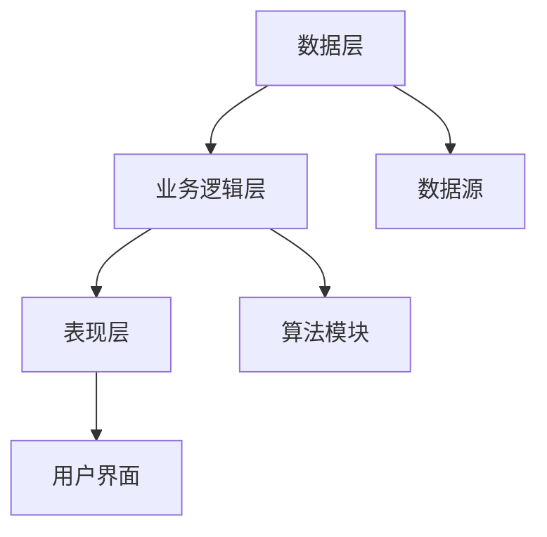
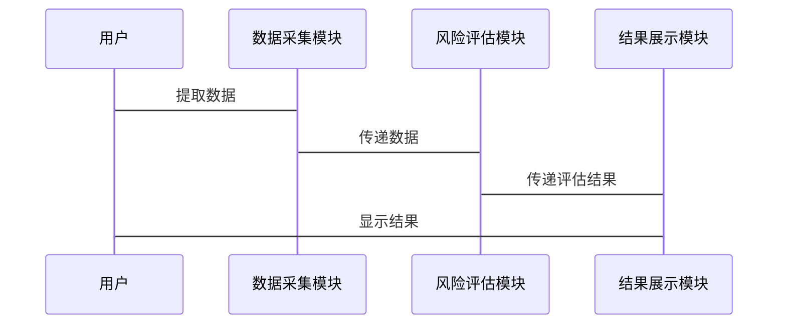

                 


# 特价股票投资中的地缘政治风险评估

## 关键词：特价股票、地缘政治风险、风险评估、股票投资、算法、系统架构

## 摘要：
本文深入探讨了地缘政治风险在特价股票投资中的重要性，并通过系统化的分析方法，结合数学模型和算法，提供了一种评估和应对地缘政治风险的有效策略。文章首先介绍了地缘政治风险的基本概念和其对特价股票市场的关联性，随后详细讲解了地缘政治风险评估的核心理论和算法原理，包括线性回归模型、机器学习模型和贝叶斯网络模型。接着，文章从系统架构的角度，设计了完整的地缘政治风险评估系统，涵盖了数据采集、风险评估模块和结果展示模块。最后，通过实际案例分析，展示了如何在项目中应用这些理论和方法，并总结了最佳实践经验和注意事项。

---

## 第一部分：地缘政治风险与特价股票投资的关联

### 第1章：地缘政治风险的基本概念与影响

#### 1.1 地缘政治风险的定义与特征
地缘政治风险是指由于政治冲突、国际关系紧张、政策变化等不可预测的地缘政治事件，对经济、市场和企业带来的潜在负面影响。其主要特征包括不可预测性、广泛性和长期性。

#### 1.2 特价股票市场的特点
特价股票市场通常指那些价格较低、流动性较差、风险较高的股票市场。这类市场容易受到外部因素的影响，尤其是地缘政治风险，因为投资者可能会迅速调整投资行为，导致股价大幅波动。

#### 1.3 地缘政治风险对特价股票投资的影响机制
地缘政治风险通过多种机制影响特价股票投资，包括市场情绪、政策变化、国际贸易关系等。例如，地区冲突可能导致投资者恐慌性抛售股票，从而引发股价暴跌。

### 第2章：地缘政治风险与股票价格的关联性分析

#### 2.1 地缘政治事件对股票市场的短期影响
突发的地缘政治事件（如战争、制裁）通常会导致市场恐慌，投资者可能抛售股票以规避风险，从而引发股价短期下跌。

#### 2.2 地缘政治风险对股票市场的长期影响
长期来看，地缘政治风险可能影响一个国家的经济基本面，从而影响股票市场的长期走势。例如，贸易摩擦可能导致企业利润下降，进而影响股价。

#### 2.3 地缘政治风险对不同类型股票的影响差异
不同类型的股票对地缘政治风险的敏感性不同。例如，能源行业的股票可能对地缘政治风险更为敏感，而科技行业的股票则可能受政策影响较大。

---

## 第二部分：地缘政治风险评估的核心概念与联系

### 第3章：地缘政治风险评估的理论基础

#### 3.1 地缘政治风险评估的模型与方法
常用的地缘政治风险评估模型包括定性分析法、定量分析法和混合分析法。定性分析法主要通过专家判断进行评估，而定量分析法则基于数学模型进行计算。

#### 3.2 地缘政治风险评估的关键指标
关键指标包括政治稳定性、国际关系紧张程度、政策变化频率等。这些指标可以通过数据量化，为风险评估提供依据。

#### 3.3 地缘政治风险与金融市场的关联
地缘政治风险通过影响市场情绪、政策环境和国际贸易关系，进而影响股票市场的表现。这种关联性可以通过统计分析和模型模拟来量化。

### 第4章：地缘政治风险与股票价格的关联性分析

#### 4.1 地缘政治事件对股票市场的短期影响
通过分析历史数据，可以发现地缘政治事件往往会导致股票市场的短期波动。例如，2022年俄罗斯入侵乌克兰导致全球股市大幅下跌。

#### 4.2 地缘政治风险对股票市场的长期影响
长期来看，地缘政治风险可能影响一个国家的经济政策和国际贸易关系，从而影响股票市场的长期走势。例如，中美贸易摩擦对两国股市的影响持续了数年。

#### 4.3 地缘政治风险对不同类型股票的影响差异
不同行业的股票对地缘政治风险的敏感性不同。例如，能源行业的股票可能对地缘政治风险更为敏感，而科技行业的股票则可能受政策影响较大。

---

## 第三部分：地缘政治风险评估的算法原理

### 第5章：地缘政治风险评估的数学模型

#### 5.1 线性回归模型
线性回归模型是一种常用的统计模型，可以用于量化地缘政治风险对股票价格的影响。模型公式如下：

$$ y = \beta_0 + \beta_1x_1 + \beta_2x_2 + \ldots + \beta_nx_n + \epsilon $$

其中，$y$ 是股票价格，$x_i$ 是地缘政治风险指标，$\beta_i$ 是回归系数，$\epsilon$ 是误差项。

#### 5.2 机器学习模型
机器学习模型（如随机森林、支持向量机）可以用于地缘政治风险评估。这些模型能够处理复杂的非线性关系，提供更高的预测精度。

#### 5.3 贝叶斯网络模型
贝叶斯网络模型通过构建概率关系图，可以更直观地展示地缘政治风险的影响路径。

### 第6章：算法原理的详细讲解与代码实现

#### 6.1 线性回归模型的数学推导与代码实现
线性回归模型的实现步骤包括数据预处理、模型训练、参数优化等。以下是Python代码示例：

```python
import numpy as np
from sklearn.linear_model import LinearRegression

# 数据预处理
X = np.array([x1, x2, ... xn]).reshape(-1, 1)
y = np.array([y1, y2, ... yn])

# 模型训练
model = LinearRegression()
model.fit(X, y)

# 参数优化
print('回归系数:', model.coef_)
print('截距:', model.intercept_)
```

#### 6.2 机器学习模型的训练与优化
使用随机森林模型进行地缘政治风险评估的代码示例如下：

```python
from sklearn.ensemble import RandomForestRegressor

# 数据预处理
X = processed_data
y = target_variable

# 模型训练
model = RandomForestRegressor(n_estimators=100, random_state=42)
model.fit(X, y)

# 模型预测
predictions = model.predict(X_test)
```

#### 6.3 贝叶斯网络模型的构建与应用
贝叶斯网络模型的构建需要先确定变量之间的关系，然后通过概率计算进行预测。以下是简化的代码示例：

```python
from sklearn.naive_bayes import GaussianNB

# 数据预处理
X = processed_data
y = target_variable

# 模型训练
model = GaussianNB()
model.fit(X, y)

# 模型预测
predictions = model.predict(X_test)
```

---

## 第四部分：地缘政治风险评估的系统架构设计

### 第7章：系统功能设计

#### 7.1 数据采集模块
数据采集模块负责收集地缘政治事件、股票价格等数据。数据来源包括新闻媒体、政府公告、金融数据库等。

#### 7.2 风险评估模块
风险评估模块基于收集的数据，运用数学模型和算法进行地缘政治风险评估。评估结果可以量化为风险指数。

#### 7.3 结果展示模块
结果展示模块以可视化的方式呈现评估结果，帮助投资者理解和决策。

### 第8章：系统架构设计

#### 8.1 系统架构设计
系统架构采用分层设计，包括数据层、业务逻辑层和表现层。以下是系统架构的mermaid图：



#### 8.2 系统交互设计
系统交互设计包括数据采集、模型训练、风险评估和结果展示四个步骤。以下是交互序列图：



---

## 第五部分：地缘政治风险评估的项目实战

### 第9章：环境安装与系统核心实现

#### 9.1 环境安装
需要安装的Python库包括numpy、pandas、scikit-learn等。

#### 9.2 核心代码实现
以下是风险评估模块的核心代码示例：

```python
import numpy as np
from sklearn.linear_model import LinearRegression

# 数据预处理
X = np.array([x1, x2, ... xn]).reshape(-1, 1)
y = np.array([y1, y2, ... yn])

# 模型训练
model = LinearRegression()
model.fit(X, y)

# 模型预测
predictions = model.predict(new_X)
```

#### 9.3 代码应用解读
代码实现了线性回归模型，用于预测地缘政治风险对股票价格的影响。通过实际数据的输入，可以得到风险评估结果。

### 第10章：实际案例分析与详细讲解

#### 10.1 实际案例分析
以2022年俄罗斯入侵乌克兰为例，分析地缘政治风险对能源行业股票的影响。

#### 10.2 详细讲解
通过数据分析和模型计算，展示地缘政治风险如何影响股票价格，并提出相应的投资策略。

### 第11章：项目小结

#### 11.1 项目总结
总结项目的主要成果和经验教训，强调地缘政治风险评估在特价股票投资中的重要性。

#### 11.2 经验与教训
在项目实施过程中，需要注意数据的准确性和模型的适用性，及时调整模型参数以适应市场变化。

---

## 第六部分：最佳实践与注意事项

### 第12章：最佳实践 tips

#### 12.1 小结
地缘政治风险评估是特价股票投资中不可忽视的重要环节，通过科学的模型和系统的架构设计，可以有效降低投资风险。

#### 12.2 注意事项
投资者在实际操作中，应密切关注地缘政治事件，及时调整投资策略，并结合多种模型进行综合评估。

#### 12.3 拓展阅读
推荐阅读相关领域的书籍和论文，进一步深入学习地缘政治风险评估的方法和应用。

---

## 作者：AI天才研究院/AI Genius Institute & 禅与计算机程序设计艺术 /Zen And The Art of Computer Programming

---

以上是《特价股票投资中的地缘政治风险评估》的完整目录和文章内容。

