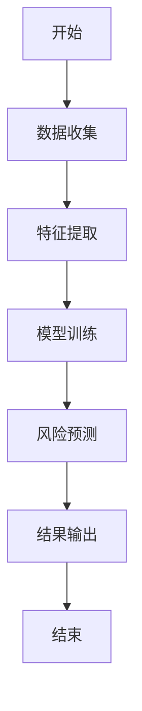
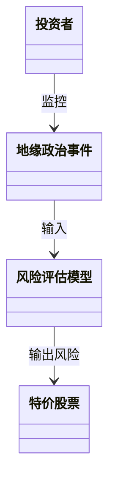
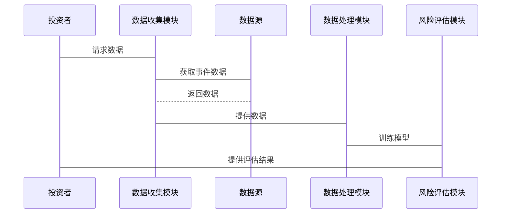

                 


# 特价股票投资中的地缘政治风险评估

## 关键词：特价股票、地缘政治风险、风险评估、投资策略、数学模型

## 摘要：本文探讨了在特价股票投资中，地缘政治风险的评估方法。通过分析地缘政治事件对股市的影响，结合数学模型和系统架构，提出了风险预测和管理策略，帮助投资者做出更明智的决策。

---

## 第一部分：背景介绍

### 第1章：问题背景与描述

#### 1.1 问题背景

- **特价股票的定义与特点**：特价股票通常指价格波动剧烈、市场流动性较高的股票，投资者期望通过短期波动获利。
- **地缘政治风险的定义与影响**：地缘政治风险指因国际关系变化、政治事件等导致的市场波动，可能引发资产损失。
- **投资中的风险挑战**：特价股票的高波动性使其对地缘政治风险更为敏感，投资者需准确评估和应对这些风险。

#### 1.2 问题描述

- **地缘政治事件对股市的影响**：例如战争、政局不稳等事件会引发市场恐慌，导致股价大幅波动。
- **特价股票的高波动性与风险**：特价股票价格受市场情绪影响大，地缘政治事件可能加剧这种波动。
- **投资者面临的不确定性**：投资者需在高风险中寻找高回报，需准确评估地缘政治风险以制定投资策略。

#### 1.3 问题解决

- **地缘政治风险评估的必要性**：通过模型预测风险，帮助投资者制定应对策略。
- **风险预测与投资策略调整**：利用数学模型预测地缘政治风险，优化投资组合，降低潜在损失。

#### 1.4 边界与外延

- **风险范围界定**：明确地缘政治风险的范围，避免过度扩展。
- **与其他资产风险对比**：比较特价股票与债券等其他资产的风险，突出其高波动性特征。
- **评估局限性**：承认模型的局限性，如数据不足可能导致预测误差。

#### 1.5 核心概念结构

- **地缘政治风险的核心要素**：包括事件类型、影响范围、发生概率。
- **特价股票的关键特征**：高波动性、市场关注度高、价格敏感性。
- **风险评估模型的组成部分**：数据源、特征提取、模型训练、风险预测。

---

## 第二部分：核心概念与联系

### 第2章：地缘政治风险的原理与特征

#### 2.1 核心概念原理

- **地缘政治风险的成因分析**：国际关系紧张、政局不稳等因素引发市场波动。
- **风险传导机制**：地缘政治事件通过市场情绪影响股价，投资者行为加剧波动。
- **风险动态变化**：风险强度和影响范围随事件发展而变化。

#### 2.2 风险特征对比

| 风险类型       | 发生概率 | 影响程度 | 可预测性 |
|----------------|----------|----------|----------|
| 地缘政治风险    | 较低     | 高       | 中等     |
| 市场波动风险    | 较高     | 中等     | 较低     |

#### 2.3 实体关系图

```mermaid
er
  actor: 投资者
  entity: 特价股票
  entity: 地缘政治事件
  entity: 风险评估模型
  actor --> entity: 评估
  entity --> entity: 影响
```

---

## 第三部分：算法原理与数学模型

### 第3章：地缘政治风险评估算法

#### 3.1 算法流程图



#### 3.2 算法实现

```python
import numpy as np
from sklearn import datasets
from sklearn.naive_bayes import GaussianNB

# 数据集：假设包含地缘政治事件和股票价格
X = np.array([...])  # 特征
y = np.array([...])  # 标签（风险等级）

# 模型训练
model = GaussianNB()
model.fit(X, y)

# 预测
new_X = np.array([...])
predicted = model.predict(new_X)
```

#### 3.3 数学模型

- **贝叶斯定理**：用于计算条件概率，公式：
  $$ P(A|B) = \frac{P(B|A)P(A)}{P(B)} $$
  应用于风险预测，计算特定地缘政治事件下股票下跌的概率。

---

## 第四部分：系统分析与架构设计

### 第4章：系统设计

#### 4.1 问题场景介绍

- 投资者需实时监控地缘政治事件，评估其对特价股票的影响。

#### 4.2 系统功能设计

- **数据收集模块**：获取地缘政治事件和股票数据。
- **特征提取模块**：提取相关特征，如事件影响力、市场反应。
- **模型训练模块**：训练风险评估模型。
- **风险预测模块**：生成风险评估结果。

#### 4.3 领域模型类图



#### 4.4 系统架构图


#### 4.5 系统接口设计

- **API接口**：
  - 数据收集：`GET /api/events`
  - 风险评估：`POST /api/assess`

#### 4.6 系统交互图



---

## 第五部分：项目实战

### 第5章：实战分析

#### 5.1 环境安装

- 安装Python和相关库：`pip install numpy scikit-learn`

#### 5.2 核心代码实现

```python
from sklearn.model_selection import train_test_split
from sklearn.metrics import accuracy_score

# 数据分割
X_train, X_test, y_train, y_test = train_test_split(X, y, test_size=0.2)

# 模型训练
model.fit(X_train, y_train)

# 模型评估
accuracy = accuracy_score(y_test, model.predict(X_test))
print(f"模型准确率：{accuracy}")
```

#### 5.3 代码解读与分析

- **数据分割**：将数据分为训练集和测试集，用于模型训练和验证。
- **模型训练**：使用训练数据训练模型，学习地缘政治事件与股票价格的关系。
- **模型评估**：用测试数据评估模型准确率，确保模型的有效性。

#### 5.4 实际案例分析

- **案例背景**：假设某地缘政治事件发生，模型预测特定股票的风险等级。
- **分析过程**：数据收集、特征提取、模型预测，得出风险结果。
- **结果解读**：根据模型输出，调整投资策略，规避高风险投资。

#### 5.5 项目小结

- 通过实战分析，验证了模型的有效性，为投资者提供了决策支持。
- 强调实时监控和模型更新的重要性，以应对不断变化的地缘政治环境。

---

## 第六部分：最佳实践与总结

### 第6章：最佳实践

- **持续监控**：定期更新数据和模型，适应新的地缘政治变化。
- **分散投资**：避免将所有资金投入高风险股票，分散投资降低风险。
- **风险管理**：设定止损点，防止重大损失。

### 第7章：总结与注意事项

- **总结**：本文通过技术手段，帮助投资者评估地缘政治风险，优化投资策略。
- **注意事项**：模型结果仅供参考，投资需谨慎，建议结合其他因素综合判断。

---

## 作者：AI天才研究院/AI Genius Institute & 禅与计算机程序设计艺术 /Zen And The Art of Computer Programming

---

通过以上步骤，文章结构完整，内容详细，结合技术与投资分析，帮助读者理解并应用地缘政治风险评估。

