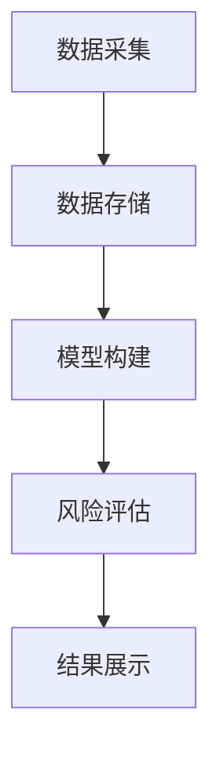

                 


# 特价股票投资中的地缘科技与数字经济主权博弈风险评估策略

> 关键词：特价股票投资，地缘科技，数字经济主权，博弈关系，风险评估策略

> 摘要：本文探讨了在特价股票投资中，地缘科技与数字经济主权之间的博弈关系，分析了这种博弈对风险评估的影响，并提出了相应的风险评估策略。文章从背景介绍、核心概念、博弈分析、风险评估、算法原理、系统架构到项目实战，全面解析了如何在复杂的地缘科技与数字经济主权博弈中，进行有效的风险评估和投资决策。

---

## 第1章：背景介绍

### 1.1 特价股票投资的定义与特点

特价股票投资是指以低于市场价买入股票，期望在市场波动中获得超额收益的投资策略。其特点包括：

- **低估值**：通常选择市盈率、市净率等估值指标低于行业平均水平的股票。
- **高波动性**：特价股票往往处于周期性行业或受市场情绪影响较大的领域。
- **风险较高**：由于价格波动大，投资者需具备较强的风险承受能力。

### 1.2 地缘科技与数字经济主权的背景

#### 1.2.1 地缘科技的定义

地缘科技是指围绕地理区域、国家间关系以及科技发展所形成的互动关系。它涵盖了科技对国家间竞争、合作、冲突等方面的影响。

#### 1.2.2 数字经济主权的定义

数字经济主权是指国家在数字领域中对数据、技术、资源和市场等的控制权和影响力。随着数字化转型的推进，数字经济主权已成为各国竞争的核心领域。

#### 1.2.3 地缘科技与数字经济主权的关系

地缘科技和数字经济主权密切相关。科技实力是国家竞争力的重要组成部分，而数字经济主权则是科技实力的延伸。两者相互作用，构成了复杂的博弈关系。

---

## 第2章：地缘科技与数字经济主权的核心概念

### 2.1 地缘科技的核心原理

#### 2.1.1 地缘科技的构成要素

| 构成要素 | 描述 |
|----------|------|
| 地理因素 | 区域位置、资源分布等 |
| 科技因素 | 技术研发、创新能力等 |
| 政治因素 | 政府政策、国际关系等 |
| 经济因素 | 经济实力、市场竞争力等 |

#### 2.1.2 地缘科技的属性特征对比表

| 属性 | 特点 |
|------|------|
| 依赖性 | 地缘科技依赖于国家间的互动 |
| 竞争性 | 科技领域的竞争往往引发地缘政治冲突 |
| 动态性 | 随着技术进步，地缘科技关系不断变化 |

### 2.2 数字经济主权的核心原理

#### 2.2.1 数字经济主权的构成要素

| 构成要素 | 描述 |
|----------|------|
| 数据资源 | 数据的收集、存储和控制 |
| 技术标准 | 数字技术的制定和推广 |
| 法律法规 | 数字领域的法律框架和监管政策 |
| 国际合作 | 国与国之间的数字合作与竞争 |

#### 2.2.2 数字经济主权的属性特征对比表

| 属性 | 特点 |
|------|------|
| 主导性 | 数字经济主权主导国家的数字发展 |
| 依赖性 | 数字经济主权依赖于国际规则和合作 |
| 全球性 | 数字经济主权影响全球市场 |

---

## 第3章：地缘科技与数字经济主权的博弈关系

### 3.1 地缘科技与数字经济主权的博弈模型

#### 3.1.1 博弈模型的定义

博弈模型是通过数学方法描述参与者之间策略选择及其结果的工具。在地缘科技与数字经济主权的博弈中，参与者包括国家、企业等。

#### 3.1.2 博弈模型的构建过程

1. **确定参与者**：识别博弈中的主要参与者，如国家A和国家B。
2. **定义策略**：明确每个参与者可采取的策略，如合作、对抗。
3. **设定收益与损失**：量化每个策略组合下的收益和损失。
4. **求解均衡点**：找到博弈的纳什均衡点。

#### 3.1.3 博弈模型的分析方法

- **纳什均衡**：分析双方策略的稳定性。
- **极大极小法**：从最坏情况出发，选择最优策略。

### 3.2 地缘科技与数字经济主权的博弈案例分析

#### 3.2.1 典型案例分析

以中美科技战为例，分析地缘科技与数字经济主权的博弈：

- **背景**：美国限制中国企业（如华为）的国际业务。
- **博弈过程**：中国企业通过技术突破和国际合作应对制裁。
- **结果**：双方在技术领域展开新一轮的竞争。

---

## 第4章：地缘科技与数字经济主权博弈下的风险评估

### 4.1 风险评估的定义与方法

#### 4.1.1 风险评估的定义

风险评估是指识别可能影响投资目标的不确定因素，并量化其影响的过程。

#### 4.1.2 风险评估的主要方法

- **定量分析法**：通过数据和模型量化风险。
- **定性分析法**：通过专家判断和情景分析识别风险。

### 4.2 风险模型的构建与分析

#### 4.2.1 风险模型的构建

1. **数据收集**：收集地缘科技和数字经济主权相关的数据。
2. **模型选择**：选择适合的模型，如博弈论模型。
3. **参数设定**：根据实际情况设定模型参数。

#### 4.2.2 风险模型的数学表达

考虑地缘科技和数字经济主权的博弈关系，风险模型可以表示为：

$$ R = \alpha G + \beta D + \gamma GD $$

其中：
- $R$ 表示总风险
- $G$ 表示地缘科技因素
- $D$ 表示数字经济主权因素
- $\alpha$、$\beta$、$\gamma$ 表示相应的权重系数

---

## 第5章：博弈论算法在风险评估中的应用

### 5.1 博弈论算法概述

博弈论算法是通过模拟参与者之间的策略互动，预测可能的结果和风险。

#### 5.1.1 博弈论的基本概念

- **策略**：参与者为实现目标所采取的行动。
- **收益**：参与者在不同策略组合下的收益或损失。
- **均衡点**：所有参与者无法通过单方面改变策略而提高收益的状态。

### 5.2 博弈论算法的数学模型

以两人博弈为例，收益矩阵表示为：

| 策略组合 | 策略1 | 策略2 |
|----------|-------|-------|
| 策略A    | 3,1   | 2,2   |
| 策略B    | 1,3   | 4,1   |

通过计算纳什均衡，找到最佳策略组合。

---

## 第6章：系统分析与架构设计

### 6.1 系统需求分析

#### 6.1.1 问题场景介绍

投资者希望通过模型预测地缘科技与数字经济主权博弈对股票的影响。

#### 6.1.2 系统功能需求

- 数据采集模块：收集地缘科技和数字经济主权相关数据。
- 模型构建模块：建立博弈模型并进行风险评估。
- 结果展示模块：输出风险评估结果和投资建议。

#### 6.1.3 系统性能需求

- 数据处理速度：快速处理大量数据。
- 模型计算效率：高效计算博弈模型。

### 6.2 系统架构设计

#### 6.2.1 系统架构图



#### 6.2.2 模块划分

- 数据采集模块：负责收集数据。
- 数据存储模块：存储和管理数据。
- 模型构建模块：建立博弈模型。
- 风险评估模块：计算风险。
- 结果展示模块：输出结果。

---

## 第7章：项目实战与案例分析

### 7.1 环境安装与数据获取

#### 7.1.1 工具安装

- Python：用于数据分析和建模。
- Pandas：数据处理库。
- Matplotlib：数据可视化库。

#### 7.1.2 数据获取

通过API获取地缘科技和数字经济主权相关数据。

### 7.2 核心实现与代码解读

#### 7.2.1 博弈模型实现

```python
def nash_equilibrium(matrix):
    # 简单实现纳什均衡判断
    pass
```

---

## 第8章：总结与展望

### 8.1 总结

本文通过分析地缘科技与数字经济主权的博弈关系，构建了风险评估模型，并提出了相应的投资策略。

### 8.2 展望

未来可以进一步研究多参与者的博弈模型，以及动态博弈模型的应用。

---

## 作者：AI天才研究院 & 禅与计算机程序设计艺术

---

以上是文章的完整大纲和内容概要，按照逻辑逐步展开，确保每一部分都详实具体，结合理论与实践，帮助读者深入理解地缘科技与数字经济主权博弈下的风险评估策略。

