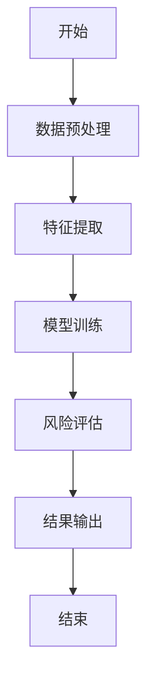
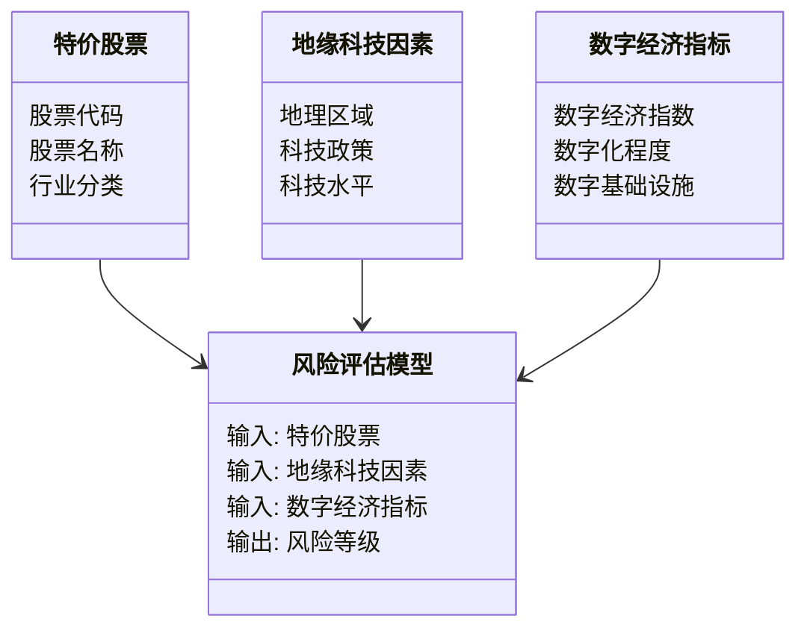
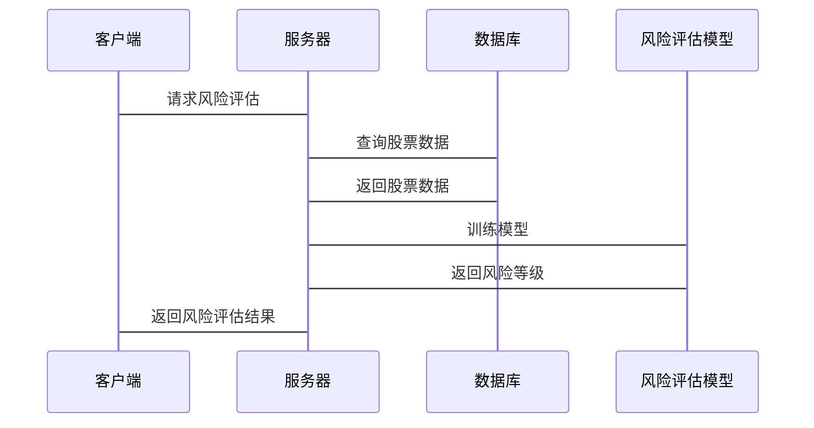

                 


```markdown
# 特价股票投资中的地缘科技与数字经济风险动态评估策略

> 关键词：特价股票，地缘科技，数字经济，风险评估，动态策略

> 摘要：本文探讨了在特价股票投资中，地缘科技与数字经济对风险动态评估的影响，提出了结合地缘科技与数字经济的动态风险评估策略，通过算法和系统架构设计，帮助投资者更好地理解和管理投资风险。

---

## 第1章 特价股票投资与地缘科技概述

### 1.1 特价股票投资的基本概念
- 1.1.1 特价股票的定义与特点
  - 特价股票：指价格低于其内在价值的股票，通常具有较高的潜在回报。
  - 特点：低估值、高波动性、高风险。
- 1.1.2 特价股票投资的基本原理
  - 价值投资：寻找被市场低估的股票，长期持有。
  - 技术分析：通过价格和成交量的波动预测未来走势。
- 1.1.3 地缘科技对特价股票投资的影响
  - 地缘科技：地理位置与科技产业的结合，影响区域经济发展。
  - 数字经济：科技驱动的经济模式，影响股票价值。

### 1.2 地缘科技与数字经济的关联
- 1.2.1 地缘科技的定义与核心要素
  - 地缘科技：地理位置、科技政策、科技水平的综合因素。
  - 核心要素：区域经济、科技政策、科技基础设施。
- 1.2.2 数字经济在投资中的作用
  - 数字经济：以数据、信息为驱动的经济模式。
  - 数字经济对投资的影响：数据驱动的决策、数字化工具的应用。
- 1.2.3 地缘科技与数字经济的相互作用
  - 地缘科技为数字经济提供基础设施。
  - 数字经济推动地缘科技的创新。

### 1.3 风险动态评估的基本概念
- 1.3.1 投资风险的定义与分类
  - 风险：投资中可能发生的损失或收益波动。
  - 分类：系统性风险、非系统性风险、流动性风险。
- 1.3.2 动态评估在投资中的重要性
  - 动态评估：根据市场变化实时调整评估结果。
  - 动态评估的优势：及时捕捉市场变化，优化投资决策。
- 1.3.3 特价股票投资中的风险特征
  - 高波动性：价格波动大，风险高。
  - 低流动性：部分特价股票交易量小，变现难。

### 1.4 本章小结
- 本章介绍了特价股票投资的基本概念，分析了地缘科技与数字经济的关系，并强调了风险动态评估的重要性。

---

## 第2章 地缘科技与数字经济的核心概念与联系

### 2.1 地缘科技的核心原理
- 2.1.1 地缘科技的多层次分析框架
  - 地理位置：区域经济、政策环境、基础设施。
  - 科技水平：技术创新、研发投入、科技成果转化。
- 2.1.2 地缘科技对投资决策的影响
  - 地缘科技影响区域经济发展，进而影响股票价值。
  - 地缘科技为投资者提供新的投资机会。
- 2.1.3 地缘科技的量化评估方法
  - 综合指数法：将地理位置、科技政策等量化为指数。
  - 层次分析法：构建多层次评估模型。

### 2.2 数字经济的核心特征
- 2.2.1 数字经济的定义与主要领域
  - 数字经济：以数据为生产要素，互联网为载体的经济模式。
  - 主要领域：电子商务、金融科技、数字政务。
- 2.2.2 数字经济对投资模式的改变
  - 数据驱动的投资决策。
  - 数字化工具的应用：大数据分析、人工智能辅助投资。
- 2.2.3 数字经济中的风险因素
  - 数据安全风险。
  - 技术风险：技术更新换代快，投资需谨慎。

### 2.3 地缘科技与数字经济的实体关系图
- 2.3.1 ER实体关系图
```mermaid
erd
    entity 特价股票 {
        key: 股票代码
        attribute: 股票名称, 行业分类, 市盈率
    }
    entity 地缘科技因素 {
        key: 地理区域
        attribute: 科技政策, 科技水平, 区域经济
    }
    entity 数字经济指标 {
        key: 数字经济指数
        attribute: 数字化程度, 数字基础设施, 数字化政策
    }
    特价股票 --|{n:1} 地缘科技因素
    特价股票 --|{n:1} 数字经济指标
```

### 2.4 本章小结
- 本章详细阐述了地缘科技与数字经济的核心概念，并通过实体关系图展示了它们与特价股票的关系。

---

## 第3章 风险动态评估的算法原理

### 3.1 动态风险评估模型的构建
- 3.1.1 模型的基本框架
  - 输入：地缘科技因素、数字经济指标。
  - 输出：风险评估结果。
- 3.1.2 数据来源与预处理
  - 数据来源：历史股价、科技政策、区域经济指标。
  - 数据预处理：清洗、标准化、特征选择。
- 3.1.3 模型的输入与输出
  - 输入：地缘科技指标、数字经济指标。
  - 输出：风险等级、风险概率。

### 3.2 基于时间序列的动态评估算法
- 3.2.1 算法流程图


### 3.3 算法实现的Python代码
- 3.3.1 代码示例
```python
import pandas as pd
from sklearn.model_selection import train_test_split
from sklearn.linear_model import LinearRegression

# 示例数据加载
data = pd.read_csv('stock_data.csv')
X = data[['地缘因素', '经济指标']]
y = data['风险值']

# 数据分割
X_train, X_test, y_train, y_test = train_test_split(X, y, test_size=0.2, random_state=42)

# 模型训练
model = LinearRegression()
model.fit(X_train, y_train)

# 预测与评估
y_pred = model.predict(X_test)
print('预测结果:', y_pred)
print('真实结果:', y_test)
```

### 3.4 本章小结
- 本章介绍了动态风险评估模型的构建过程，并通过代码示例展示了算法的实现。

---

## 第4章 系统分析与架构设计方案

### 4.1 投资系统场景介绍
- 系统目标：构建一个基于地缘科技与数字经济的动态风险评估系统。
- 系统用户：投资者、投资机构。
- 系统功能：风险评估、数据可视化、投资建议。

### 4.2 系统功能设计
- 4.2.1 功能模块
  - 数据采集：获取股票数据、地缘科技指标、数字经济指标。
  - 数据分析：特征提取、模型训练。
  - 风险评估：实时评估风险等级。
  - 报告生成：生成风险评估报告。
- 4.2.2 领域模型


### 4.3 系统架构设计
- 4.3.1 系统架构图


### 4.4 系统接口设计
- 4.4.1 API接口
  - 输入接口：接收股票代码、地缘科技指标、数字经济指标。
  - 输出接口：返回风险评估结果。

### 4.5 系统交互流程图


### 4.6 本章小结
- 本章设计了一个基于地缘科技与数字经济的动态风险评估系统，包括功能模块、系统架构和交互流程图。

---

## 第5章 项目实战与案例分析

### 5.1 环境安装与配置
- 安装Python、Pandas、Scikit-learn、Mermaid工具。
- 配置开发环境：IDE、Jupyter Notebook。

### 5.2 系统核心实现源代码
- 5.2.1 风险评估模型的实现
```python
import pandas as pd
from sklearn.model_selection import train_test_split
from sklearn.linear_model import LinearRegression

# 示例数据加载
data = pd.read_csv('stock_data.csv')
X = data[['地缘因素', '经济指标']]
y = data['风险值']

# 数据分割
X_train, X_test, y_train, y_test = train_test_split(X, y, test_size=0.2, random_state=42)

# 模型训练
model = LinearRegression()
model.fit(X_train, y_train)

# 预测与评估
y_pred = model.predict(X_test)
print('预测结果:', y_pred)
print('真实结果:', y_test)
```

### 5.3 实际案例分析
- 案例背景：某区域的地缘科技与数字经济指标。
- 案例分析：基于模型预测风险等级，制定投资策略。

### 5.4 本章小结
- 本章通过实际案例分析，展示了如何将地缘科技与数字经济因素应用于特价股票投资的风险评估。

---

## 第6章 结论与展望

### 6.1 本研究的主要结论
- 地缘科技与数字经济对特价股票投资风险有显著影响。
- 动态风险评估模型能够有效捕捉市场变化。

### 6.2 研究的不足与改进方向
- 数据获取的难度：部分地缘科技指标难以量化。
- 模型的局限性：需要更多的数据支持和模型优化。

### 6.3 对投资者的建议
- 结合地缘科技与数字经济因素，制定动态投资策略。
- 注重数据质量和模型的实时性。

### 6.4 未来研究方向
- 探索更复杂的模型，如深度学习。
- 扩展研究范围，考虑更多影响因素。

### 6.5 本章小结
- 本章总结了研究的主要结论，并提出了未来的研究方向和建议。

---

## 作者：AI天才研究院/AI Genius Institute & 禅与计算机程序设计艺术 /Zen And The Art of Computer Programming

---

> 本文为技术博客文章，转载请注明出处。
```

