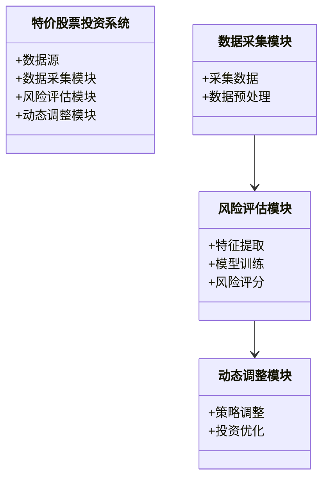

                 


# 特价股票投资中的地缘科技风险动态评估策略

> 关键词：特价股票，地缘科技风险，动态评估，风险管理，投资策略

> 摘要：本文深入探讨了在特价股票投资中，如何有效评估和应对地缘科技风险。通过分析地缘政治、科技发展和市场波动等因素，提出了一种动态风险评估策略，结合算法和系统架构设计，为投资者提供科学的决策支持。

---

## 第一部分：背景与概念

### 第1章：特价股票与地缘科技风险概述

#### 1.1 特价股票投资的背景与特点

- **1.1.1 特价股票的定义与分类**
  特价股票是指价格相对较低的股票，通常被认为具有较高的增长潜力，但也伴随着较高的风险。根据市场表现，特价股票可以分为周期性股票和成长性股票。

- **1.1.2 特价股票投资的潜在机会与风险**
  特价股票的投资机会在于其低估值和潜在的高回报，但其风险包括市场波动、公司基本面变化和外部环境的影响。

- **1.1.3 地缘科技风险的引入与重要性**
  地缘科技风险是指由于地理位置和技术依赖带来的风险，如供应链中断、技术封锁等，这些因素在特价股票投资中尤为关键。

#### 1.2 地缘科技风险的构成与影响

- **1.2.1 地缘政治风险的定义与特征**
  地缘政治风险涉及国家间的冲突、政策变化和国际关系，这些因素直接影响企业的运营和股价。

- **1.2.2 科技发展对地缘风险的影响**
  技术依赖可能导致供应链中断，而技术封锁则可能限制公司的创新能力，影响其市场竞争力。

- **1.2.3 特价股票投资中地缘科技风险的动态性**
  地缘科技风险是动态变化的，需要投资者实时监控和调整投资策略。

#### 1.3 动态评估策略的核心概念

- **1.3.1 动态评估的定义与目标**
  动态评估是一种实时更新风险评估的方法，旨在捕捉市场变化，及时调整投资策略。

- **1.3.2 动态评估在特价股票投资中的应用**
  通过动态评估，投资者可以识别潜在风险，优化投资组合，降低损失。

- **1.3.3 地缘科技风险动态评估的边界与外延**
  确定评估的范围和限制，确保评估的可行性和准确性。

---

## 第二部分：地缘科技风险的构成与分析

### 第2章：地缘科技风险的构成要素

#### 2.1 地缘政治风险的多维度分析

- **2.1.1 政治稳定性与政策变化**
  政治稳定性直接影响企业的经营环境，政策变化可能影响行业的整体走势。

- **2.1.2 地缘冲突与国际关系**
  地缘冲突可能导致供应链中断，影响企业的生产和销售。

- **2.1.3 政府监管与行业政策**
  政府监管和行业政策的变化可能影响企业的经营成本和市场准入。

#### 2.2 科技发展对地缘风险的影响

- **2.2.1 技术依赖与供应链风险**
  依赖特定供应商可能导致供应链中断，影响企业的生产效率。

- **2.2.2 技术封锁与知识产权保护**
  技术封锁可能限制企业的技术创新，知识产权保护可能增加企业的研发成本。

- **2.2.3 数字化转型与网络安全**
  数字化转型提高了企业的效率，但也带来了网络安全风险，可能影响企业的数据安全和声誉。

#### 2.3 经济与市场波动的关联性

- **2.3.1 经济周期与市场波动**
  经济周期影响市场波动，进而影响股价的变化。

- **2.3.2 通货膨胀与货币政策**
  通货膨胀和货币政策变化可能影响企业的成本和利润，进而影响股价。

- **2.3.3 市场情绪与投资者行为**
  市场情绪和投资者行为可能放大市场波动，影响股价的短期走势。

---

## 第三部分：地缘科技风险动态评估模型

### 第3章：动态评估模型的设计与实现

#### 3.1 数据收集与特征提取

- **3.1.1 数据来源与预处理**
  数据来自多种来源，包括新闻、社交媒体和政府公告，需进行清洗和标准化。

- **3.1.2 特征提取与选择**
  选择关键特征，如政治事件、技术专利和经济指标，进行特征工程。

#### 3.2 动态评估模型的构建与验证

- **3.2.1 模型选择与优化**
  采用时间序列分析模型，如ARIMA，进行参数优化和模型验证。

- **3.2.2 模型评估与验证**
  使用历史数据进行回测，评估模型的准确性和稳定性。

---

## 第四部分：算法原理与实现

### 第4章：算法原理与实现细节

#### 4.1 算法原理

- **4.1.1 时间序列分析**
  使用ARIMA模型进行预测，公式为：
  $$ ARIMA(p, d, q) $$
  其中，p为自回归阶数，d为差分阶数，q为移动平均阶数。

- **4.1.2 机器学习算法**
  使用随机森林进行分类，公式为：
  $$ y = \sum_{i=1}^{n} w_i x_i + b $$
  其中，\( w_i \) 是特征权重，\( x_i \) 是特征向量，\( b \) 是偏置。

#### 4.2 算法实现

- **4.2.1 Python代码实现**
  ```python
  from sklearn.ensemble import RandomForestClassifier
  model = RandomForestClassifier(n_estimators=100, random_state=42)
  model.fit(X_train, y_train)
  ```

- **4.2.2 算法流程图**
  ```mermaid
  graph TD
      A[数据预处理] --> B[特征提取]
      B --> C[模型训练]
      C --> D[预测]
      D --> E[评估]
  ```

---

## 第五部分：系统架构与设计

### 第5章：系统架构设计

#### 5.1 系统功能设计

- **5.1.1 数据采集模块**
  采集市场数据和新闻数据，进行初步清洗。

- **5.1.2 风险评估模块**
  使用动态模型评估地缘科技风险，生成风险评分。

- **5.1.3 动态调整模块**
  根据风险评分调整投资策略，优化投资组合。

#### 5.2 系统架构图



---

## 第六部分：项目实战与案例分析

### 第6章：项目实战

#### 6.1 环境安装与配置

- 安装Python和必要的库，如pandas、numpy、scikit-learn。

#### 6.2 核心代码实现

- 数据预处理和特征工程代码：
  ```python
  import pandas as pd
  import numpy as np
  from sklearn.preprocessing import StandardScaler

  # 数据预处理
  df = pd.read_csv('data.csv')
  df.dropna(inplace=True)
  df = df[["price", "volume", "news_sentiment"]]

  # 特征工程
  scaler = StandardScaler()
  features = scaler.fit_transform(df[['price', 'volume']])
  ```

- 风险评估模型代码：
  ```python
  from sklearn.ensemble import RandomForestClassifier

  model = RandomForestClassifier(n_estimators=100, random_state=42)
  model.fit(features, df['news_sentiment'])
  ```

#### 6.3 案例分析

- 使用实际数据进行分析，展示模型预测结果和投资策略调整。

---

## 第七部分：优化与风险管理

### 第7章：优化与风险管理

#### 7.1 模型优化

- 使用超参数调优和特征选择优化模型性能。

#### 7.2 风险管理策略

- 制定止损策略和分散投资策略，降低整体风险。

#### 7.3 小结

- 总结优化方法和风险管理策略，提出未来研究方向。

---

## 第八部分：总结与展望

### 第8章：总结与展望

#### 8.1 总结

- 回顾全文，总结主要观点和方法。

#### 8.2 展望

- 展望未来研究方向，如引入深度学习模型和实时数据分析。

---

## 作者

**作者：AI天才研究院/AI Genius Institute & 禅与计算机程序设计艺术 /Zen And The Art of Computer Programming**

---

通过以上结构，文章详细讲解了特价股票投资中的地缘科技风险动态评估策略，从背景到算法实现，再到系统设计和项目实战，为投资者提供了全面的指导和实用的工具。

