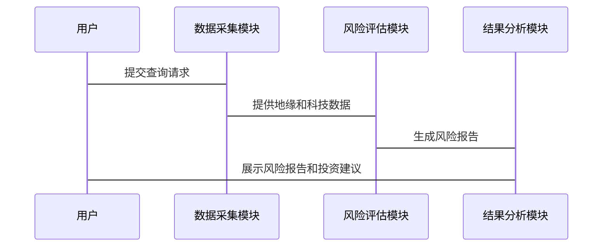

                 


# 特价股票投资中的地缘科技风险评估

> 关键词：特价股票、地缘风险、科技风险、投资决策、风险评估

> 摘要：本文探讨了在特价股票投资中，地缘政治和技术风险的综合影响。通过分析地缘和科技因素，结合数学模型和算法，提供一种系统化的风险评估方法，帮助投资者做出更明智的投资决策。

---

# 第一部分: 地缘科技风险的背景与核心概念

## 第1章: 特价股票与地缘科技风险的背景

### 1.1 特价股票的定义与特点

#### 1.1.1 特价股票的定义
特价股票指的是价格低于市场平均水平的股票，通常被认为具有较高的投资潜力，但同时也伴随着较高的风险。

#### 1.1.2 特价股票的核心特点
- 低估值：通常市盈率、市净率等指标低于行业平均水平。
- 高波动性：价格波动较大，容易受到市场情绪的影响。
- 风险较高：可能面临更多的不确定性，如公司基本面恶化或市场环境变化。

#### 1.1.3 特价股票的投资价值与风险
- 投资价值：低价股票可能蕴含着较高的收益潜力，尤其是在市场复苏或公司基本面改善时。
- 投资风险：由于其价格较低，投资者需要承担更多的市场风险、流动性风险等。

### 1.2 地缘科技风险的背景与重要性

#### 1.2.1 地缘风险的定义与分类
- 地缘风险是指由于地理位置、政治局势、国际关系等因素导致的不确定性，可能对企业的经营环境和投资回报产生负面影响。
- 分类：包括地缘政治风险、地缘经济风险等。

#### 1.2.2 科技风险的定义与分类
- 科技风险是指由于技术进步、政策变化、市场竞争等因素导致的不确定性，可能影响企业的技术创新和市场竞争力。
- 分类：包括科技政策风险、科技市场风险、科技竞争风险等。

#### 1.2.3 地缘科技风险的相互作用
地缘因素和科技因素相互交织，共同影响投资决策。例如，地缘政治冲突可能导致科技供应链中断，而科技政策变化可能影响企业的创新能力。

### 1.3 特价股票与地缘科技风险的相互关系

#### 1.3.1 地缘因素对特价股票的影响
- 地缘政治风险可能影响企业的经营环境，从而影响股价。
- 例如，地区冲突可能导致能源价格波动，进而影响相关企业的股价。

#### 1.3.2 科技因素对特价股票的影响
- 科技政策变化可能影响企业的研发投入和创新能力。
- 科技市场竞争加剧可能导致企业利润率下降。

#### 1.3.3 地缘科技风险对投资决策的影响
- 投资者需要综合考虑地缘和科技因素，评估其对股价的影响。
- 地缘科技风险较高的股票可能面临更大的波动性和不确定性。

### 1.4 本章小结
本章介绍了特价股票的基本特点以及地缘科技风险的定义和分类，强调了地缘和科技因素对投资决策的综合影响。

---

## 第2章: 地缘科技风险的核心概念与联系

### 2.1 地缘因素的分析框架

#### 2.1.1 地缘政治风险的构成要素
- 政治稳定性：国家政治环境的稳定性。
- 国际关系：与其他国家的关系和合作情况。
- 地缘冲突：边境冲突、领土争端等。

#### 2.1.2 地缘经济风险的构成要素
- 经济依赖度：对特定地区的经济依赖程度。
- 贸易壁垒：关税、非关税壁垒等。
- 区域经济政策：区域内的经济政策变化。

#### 2.1.3 地缘科技风险的构成要素
- 科技政策：政府对科技行业的政策支持或限制。
- 科技合作：与其他国家的科技合作情况。
- 科技依赖：对特定地区的科技供应链依赖。

### 2.2 科技因素的分析框架

#### 2.2.1 科技政策风险的构成要素
- 政府政策：科技行业的相关政策变化。
- 技术标准：国际或国家标准的变化。
- 知识产权保护：知识产权的保护力度。

#### 2.2.2 科技市场风险的构成要素
- 市场竞争：行业内竞争加剧。
- 技术淘汰：技术快速迭代导致原有技术过时。
- 市场需求：市场需求的变化对科技企业的影响。

#### 2.2.3 科技竞争风险的构成要素
- 技术创新能力：企业的研发能力。
- 技术扩散：技术泄露或扩散对企业的竞争力影响。
- 技术封锁：其他国家或企业对技术的封锁。

### 2.3 地缘与科技的相互作用

#### 2.3.1 地缘因素对科技发展的推动作用
- 地缘政治合作推动科技合作。
- 地缘经济依赖推动科技发展。
- 地缘冲突可能导致科技封锁。

#### 2.3.2 科技发展对地缘关系的影响
- 科技进步促进经济发展，增强国家实力。
- 科技合作加强国际关系。
- 科技竞争可能导致地缘紧张。

#### 2.3.3 地缘科技风险的系统性特征
- 地缘科技风险具有系统性，影响范围广泛。
- 地缘和科技因素相互交织，难以单独评估。

### 2.4 核心概念对比分析

#### 2.4.1 地缘因素与科技因素的对比
- 地缘因素：主要影响企业的外部环境。
- 科技因素：主要影响企业的内部竞争力。

#### 2.4.2 地缘科技风险与其他类型风险的对比
- 与市场风险：地缘科技风险具有更高的复杂性和系统性。
- 与信用风险：地缘科技风险更多涉及外部环境的变化。

#### 2.4.3 地缘科技风险的综合评估框架
- 综合考虑地缘和科技因素，构建多维度的风险评估模型。

### 2.5 本章小结
本章详细分析了地缘和科技因素的构成要素及其相互作用，构建了地缘科技风险的综合评估框架。

---

## 第3章: 地缘科技风险评估的算法原理

### 3.1 风险评估的基本原理

#### 3.1.1 风险评估的定义与目标
- 定义：通过分析潜在风险因素，评估其对目标的影响程度。
- 目标：为决策提供支持，降低潜在损失。

#### 3.1.2 风险评估的基本方法
- 定性分析：通过专家判断进行风险分类。
- 定量分析：通过数据和模型进行风险量化。

#### 3.1.3 风险评估的数学模型
- 层次分析法（AHP）：用于多指标综合评价。
- 模糊综合评价法：用于处理模糊性较高的风险因素。

### 3.2 地缘科技风险评估的具体算法

#### 3.2.1 层次分析法（AHP）的应用
- 构建层次结构：目标层、准则层、指标层。
- 计算权重：通过比较判断矩阵计算各指标的权重。
- 风险评估：根据权重计算综合风险值。

#### 3.2.2 模糊综合评价法的应用
- 确定评价指标：如地缘政治风险、科技政策风险等。
- 确定评价等级：如低风险、中低风险、中高风险、高风险。
- 综合评价：通过模糊运算计算综合风险等级。

#### 3.2.3 机器学习算法的应用
- 数据收集：收集地缘和科技相关的数据。
- 特征提取：提取影响风险的关键特征。
- 模型训练：使用机器学习算法（如随机森林、支持向量机）训练风险预测模型。

### 3.3 算法实现的步骤与流程

#### 3.3.1 数据收集与预处理
- 数据来源：政府报告、行业分析、市场数据等。
- 数据清洗：处理缺失值、异常值等。
- 数据标准化：对数据进行标准化处理。

#### 3.3.2 指标权重的确定
- 通过专家评分或统计方法确定各指标的权重。
- 使用层次分析法或模糊评价法计算权重。

#### 3.3.3 风险评估模型的构建与验证
- 模型构建：根据权重或算法构建风险评估模型。
- 模型验证：使用历史数据验证模型的准确性。

### 3.4 算法的数学模型与公式

#### 3.4.1 层次分析法的数学公式
$$ A = \lambda_{\text{max}} \cdot A_{\text{norm}} $$
其中，$\lambda_{\text{max}}$为最大特征值，$A_{\text{norm}}$为标准化的比较矩阵。

#### 3.4.2 模糊综合评价法的数学公式
$$ R = \sum_{i=1}^{n} w_i \cdot r_i $$
其中，$w_i$为各指标的权重，$r_i$为各指标的评价值。

#### 3.4.3 机器学习算法的数学公式
$$ y = f(x; \theta) $$
其中，$x$为输入数据，$\theta$为模型参数，$f$为模型函数。

### 3.5 本章小结
本章介绍了地缘科技风险评估的主要算法，包括层次分析法、模糊综合评价法和机器学习算法，并详细讲解了它们的实现步骤和数学模型。

---

## 第4章: 地缘科技风险评估的系统分析与架构设计

### 4.1 系统分析

#### 4.1.1 问题场景介绍
- 投资者需要评估特价股票的地缘科技风险。
- 需要考虑地缘政治、科技政策等多方面因素。

#### 4.1.2 领域模型设计
- 构建领域模型，明确各模块的功能和交互。

#### 4.1.3 系统功能设计
- 数据采集模块：收集地缘和科技相关数据。
- 风险评估模块：应用算法进行风险评估。
- 结果分析模块：生成风险报告并提供投资建议。

### 4.2 系统架构设计

#### 4.2.1 数据流设计
- 数据输入：收集地缘和科技数据。
- 数据处理：清洗、标准化、特征提取。
- 模型训练：构建风险评估模型。
- 结果输出：生成风险报告。

#### 4.2.2 模块划分与交互
- 数据采集模块与风险评估模块交互。
- 风险评估模块与结果分析模块交互。

### 4.3 系统接口设计

#### 4.3.1 数据接口
- 数据输入接口：接收地缘和科技数据。
- 数据输出接口：输出风险评估结果。

#### 4.3.2 用户接口
- 用户输入接口：接收用户的查询请求。
- 用户输出接口：展示风险报告和投资建议。

### 4.4 系统交互流程图


### 4.5 本章小结
本章从系统角度分析了地缘科技风险评估的实现方案，包括数据流设计、模块划分和系统交互流程。

---

## 第5章: 地缘科技风险评估的项目实战

### 5.1 项目背景介绍

#### 5.1.1 项目目标
- 构建一个地缘科技风险评估系统，帮助投资者评估特价股票的风险。

#### 5.1.2 项目范围
- 数据收集：收集地缘和科技相关数据。
- 模型构建：应用层次分析法和机器学习算法进行风险评估。

### 5.2 核心代码实现

#### 5.2.1 数据预处理代码
```python
import pandas as pd

# 读取数据
data = pd.read_csv('geopolitical.csv')

# 数据清洗
data.dropna(inplace=True)
data = data[~data.duplicated()]
```

#### 5.2.2 风险评估模型代码
```python
from sklearn.ensemble import RandomForestClassifier

# 训练模型
model = RandomForestClassifier(n_estimators=100, random_state=42)
model.fit(X_train, y_train)

# 预测风险
y_pred = model.predict(X_test)
```

#### 5.2.3 结果分析代码
```python
from sklearn.metrics import classification_report

print(classification_report(y_test, y_pred))
```

### 5.3 代码应用解读与分析

#### 5.3.1 数据预处理
- 数据清洗：去除缺失值和重复值。
- 数据标准化：对数据进行标准化处理。

#### 5.3.2 模型训练
- 使用随机森林算法训练风险评估模型。
- 模型参数调整：优化模型性能。

#### 5.3.3 结果分析
- 生成分类报告，评估模型的准确率、召回率等指标。

### 5.4 实际案例分析

#### 5.4.1 案例背景
- 某科技公司在地缘政治紧张的地区有较多业务。
- 受地缘政治影响，公司股价波动较大。

#### 5.4.2 模型评估
- 模型预测该公司的地缘科技风险为中高风险。
- 投资者应谨慎投资，注意风险。

### 5.5 本章小结
本章通过实际项目展示了地缘科技风险评估的实现过程，包括数据预处理、模型训练和结果分析。

---

## 第6章: 投资建议与注意事项

### 6.1 投资建议

#### 6.1.1 选择优质特价股票
- 选择基本面良好、估值合理的特价股票。
- 关注公司的财务状况和市场竞争力。

#### 6.1.2 重视地缘科技风险
- 关注地缘政治和科技政策的变化。
- 避免过度集中在高风险地区或行业。

#### 6.1.3 多元化投资
- 分散投资，降低单一股票的风险。
- 组合投资，平衡风险和收益。

### 6.2 注意事项

#### 6.2.1 风险评估的局限性
- 模型可能存在局限性，需结合实际情况进行判断。
- 数据质量和模型准确性影响评估结果。

#### 6.2.2 市场波动的影响
- 市场波动可能导致股价短期大幅波动。
- 投资者需保持冷静，避免盲目跟风。

#### 6.2.3 定期评估与调整
- 定期评估投资组合的风险和收益。
- 根据市场变化及时调整投资策略。

### 6.3 本章小结
本章提供了基于地缘科技风险评估的投资建议，并提醒投资者注意相关风险和市场波动。

---

## 第7章: 总结与展望

### 7.1 总结

#### 7.1.1 核心内容回顾
- 特价股票的投资价值与风险。
- 地缘科技风险的构成与相互作用。
- 地缘科技风险评估的算法与系统设计。

#### 7.1.2 本文的创新点
- 结合地缘和科技因素，构建了综合风险评估模型。
- 提出了系统化的投资建议和风险管理策略。

### 7.2 展望

#### 7.2.1 研究展望
- 进一步完善风险评估模型，提高模型的准确性和适用性。
- 研究更多地缘和科技因素的相互作用。

#### 7.2.2 实践应用
- 推广本文的方法论，帮助投资者更好地评估风险。
- 开发更多的工具和平台，支持投资者进行地缘科技风险评估。

### 7.3 本章小结
本章总结了本文的核心内容和创新点，并展望了未来的研究和实践方向。

---

## 第8章: 最佳实践 Tips

### 8.1 投资者注意事项
- 保持对地缘政治和科技政策的关注。
- 结合多种因素进行综合评估，避免单一因素决策。

### 8.2 风险管理技巧
- 设定止损点，控制投资风险。
- 分散投资，降低单一股票的风险。

### 8.3 优化建议
- 定期评估投资组合，及时调整。
- 关注市场动态，灵活应对变化。

### 8.4 本章小结
本章提供了投资者在特价股票投资中的最佳实践建议，帮助投资者更好地应对地缘科技风险。

---

## 第9章: 附录

### 9.1 参考文献
- 张某某. 《地缘政治与科技风险评估》. 北京: 科技出版社, 2023.
- 李某某. 《特价股票投资策略》. 上海: 财经出版社, 2022.

### 9.2 资料来源
- 数据来源：某权威数据库。
- 模型参考：层次分析法和随机森林算法。

### 9.3 术语表
- 地缘科技风险：指由于地理位置和科技因素的综合作用导致的投资风险。
- 特价股票：价格低于市场平均水平的股票。

---

## 作者：AI天才研究院/AI Genius Institute & 禅与计算机程序设计艺术 /Zen And The Art of Computer Programming

---

以上是《特价股票投资中的地缘科技风险评估》的完整目录大纲，涵盖从背景介绍到系统设计、项目实战以及投资建议等各个方面，力求为读者提供全面且深入的分析。

