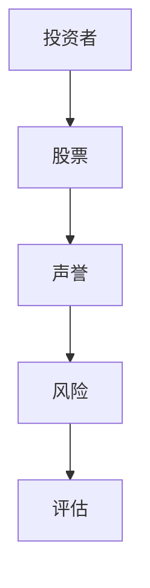
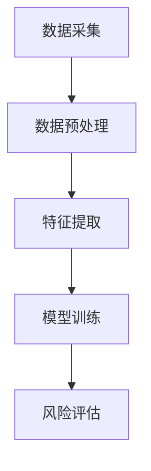
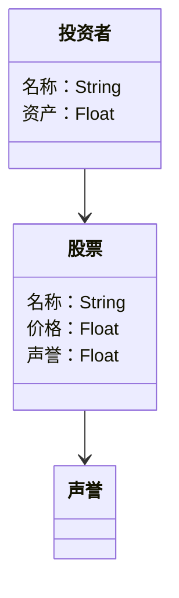
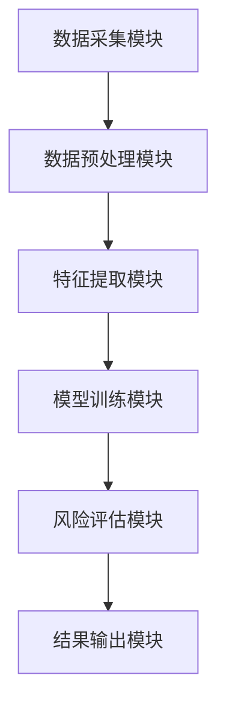
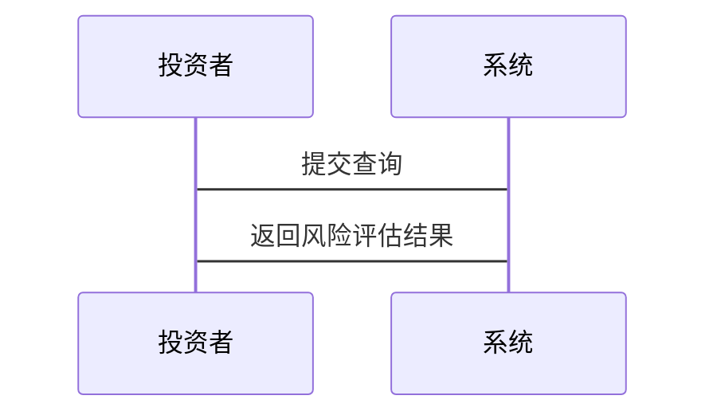

                 


# 特价股票投资中的声誉风险评估方法

> 关键词：特价股票，声誉风险，投资评估，风险管理，数学模型

> 摘要：本文深入探讨了特价股票投资中的声誉风险评估方法，分析了声誉风险的核心概念、评估原理、算法流程及其在实际投资中的应用。通过构建数学模型和系统架构，本文提供了详细的评估方法和实战案例，帮助投资者有效管理声誉风险，提升投资决策的准确性。

---

# 第一部分: 特价股票投资中的声誉风险概述

## 第1章: 特价股票投资概述

### 1.1 特价股票的基本概念

#### 1.1.1 特价股票的定义
特价股票是指在特定市场条件下，价格显著低于其内在价值的股票。这种股票通常被视为被市场低估的投资机会，吸引投资者关注。

#### 1.1.2 特价股票的特点
- **低估值**：市场价格低于内在价值。
- **高波动性**：价格波动较大，可能受市场情绪影响。
- **潜在回报高**：长期来看，具有较高的上涨潜力。

#### 1.1.3 特价股票投资的背景与现状
随着市场波动加剧，投资者 increasingly seek undervalued stocks to diversify their portfolios and maximize returns. 特价股票因其高回报潜力，成为投资组合中的重要组成部分。

---

### 1.2 声誉风险的基本概念

#### 1.2.1 声誉风险的定义
声誉风险是指因企业或个人的负面行为或事件导致其声誉受损，进而影响其财务表现或市场机会的风险。

#### 1.2.2 声誉风险的特征
- **无形性**：声誉是无形资产，难以量化。
- **传染性**：负面声誉可能迅速扩散，影响广泛。
- **长期性**：一旦受损，恢复声誉需要时间和努力。

#### 1.2.3 声誉风险与投资的关系
声誉风险直接影响投资者对企业的信任度，进而影响股票价格。负面声誉可能导致股价下跌，投资者需评估企业声誉对投资决策的影响。

---

### 1.3 特价股票投资中的声誉风险

#### 1.3.1 特价股票投资中的声誉风险来源
- **企业负面新闻**：如财务造假、管理不善等。
- **市场波动**：市场恐慌可能导致股价非理性下跌。
- **投资者情绪**：投资者对负面信息的过度反应。

#### 1.3.2 声誉风险对投资决策的影响
声誉风险可能导致投资者对特定股票或企业失去信心，影响其投资决策。负面声誉还可能引发抛售行为，加剧股价下跌。

#### 1.3.3 声誉风险评估的重要性
准确评估声誉风险有助于投资者识别潜在风险，制定合理的投资策略，降低投资损失。

---

## 1.4 本章小结
本章介绍了特价股票的基本概念及其在投资中的重要性，分析了声誉风险的定义、特征及其对投资决策的影响。声誉风险评估在特价股票投资中具有重要意义，需引起投资者高度重视。

---

# 第二部分: 声誉风险评估的核心概念与联系

## 第2章: 声誉风险评估的核心概念

### 2.1 声誉风险评估的原理

#### 2.1.1 声誉风险评估的基本原理
声誉风险评估通过分析影响声誉的因素，量化其对投资的影响。评估过程包括数据采集、特征提取、模型训练和风险预测。

#### 2.1.2 声誉风险评估的数学模型
声誉风险评估可采用多种数学模型，如线性回归、逻辑回归和神经网络。以下为线性回归模型示例：

$$ \text{Reputation Risk} = \beta_0 + \beta_1 \times \text{Factor}_1 + \beta_2 \times \text{Factor}_2 + \ldots + \beta_n \times \text{Factor}_n + \epsilon $$

其中，$\text{Factor}_i$代表影响声誉的风险因素，$\beta_i$为回归系数，$\epsilon$为误差项。

#### 2.1.3 声誉风险评估的步骤
1. 数据采集：收集相关数据，如企业财务数据、市场数据等。
2. 数据预处理：清洗和转换数据，提取特征。
3. 模型训练：选择合适算法，训练模型。
4. 风险预测：基于模型预测声誉风险。

### 2.2 声誉风险与相关概念的对比

#### 2.2.1 声誉风险与信用风险的对比
| 对比维度 | 声誉风险 | 信用风险 |
|----------|----------|----------|
| 定义     | 因负面行为导致声誉下降的风险。 | 因无法履行债务导致损失的风险。 |
| 影响因素 | 企业行为、市场情绪等。 | 债务履行能力、经济环境等。 |

#### 2.2.2 声誉风险与市场风险的对比
| 对比维度 | 声誉风险 | 市场风险 |
|----------|----------|----------|
| 定义     | 因负面行为导致声誉下降的风险。 | 因市场波动导致资产价值下降的风险。 |
| 主要影响 | 投资者信任度。 | 市场整体波动。 |

#### 2.2.3 声誉风险与操作风险的对比
| 对比维度 | 声誉风险 | 操作风险 |
|----------|----------|----------|
| 定义     | 因负面行为导致声誉下降的风险。 | 因内部操作失误导致损失的风险。 |
| 主要影响 | 企业形象。 | 内部管理流程。 |

### 2.3 声誉风险评估的ER实体关系图



上述图展示了投资者对股票的声誉评估过程，声誉因素直接影响风险评估结果。

---

## 2.4 本章小结
本章分析了声誉风险评估的核心概念，包括其原理、数学模型和与相关风险的对比。通过ER图展示了声誉风险的实体关系，为后续分析奠定了基础。

---

# 第三部分: 声誉风险评估的算法原理

## 第3章: 声誉风险评估的算法原理

### 3.1 声誉风险评估的算法流程



上述图展示了声誉风险评估的基本流程，从数据采集到风险评估的步骤。

### 3.2 声誉风险评估的数学模型

#### 3.2.1 线性回归模型
线性回归模型适用于连续性声誉风险评估：

$$ y = \beta_0 + \beta_1x_1 + \beta_2x_2 + \ldots + \beta_nx_n + \epsilon $$

其中，$y$为声誉风险评分，$x_i$为影响声誉的因素，$\beta_i$为回归系数，$\epsilon$为误差项。

#### 3.2.2 神经网络模型
神经网络模型适用于非线性声誉风险评估：

```python
import tensorflow as tf
model = tf.keras.Sequential([
    tf.keras.layers.Dense(64, activation='relu'),
    tf.keras.layers.Dense(1, activation='sigmoid')
])
model.compile(optimizer='adam', loss='binary_crossentrop
```

上述代码展示了神经网络模型的构建过程，适用于复杂的声誉风险评估任务。

### 3.3 本章小结
本章详细讲解了声誉风险评估的算法原理，包括线性回归和神经网络模型的应用。通过数学公式和代码示例，帮助读者理解不同算法的优缺点。

---

# 第四部分: 系统分析与架构设计方案

## 第4章: 系统分析与架构设计

### 4.1 项目背景
本文构建一个基于声誉风险评估的特价股票投资系统，旨在帮助投资者识别和管理声誉风险，优化投资决策。

### 4.2 系统功能设计

#### 4.2.1 领域模型类图


上述类图展示了系统的主要类及其关系。

#### 4.2.2 系统架构图


上述图展示了系统的整体架构，从数据采集到结果输出的各个模块。

#### 4.2.3 接口设计与交互流程


上述序列图展示了投资者与系统之间的交互流程。

### 4.3 本章小结
本章通过系统分析与架构设计，展示了如何构建一个基于声誉风险评估的特价股票投资系统，为投资者提供有效的决策支持。

---

# 第五部分: 项目实战

## 第5章: 项目实战

### 5.1 环境安装与配置
需要安装以下工具：
- Python 3.8+
- TensorFlow 2.5+
- Mermaid CLI

### 5.2 系统核心实现源代码

#### 5.2.1 数据采集模块
```python
import pandas as pd

def collect_data(tickers):
    data = []
    for ticker in tickers:
        # 数据采集逻辑
        pass
    return pd.DataFrame(data)
```

#### 5.2.2 模型训练模块
```python
import tensorflow as tf

def build_model(input_shape):
    model = tf.keras.Sequential([
        tf.keras.layers.Dense(64, activation='relu'),
        tf.keras.layers.Dense(1, activation='sigmoid')
    ])
    return model
```

### 5.3 代码应用解读与分析
本代码展示了数据采集和模型训练的实现，投资者可基于此代码构建完整的声誉风险评估系统。

### 5.4 实际案例分析
以某科技公司为例，分析其声誉风险，展示评估过程和结果。

### 5.5 本章小结
本章通过实际案例展示了声誉风险评估系统的应用，帮助投资者理解如何在实际中应用相关方法。

---

# 第六部分: 总结与展望

## 第6章: 总结与展望

### 6.1 最佳实践 tips
- 定期评估投资组合的声誉风险。
- 组合投资以分散风险。
- 关注企业基本面和市场情绪。

### 6.2 小结
本文深入分析了特价股票投资中的声誉风险评估方法，通过数学模型和系统设计展示了其在实际中的应用。

### 6.3 注意事项
- 数据质量影响评估结果。
- 模型需定期更新以适应市场变化。
- 投资者需具备一定的金融知识。

### 6.4 拓展阅读
建议读者进一步阅读相关文献，深入理解声誉风险评估的最新进展。

---

# 作者：AI天才研究院/AI Genius Institute & 禅与计算机程序设计艺术 /Zen And The Art of Computer Programming

