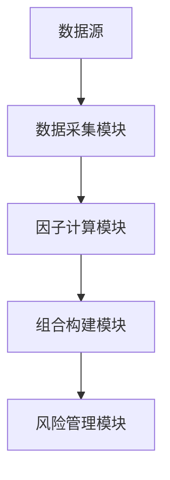

                 


# 特价股票投资中的多因子模型应用

> 关键词：多因子模型, 特价股票, 投资策略, 数学模型, 量化投资

> 摘要：本文详细探讨了多因子模型在特价股票投资中的应用，从背景介绍、核心概念到算法原理、系统架构，再到项目实战，全面分析了多因子模型的优势和实际应用。通过数学公式和代码实现，展示了如何构建有效的多因子模型，帮助投资者在特价股票市场中获得超额收益。

---

## 第1章: 特价股票投资概述

### 1.1 特价股票投资的定义与特点

#### 1.1.1 特价股票的定义
特价股票通常指的是市场价格低于其内在价值的股票。这种股票可能因为市场波动、公司困境或其他因素导致价格被低估，为投资者提供了以较低价格买入的机会，期望在价格回升时获利。

#### 1.1.2 特价股票投资的特点
- **低估值**：价格低于内在价值，具有较高的安全边际。
- **逆向投资**：在市场恐慌时买入，利用市场非理性。
- **周期性**：通常在市场低迷或特定行业困境时出现。
- **高风险**：低价可能意味着公司基本面存在问题，风险较高。

#### 1.1.3 特价股票投资的市场背景
近年来，随着市场波动加剧，投资者 increasingly转向量化方法来寻找低估股票。多因子模型因其多维度分析的优势，成为特价股票投资的重要工具。

### 1.2 多因子模型的基本概念

#### 1.2.1 多因子模型的定义
多因子模型是一种投资策略，通过多个因子（如价值、动量、质量等）来评估股票的投资价值。它结合多个维度的信息，构建投资组合，以期获得超额收益。

#### 1.2.2 多因子模型的核心要素
- **因子**：如市盈率、市净率、动量等。
- **权重**：各因子对股票评分的贡献程度。
- **数据源**：包括历史价格、财务数据等。

#### 1.2.3 多因子模型与单因子模型的区别
单因子模型仅依赖一个因子，而多因子模型结合多个因子，能够更全面地评估股票，减少单一因子的局限性。

### 1.3 特价股票投资中的问题背景

#### 1.3.1 特价股票投资的主要问题
- **信息不对称**：投资者难以全面评估公司价值。
- **市场波动**：价格受情绪影响大。
- **选择困难**：如何筛选出真正被低估的股票。

#### 1.3.2 传统投资方法的局限性
传统方法依赖经验判断，难以系统化和量化，容易受主观因素影响。

#### 1.3.3 多因子模型的应用优势
多因子模型通过量化分析，结合多个维度的信息，提高选股准确性，降低风险。

---

## 第2章: 多因子模型的核心概念与联系

### 2.1 多因子模型的原理

#### 2.1.1 多因子模型的基本原理
通过多个因子对股票进行评分，综合各因子的评分结果，筛选出具有投资价值的股票。

#### 2.1.2 多因子模型的数学基础
因子得分公式：$$ F_i = w_1 \times Factor1 + w_2 \times Factor2 + ... + w_n \times Factor_n $$

#### 2.1.3 多因子模型的因子选择
选择具有低相关性且能解释收益差异的因子，如价值因子、动量因子等。

### 2.2 多因子模型中的核心因子

#### 2.2.1 价值因子
- **市盈率（P/E）**：$$ PE = \frac{Price}{Earnings} $$
- **市净率（P/B）**：$$ PB = \frac{Price}{Book\ Value} $$

#### 2.2.2 动量因子
- **动量效应**：过去表现好的股票未来继续表现好。
- 计算方法：使用过去12个月的收益，筛选表现好的股票。

#### 2.2.3 市盈率因子
低市盈率通常意味着股票被低估。

#### 2.2.4 质量因子
- **ROE（净资产收益率）**：$$ ROE = \frac{Net\ Profit}{Equity} $$
- **债务率**：$$ Debt/Equity = \frac{Total\ Debt}{Total\ Equity} $$

### 2.3 多因子模型的因子关系

#### 2.3.1 因子之间的相关性分析
使用相关系数矩阵分析因子之间的相关性，避免因子冗余。

#### 2.3.2 因子之间的相互作用
动量因子与价值因子可能在某些市场条件下表现出负相关性。

#### 2.3.3 因子权重的确定方法
通过回归分析或因子载荷确定各因子的权重。

---

## 第3章: 多因子模型的数学模型与算法原理

### 3.1 多因子模型的数学公式

#### 3.1.1 多因子模型的通用公式
$$ Score = \sum_{i=1}^{n} w_i \times Factor_i $$

#### 3.1.2 因子得分的计算公式
每个因子的得分标准化后加权求和。

#### 3.1.3 组合权重的分配公式
$$ Weight_i = \frac{w_i}{\sum_{j=1}^{n} w_j} $$

### 3.2 多因子模型的算法流程

#### 3.2.1 数据采集与预处理
- 收集历史价格、财务数据。
- 数据清洗和标准化。

#### 3.2.2 因子计算与选择
- 计算各因子值。
- 筛选相关性低且有效的因子。

#### 3.2.3 因子权重确定
- 使用回归或主成分分析确定权重。

#### 3.2.4 组合构建与优化
- 根据评分排序，选择Top N股票。
- 优化组合，降低风险。

---

## 第4章: 多因子模型的系统分析与架构设计

### 4.1 问题场景介绍
构建一个多因子量化投资系统，用于筛选特价股票。

### 4.2 系统功能设计

#### 4.2.1 数据采集模块
- 从数据库获取股票数据。
- 数据清洗和预处理。

#### 4.2.2 因子计算模块
- 计算各因子值，如PE、动量等。

#### 4.2.3 组合构建模块
- 根据因子评分排序，构建投资组合。

#### 4.2.4 风险管理模块
- 设置止损和止盈策略。

### 4.3 系统架构设计

#### 4.3.1 系统架构图


### 4.4 系统接口设计
- 数据接口：API获取股票数据。
- 计算接口：因子计算函数。

---

## 第5章: 项目实战

### 5.1 环境安装
安装Python、Pandas、NumPy、Scikit-learn等库。

### 5.2 核心实现源代码

```python
import pandas as pd
import numpy as np

# 数据预处理
data = pd.read_csv('stock_data.csv')
data = data.dropna()

# 因子计算
def calculate_factor(pe, pb, momentum):
    score = 0.4 * pe + 0.3 * pb + 0.3 * momentum
    return score

# 计算各股票的因子评分
scores = []
for stock in data['Ticker']:
    pe = data[data['Ticker'] == stock]['PE'].values[0]
    pb = data[data['Ticker'] == stock]['PB'].values[0]
    momentum = data[data['Ticker'] == stock]['Momentum'].values[0]
    scores.append(calculate_factor(pe, pb, momentum))

data['Score'] = scores
data_sorted = data.sort_values('Score', ascending=False)
```

### 5.3 案例分析
分析某行业特价股票，计算其因子评分，筛选Top 5股票构建组合。

---

## 第6章: 总结与展望

### 6.1 总结
多因子模型通过结合多个因子，提高了选股的准确性和投资组合的风险调整后收益。

### 6.2 小结
本文详细介绍了多因子模型在特价股票投资中的应用，从理论到实践，展示了其优势和实际效果。

### 6.3 注意事项
- 数据质量影响结果。
- 模型需定期更新。
- 风险管理不可忽视。

### 6.4 拓展阅读
建议阅读相关量化投资书籍，深入学习多因子模型的应用。

---

## 作者：AI天才研究院 & 禅与计算机程序设计艺术

本文由AI天才研究院和禅与计算机程序设计艺术团队合作完成，旨在分享专业见解和技术实践经验，帮助读者在量化投资领域取得成功。

