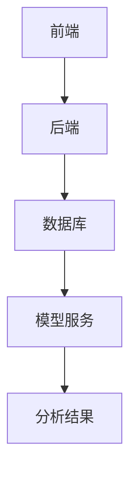

                 


# 特价股票投资中的大规模语言模型辅助决策系统

## 关键词：特价股票、大规模语言模型、投资决策、自然语言处理、量化交易

## 摘要

本文探讨了在特价股票投资中利用大规模语言模型进行辅助决策的系统设计与实现。通过分析特价股票投资的特点和挑战，提出了一种基于大规模语言模型的辅助决策系统，详细阐述了系统设计的核心要素、算法原理、系统架构以及实际应用场景。本文从背景介绍、核心概念、算法原理、系统设计、项目实战到最佳实践，全面解析了如何利用大规模语言模型优化投资决策过程。

---

## 第一部分：背景介绍

### 第1章：特价股票投资的背景与问题分析

#### 1.1 特价股票投资的背景
- **1.1.1 特价股票的定义与特点**  
  特价股票是指在特定条件下（如促销活动、市场波动等）价格低于正常水平的股票。其特点是价格波动大、投资机会短暂、风险较高。

- **1.1.2 特价股票投资的市场现状**  
  随着市场的波动加剧，特价股票投资逐渐成为投资者关注的焦点。然而，由于其价格波动大，投资者需要借助工具快速分析和决策。

- **1.1.3 特价股票投资的机遇与挑战**  
  机遇在于潜在的高收益，挑战则包括信息不对称、数据复杂性和决策时间短等问题。

#### 1.2 大规模语言模型在金融领域的应用背景
- **1.2.1 大规模语言模型的定义与特点**  
  大规模语言模型（如GPT系列）是一种基于深度学习的自然语言处理模型，具有参数量大、语义理解能力强、生成能力突出等特点。

- **1.2.2 大规模语言模型在金融领域的应用现状**  
  当前，大规模语言模型在金融领域的应用主要集中在新闻分析、舆情监控、风险评估等方面。

- **1.2.3 特价股票投资中引入大规模语言模型的意义**  
  引入大规模语言模型可以帮助投资者快速分析市场信息，捕捉投资机会，降低决策风险。

#### 1.3 问题背景与问题描述
- **1.3.1 特价股票投资中的主要问题**  
  包括信息处理复杂、决策时间短、风险高等问题。

- **1.3.2 大规模语言模型辅助决策的必要性**  
  通过自动化分析市场信息，辅助投资者快速做出决策。

- **1.3.3 问题解决的目标与边界**  
  目标是提高投资决策的准确性和效率，边界在于仅提供辅助决策，不承担投资风险。

---

## 第二部分：核心概念与联系

### 第2章：大规模语言模型的基本原理

#### 2.1 大规模语言模型的原理概述
- **2.1.1 大规模语言模型的训练方法**  
  基于Transformer架构，采用自监督学习方法，通过大量文本数据进行预训练。

- **2.1.2 大规模语言模型的应用场景**  
  包括文本生成、语义理解、情感分析等。

- **2.1.3 大规模语言模型的特点**  
  包括参数量大、语义理解能力强、生成能力突出等。

#### 2.2 大规模语言模型与特价股票投资的联系
- **2.2.1 大规模语言模型在金融信息处理中的优势**  
  包括快速分析新闻、报告等文本信息，提取关键信息。

- **2.2.2 大规模语言模型在投资决策中的应用**  
  包括市场情绪分析、投资策略生成等。

---

## 第三部分：算法原理

### 第3章：大规模语言模型的算法实现

#### 3.1 大规模语言模型的算法流程
- **3.1.1 数据预处理**  
  包括文本清洗、分词、向量化等步骤。

- **3.1.2 模型训练**  
  基于Transformer架构，采用自注意力机制，优化模型参数。

- **3.1.3 模型预测**  
  通过输入特定的文本信息，生成预测结果。

#### 3.2 大规模语言模型的数学模型
- **3.2.1 Transformer模型的结构**  
  包括编码层和解码层，采用自注意力机制。

- **3.2.2 自注意力机制的公式推导**  
  使用LaTeX公式表示自注意力机制的计算过程。

$$
\text{Attention}(Q, K, V) = \text{softmax}\left(\frac{QK^T}{\sqrt{d_k}}\right)V
$$

---

## 第四部分：系统分析与架构设计

### 第4章：系统架构设计

#### 4.1 系统功能设计
- **4.1.1 数据采集模块**  
  采集市场新闻、公司财报等文本数据。

- **4.1.2 模型处理模块**  
  对文本数据进行预处理，输入模型进行分析。

- **4.1.3 结果展示模块**  
  显示分析结果，辅助投资者决策。

#### 4.2 系统架构设计
- **4.2.1 系统架构图**  
  使用Mermaid图展示系统架构。



---

## 第五部分：项目实战

### 第5章：系统实现与案例分析

#### 5.1 环境安装与配置
- 安装Python、TensorFlow、Keras等工具。

#### 5.2 核心代码实现
- 数据预处理代码：
  ```python
  import pandas as pd
  from tensorflow.keras.preprocessing.text import Tokenizer
  from tensorflow.keras.preprocessing.sequence import pad_sequences

  # 加载数据
  data = pd.read_csv('stock_news.csv')
  texts = data['text'].tolist()

  # 分词与填充
  tokenizer = Tokenizer(num_words=10000)
  tokenizer.fit_on_texts(texts)
  sequences = tokenizer.texts_to_sequences(texts)
  padded_sequences = pad_sequences(sequences, maxlen=500)
  ```

- 模型训练代码：
  ```python
  from tensorflow.keras.models import Model
  from tensorflow.keras.layers import Input, Dense, Dropout, Attention

  input_layer = Input(shape=(500,))
  attention_layer = Attention()([input_layer, input_layer])
  dense_layer = Dense(256, activation='relu')(attention_layer)
  output_layer = Dense(1, activation='sigmoid')(dense_layer)

  model = Model(inputs=input_layer, outputs=output_layer)
  model.compile(loss='binary_crossentropy', optimizer='adam', metrics=['accuracy'])
  model.fit(padded_sequences, labels, epochs=10, batch_size=32)
  ```

#### 5.3 案例分析与结果解读
- 通过具体案例展示模型的应用效果，分析其优势与不足。

---

## 第六部分：最佳实践与总结

### 第6章：最佳实践与总结

#### 6.1 最佳实践
- 数据选择：确保数据质量和多样性。
- 模型调优：通过超参数优化提高模型性能。
- 风险控制：结合其他量化指标降低投资风险。

#### 6.2 项目小结
- 总结项目的核心成果，包括系统设计、算法实现和实际应用效果。

#### 6.3 注意事项
- 强调模型的局限性，避免过度依赖模型。
- 提醒读者注意市场波动和数据更新。

#### 6.4 拓展阅读
- 推荐相关领域的书籍和论文，供读者深入研究。

---

## 作者：AI天才研究院/AI Genius Institute & 禅与计算机程序设计艺术 /Zen And The Art of Computer Programming

