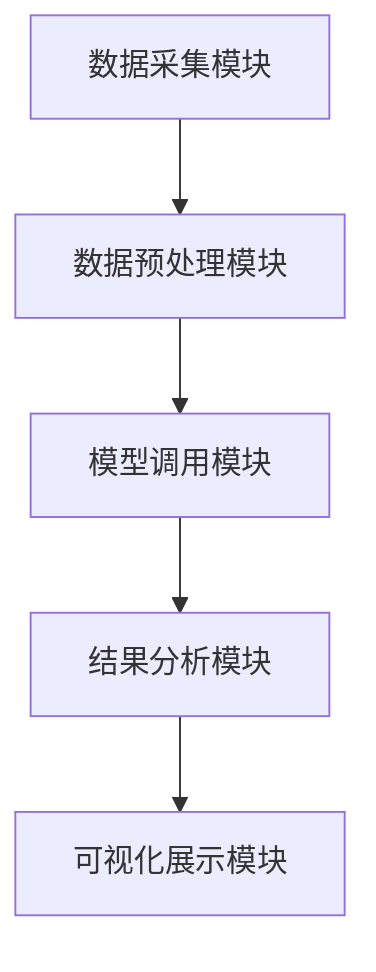

                 


# 特价股票投资中的大规模语言模型辅助情景分析系统

## 关键词：特价股票、大规模语言模型、情景分析、股票投资、文本分析

## 摘要：本文探讨了如何利用大规模语言模型辅助特价股票投资中的情景分析，通过背景介绍、核心概念、算法原理、系统架构设计和项目实战，详细讲解了大规模语言模型在股票分析中的应用。文章从传统分析方法的局限性出发，提出利用大语言模型处理文本数据、生成市场情绪分析，辅助投资决策，构建了完整的系统架构，并通过实际案例验证了系统的有效性。

---

## 第一部分：背景介绍

### 第1章：特价股票投资概述

#### 1.1 特价股票的定义与特点
- **1.1.1 特价股票的定义**  
  特价股票通常指价格低于市场平均水平的股票，具有较高的潜在回报，但风险也较高。  
- **1.1.2 特价股票的特点**  
  - 价格低廉：适合资金有限的投资者。  
  - 高波动性：价格波动较大，容易受市场情绪影响。  
  - 风险较高：公司基本面可能存在不确定性。  

#### 1.2 投资者类型与投资策略
- **1.2.1 不同类型投资者的分析**  
  - 长期投资者：关注公司基本面，注重长期价值。  
  - 短期投资者：关注市场波动，追求短期收益。  
  - 投机者：基于市场情绪进行交易。  
- **1.2.2 投资策略的多样性**  
  - 基本面分析：研究公司财务状况、行业地位等。  
  - 技术分析：通过价格走势预测未来趋势。  
  - 市场情绪分析：利用市场参与者的情绪判断市场走向。  

#### 1.3 传统股票分析方法的局限性
- **1.3.1 基本面分析的局限**  
  基本面分析依赖于财务数据，但无法完全预测市场波动。  
- **1.3.2 技术分析的局限**  
  技术分析受市场情绪影响较大，且依赖历史数据，无法预测未来市场行为。  
- **1.3.3 市场情绪分析的挑战**  
  市场情绪复杂多变，难以准确量化和预测。

---

## 第二部分：核心概念与联系

### 第2章：大规模语言模型的原理与应用

#### 2.1 大规模语言模型的定义与特点
- **2.1.1 大规模语言模型的定义**  
  大规模语言模型（LLM）是基于深度学习的自然语言处理模型，能够理解和生成人类语言。  
- **2.1.2 模型的训练方法**  
  - 预训练：使用大量通用文本数据进行无监督学习。  
  - 微调：在特定任务数据上进行有监督优化。  
- **2.1.3 模型的输出能力**  
  - 文本生成：生成连贯的文本。  
  - 情感分析：识别文本中的情感倾向。  
  - 实体识别：提取文本中的关键实体。  

#### 2.2 大规模语言模型在股票分析中的应用
- **2.2.1 文本数据的处理与分析**  
  - 从新闻、社交媒体等来源提取相关信息。  
  - 使用模型分析文本中的情绪、观点和趋势。  
- **2.2.2 市场情绪预测**  
  - 通过分析社交媒体和新闻，预测市场情绪的变化。  
  - 情绪指标与股价走势的相关性分析。  
- **2.2.3 投资决策辅助**  
  - 提供基于模型的买卖信号。  
  - 结合基本面和技术分析，生成综合投资建议。

---

## 第三部分：算法原理讲解

### 第3章：大规模语言模型的训练与优化

#### 3.1 预训练过程
- **3.1.1 语言模型的预训练目标**  
  最小化预测词的条件概率，即 $P(w_{i}|w_{<i})$。  
- **3.1.2 损失函数的计算**  
  使用交叉熵损失函数：  
  $$\mathcal{L} = -\frac{1}{N}\sum_{i=1}^{N}\sum_{j=1}^{M} y_{ij} \log p(y_{ij}|x)$$  
  其中，$N$ 是训练样本数，$M$ 是每个样本的词数，$y_{ij}$ 是标签，$p(y_{ij}|x)$ 是预测概率。  
- **3.1.3 优化器的选择与应用**  
  常用Adam优化器，参数更新公式：  
  $$\theta_{t+1} = \theta_t - \eta \frac{\partial \mathcal{L}}{\partial \theta_t}$$  

#### 3.2 微调过程
- **3.2.1 领域特定数据的引入**  
  在股票分析任务中，引入金融新闻、社交媒体评论等数据。  
- **3.2.2 微调策略的选择**  
  - 使用较小的学习率进行微调。  
  - 保持预训练的参数不变，仅优化任务特定的层。  
- **3.2.3 模型性能的评估**  
  使用准确率、F1分数等指标评估模型在特定任务上的表现。

---

## 第四部分：系统分析与架构设计方案

### 第4章：系统架构设计

#### 4.1 系统模块划分
- **数据采集模块**  
  从新闻网站、社交媒体等获取实时数据。  
- **数据预处理模块**  
  清洗、标注数据，提取关键词和情感倾向。  
- **模型调用模块**  
  调用预训练好的语言模型，进行文本分析。  
- **结果分析模块**  
  结合模型输出和基本面数据，生成投资建议。  
- **可视化展示模块**  
  以图表形式展示分析结果，方便用户决策。

#### 4.2 系统架构图


---

## 第五部分：项目实战

### 第5章：大规模语言模型辅助情景分析系统的实现

#### 5.1 环境配置
- **开发环境**：Python 3.8+，Jupyter Notebook。  
- **依赖库**：PyTorch、Hugging Face Transformers、Plotly。

#### 5.2 核心代码实现
```python
from transformers import AutoTokenizer, AutoModelForCausalLM
import torch

# 加载预训练模型
model_name = "gpt2"
tokenizer = AutoTokenizer.from_pretrained(model_name)
model = AutoModelForCausalLM.from_pretrained(model_name)

# 微调模型
def train_model(model, tokenizer, train_dataset, val_dataset, num_epochs=3):
    optimizer = torch.optim.Adam(model.parameters(), lr=5e-5)
    criterion = torch.nn.CrossEntropyLoss()
    
    for epoch in range(num_epochs):
        model.train()
        for batch in train_dataset:
            inputs, labels = batch
            outputs = model(inputs)
            loss = criterion(outputs.logits, labels)
            optimizer.zero_grad()
            loss.backward()
            optimizer.step()
    return model

# 定义数据集类
class StockDataset(torch.utils.data.Dataset):
    def __init__(self, tokenizer, texts, labels):
        self.tokenizer = tokenizer
        self.texts = texts
        self.labels = labels
    
    def __len__(self):
        return len(self.texts)
    
    def __getitem__(self, idx):
        text = self.texts[idx]
        label = self.labels[idx]
        encoding = self.tokenizer.encode_plus(
            text,
            add_special_tokens=True,
            return_tensors='pt',
            padding='max_length',
            max_length=128
        )
        return {
            'input_ids': encoding['input_ids'].flatten(),
            'attention_mask': encoding['attention_mask'].flatten(),
            'labels': torch.tensor(label, dtype=torch.long)
        }
```

#### 5.3 项目案例分析
- **案例背景**：假设我们要分析某科技公司的新闻，预测市场情绪。  
- **数据处理**：将新闻文本转换为模型可接受的格式。  
- **模型调用**：使用微调后的模型生成情绪分析结果。  
- **结果解读**：根据模型输出，判断市场情绪是积极、消极还是中性，并结合基本面数据给出投资建议。

---

## 结语

通过本文的详细讲解，我们可以看到，大规模语言模型在特价股票投资中的应用具有巨大的潜力。从预训练到微调，从系统设计到项目实现，每一步都需要精心设计和优化。未来，随着模型性能的提升和数据的丰富，大语言模型在股票分析中的作用将更加显著。

---

## 作者：AI天才研究院 & 禅与计算机程序设计艺术

