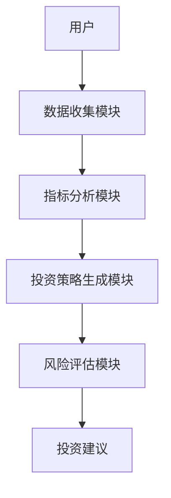
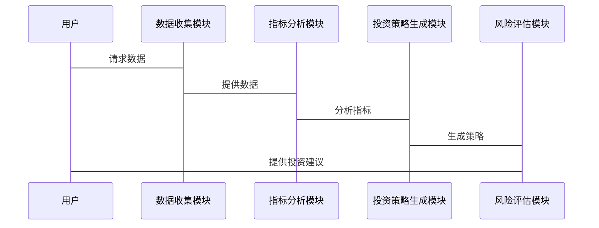

                 

# 特价股票投资中的宏观经济周期考量

> 关键词：宏观经济周期，特价股票，投资策略，经济指标，风险管理

> 摘要：本文从宏观经济周期的角度分析特价股票投资的策略和方法，探讨如何通过宏观经济指标的分析，制定有效的投资策略，并结合系统架构设计和实证分析，为投资者提供科学的投资决策支持。

---

## 第一部分: 宏观经济周期与特价股票投资概述

### 第1章: 宏观经济周期的基本概念

#### 1.1 宏观经济周期的定义与阶段划分

##### 1.1.1 宏观经济周期的定义
$$ 宏观经济周期指经济活动的波动，通常分为衰退、复苏、过热和滞胀四个阶段 $$

##### 1.1.2 经济周期的四个阶段：衰退、复苏、过热、滞胀

- **衰退阶段**：经济增长放缓，企业盈利下降，失业率上升。
- **复苏阶段**：经济开始恢复，企业盈利逐步回升。
- **过热阶段**：经济增长过快，可能出现通货膨胀。
- **滞胀阶段**：经济增长停滞，通货膨胀率高企。

##### 1.1.3 宏观经济指标对周期判断的影响

- **GDP增长率**：衡量经济整体表现的核心指标。
- **失业率**：反映劳动力市场健康状况的重要指标。
- **通货膨胀率**：衡量物价水平变化的关键指标。

#### 1.2 特价股票的定义与特点

##### 1.2.1 特价股票的定义

$$ 特价股票指市场价格低于其内在价值的股票 $$

##### 1.2.2 特价股票与价值投资的区别

| 特价股票 | 价值投资 |
|----------|-----------|
| 侧重于价格低于价值 | 侧重于长期基本面分析 |
| 更关注市场波动 | 更关注企业内在价值 |

#### 1.3 宏观经济周期与特价股票投资的关联

##### 1.3.1 宏观经济周期对股票市场的影响

- **衰退阶段**：股市通常会下跌，但可能出现廉价的买入机会。
- **复苏阶段**：股市逐渐回升，适合寻找低估股票。
- **过热阶段**：股市可能出现泡沫，风险增大。
- **滞胀阶段**：股市表现不佳，需谨慎选择投资标的。

---

### 第2章: 宏观经济指标与分析

#### 2.1 GDP与GDP平减指数

##### 2.1.1 GDP的定义与计算方法

$$ GDP = C + I + G + (X-M) $$

其中：
- C：消费支出
- I：投资支出
- G：政府购买
- X：出口
- M：进口

##### 2.1.2 GDP平减指数的作用

GDP平减指数用于衡量整体经济中的价格水平变化，是通货膨胀的重要指标。

#### 2.2 利率与通货膨胀率

##### 2.2.1 利率的种类与影响

- **短期利率**：影响市场流动性，影响银行储蓄和债券收益率。
- **长期利率**：影响企业的投资决策和房贷等长期贷款。

##### 2.2.2 通货膨胀率的计算与意义

$$ 通货膨胀率 = \frac{\text{当前物价水平} - \text{基期物价水平}}{\text{基期物价水平}} \times 100\% $$

通货膨胀率过高会导致货币购买力下降，影响股市表现。

---

### 第3章: 宏观经济指标的分析方法

#### 3.1 宏观经济指标的组合分析

##### 3.1.1 综合运用多种指标进行经济周期判断

例如，结合GDP增长率、失业率和通货膨胀率进行综合判断。

#### 3.2 宏观经济指标对投资策略的影响

##### 3.2.1 不同经济周期阶段的投资策略

- **衰退阶段**：选择防御性行业，如公用事业、医疗等。
- **复苏阶段**：选择周期性行业，如制造业、建筑业等。
- **过热阶段**：警惕市场泡沫，考虑减仓。
- **滞胀阶段**：选择抗通胀资产，如黄金、房地产等。

---

## 第二部分: 宏观经济周期下的投资策略

### 第4章: 特价股票投资策略的制定

#### 4.1 宏观经济周期对投资策略的影响

##### 4.1.1 选择行业的重要性

在不同的经济周期阶段，不同行业的表现差异显著。

#### 4.2 基于宏观经济指标的投资模型

##### 4.2.1 模型构建

$$ 投资策略 = f(\text{GDP增长率, 失业率, 通货膨胀率}) $$

---

## 第三部分: 系统架构与实证分析

### 第5章: 投资分析系统的架构设计

#### 5.1 系统功能设计

##### 5.1.1 数据收集模块

- 收集宏观经济指标数据，如GDP、利率、通货膨胀率等。
- 收集股票市场数据，包括个股价格、市盈率、市净率等。

##### 5.1.2 指标分析模块

- 计算宏观经济指标的变化趋势。
- 分析指标对股市的影响。

##### 5.1.3 投资策略生成模块

- 根据宏观经济指标生成投资建议。
- 优化投资组合。

##### 5.1.4 风险评估模块

- 评估投资策略的风险。
- 提供风险管理建议。

#### 5.2 系统架构设计

##### 5.2.1 系统架构图

#### 5.3 系统接口设计

##### 5.3.1 数据接口

- 数据来源：政府统计部门、金融数据供应商。

##### 5.3.2 投资建议接口

- 输出格式：JSON或XML，包含投资建议和风险提示。

#### 5.4 系统交互流程图

---

## 第四部分: 投资实践与风险管理

### 第6章: 投资实践中的风险管理

#### 6.1 风险管理策略

##### 6.1.1 分散投资

$$ 分散投资 = \sum_{i=1}^{n} w_i \times r_i $$

其中：
- \( w_i \)：资产i的权重
- \( r_i \)：资产i的预期收益

##### 6.1.2 设置止损点

$$ 止损点 = \text{买入价} \times (1 - \text{止损比例}) $$

#### 6.2 心理因素与投资纪律

##### 6.2.1 避免情绪化决策

- 保持冷静，避免贪婪和恐惧。

##### 6.2.2 长期投资纪律

- 遵循投资策略，避免频繁交易。

---

## 第五部分: 实证分析与总结

### 第7章: 实证分析

#### 7.1 数据来源与分析方法

##### 7.1.1 数据来源

- 历史宏观经济数据
- 历史股票市场数据

#### 7.2 分析结果

##### 7.2.1 不同经济周期阶段的策略表现

- **衰退阶段**：防御性行业表现优于周期性行业。
- **复苏阶段**：周期性行业表现优于防御性行业。
- **过热阶段**：市场波动加剧，需谨慎操作。
- **滞胀阶段**：抗通胀资产表现优于其他资产。

---

## 结论

通过宏观经济周期的分析，投资者可以在不同的经济阶段制定相应的投资策略，从而在特价股票投资中获得更好的收益。同时，结合系统的架构设计和风险管理，可以有效降低投资风险，提高投资收益。

---

## 作者

作者：AI天才研究院/AI Genius Institute & 禅与计算机程序设计艺术 /Zen And The Art of Computer Programming

