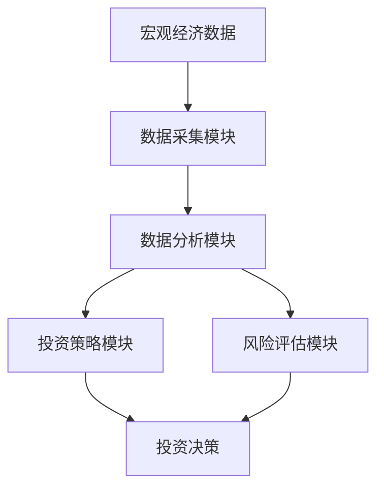
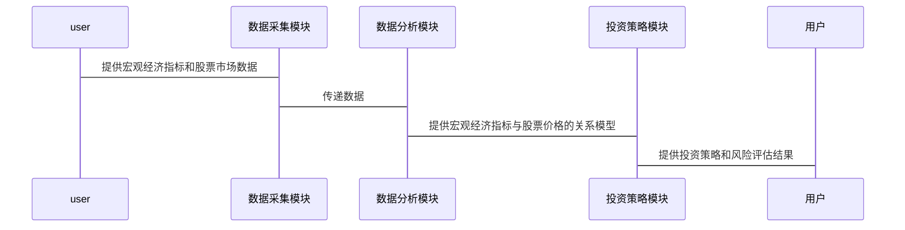

                 


# 特价股票投资中的宏观经济因素分析

> 关键词：特价股票、宏观经济、股票投资、经济指标、投资策略

> 摘要：特价股票投资中的宏观经济因素分析探讨了宏观经济指标对特价股票投资的影响。文章首先介绍了特价股票的定义和特点，分析了宏观经济指标如GDP、失业率、CPI等对股市的影响机制，然后结合具体行业分析了宏观经济因素对不同行业股票的影响。接下来，文章详细阐述了宏观经济分析方法，如PE分析和行业比较分析，并讨论了宏观经济风险的管理策略。最后，通过实际案例分析和系统架构设计，展示了如何将宏观经济因素应用于实际投资决策中。

---

# 特价股票投资中的宏观经济因素分析

## 第1章: 特价股票投资的背景与重要性

### 1.1 特价股票投资的定义与特点

#### 1.1.1 特价股票的定义
特价股票是指在特定市场条件下，价格被低估的股票。这些股票通常具有较高的潜在回报率，但市场对其估值可能低于其实际价值。特价股票的核心特征包括低市盈率（P/E比率）、低市净率（P/B比率）以及较高的股息收益率。

#### 1.1.2 特价股票投资的核心特点
- **价值低估**：特价股票通常被认为市场价格低于其内在价值。
- **周期性**：特价股票往往出现在经济周期的低谷阶段。
- **高风险-高回报**：由于市场价格被低估，潜在回报较高，但同时也伴随着较高的市场风险。

#### 1.1.3 特价股票投资的市场定位
特价股票投资主要集中在周期性行业和夕阳行业，这些行业的股票在市场低迷时期往往被低估。投资者通过识别市场中的这些机会，可以在市场回升时获得超额回报。

### 1.2 宏观经济因素在股票投资中的作用

#### 1.2.1 宏观经济对股市的整体影响
宏观经济因素是影响股市整体走势的重要因素。例如，GDP增长率、利率水平、通货膨胀率等宏观经济指标都会对股市产生深远影响。当GDP增长强劲时，企业盈利上升，股市通常表现良好；反之，当经济衰退时，股市可能下跌。

#### 1.2.2 特价股票投资中的宏观经济敏感性
特价股票对宏观经济变化的敏感性较高。例如，当央行降低利率时，资金成本下降，企业融资更容易，这可能提升股价。同样，当通货膨胀率上升时，企业成本增加，可能影响盈利能力，从而影响股价。

#### 1.2.3 宏观经济因素与股票价格的关系
宏观经济因素通过影响企业的盈利能力和市场流动性间接影响股票价格。例如，低利率环境通常会增加市场流动性，推动股价上涨；而高通胀率可能导致央行加息，从而抑制股价。

### 1.3 本书的核心目标与内容框架

#### 1.3.1 本书的核心目标
本书旨在通过分析宏观经济因素对特价股票投资的影响，帮助投资者更好地识别市场机会和风险，制定有效的投资策略。

#### 1.3.2 本书的内容框架
- 第1章：特价股票投资的背景与重要性
- 第2章：宏观经济指标与股票价格的关系
- 第3章：宏观经济因素对行业的影响
- 第4章：宏观经济分析方法与工具
- 第5章：宏观经济风险与投资策略
- 第6章：宏观经济因素分析系统架构
- 第7章：宏观经济因素分析项目实战
- 第8章：总结与最佳实践

#### 1.3.3 本书的适用读者
本书适合对股票投资感兴趣的投资新手、专业投资者以及金融研究人员。通过本书，读者可以掌握宏观经济因素对股票投资的影响，提升自己的投资决策能力。

### 1.4 本章小结
本章介绍了特价股票投资的背景、定义、特点以及宏观经济因素在股票投资中的作用。接下来的章节将深入分析宏观经济指标、行业影响、分析方法和系统架构等内容，帮助读者全面理解宏观经济因素对特价股票投资的影响。

---

## 第2章: 宏观经济指标与股票价格的关系

### 2.1 主要宏观经济指标概述

#### 2.1.1 国内生产总值（GDP）
GDP是衡量一个国家或地区经济总量的重要指标。GDP增长强劲通常意味着企业盈利上升，股市表现良好。

#### 2.1.2 失业率
失业率上升通常意味着经济不景气，企业盈利下降，股市可能下跌。

#### 2.1.3 消费者价格指数（CPI）
CPI是衡量通货膨胀的重要指标。高通胀可能导致央行加息，从而抑制股市表现。

#### 2.1.4 利率
利率水平直接影响企业的融资成本和市场流动性。低利率环境通常有利于股市上涨。

#### 2.1.5 汇率
汇率变化影响出口企业的竞争力和外资流入，从而影响股市表现。

#### 2.1.6 财政政策与货币政策
财政政策和货币政策通过影响市场流动性、企业盈利和消费者信心，间接影响股市。

### 2.2 宏观经济指标对股市的影响机制

#### 2.2.1 GDP增长与股市的关系
GDP增长强劲通常推动股市上涨，因为企业盈利上升。

#### 2.2.2 利率变化对股市的影响
低利率环境通常增加市场流动性，推动股价上涨；高利率环境可能抑制股市。

#### 2.2.3 通货膨胀对股市的影响
高通胀可能导致央行加息，抑制股市表现；适度通胀可能推动企业盈利上升，股市上涨。

#### 2.2.4 财政政策与货币政策对股市的影响
扩张性财政政策和货币政策通常通过增加市场流动性、降低企业融资成本，推动股市上涨。

### 2.3 特价股票投资中的宏观经济因素分析

#### 2.3.1 宏观经济因素对特价股票的影响
特价股票对宏观经济因素的敏感性较高，例如低利率环境可能推动特价股票价格上涨。

#### 2.3.2 宏观经济指标对特价股票投资的指导作用
通过分析宏观经济指标，投资者可以识别市场趋势，制定投资策略。

### 2.4 本章小结
本章分析了主要宏观经济指标对股市的影响机制，以及这些因素对特价股票投资的指导作用。接下来的章节将深入分析宏观经济因素对不同行业的影响，以及如何将这些因素应用于实际投资决策中。

---

## 第3章: 宏观经济因素对行业的影响

### 3.1 主要行业分析

#### 3.1.1 能源行业
能源行业受宏观经济因素影响较大，例如油价波动、政策变化等。

#### 3.1.2 制造业
制造业受GDP增长、利率水平、通货膨胀等因素影响，经济周期波动对制造业股票影响显著。

#### 3.1.3 信息技术行业
信息技术行业受宏观经济政策、技术创新和市场 demand的影响较大。

#### 3.1.4 金融行业
金融行业受利率水平、货币政策、市场流动性等因素影响，宏观经济因素对金融行业股票的影响较为直接。

#### 3.1.5 零售行业
零售行业受消费者信心、通胀率、经济周期等因素影响，宏观经济波动对零售行业股票影响显著。

### 3.2 宏观经济因素对各行业的影响

#### 3.2.1 能源行业
油价波动直接影响能源企业的盈利能力和股价。

#### 3.2.2 制造业
GDP增长和利率水平影响制造业企业的盈利能力和市场 demand。

#### 3.2.3 信息技术行业
技术创新和政策变化对信息技术行业股票的影响较大。

#### 3.2.4 金融行业
利率水平和货币政策直接影响金融行业股票的表现。

#### 3.2.5 零售行业
消费者信心和通胀率影响零售行业股票的市场表现。

### 3.3 特价股票投资中的行业选择

#### 3.3.1 行业选择的宏观经济分析
投资者需要根据宏观经济因素，选择具有较高潜在回报的行业进行投资。

#### 3.3.2 行业选择的策略
通过分析宏观经济指标和行业特点，制定行业选择策略，优化投资组合。

### 3.4 本章小结
本章分析了宏观经济因素对不同行业的影响，帮助投资者更好地理解行业选择的重要性。接下来的章节将讨论宏观经济分析方法与工具，以及如何将这些因素应用于实际投资决策中。

---

## 第4章: 宏观经济分析方法与工具

### 4.1 宏观经济分析方法

#### 4.1.1 宏观经济指标分析
通过分析GDP、失业率、CPI等指标，判断经济趋势和市场风险。

#### 4.1.2 行业比较分析
通过比较不同行业的表现，识别具有较高潜在回报的行业。

#### 4.1.3 财务指标分析
通过分析企业的财务指标，如市盈率、市净率等，评估股票的投资价值。

### 4.2 宏观经济分析工具

#### 4.2.1 数据可视化工具
使用数据可视化工具（如Excel、Tableau）分析宏观经济数据和股票市场数据。

#### 4.2.2 统计分析工具
使用统计分析工具（如SPSS、R）进行宏观经济数据分析和预测。

#### 4.2.3 金融分析软件
使用金融分析软件（如彭博终端、FactSet）获取实时宏观经济数据和市场分析报告。

### 4.3 宏观经济分析的数学模型

#### 4.3.1 回归分析
通过回归分析，建立宏观经济指标与股票价格之间的关系模型。

#### 4.3.2 时间序列分析
通过时间序列分析，预测未来宏观经济指标对股票市场的影响。

#### 4.3.3 风险评估模型
通过风险评估模型（如VaR模型），评估宏观经济因素对投资组合的风险影响。

### 4.4 本章小结
本章介绍了宏观经济分析的方法和工具，帮助投资者更好地理解和应用宏观经济因素分析。接下来的章节将讨论宏观经济风险与投资策略，以及如何将这些因素应用于实际投资决策中。

---

## 第5章: 宏观经济风险与投资策略

### 5.1 宏观经济风险

#### 5.1.1 经济周期风险
经济周期波动对股票市场的影响较大，投资者需要关注经济周期变化，制定相应的投资策略。

#### 5.1.2 通货膨胀风险
高通货膨胀可能导致央行加息，抑制股市表现，投资者需要关注通胀风险。

#### 5.1.3 利率风险
利率变化直接影响市场的流动性，影响股票价格，投资者需要关注利率风险。

### 5.2 宏观经济风险的管理

#### 5.2.1 多样化投资
通过多样化投资，分散宏观经济风险，降低投资组合的整体风险。

#### 5.2.2 对冲策略
通过使用衍生工具（如期货、期权）对冲宏观经济风险，保护投资组合的价值。

### 5.3 宏观经济因素下的投资策略

#### 5.3.1 价值投资策略
寻找市场价格被低估的股票，长期持有，等待市场价值回归。

#### 5.3.2 股票市场趋势投资策略
根据宏观经济指标和市场趋势，制定买卖决策。

#### 5.3.3 风险投资策略
通过分析宏观经济因素，识别具有高增长潜力的行业和企业，进行风险投资。

### 5.4 本章小结
本章分析了宏观经济风险及其管理策略，帮助投资者制定有效的投资策略。接下来的章节将讨论宏观经济因素分析的系统架构，以及如何将这些因素应用于实际投资决策中。

---

## 第6章: 宏观经济因素分析系统架构

### 6.1 系统架构设计

#### 6.1.1 系统功能模块
- 数据采集模块：采集宏观经济指标和股票市场数据。
- 数据分析模块：分析宏观经济指标与股票价格的关系。
- 风险评估模块：评估宏观经济因素对投资组合的风险影响。
- 投资策略模块：制定基于宏观经济分析的投资策略。

#### 6.1.2 系统架构图


### 6.2 系统实现

#### 6.2.1 环境安装
- 数据库：MySQL
- 程序语言：Python
- 开发工具：PyCharm

#### 6.2.2 核心实现代码
```python
import pandas as pd
import numpy as np
from sklearn.linear_model import LinearRegression

# 数据采集模块
def collect_data():
    # 从数据库中采集宏观经济指标和股票市场数据
    data = pd.read_sql_query("SELECT * FROM macroeconomic_factors", conn)
    return data

# 数据分析模块
def analyze_data(data):
    # 使用线性回归模型分析宏观经济指标与股票价格的关系
    model = LinearRegression()
    model.fit(data[['GDP', 'unemployment_rate', 'CPI']], data['stock_price'])
    return model.coef_

# 风险评估模块
def assess_risk(model_coefficients):
    # 根据模型系数评估宏观经济因素对投资组合的风险影响
    risk = np.abs(model_coefficients).sum()
    return risk

# 投资策略模块
def formulate_strategy(risk):
    # 根据风险评估结果制定投资策略
    if risk > 0.5:
        return "减少投资"
    else:
        return "增加投资"
```

### 6.3 系统接口设计

#### 6.3.1 数据接口
- 数据采集模块与数据库的接口。
- 数据分析模块与投资策略模块的接口。

#### 6.3.2 用户接口
- 用户输入宏观经济指标和股票市场数据。
- 用户查看投资策略和风险评估结果。

### 6.4 系统交互流程

#### 6.4.1 交互序列图


### 6.5 本章小结
本章设计了一个基于宏观经济因素分析的系统架构，展示了如何将宏观经济因素应用于实际投资决策中。接下来的章节将通过实际案例分析，进一步验证和应用这些理论。

---

## 第7章: 宏观经济因素分析项目实战

### 7.1 项目背景

#### 7.1.1 项目目标
通过分析宏观经济因素，识别具有高潜在回报的特价股票，制定有效的投资策略。

#### 7.1.2 项目范围
分析过去五年内的宏观经济数据和股票市场数据，选择具有代表性的行业和企业进行分析。

### 7.2 项目实施

#### 7.2.1 数据采集
从数据库中采集宏观经济指标（GDP、失业率、CPI等）和股票市场数据。

#### 7.2.2 数据分析
使用线性回归模型分析宏观经济指标与股票价格的关系。

#### 7.2.3 风险评估
根据模型系数评估宏观经济因素对投资组合的风险影响。

#### 7.2.4 投资策略制定
根据风险评估结果，制定基于宏观经济分析的投资策略。

### 7.3 项目结果

#### 7.3.1 数据分析结果
通过分析发现，GDP增长与股票价格呈正相关关系，失业率与股票价格呈负相关关系。

#### 7.3.2 投资策略
根据风险评估结果，制定“减少投资”或“增加投资”的策略。

### 7.4 项目总结

#### 7.4.1 项目小结
通过本次项目，验证了宏观经济因素对特价股票投资的影响，展示了如何通过系统架构和数据分析制定有效的投资策略。

#### 7.4.2 项目经验
在项目实施过程中，需要注意数据的准确性和模型的适用性，同时要结合实际市场情况调整投资策略。

### 7.5 本章小结
本章通过实际案例分析，展示了如何将宏观经济因素分析应用于特价股票投资中。接下来的章节将总结最佳实践，为读者提供进一步的指导。

---

## 第8章: 总结与最佳实践

### 8.1 本书总结

#### 8.1.1 核心内容回顾
本书系统地分析了宏观经济因素对特价股票投资的影响，包括宏观经济指标、行业影响、分析方法和系统架构等内容。

#### 8.1.2 本书的主要结论
宏观经济因素是影响特价股票投资的重要因素，投资者需要通过系统分析和实际案例分析，制定有效的投资策略。

### 8.2 最佳实践

#### 8.2.1 宏观经济分析的注意事项
- 数据的准确性和完整性
- 模型的适用性和稳定性
- 市场情况的变化和调整

#### 8.2.2 投资策略的制定
- 结合宏观经济分析和市场实际情况
- 多样化投资，分散风险
- 定期评估和调整投资策略

### 8.3 未来展望

#### 8.3.1 宏观经济因素分析的未来发展
随着大数据和人工智能技术的发展，宏观经济因素分析将更加精准和高效。

#### 8.3.2 特价股票投资的未来趋势
特价股票投资将更加依赖于宏观经济分析和技术创新，投资者需要不断提升自己的分析能力。

### 8.4 本章小结
本章总结了本书的核心内容和最佳实践，为读者提供了进一步学习和实践的方向。

---

## 作者信息

作者：AI天才研究院/AI Genius Institute & 禅与计算机程序设计艺术/Zen And The Art of Computer Programming

---

通过以上目录结构，我们可以清晰地看到《特价股票投资中的宏观经济因素分析》这本书的逻辑性和系统性。每一章都紧密围绕主题，从背景介绍到系统架构设计，再到实际项目实战，层层递进，帮助读者全面理解宏观经济因素对特价股票投资的影响。

