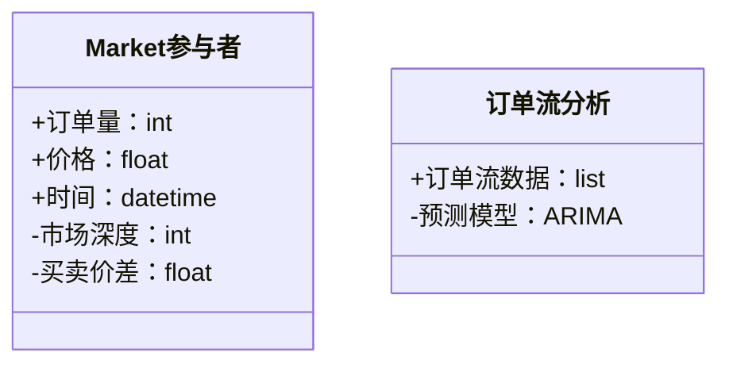
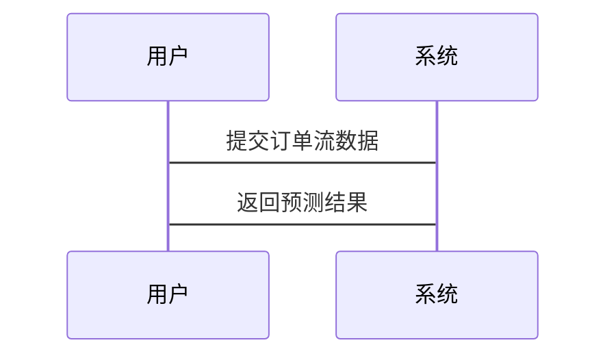

                 


# 特价股票投资中的市场微观结构分析

> 关键词：特价股票、市场微观结构、订单流分析、交易算法、投资策略

> 摘要：本文从市场微观结构的角度分析特价股票投资，探讨订单流分析、市场参与者的互动、定价机制及算法模型，帮助投资者理解市场动态和制定有效的投资策略。

---

## 第一部分: 特价股票投资中的市场微观结构基础

### 第1章: 市场微观结构概述

#### 1.1 股票市场的基本概念

##### 1.1.1 股票市场的定义与功能
股票市场是买卖公司股份的场所，其功能包括资金筹集、价格发现和风险分散。股票市场的运作依赖于订单簿和交易机制，参与者包括个人投资者、机构投资者和做市商。

##### 1.1.2 微观结构在股票市场中的作用
市场微观结构研究市场参与者、订单簿和交易机制如何影响价格和流动性。它帮助投资者理解市场动态，制定有效的交易策略。

##### 1.1.3 特价股票的定义与特点
特价股票指价格远低于市场平均水平的股票，通常出现在市场下跌或公司困境时期。其特点是高波动性和高风险。

#### 1.2 订单簿与市场流动性

##### 1.2.1 订单簿的基本结构
订单簿记录买方和卖方的订单，包括限价单、市价单和止盈止损单。订单簿反映了市场的供需情况，影响股票价格。

##### 1.2.2 市场深度与订单流分析
市场深度是订单簿中未成交的订单总量，反映市场流动性。订单流分析研究订单的数量和时间分布，帮助预测价格波动。

##### 1.2.3 流动性对股价的影响
高流动性市场买卖价差小，交易成本低；低流动性市场买卖价差大，交易成本高。流动性影响特价股票的买卖价差和交易时机。

#### 1.3 市场参与者与角色

##### 1.3.1 市场参与者的主要类型
主要参与者包括个人投资者、机构投资者（如基金和保险公司）和做市商。机构投资者提供流动性，做市商维系市场秩序。

##### 1.3.2 投资者行为对市场的影响
投资者行为受情绪和理性驱动，影响订单流和市场走势。情绪化交易可能导致市场波动，理性分析有助于制定长期策略。

##### 1.3.3 市场微观结构中的互动关系
市场参与者相互影响，订单流反映互动。买方推动价格上涨，卖方推动价格下跌，均衡价格反映市场信息。

---

## 第2章: 特价股票投资的基本原理

### 2.1 特价股票的定价机制

#### 2.1.1 市场供需与价格形成
供需关系决定价格，买方需求增加推高股价，卖方供给增加压低股价。特价股票的定价受市场整体趋势和公司基本面影响。

#### 2.1.2 微观结构对价格的影响
订单流和市场深度影响价格波动，订单量增加可能推高价格，订单量减少可能压低价格。市场参与者行为影响价格发现。

#### 2.1.3 特价股票的估值方法
使用市盈率、市净率等指标评估特价股票的价值。考虑公司基本面和市场情绪，判断股票是否被低估。

### 2.2 市场微观结构中的套利机会

#### 2.2.1 套利的基本概念与类型
套利利用价格差异获利，常见类型包括跨市场套利、配对交易和价差套利。套利在市场微观结构中发现价格失衡。

#### 2.2.2 微观结构中的套利策略
分析订单流和市场深度，寻找短期价格差异。套利策略利用市场不完美，降低交易成本，提高投资回报。

#### 2.2.3 套利对市场效率的影响
套利减少价格差异，提高市场效率。然而，过度套利可能增加市场波动，影响市场稳定性。

### 2.3 市场微观结构中的信息不对称

#### 2.3.1 信息不对称的定义与表现
信息不对称指市场参与者掌握不同信息，影响价格发现和交易决策。常见于机构投资者和个人投资者之间。

#### 2.3.2 微观结构中的信息传递
订单流反映市场信息，投资者通过分析订单量和价格变化，获取市场信号。信息传递影响市场参与者的交易行为。

#### 2.3.3 信息不对称对投资策略的影响
信息不对称增加投资风险，投资者需通过技术分析和基本面研究，降低信息不对称带来的不利影响。

---

## 第3章: 市场微观结构中的订单流分析

### 3.1 订单流的基本特征

#### 3.1.1 订单流的时间序列分析
订单流具有周期性，市场参与者在特定时间段集中交易。时间序列分析帮助预测订单量和价格波动。

#### 3.1.2 订单流的波动性与周期性
订单流波动性反映市场情绪，周期性与市场周期相关。波动性高的订单流预示高波动市场，周期性订单流反映市场趋势。

#### 3.1.3 订单流与市场情绪的关系
订单流反映市场情绪，买方订单增加显示乐观情绪，卖方订单增加显示悲观情绪。市场情绪影响订单流和股价走势。

### 3.2 市场微观结构中的订单量分析

#### 3.2.1 订单量与市场深度的关系
订单量影响市场深度，订单量增加提高市场流动性，降低买卖价差。市场深度反映市场参与者的交易意愿。

#### 3.2.2 订单量预测模型的建立
使用统计模型预测订单量，如ARIMA模型和LSTM模型。模型考虑历史订单量和市场因素，预测未来订单量。

#### 3.2.3 订单量对股价波动的影响
订单量增加推高股价，订单量减少压低股价。订单流分析帮助预测股价波动，制定交易策略。

### 3.3 市场微观结构中的订单类型

#### 3.3.1 市场订单与限价订单
市场订单以当前价格成交，限价订单设定买入价低于市价或卖出价高于市价，影响市场深度和交易成本。

#### 3.3.2 止盈止损订单与市价订单
止盈止损订单控制风险，市价订单立即成交。订单类型影响交易成本和市场流动性。

#### 3.3.3 大额订单与小订单
大额订单影响市场价格，小订单反映市场情绪。订单类型分析帮助投资者判断市场趋势和风险。

---

## 第4章: 市场微观结构中的算法与数学模型

### 4.1 订单流预测算法

#### 4.1.1 基于时间序列的订单流预测
使用ARIMA模型预测订单流，分析历史数据识别趋势和周期性。模型参数调整优化预测精度。

#### 4.1.2 基于机器学习的订单流预测
应用LSTM模型处理时间序列数据，捕捉复杂模式。机器学习模型考虑更多因素，提高预测准确性。

#### 4.1.3 订单流预测的数学模型
ARIMA模型公式：
$$ ARIMA(p, d, q) $$
LSTM模型结构：
$$
\begin{align*}
i_t &= \sigma_t \\
f_t &= \sigma_t \\
o_t &= \sigma_t \\
\end{align*}
$$

### 4.2 数学模型与统计方法

#### 4.2.1 市场微观结构中的马尔可夫链模型
马尔可夫链模型分析订单状态转移，预测订单量变化。模型状态包括买方主导、卖方主导和平衡状态。

#### 4.2.2 马尔可夫链模型的应用
状态转移概率矩阵：
$$
P = \begin{bmatrix}
0.6 & 0.3 & 0.1 \\
0.2 & 0.5 & 0.3 \\
0.1 & 0.3 & 0.6 \\
\end{bmatrix}
$$

#### 4.2.3 基于订单流的回归分析
回归模型预测价格变化，变量包括订单量、买卖价差和市场深度。模型公式：
$$
y = \beta_0 + \beta_1x_1 + \beta_2x_2 + \epsilon
$$

### 4.3 订单流分析的Python实现

```python
import pandas as pd
import numpy as np
from statsmodels.tsa.arima_model import ARIMA

# 数据加载
data = pd.read_csv('order_flow.csv')

# ARIMA模型训练
model = ARIMA(data['order_volume'], order=(5,1,0))
model_fit = model.fit()

# 预测订单流
forecast = model_fit.forecast(steps=10)
print(forecast)
```

---

## 第5章: 系统分析与架构设计

### 5.1 系统功能设计

#### 5.1.1 领域模型设计
领域模型图（mermaid）：


#### 5.1.2 系统架构设计
系统架构图（mermaid）：
```mermaid
container Market参与者 {
    Market参与者
    订单流分析
}
container 系统架构 {
    前端界面
    后台处理
    数据存储
}
```

### 5.2 系统接口设计

#### 5.2.1 系统接口设计
API接口文档：
- 输入：订单流数据（JSON格式）
- 输出：预测结果（JSON格式）

#### 5.2.2 系统交互流程
交互流程图（mermaid）：


---

## 第6章: 项目实战

### 6.1 环境安装

#### 6.1.1 安装Python环境
使用Anaconda安装Python 3.9及以上版本。

#### 6.1.2 安装依赖库
安装pandas、numpy、statsmodels和scikit-learn。

### 6.2 核心代码实现

#### 6.2.1 订单流预测代码
```python
import pandas as pd
import numpy as np
from statsmodels.tsa.arima_model import ARIMA
import matplotlib.pyplot as plt

# 数据加载
data = pd.read_csv('order_flow.csv')

# 训练ARIMA模型
model = ARIMA(data['order_volume'], order=(5,1,0))
model_fit = model.fit()

# 预测未来订单流
forecast = model_fit.forecast(steps=10)
forecast_results = pd.DataFrame(forecast, columns=['order_volume'])

# 可视化预测结果
plt.plot(data['order_volume'], label='历史数据')
plt.plot(forecast_results['order_volume'], label='预测数据')
plt.xlabel('时间')
plt.ylabel('订单量')
plt.legend()
plt.show()
```

### 6.3 案例分析与总结

#### 6.3.1 案例分析
分析某特价股票的订单流数据，预测未来订单量和价格走势。通过可视化工具展示预测结果，验证模型准确性。

#### 6.3.2 项目总结
总结项目经验，优化算法模型，改进系统架构，提升预测精度和运行效率。提出未来研究方向，如引入更多机器学习模型和实时数据流处理。

---

## 第7章: 最佳实践与拓展阅读

### 7.1 小结

通过市场微观结构分析，投资者可以更好地理解特价股票的定价机制和市场动态。订单流分析和算法模型为投资决策提供科学依据，帮助投资者制定有效策略。

### 7.2 注意事项

- 数据质量影响预测结果，需确保数据准确性和完整性。
- 市场环境变化需及时调整模型参数，保持预测准确性。
- 风险管理至关重要，需设置止损点和止盈点，控制投资风险。

### 7.3 拓展阅读

建议阅读相关书籍和文献，深入学习市场微观结构理论和算法模型。实践更多项目，积累经验，提升分析能力。

---

作者：AI天才研究院/AI Genius Institute & 禅与计算机程序设计艺术 /Zen And The Art of Computer Programming

