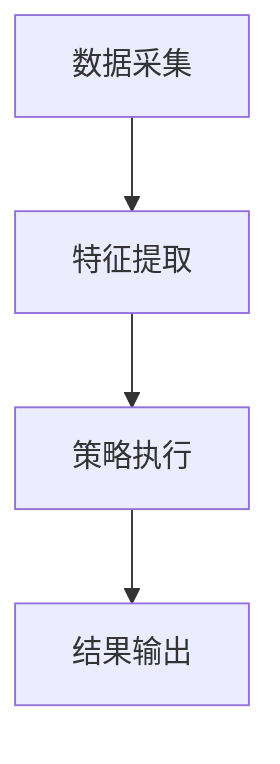

                 


# 特价股票投资中的情绪因子分析

> 关键词：特价股票，情绪因子，投资决策，市场情绪，量化分析

> 摘要：本文从情绪因子的定义出发，分析其在股票投资中的作用，特别是特价股票投资中的应用。通过行为金融学、统计分析、机器学习等多种方法，探讨情绪因子的量化与分析，并结合实际案例，展示情绪因子在特价股票投资中的实际效果。

---

## 第1章: 情绪因子与特价股票投资概述

### 1.1 情绪因子的定义与背景

#### 1.1.1 投资者情绪的定义
投资者情绪（Investor Sentiment）是指投资者在市场中的心理状态和对市场的看法，通常表现为乐观或悲观。情绪因子是将这些情绪状态量化后，用于分析其对股票价格的影响。

#### 1.1.2 情绪因子在股票投资中的作用
情绪因子可以帮助投资者识别市场中的非理性行为，从而在市场波动中寻找投资机会。例如，在市场恐慌时，情绪因子可能显示市场情绪低落，此时可能存在被低估的股票。

#### 1.1.3 特价股票的定义与特点
特价股票通常指价格低于市场平均水平的股票，具有高波动性和高风险的特点。这些股票通常被市场忽视或低估，但在情绪因子分析中，可以通过识别市场情绪的变化来捕捉投资机会。

### 1.2 情绪因子与股票价格的关系

#### 1.2.1 情绪因子对股票价格的短期影响
市场情绪的变化往往导致股票价格的短期波动。例如，当市场情绪高涨时，股票价格可能被推高，反之则可能下跌。

#### 1.2.2 情绪因子对股票价格的长期影响
长期来看，情绪因子可能影响市场的整体波动性，但理性分析和基本面因素仍然是决定股票价格的主要因素。

#### 1.2.3 情绪因子与市场波动性分析
情绪因子可以帮助投资者识别市场波动的来源，从而更好地管理投资风险。

### 1.3 情绪因子分析的必要性

#### 1.3.1 投资者情绪对市场行为的影响
投资者情绪影响市场的买卖决策，从而影响股票价格。情绪因子分析可以帮助投资者理解市场的集体行为。

#### 1.3.2 情绪因子分析在投资决策中的价值
情绪因子分析可以帮助投资者识别市场趋势和潜在的投资机会，特别是在特价股票投资中。

#### 1.3.3 情绪因子与特价股票投资的应用前景
通过对情绪因子的分析，投资者可以更好地理解特价股票的市场情绪，从而制定更有效的投资策略。

### 1.4 本章小结
本章介绍了情绪因子的定义、作用以及其在特价股票投资中的应用前景。情绪因子作为投资者情绪的量化指标，可以帮助投资者更好地理解市场行为和价格波动。

---

## 第2章: 情绪因子的理论基础

### 2.1 行为金融学与情绪因子

#### 2.1.1 行为金融学的定义与核心理论
行为金融学研究投资者心理和行为对市场的影响。核心理论包括有限理性、前景理论等。

#### 2.1.2 情绪偏差与投资决策
投资者的情绪偏差，如过度自信、从众心理等，会影响其投资决策。情绪因子分析可以帮助识别这些偏差。

#### 2.1.3 情绪因子在行为金融学中的应用
通过分析情绪因子，行为金融学家可以更好地理解市场的非理性波动。

### 2.2 情绪指标与市场情绪分析

#### 2.2.1 常见的情绪指标
- **恐慌指数（VIX）**：反映市场波动性的指标。
- **市场情绪指数（PSI）**：基于投资者情绪调查的指标。

#### 2.2.2 情绪指标的计算方法
情绪指标通常基于市场数据（如成交量、换手率）或社交媒体数据（如Twitter、Reddit）进行计算。

#### 2.2.3 情绪指标与股票价格的关系
情绪指标可以预测股票价格的变化，尤其是在市场波动加剧时。

### 2.3 情绪因子与市场周期

#### 2.3.1 市场周期的定义与阶段划分
市场周期包括上升周期、下降周期等，情绪因子在不同周期中的表现不同。

#### 2.3.2 情绪因子在不同市场周期中的表现
在上升周期中，情绪因子可能显示乐观情绪；在下降周期中，情绪因子可能显示悲观情绪。

#### 2.3.3 情绪因子与市场拐点的识别
情绪因子可以帮助投资者识别市场的拐点，从而提前做出投资决策。

### 2.4 本章小结
本章分析了情绪因子的理论基础，包括行为金融学、情绪指标以及市场周期中的情绪因子表现。情绪因子分析为投资者提供了理解市场行为的重要工具。

---

## 第3章: 情绪因子的量化与分析方法

### 3.1 情绪因子的量化指标

#### 3.1.1 基于市场数据的情绪指标
- **成交量**：高成交量可能反映市场情绪高涨或恐慌。
- **换手率**：高换手率可能反映市场情绪活跃。

#### 3.1.2 基于新闻数据的情绪指标
- **情感分析**：通过分析新闻标题的情感倾向，量化市场情绪。

#### 3.1.3 基于社交媒体的情绪指标
- **Twitter情绪分析**：通过分析Twitter上的关键词和情感倾向，量化市场情绪。
- **Reddit情绪分析**：通过分析Reddit上的讨论内容，量化市场情绪。

### 3.2 情绪因子的分析方法

#### 3.2.1 统计分析方法
- **相关性分析**：分析情绪因子与股票价格之间的相关性。
- **回归分析**：建立情绪因子与股票收益的回归模型。

#### 3.2.2 时间序列分析方法
- **ARIMA模型**：用于预测情绪因子的变化趋势。
- **GARCH模型**：用于分析情绪因子对市场波动性的影响。

#### 3.2.3 机器学习方法
- **情感分析模型**：使用机器学习算法（如SVM、随机森林）进行情感分类。
- **聚类分析**：将市场情绪分为不同类别。

### 3.3 情绪因子的多因子模型构建

#### 3.3.1 多因子模型的定义与构建步骤
多因子模型将多个因子（如情绪因子、价值因子、动量因子）结合，用于解释股票收益。

#### 3.3.2 情绪因子在多因子模型中的应用
情绪因子可以作为多因子模型中的一个因子，与其他因子一起解释股票收益。

#### 3.3.3 情绪因子与其他因子的交互作用
情绪因子可能与价值因子、动量因子等存在交互作用，共同影响股票收益。

### 3.4 本章小结
本章介绍了情绪因子的量化指标和分析方法，包括统计分析、时间序列分析和机器学习方法。情绪因子分析可以帮助投资者更好地理解市场情绪和股票收益的关系。

---

## 第4章: 情绪因子在特价股票投资中的应用

### 4.1 特价股票的市场特征

#### 4.1.1 特价股票的定义与分类
特价股票通常指价格低于市场平均水平的股票，可能具有高波动性和高风险。

#### 4.1.2 特价股票的市场参与者分析
市场参与者可能包括散户、机构投资者和高频交易者。

#### 4.1.3 特价股票的市场情绪分析
特价股票的市场情绪可能比高价股票更不稳定，情绪因子分析尤为重要。

### 4.2 情绪因子在特价股票投资中的具体应用

#### 4.2.1 情绪因子与特价股票的收益预测
通过分析情绪因子，投资者可以预测特价股票的收益变化。

#### 4.2.2 情绪因子与特价股票的风险管理
情绪因子可以帮助投资者识别市场风险，从而更好地管理投资组合。

#### 4.2.3 情绪因子与特价股票的投资策略
情绪因子分析可以支持投资者制定基于情绪因子的投资策略，如情绪驱动的买卖信号。

### 4.3 本章小结
本章分析了情绪因子在特价股票投资中的具体应用，包括收益预测、风险管理和投资策略制定。情绪因子分析为投资者提供了重要的工具，帮助其在特价股票市场中做出更明智的投资决策。

---

## 第5章: 情绪因子分析的系统架构与实现

### 5.1 系统架构设计

#### 5.1.1 系统功能设计
- 数据采集模块：采集市场数据和社交媒体数据。
- 特征提取模块：提取情绪因子和相关特征。
- 策略执行模块：基于情绪因子分析制定投资策略。

#### 5.1.2 系统架构图


### 5.2 系统实现细节

#### 5.2.1 数据采集
- **市场数据**：包括股票价格、成交量等。
- **社交媒体数据**：包括Twitter、Reddit上的文本数据。

#### 5.2.2 特征提取
- **情绪分析**：对社交媒体数据进行情感分类，提取情绪因子。
- **统计指标**：计算基于市场数据的情绪指标。

#### 5.2.3 策略执行
- **情绪驱动策略**：基于情绪因子变化制定买卖信号。
- **多因子模型**：结合情绪因子和其他因子进行投资决策。

### 5.3 系统实现代码示例

#### 5.3.1 数据采集
```python
import pandas as pd
from pandas_datareader import DataReader

# 采集股票数据
data = DataReader('AAPL', 'yahoo', start='2020-01-01', end='2023-12-31')
data.to_csv('aapl.csv')
```

#### 5.3.2 情绪分析
```python
from textblob import TextBlob

# 对社交媒体文本进行情绪分析
def get_sentiment(text):
    blob = TextBlob(text)
    return blob.sentiment.polarity

# 示例文本
text = "I love this stock!"
sentiment = get_sentiment(text)
print(sentiment)
```

#### 5.3.3 多因子模型
```python
import numpy as np
from sklearn.linear_model import LinearRegression

# 示例数据
X = np.array([[1, 2], [3, 4], [5, 6]])
y = np.array([7, 8, 9])

# 建立回归模型
model = LinearRegression()
model.fit(X, y)

# 预测
new_X = np.array([[2, 3]])
predicted_y = model.predict(new_X)
print(predicted_y)
```

### 5.4 本章小结
本章详细介绍了情绪因子分析的系统架构与实现，包括数据采集、特征提取和策略执行的全过程。通过具体代码示例，读者可以更好地理解情绪因子分析的技术实现。

---

## 第6章: 情绪因子分析的项目实战

### 6.1 项目背景与目标
本项目旨在通过情绪因子分析，帮助投资者制定基于情绪因子的特价股票投资策略。

### 6.2 项目环境搭建
- **工具安装**：安装Python、Pandas、Scikit-learn等工具。
- **数据来源**：使用Yahoo Finance和Twitter API获取数据。

### 6.3 项目核心实现

#### 6.3.1 数据采集与处理
```python
import pandas as pd
import tweepy

# 采集Twitter数据
def get_tweets(query):
    auth = tweepy.OAuthHandler(consumer_key, consumer_secret)
    api = tweepy.API(auth)
    tweets = api.search(query, count=100)
    return tweets

tweets = get_tweets("stock")
```

#### 6.3.2 情绪因子计算
```python
from textblob import TextBlob

def calculate_sentiment(tweets):
    sentiments = []
    for tweet in tweets:
        text = tweet.text
        blob = TextBlob(text)
        sentiments.append(blob.sentiment.polarity)
    return sentiments

sentiments = calculate_sentiment(tweets)
```

#### 6.3.3 投资策略制定
```python
import numpy as np
from sklearn.linear_model import LinearRegression

# 建立情绪因子与股票收益的回归模型
X = np.array([sentiments])
y = np.array([stock_prices])

model = LinearRegression()
model.fit(X, y)

# 预测未来收益
future_sentiment = 0.5
predicted_price = model.predict([[future_sentiment]])
print(predicted_price)
```

### 6.4 项目案例分析

#### 6.4.1 案例背景
选择一只特价股票，分析其市场情绪变化。

#### 6.4.2 数据分析与结果解读
通过情绪因子分析，识别市场情绪变化对股票价格的影响。

#### 6.4.3 投资策略优化
根据情绪因子分析结果，优化投资策略，提高投资收益。

### 6.5 本章小结
本章通过实际项目案例，展示了情绪因子分析在特价股票投资中的具体应用。通过数据采集、情绪计算和策略制定，投资者可以更好地理解市场情绪，制定更有效的投资策略。

---

## 第7章: 情绪因子分析的总结与展望

### 7.1 本章总结
情绪因子分析是投资者理解市场情绪的重要工具，特别是在特价股票投资中。通过量化分析和系统实现，投资者可以更好地识别市场趋势和投资机会。

### 7.2 情绪因子分析的局限性
情绪因子分析依赖于数据质量和模型准确性，可能存在一定的局限性。例如，社交媒体数据可能存在噪声，情绪分析结果可能不够准确。

### 7.3 情绪因子分析的未来展望
未来，随着人工智能技术的发展，情绪因子分析将更加精确和多样化。例如，使用更复杂的深度学习模型进行情绪分析，结合更多数据源（如语音、视频）进行情绪计算。

### 7.4 本章小结
本章总结了情绪因子分析的重要性和应用前景，同时指出了其局限性和未来发展方向。

---

## 作者：AI天才研究院/AI Genius Institute & 禅与计算机程序设计艺术 /Zen And The Art of Computer Programming

---

以上是《特价股票投资中的情绪因子分析》的完整目录大纲和文章内容。希望这篇文章能为投资者提供有价值的情绪因子分析方法，帮助他们在特价股票投资中做出更明智的决策。

