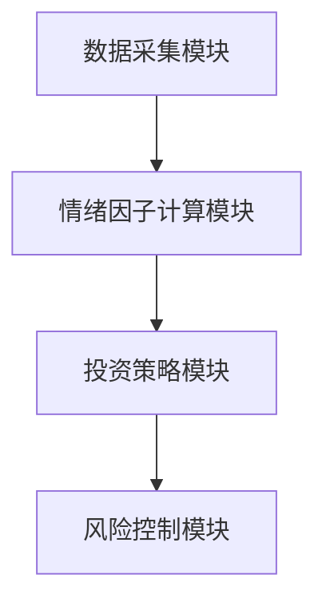

                 


# 特价股票投资中的情绪因子分析与应用

## 关键词：
- 特价股票, 情绪因子, 投资策略, 市场情绪, 行为金融学

## 摘要：
本文深入探讨了特价股票投资中情绪因子的分析与应用。情绪因子作为一种新兴的量化投资因子，能够有效捕捉市场参与者的心理波动对股价的影响。通过行为金融学的理论基础、情绪数据的收集与量化方法、情绪因子的分析模型以及实际投资策略的构建，本文系统性地展示了如何将情绪因子应用于特价股票的投资决策中。结合具体的项目实战和系统设计，本文为投资者提供了一套基于情绪因子的投资策略框架，帮助投资者在复杂的市场环境中捕捉情绪驱动的投资机会，优化投资组合的表现。

---

## 第1章: 情绪因子的背景与理论基础

### 1.1 情绪因子的定义与特点
情绪因子是指投资者情绪波动对市场行为和股价波动的影响程度。它通过量化市场参与者的心理状态，捕捉市场情绪的变化趋势，从而为投资决策提供参考依据。

#### 情绪因子的特点：
1. **动态性**：情绪因子随时间变化，受市场环境、新闻事件等因素影响。
2. **非线性**：情绪因子与股价之间的关系通常是非线性的，存在市场情绪过热或恐慌时的极端波动。
3. **可量化**：通过自然语言处理、情感分析等技术，情绪因子可以被量化为具体的指标。

### 1.2 情绪因子与投资决策
情绪因子在投资决策中的作用主要体现在以下几个方面：
1. **市场情绪预测**：通过分析情绪因子，预测市场情绪的变化趋势，提前布局投资策略。
2. **风险控制**：情绪波动较大的市场环境可能带来更大的投资风险，情绪因子可以帮助投资者更好地进行风险控制。
3. **投资机会发现**：情绪因子可以帮助投资者发现市场情绪低估或高估的资产，从而捕捉投资机会。

### 1.3 行为金融学基础
行为金融学研究投资者心理行为对市场的影响，揭示了传统金融学无法解释的市场现象。情绪因子作为行为金融学的重要组成部分，通过分析投资者的心理波动，帮助理解市场行为。

#### 核心理论：
- **前景理论**：投资者对收益和损失的敏感度不同，导致情绪波动对投资决策的影响。
- **情绪周期理论**：市场情绪会经历从乐观到悲观再到乐观的周期性变化。

---

## 第2章: 情绪因子的分析方法

### 2.1 情绪数据的收集与处理
情绪数据主要来源于以下几个方面：
1. **新闻媒体**：通过分析财经新闻的情绪倾向，获取市场情绪信息。
2. **社交媒体**：通过分析投资者在社交媒体上的发言，量化市场情绪。
3. **机构报告**：通过分析机构投资者的情绪报告，获取市场情绪数据。

#### 数据预处理步骤：
1. **数据清洗**：去除无效数据，如重复数据、噪声数据。
2. **数据标注**：通过自然语言处理技术，对情绪数据进行分类和标注。
3. **数据标准化**：将情绪数据标准化，以便后续分析。

### 2.2 情绪因子的量化方法
情绪因子可以通过以下几种方式量化：
1. **情感分析模型**：利用自然语言处理技术，对情绪数据进行情感分析，生成情绪指数。
2. **时间序列分析**：通过时间序列分析，捕捉情绪因子的动态变化趋势。
3. **机器学习模型**：利用机器学习算法，对情绪因子进行预测和分类。

#### 情绪指数计算公式：
$$
\text{情绪指数} = \sum_{i=1}^{n} w_i \times \text{情绪强度}_i
$$
其中，$w_i$为第$i$个情绪数据的权重，$\text{情绪强度}_i$为第$i$个情绪数据的强度。

### 2.3 情绪因子的分析模型
情绪因子的分析模型主要包括以下几个步骤：
1. **数据采集**：收集情绪数据。
2. **情绪指数计算**：通过量化方法计算情绪指数。
3. **情绪因子与股价的相关性分析**：分析情绪因子与股价之间的相关性。
4. **情绪因子的预测模型**：利用机器学习算法，构建情绪因子的预测模型。

#### 情绪因子与股价的相关性分析：
$$
\text{相关系数} = \frac{\sum (x_i - \bar{x})(y_i - \bar{y})}{\sqrt{\sum (x_i - \bar{x})^2} \times \sqrt{\sum (y_i - \bar{y})^2}}
$$
其中，$x_i$为情绪因子，$y_i$为股价。

---

## 第3章: 情绪因子在投资策略中的应用

### 3.1 投资策略的构建
情绪因子可以用于构建多种投资策略，如情绪驱动的短期交易策略、情绪驱动的长期投资策略等。

#### 短期交易策略：
- 基于情绪因子的短期波动预测，进行高频交易。
- 在市场情绪过热时，卖出资产，避免市场崩盘。

#### 长期投资策略：
- 在市场情绪低谷时，买入低估资产，长期持有。
- 结合情绪因子和其他因子（如价值因子、动量因子）构建多因子投资模型。

### 3.2 投资组合优化
情绪因子可以帮助投资者优化投资组合，降低投资风险。

#### 投资组合优化模型：
$$
\min_w \left( w^T \Sigma w \right)
$$
$$
\text{subject to} \quad w^T \mu = \text{目标收益}, \quad w^T e = 1
$$
其中，$w$为投资组合权重，$\Sigma$为资产之间的协方差矩阵，$\mu$为资产的预期收益，$e$为单位向量。

### 3.3 风险控制
情绪因子可以帮助投资者识别市场情绪风险，进行有效的风险控制。

#### 风险控制策略：
- 在市场情绪过热时，增加现金头寸，降低股票仓位。
- 在市场情绪恐慌时，逢低吸纳，抄底优质资产。

---

## 第4章: 系统设计与实现

### 4.1 系统设计概述
情绪因子分析系统的总体架构包括数据采集模块、情绪因子计算模块、投资策略模块和风险控制模块。

#### 系统架构图：


### 4.2 数据采集模块
数据采集模块负责从多种数据源采集情绪数据，包括新闻媒体、社交媒体和机构报告。

#### 数据源：
- **新闻媒体**：财经新闻网站、新闻数据库。
- **社交媒体**：Twitter、Reddit等社交媒体平台。
- **机构报告**：机构投资者的情绪报告、市场分析报告。

### 4.3 情绪因子计算模块
情绪因子计算模块通过自然语言处理技术和时间序列分析方法，计算情绪指数。

#### 情绪指数计算流程：
1. 数据清洗：去除无效数据。
2. 数据标注：通过情感分析模型对情绪数据进行分类。
3. 数据标准化：将情绪数据标准化。
4. 情绪指数计算：通过加权求和的方法计算情绪指数。

### 4.4 投资策略模块
投资策略模块基于情绪指数，构建投资策略，指导投资决策。

#### 投资策略实现：
1. 短期交易策略：基于情绪指数的短期波动预测，进行高频交易。
2. 长期投资策略：在市场情绪低谷时，买入低估资产，长期持有。
3. 多因子模型：结合情绪因子和其他因子（如价值因子、动量因子）构建多因子投资模型。

### 4.5 风险控制模块
风险控制模块通过情绪因子分析，识别市场情绪风险，进行有效的风险控制。

#### 风险控制策略：
1. 在市场情绪过热时，增加现金头寸，降低股票仓位。
2. 在市场情绪恐慌时，逢低吸纳，抄底优质资产。

---

## 第5章: 项目实战与案例分析

### 5.1 数据采集与预处理
#### 数据源选择：
- 新闻媒体：新浪财经、东方财富网。
- 社交媒体：Twitter、Reddit。
- 机构报告：机构投资者情绪报告。

#### 数据预处理：
1. 数据清洗：去除无效数据。
2. 数据标注：通过情感分析模型对情绪数据进行分类。
3. 数据标准化：将情绪数据标准化。

### 5.2 情绪指数计算
#### 情绪指数计算代码：
```python
import pandas as pd
import numpy as np

# 数据预处理
df = pd.read_csv('emotion_data.csv')
df.dropna(inplace=True)
df['sentiment'] = df['sentiment'].apply(lambda x: 1 if x > 0 else -1)

# 情绪指数计算
weights = np.array([0.5, 0.3, 0.2])
emotional_index = np.dot(df['sentiment'].values, weights)
```

### 5.3 投资策略实现
#### 投资策略代码：
```python
import pandas as pd
import numpy as np

# 数据读取
df = pd.read_csv('stock_data.csv')

# 情绪因子计算
df['emotional_factor'] = df['sentiment'].apply(lambda x: 1 if x > 0 else -1)

# 投资策略实现
positions = []
for i in range(len(df)):
    if df['emotional_factor'].iloc[i] == 1:
        positions.append(1)
    else:
        positions.append(0)
```

### 5.4 实际案例分析
#### 案例分析：
通过实际案例分析，验证情绪因子在投资策略中的有效性。例如，在市场情绪低谷时，买入低估资产，长期持有，可以获得较高的收益。

---

## 第6章: 高级主题与未来展望

### 6.1 情绪因子的动态变化
情绪因子的动态变化受到多种因素的影响，如市场环境、新闻事件、政策变化等。未来的研究可以进一步探索情绪因子的动态变化规律，优化情绪因子的计算方法。

### 6.2 情绪因子的跨市场应用
情绪因子不仅适用于单个市场，还可以应用于跨市场投资。通过分析不同市场的市场情绪，可以制定跨市场投资策略，优化投资组合的表现。

### 6.3 情绪因子与人工智能的结合
随着人工智能技术的发展，情绪因子的分析与应用将更加智能化。未来的研究可以进一步探索情绪因子与人工智能的结合，利用深度学习等技术，提高情绪因子的分析精度。

---

## 结论

情绪因子作为一种新兴的量化投资因子，能够有效捕捉市场参与者的心理波动对股价的影响。通过行为金融学的理论基础、情绪数据的收集与量化方法、情绪因子的分析模型以及实际投资策略的构建，本文系统性地展示了如何将情绪因子应用于特价股票的投资决策中。结合具体的项目实战和系统设计，本文为投资者提供了一套基于情绪因子的投资策略框架，帮助投资者在复杂的市场环境中捕捉情绪驱动的投资机会，优化投资组合的表现。

---

## 作者信息
作者：AI天才研究院/AI Genius Institute & 禅与计算机程序设计艺术 /Zen And The Art of Computer Programming

