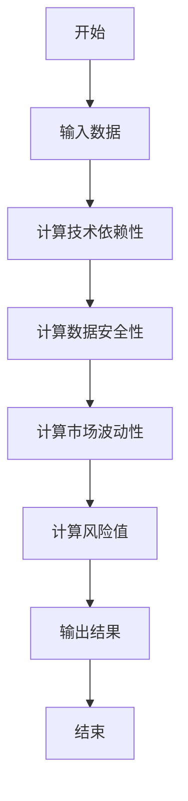
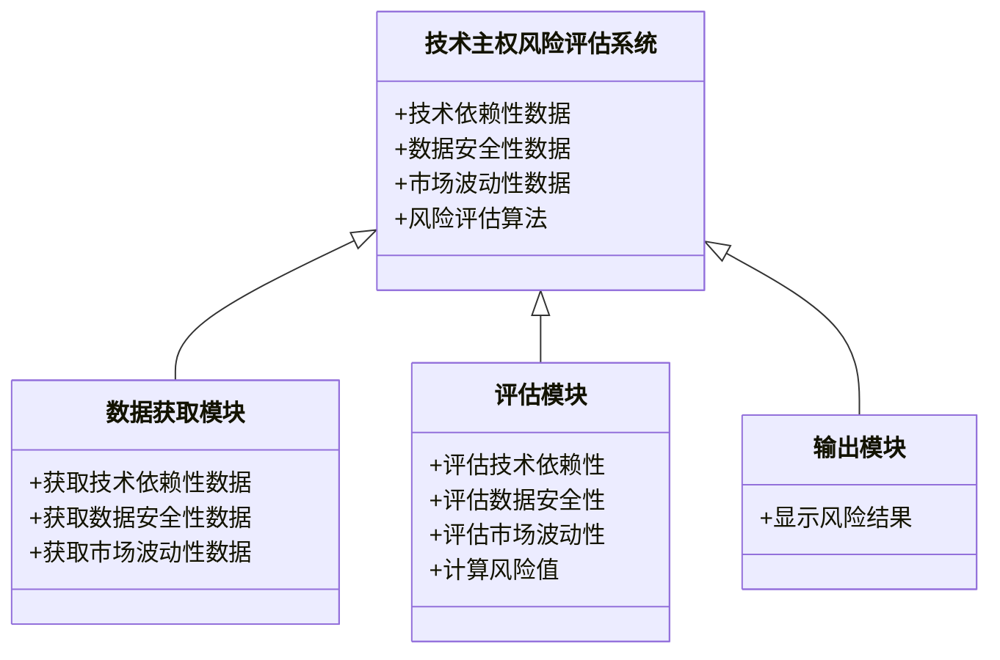
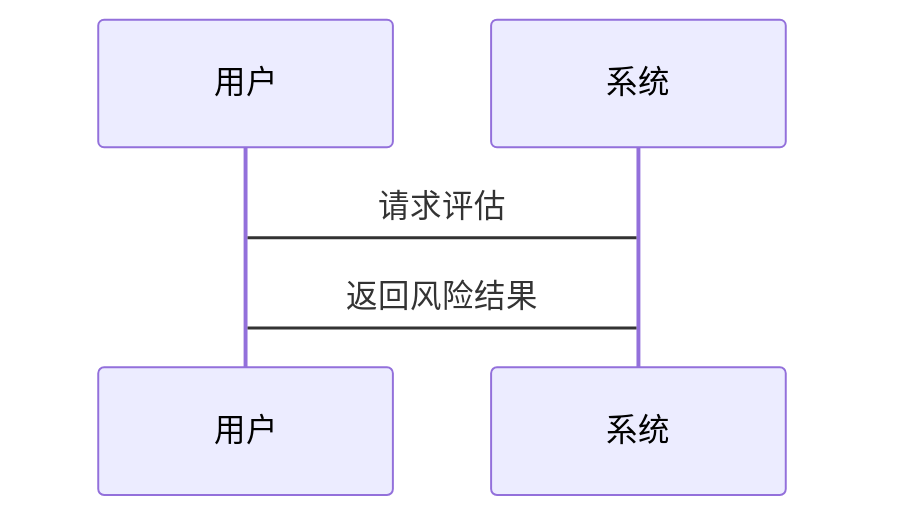

                 


# 特价股票投资中的技术主权风险评估

> 关键词：特价股票，技术主权，风险评估，算法原理，系统架构

> 摘要：本文系统地探讨了特价股票投资中的技术主权风险评估，从背景概述、核心概念、算法原理到系统设计与项目实战，深入分析了技术主权风险在股票投资中的重要性及其评估方法。通过构建数学模型、ER实体关系图和系统架构图，本文为投资者提供了一套全面的技术主权风险评估框架，帮助投资者在复杂的市场环境中做出明智决策。

---

## 第1章 特价股票投资与技术主权风险概述

### 1.1 特价股票投资的背景与特点

#### 1.1.1 特价股票的定义与特点
特价股票是指在特定市场条件下，如公司重组、财务困境或市场波动时，价格被低估的股票。其特点是价格波动大、潜在收益高、风险较高。

#### 1.1.2 特价股票投资的核心要素
- 市场分析：宏观经济、行业趋势、公司基本面。
- 技术分析：K线图、均线、成交量等技术指标。
- 风险管理：止损策略、仓位控制、分散投资。

#### 1.1.3 特价股票投资与传统股票投资的区别
- 投资策略：传统投资注重长期价值，特价股票投资注重短期价格波动。
- 风险承受：特价股票投资风险更高，回报潜力更大。

### 1.2 技术主权风险的定义与重要性

#### 1.2.1 技术主权风险的定义
技术主权风险是指由于技术依赖或技术缺陷导致的投资风险，特别是在依赖外部技术时，可能出现的技术中断或数据泄露风险。

#### 1.2.2 技术主权风险的核心要素
- 技术依赖性：对某些技术的过度依赖可能导致风险。
- 数据安全：技术漏洞可能导致数据泄露，影响投资决策。
- 技术更新：技术落后或更新不及时可能引发风险。

#### 1.2.3 技术主权风险在股票投资中的重要性
- 影响投资决策：技术缺陷可能导致错误的市场分析。
- 影响投资结果：技术故障可能导致投资损失。
- 影响市场信心：技术问题可能引发市场恐慌。

### 1.3 技术主权风险评估的必要性

#### 1.3.1 技术主权风险对投资决策的影响
技术主权风险可能影响投资者对市场的判断，从而影响投资决策的正确性。

#### 1.3.2 技术主权风险评估的现状与挑战
当前，技术主权风险评估在股票投资中尚未得到充分重视，存在技术依赖性强、数据安全风险高等挑战。

#### 1.3.3 本章小结
本章从背景出发，介绍了特价股票投资的特点和技术主权风险的定义及其重要性，强调了技术主权风险评估的必要性。

---

## 第2章 技术主权风险的核心概念与联系

### 2.1 技术主权风险的核心原理

#### 2.1.1 技术主权风险的形成机制
技术主权风险的形成主要来源于技术依赖性和技术脆弱性。

#### 2.1.2 技术主权风险的关键属性
- 依赖性：对技术的依赖程度。
- 脆弱性：技术的脆弱性可能导致风险。
- 波动性：技术波动对市场的影响。

#### 2.1.3 技术主权风险与其他金融风险的关系
技术主权风险与其他风险（如市场风险、信用风险）相互作用，共同影响投资结果。

### 2.2 技术主权风险的ER实体关系图

```mermaid
erd
    title 技术主权风险ER图
    组件: ID, 名称, 类型
    风险: ID, 名称, 影响程度
    技术: ID, 名称, 依赖性
    关系: 组件 --> 风险: 影响
          技术 --> 风险: 导致
```

### 2.3 技术主权风险的概念属性特征对比表

| 概念       | 定义                                                                 | 属性1         | 属性2         | 属性3         |
|------------|----------------------------------------------------------------------|---------------|---------------|---------------|
| 技术主权风险| 因技术依赖或缺陷导致的投资风险                                         | 高依赖性      | 高脆弱性      | 高波动性      |
| 市场风险    | 因市场波动导致的投资风险                                               | 高不确定性    | 高波动性      | 低依赖性      |

### 2.4 本章小结
本章通过构建ER实体关系图和对比表，分析了技术主权风险的核心原理及其与其他金融风险的关系，为后续的评估方法奠定了基础。

---

## 第3章 技术主权风险评估的算法原理

### 3.1 算法原理概述

#### 3.1.1 算法的基本原理
技术主权风险评估算法基于技术依赖性和市场波动性，通过量化分析评估风险。

#### 3.1.2 算法的核心思想
通过分析技术依赖性、数据安全性和市场波动性，量化技术主权风险。

#### 3.1.3 算法的优缺点
优点：量化分析，结果直观；缺点：依赖数据质量，模型假设可能影响结果。

### 3.2 算法的数学模型与公式

#### 3.2.1 数学模型的构建
技术主权风险评估模型如下：

$$ R = f(T, D, V) $$

其中，$R$ 表示风险值，$T$ 表示技术依赖性，$D$ 表示数据安全性，$V$ 表示市场波动性。

#### 3.2.2 数学公式的推导
通过权重计算，得出每个因素对风险的影响：

$$ T_{\text{score}} = \sum_{i=1}^{n} w_i \cdot t_i $$
$$ D_{\text{score}} = \sum_{i=1}^{m} w_i \cdot d_i $$
$$ V_{\text{score}} = \sum_{i=1}^{k} w_i \cdot v_i $$

最终风险值为三者的加权和：

$$ R = \alpha \cdot T_{\text{score}} + \beta \cdot D_{\text{score}} + \gamma \cdot V_{\text{score}} $$

其中，$\alpha + \beta + \gamma = 1$。

### 3.3 算法的流程图



### 3.4 本章小结
本章详细介绍了技术主权风险评估的算法原理，包括数学模型、公式推导和流程图，为后续的系统设计提供了理论基础。

---

## 第4章 技术主权风险评估的系统分析

### 4.1 系统功能设计

#### 4.1.1 领域模型


#### 4.1.2 系统架构设计


#### 4.1.3 系统接口设计
- 数据获取接口：`GET /api/data`
- 评估接口：`POST /api/assess`
- 结果输出接口：`GET /api/results`

### 4.2 系统交互设计



### 4.3 本章小结
本章从系统设计的角度，详细分析了技术主权风险评估系统的功能、架构和交互设计，为实际应用提供了指导。

---

## 第5章 项目实战：技术主权风险评估系统实现

### 5.1 环境搭建

#### 5.1.1 安装Python
```bash
python --version
pip install requests pandas numpy
```

#### 5.1.2 安装依赖库
```bash
pip install matplotlib scikit-learn
```

### 5.2 数据获取与预处理

#### 5.2.1 数据获取
```python
import pandas as pd
import numpy as np

data = pd.read_csv('stock_data.csv')
```

#### 5.2.2 数据清洗
```python
data.dropna(inplace=True)
data = data[~data['技术依赖性'].isnull()]
```

### 5.3 算法实现

#### 5.3.1 训练模型
```python
from sklearn.model_selection import train_test_split
from sklearn.linear_model import LinearRegression

X = data[['技术依赖性', '数据安全性', '市场波动性']]
y = data['风险值']

X_train, X_test, y_train, y_test = train_test_split(X, y, test_size=0.2)

model = LinearRegression()
model.fit(X_train, y_train)
```

#### 5.3.2 模型评估
```python
score = model.score(X_test, y_test)
print(f'模型得分: {score}')
```

### 5.4 风险评估与结果分析

#### 5.4.1 风险评估
```python
new_data = pd.DataFrame({
    '技术依赖性': [0.8],
    '数据安全性': [0.7],
    '市场波动性': [0.6]
})

predicted_risk = model.predict(new_data)
print(f'预测风险值: {predicted_risk[0]:.2f}')
```

#### 5.4.2 结果分析
通过模型预测，我们可以得出技术主权风险的具体数值，并根据结果制定投资策略。

### 5.5 本章小结
本章通过实际项目，展示了技术主权风险评估系统的实现过程，包括环境搭建、数据处理、模型训练和结果分析。

---

## 第6章 总结与展望

### 6.1 总结
本文系统地探讨了技术主权风险在特价股票投资中的重要性，提出了基于技术依赖性、数据安全性和市场波动性的风险评估方法，并通过实际案例展示了算法的实现过程。

### 6.2 最佳实践 tips
- 定期更新模型参数，以适应市场变化。
- 注意数据的完整性和准确性，确保评估结果的有效性。
- 在实际投资中，结合技术分析和基本面分析，提高决策的准确性。

### 6.3 展望
未来的研究可以进一步探讨技术主权风险与其他风险的相互作用，开发更复杂的评估模型，如集成学习和深度学习，以提高评估的准确性。

---

## 作者

作者：AI天才研究院 & 禅与计算机程序设计艺术

---

以上是《特价股票投资中的技术主权风险评估》的完整目录和部分内容，涵盖了从理论到实践的各个方面，为读者提供了全面的技术主权风险评估框架。

