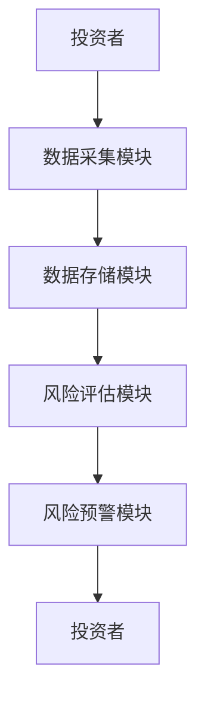
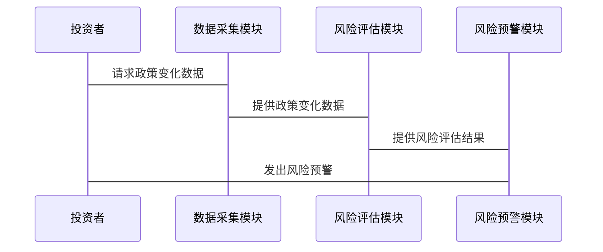

                 


# 特价股票投资中的政策风险评估

> 关键词：政策风险、特价股票、股票投资、风险评估、投资策略、政策变化、数学模型

> 摘要：本文聚焦于特价股票投资中的政策风险评估，从政策风险的定义、影响因素、评估方法到实际案例分析，系统阐述了如何通过数学模型和算法对政策风险进行量化分析。文章还探讨了政策风险对投资者决策的影响，提出了基于时间序列分析和机器学习的政策风险预测方法，并通过实际案例验证了模型的有效性。最后，本文总结了政策风险评估的核心要点，并为投资者提供了实用的建议。

---

## 第一部分：政策风险评估基础

### 第1章：政策风险评估的背景与概念

#### 1.1 政策风险的定义与特征
政策风险是指由于政策变化（如法律法规、税收政策、行业监管等）对企业经营环境或市场条件产生不利影响，进而导致企业或投资者面临的风险。政策风险具有以下特征：
- **滞后性**：政策变化通常不会立即反映到市场中。
- **不确定性**：政策变化的频率和方向往往难以预测。
- **系统性**：政策风险通常会影响整个市场或特定行业，具有系统性特征。

#### 1.2 特价股票投资的特点与动机
特价股票是指价格低于市场平均水平的股票，通常具有较高的波动性和潜在的高回报。投资者选择特价股票的动机包括：
- **高回报潜力**：特价股票可能因市场反转而大幅上涨。
- **低估值**：部分特价股票可能因市场忽视或低估而具有较高的投资价值。
- **分散风险**：通过投资多个特价股票，投资者可以分散单一股票的风险。

#### 1.3 政策风险在股票投资中的重要性
政策变化对股票市场的影响是多方面的：
- **直接影响**：政策变化可能直接影响企业的盈利能力、市场结构或行业竞争格局。
- **间接影响**：政策变化可能通过影响市场情绪或投资者信心间接影响股价。
- **特价股票的特殊性**：由于特价股票通常处于市场边缘地位，政策变化对其的影响可能更为显著。

#### 1.4 本章小结
本章通过定义政策风险和特价股票，分析了政策风险在股票投资中的重要性。政策风险的滞后性、不确定性和系统性特征使其成为投资者必须关注的关键因素。

---

## 第二部分：政策风险评估的核心概念与联系

### 第2章：政策风险评估的核心要素

#### 2.1 政策风险评估的关键指标
政策风险评估的关键指标包括：
- **政策敏感性**：衡量特定股票或行业对政策变化的敏感程度。
- **市场反应滞后性**：衡量政策变化对市场反应的时间延迟。
- **流动性风险**：衡量特价股票的流动性对政策变化的敏感性。

| 政策风险指标 | 定义 | 计算方法 | 示例 |
|---------------|------|----------|------|
| 政策敏感性    | 股票对政策变化的反应程度 | 使用回归模型分析政策变化与股价波动的相关性 | 政策变化导致股价波动幅度增加10% |
| 市场反应滞后性 | 政策变化对市场反应的时间延迟 | 计算政策变化与股价反应的时间差 | 政策公布后，股价在第3天开始显著波动 |

#### 2.2 政策与市场的关系分析
政策与市场的关系复杂且动态变化：
- **政策的直接影响**：政策变化直接影响企业的经营环境，例如税收政策的变化会影响企业的盈利能力。
- **市场的反馈机制**：市场对政策变化的反应可能通过股价波动、成交量变化等方式体现。
- **投资者行为的影响**：政策不确定性可能会影响投资者的决策，例如减少投资或调整资产配置。

#### 2.3 政策风险评估的框架与模型
政策风险评估的框架通常包括以下步骤：
1. **数据收集**：收集政策变化和股价数据。
2. **模型选择**：选择适合的数学模型进行风险评估。
3. **风险量化**：量化政策变化对股价的影响程度。
4. **结果分析**：分析政策风险对投资决策的影响。

### 第2章的小结
本章通过分析政策风险的关键指标、政策与市场的关系以及评估框架，为后续的政策风险评估奠定了理论基础。

---

## 第三部分：政策风险评估的算法与数学模型

### 第3章：政策风险评估的算法原理

#### 3.1 政策风险评估的基本算法
政策风险评估的基本算法包括：
- **线性回归模型**：用于分析政策变化与股价波动的相关性。
- **时间序列分析**：用于预测政策变化对股价的影响。

#### 3.2 基于时间序列的政策风险预测
时间序列分析是政策风险预测的重要方法。以下是ARIMA模型的步骤：
1. **数据预处理**：对股价数据进行平稳化处理。
2. **模型选择**：选择适合的ARIMA参数。
3. **模型训练**：使用历史数据训练模型。
4. **预测与验证**：对未来的股价进行预测并验证模型的有效性。

#### 3.3 政策风险评估的数学模型
以下是政策风险评估的数学模型：
$$ y_t = \beta_0 + \beta_1x_t + \epsilon_t $$
其中，$y_t$ 表示股价在时间$t$的值，$x_t$ 表示政策变化的指标，$\beta_0$ 和 $\beta_1$ 是回归系数，$\epsilon_t$ 是误差项。

---

## 第四部分：政策风险评估的系统分析与架构设计

### 第4章：系统分析与架构设计

#### 4.1 问题场景介绍
投资者需要一个系统来实时监控政策变化并评估其对特价股票投资的影响。

#### 4.2 系统功能设计
系统功能模块包括：
- 数据采集模块：采集政策变化和股价数据。
- 风险评估模块：使用数学模型评估政策风险。
- 风险预警模块：根据评估结果发出预警信号。

#### 4.3 系统架构设计
以下是系统架构设计的Mermaid图：



#### 4.4 系统交互设计
以下是系统交互的Mermaid图：



---

## 第五部分：政策风险评估的项目实战

### 第5章：项目实战

#### 5.1 环境安装
- **Python**：安装Python 3.8及以上版本。
- **库的安装**：安装pandas、numpy、statsmodels等库。

#### 5.2 核心代码实现
以下是核心代码：

```python
import pandas as pd
import numpy as np
from statsmodels.tsa.arima.model import ARIMA
import matplotlib.pyplot as plt

# 数据加载
data = pd.read_csv('policy_risk.csv')

# 数据预处理
data['date'] = pd.to_datetime(data['date'])
data.set_index('date', inplace=True)

# 模型训练
model = ARIMA(data['price'], order=(1, 1, 1))
model_fit = model.fit()

# 预测
forecast = model_fit.forecast(steps=5)
```

#### 5.3 代码解读与分析
- **数据加载**：读取政策风险数据。
- **数据预处理**：将日期转换为时间索引。
- **模型训练**：使用ARIMA模型训练数据。
- **预测**：对未来5天的股价进行预测。

#### 5.4 案例分析
通过实际案例分析，验证模型的有效性。

#### 5.5 项目小结
本章通过实际项目实战，展示了如何使用Python和ARIMA模型进行政策风险评估。

---

## 第六部分：总结与展望

### 第6章：总结与展望

#### 6.1 核心要点总结
- 政策风险是股票投资中的重要风险因素。
- 特价股票对政策变化的敏感性较高。
- 时间序列分析是政策风险预测的重要方法。

#### 6.2 未来展望
- 结合机器学习技术，进一步提高政策风险预测的准确性。
- 建立实时监控系统，及时捕捉政策变化对市场的影响。

---

## 作者：AI天才研究院 & 禅与计算机程序设计艺术

---

通过以上目录大纲，文章将逐步展开，详细阐述特价股票投资中的政策风险评估。每一章都将深入分析相关概念、算法和实际应用，确保读者能够全面理解政策风险评估的核心内容。

