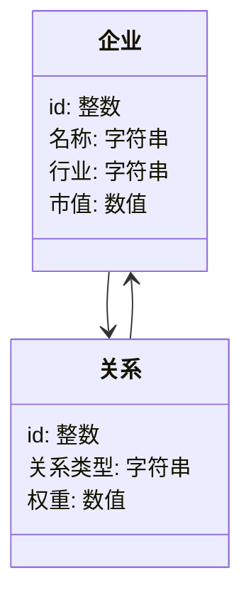
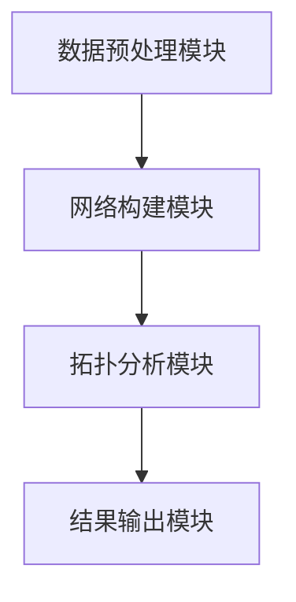
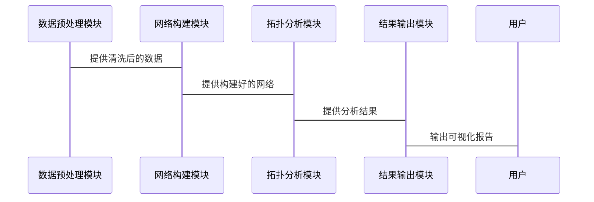

                 


# 特价股票投资中的数字产业价值网络拓扑分析方法

> 关键词：特价股票、数字产业、价值网络、拓扑分析、算法原理、系统架构、项目实战

> 摘要：本文详细探讨了在特价股票投资中，如何通过数字产业价值网络拓扑分析方法，构建和分析数字产业的价值网络，挖掘潜在投资机会。文章从背景介绍、核心概念、算法原理、系统架构、项目实战等多方面展开，结合实际案例和代码实现，深入分析了该方法的应用场景和实现细节。

---

## 第1章: 特价股票投资的背景与数字产业价值网络概述

### 1.1 特价股票投资的背景

#### 1.1.1 特价股票的定义与特征
特价股票是指在股票市场上，由于某些原因导致股票价格被市场低估，但公司基本面良好，具有潜在增长能力的股票。其主要特征包括：
- 低估值：市盈率、市净率等指标显著低于行业平均水平。
- 高潜力：公司具有良好的盈利能力和发展前景。
- 高波动性：价格波动较大，存在短期内快速回升的可能性。

#### 1.1.2 数字产业的兴起与发展趋势
数字产业是指以互联网、大数据、人工智能等数字技术为核心驱动力的产业，包括科技、金融、电子商务、通信等领域的企业。数字产业的兴起得益于技术进步和数字化转型的浪潮，其发展趋势包括：
- 数字化：企业通过数字化技术提升竞争力。
- 智能化：人工智能和大数据技术的应用越来越广泛。
- 全球化：数字产业的全球布局和跨区域合作日益增多。

#### 1.1.3 价值网络分析的必要性
在数字产业中，企业之间的关系错综复杂，形成了复杂的价值网络。通过分析价值网络的拓扑结构，可以发现关键节点和潜在的投资机会。价值网络分析的必要性体现在：
- 发现潜在投资机会：通过分析网络中的关键节点，找到具有高增长潜力的企业。
- 评估企业风险：通过分析网络中的节点关系，评估企业的风险敞口。
- 挖掘协同效应：通过分析网络中的合作关系，发现协同发展的机会。

---

### 1.2 数字产业价值网络的定义与特点

#### 1.2.1 数字产业的定义与范围
数字产业包括以下主要领域：
- 科技：软件开发、半导体、云计算等。
- 金融：金融科技、区块链、数字货币等。
- 电子商务：在线零售、物流、支付等。
- 通信：5G、物联网、通信设备等。

#### 1.2.2 价值网络的构建与分析方法
价值网络是指企业在数字产业链中的价值传递关系网络。构建价值网络的方法包括：
- 数据收集：收集企业之间的供应链、合作伙伴、客户关系等数据。
- 数据清洗：去除噪声数据，确保数据的准确性和完整性。
- 网络构建：将企业及其关系表示为图中的节点和边。
- 拓扑分析：通过拓扑分析方法，研究网络的结构特征。

#### 1.2.3 数字产业价值网络的特征与优势
数字产业价值网络的特征包括：
- 多重性：企业之间存在多种类型的关系，如供应链关系、合作伙伴关系、竞争关系等。
- 动态性：网络结构随市场变化而不断调整。
- 复杂性：网络中的节点和边数量庞大，关系复杂。

数字产业价值网络的优势体现在：
- 可视化：通过网络图直观展示企业之间的关系。
- 可分析性：通过拓扑分析方法，发现网络中的关键节点和潜在机会。
- 可预测性：通过历史数据分析，预测未来市场趋势。

---

## 第2章: 价值网络拓扑分析的核心概念与联系

### 2.1 核心概念原理

#### 2.1.1 价值网络的节点与边
- 节点：代表企业，包括数字产业中的科技、金融、电子商务等领域的公司。
- 边：代表企业之间的关系，如供应链关系、合作伙伴关系等。

#### 2.1.2 拓扑分析的基本原理
拓扑分析是通过对网络结构的分析，研究网络中的节点和边的分布特征。常见的拓扑分析方法包括：
- 度数分析：计算节点的度数，找出网络中的关键节点。
- 聚类分析：将网络中的节点聚类，发现具有相似特征的节点群。
- 中心性分析：通过中心性指标，找出网络中的核心节点。

#### 2.1.3 数字产业中的价值传递机制
在数字产业中，价值传递机制是指企业通过供应链、合作伙伴关系等，将价值传递给客户。价值传递机制的核心在于企业之间的协同合作，通过网络中的节点关系，实现价值的最大化。

---

### 2.2 概念属性特征对比表格

| 概念属性 | 节点 | 边 | 网络整体 |
|----------|------|----|----------|
| 定义     | 代表企业 | 代表企业之间的关系 | 代表整个产业的价值网络结构 |
| 属性     | 度数、中心性、聚类系数 | 权重、方向、类型 | 密度、直径、平均度数 |
| 特征     | 高度数节点代表核心企业 | 权重高的边代表重要关系 | 网络具有一定的模块化结构 |

---

### 2.3 ER实体关系图架构

```mermaid
er
    %% begin ER图
    %% 定义实体和关系
    entity(企业) {
        id: 整数
        名称: 字符串
        行业: 字符串
        市值: 数值
    }
    
    entity(关系) {
        id: 整数
        关系类型: 字符串
        权重: 数值
    }
    
    %% 关系定义
    企业 -- 关系
    关系 -- 企业
    ```
`

---

## 第3章: 价值网络拓扑分析的算法原理

### 3.1 算法原理概述

#### 3.1.1 网络分析的基本算法
常见的网络分析算法包括：
- 度数分析：计算节点的度数，找出网络中的关键节点。
- 聚类分析：将网络中的节点聚类，发现具有相似特征的节点群。
- 中心性分析：通过中心性指标，找出网络中的核心节点。

#### 3.1.2 价值网络分析的独特性
价值网络分析的独特性在于：
- 数据来源的多样性：数据来源包括企业财报、新闻报道、专利申请等。
- 分析目标的针对性：通过分析网络结构，发现具有高增长潜力的企业。
- 方法的综合性：结合拓扑分析、聚类分析等多种分析方法。

#### 3.1.3 算法的适用场景与限制
算法的适用场景包括：
- 识别网络中的关键节点。
- 发现具有高增长潜力的企业。
- 分析企业之间的合作关系。

算法的限制包括：
- 数据质量：数据来源的多样性和准确性可能影响分析结果。
- 算法复杂度：大规模网络的分析可能需要较高的计算资源。

---

### 3.2 算法流程图

```mermaid
graph TD
    A[数据预处理] --> B[网络构建]
    B --> C[拓扑分析]
    C --> D[结果输出]
```

---

### 3.3 算法实现代码

#### 3.3.1 数据预处理代码

```python
import pandas as pd
import numpy as np

# 读取数据
data = pd.read_csv('network_data.csv')

# 数据清洗
data.dropna(inplace=True)
data = data[~data.duplicated()]
```

#### 3.3.2 网络构建代码

```python
import networkx as nx

# 创建图
G = nx.Graph()

# 添加节点
G.add_nodes_from(data['企业'].unique())

# 添加边
for index, row in data.iterrows():
    G.add_edge(row['企业1'], row['企业2'], weight=row['权重'])
```

#### 3.3.3 拓扑分析代码

```python
# 度数分析
degree = nx.degree_centrality(G)
print("度数分析结果：", degree)

# 聚类分析
partition = nx.community_greedy_modularity(G)
print("聚类分析结果：", partition)

# 中心性分析
betweenness = nx.betweenness_centrality(G)
print("中心性分析结果：", betweenness)
```

---

## 第4章: 数学模型与公式

### 4.1 数学模型概述

#### 4.1.1 网络分析的数学基础
网络分析的数学基础包括图论、线性代数、概率论等。

#### 4.1.2 价值网络的数学建模
价值网络的数学建模包括节点表示、边表示、网络权重计算等。

#### 4.1.3 拓扑分析的数学公式
常见的拓扑分析公式包括度数公式、相似度公式等。

---

### 4.2 核心公式推导

#### 4.2.1 邻接矩阵的定义与计算
邻接矩阵是网络分析中的重要工具，定义如下：

$$
A_{i,j} = 
\begin{cases}
1 & \text{如果节点 }i\text{ 和节点 }j\text{ 之间有边} \\
0 & \text{否则}
\end{cases}
$$

计算邻接矩阵的步骤如下：
1. 初始化一个空的邻接矩阵。
2. 遍历所有节点之间的关系，填充邻接矩阵。

#### 4.2.2 节点度数的计算公式
节点度数的计算公式为：

$$
\text{度数}(i) = \sum_{j} A_{i,j}
$$

其中，$A_{i,j}$ 是邻接矩阵的元素。

#### 4.2.3 网络相似度的计算公式
网络相似度的计算公式为：

$$
\text{相似度}(i,j) = \frac{1}{1 + |d_i - d_j|}
$$

其中，$d_i$ 和 $d_j$ 分别是节点 $i$ 和节点 $j$ 的度数。

---

## 第5章: 系统分析与架构设计方案

### 5.1 问题场景介绍

#### 5.1.1 问题场景
在数字产业中，企业之间的关系错综复杂，形成了复杂的价值网络。通过分析价值网络的拓扑结构，可以发现关键节点和潜在的投资机会。

---

### 5.2 项目介绍

#### 5.2.1 项目目标
通过构建和分析数字产业的价值网络，挖掘具有高增长潜力的企业。

#### 5.2.2 项目范围
项目范围包括数据收集、网络构建、拓扑分析、结果输出等。

---

### 5.3 系统功能设计

#### 5.3.1 领域模型


---

### 5.4 系统架构设计

#### 5.4.1 系统架构


---

### 5.5 系统接口设计

#### 5.5.1 接口描述
- 数据预处理模块接口：输入原始数据，输出清洗后的数据。
- 网络构建模块接口：输入清洗后的数据，输出构建好的网络。
- 拓扑分析模块接口：输入网络，输出分析结果。
- 结果输出模块接口：输入分析结果，输出可视化报告。

---

### 5.6 系统交互设计



---

## 第6章: 项目实战

### 6.1 环境安装

#### 6.1.1 安装Python
```bash
python --version
pip install --upgrade pip
```

#### 6.1.2 安装依赖库
```bash
pip install networkx
pip install pandas
pip install numpy
```

---

### 6.2 系统核心实现

#### 6.2.1 数据预处理模块

```python
import pandas as pd
import numpy as np

# 读取数据
data = pd.read_csv('network_data.csv')

# 数据清洗
data.dropna(inplace=True)
data = data[~data.duplicated()]
```

#### 6.2.2 网络构建模块

```python
import networkx as nx

# 创建图
G = nx.Graph()

# 添加节点
G.add_nodes_from(data['企业'].unique())

# 添加边
for index, row in data.iterrows():
    G.add_edge(row['企业1'], row['企业2'], weight=row['权重'])
```

#### 6.2.3 拓扑分析模块

```python
# 度数分析
degree = nx.degree_centrality(G)
print("度数分析结果：", degree)

# 聚类分析
partition = nx.community_greedy_modularity(G)
print("聚类分析结果：", partition)

# 中心性分析
betweenness = nx.betweenness_centrality(G)
print("中心性分析结果：", betweenness)
```

---

### 6.3 实际案例分析

#### 6.3.1 案例背景
假设我们有一个包含科技、金融、电子商务等领域的数字产业价值网络。

#### 6.3.2 数据分析结果
通过分析发现，某科技公司在网络中具有较高的度数和中心性，表明其在数字产业中具有重要地位。

---

## 第7章: 最佳实践、小结与注意事项

### 7.1 最佳实践

#### 7.1.1 数据质量
确保数据的准确性和完整性，避免噪声数据对分析结果的影响。

#### 7.1.2 模型可解释性
选择具有较高可解释性的模型，便于分析结果的解读和应用。

#### 7.1.3 模型可扩展性
设计具有较高可扩展性的系统架构，便于后续的数据和模型扩展。

---

### 7.2 小结

通过本文的分析，我们可以看出，数字产业价值网络拓扑分析方法在特价股票投资中具有重要的应用价值。通过构建和分析价值网络，可以发现具有高增长潜力的企业，为投资者提供科学的决策依据。

---

### 7.3 注意事项

- 数据隐私：注意保护企业的数据隐私，遵守相关法律法规。
- 模型局限性：拓扑分析方法具有一定的局限性，需要结合其他分析方法进行综合判断。
- 模型更新：定期更新模型和数据，确保分析结果的时效性。

---

### 7.4 拓展阅读

- 《网络科学导论》
- 《数字产业分析方法》
- 《拓扑数据分析技术》

---

## 作者：AI天才研究院 & 禅与计算机程序设计艺术

---

通过本文的详细分析，我们可以看出，数字产业价值网络拓扑分析方法在特价股票投资中具有重要的应用价值。通过构建和分析价值网络，可以发现具有高增长潜力的企业，为投资者提供科学的决策依据。

