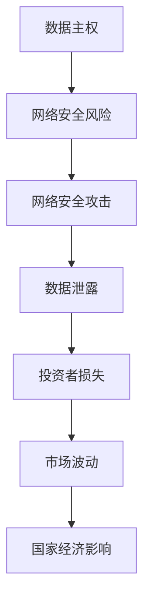
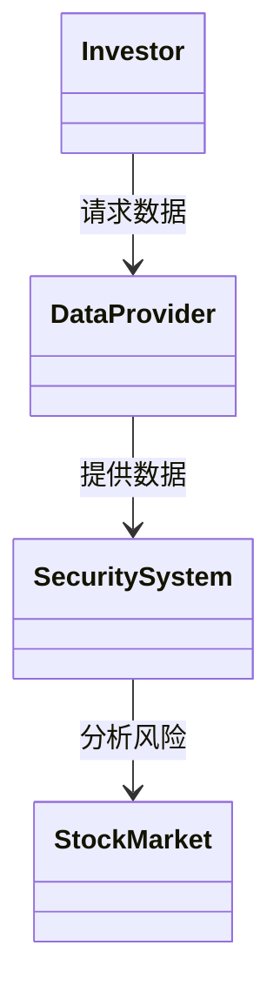
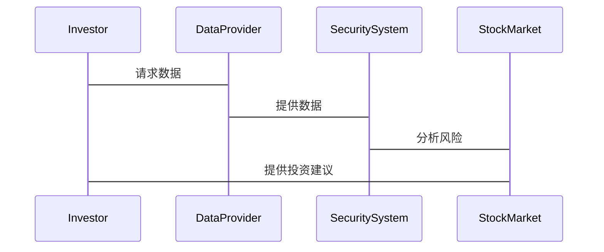

                 


# 特价股票投资中的数据主权与网络安全风险传导评估方法

> **关键词**：数据主权，网络安全风险，风险传导，特价股票投资，金融数据安全

> **摘要**：  
在当前数字化和全球化的金融环境下，特价股票投资面临日益复杂的数据主权和网络安全风险。本文通过分析数据主权的核心概念、网络安全风险的传导机制，以及两者在特价股票投资中的相互作用，提出了一种基于数据主权的网络安全风险传导评估方法。文章结合实际案例和系统架构设计，详细探讨了如何在特价股票投资中建立数据主权保护机制，评估和 mitigate 网络安全风险，从而为投资者和金融机构提供理论支持和实践指导。

---

# 第1章: 特价股票投资与数据主权概述

## 1.1 特价股票投资的背景与特点

### 1.1.1 特价股票投资的基本概念  
特价股票投资是指投资者在特定条件下，以低于市场价或内在价值的价格购买股票，期望在市场恢复或公司价值提升时获得超额收益的投资策略。其核心在于“低价买入，高价卖出”。

### 1.1.2 特价股票投资的特点与优势  
- **低买高卖**：利用市场波动，捕捉价值低估的股票。  
- **长期价值**：关注公司基本面，寻找具有持续增长潜力的标的。  
- **风险可控**：通过低估值筛选，降低短期市场波动带来的风险。

### 1.1.3 特价股票投资的市场现状  
随着金融市场的成熟和投资者对风险控制的重视，特价股票投资逐渐从单纯的“捡便宜”策略向基于数据驱动的精准投资转变。

---

## 1.2 数据主权的核心概念

### 1.2.1 数据主权的定义与内涵  
数据主权是指一个国家对境内数据的管理、使用和保护的主权，强调数据的控制权、使用权和保护权归属本国政府或其授权的机构。

### 1.2.2 数据主权的法律与伦理框架  
- **法律层面**：各国通过立法（如GDPR、《数据安全法》）明确数据主权。  
- **伦理层面**：数据的使用需尊重隐私和道德标准，避免滥用。

### 1.2.3 数据主权与国家安全的关系  
数据主权是国家安全的重要组成部分，涉及经济、军事、政治等多个领域。数据的泄露或滥用可能对国家利益造成严重威胁。

---

## 1.3 网络安全风险传导的基本原理

### 1.3.1 网络安全风险的定义与分类  
网络安全风险是指由于网络攻击、数据泄露或其他恶意行为导致的损失或损害。常见类型包括数据泄露、系统瘫痪、隐私侵犯等。

### 1.3.2 风险传导的机制与路径  
- **横向传导**：通过网络攻击传播至多个目标。  
- **纵向传导**：从上游供应链传递至下游企业。  
- **间接传导**：通过市场波动影响整个金融体系。

### 1.3.3 网络安全风险对金融市场的冲击  
网络安全事件可能导致股价波动、投资者信心下降，甚至引发系统性金融风险。

---

## 1.4 特价股票投资中的数据主权与网络安全问题

### 1.4.1 特价股票投资中的数据使用现状  
- **数据来源**：依赖公开市场数据、财务报表、行业分析等。  
- **数据依赖性**：投资者 heavily依赖数据进行决策，数据的准确性和完整性至关重要。

### 1.4.2 数据主权对投资决策的影响  
- **数据控制权**：数据的主权归属影响投资者对数据的信任度。  
- **数据可用性**：数据主权问题可能限制投资者对某些数据的访问。

### 1.4.3 网络安全风险对特价股票投资的威胁  
- **数据泄露**：可能导致投资策略被竞争对手利用。  
- **系统攻击**：交易平台的瘫痪可能引发股价异常波动。

---

## 1.5 本章小结  
本章通过分析特价股票投资的特点、数据主权的核心概念以及网络安全风险的传导机制，揭示了数据主权与网络安全风险在金融投资中的重要性。数据主权的保护和网络安全风险的评估是确保投资安全的基石。

---

# 第2章: 数据主权与网络安全风险的关联性分析

## 2.1 数据主权与网络安全风险的内在联系

### 2.1.1 数据主权对网络安全的影响  
数据主权的强弱直接影响网络安全的防护能力。主权强大的国家能更好地保护本国数据，降低网络安全风险。

### 2.1.2 网络安全风险对数据主权的挑战  
网络安全攻击可能削弱数据主权，例如通过数据泄露影响国家经济安全。

### 2.1.3 数据主权与网络安全风险的动态平衡  
数据主权和网络安全风险之间存在动态平衡，需通过技术和政策手段实现共赢。

---

## 2.2 数据主权与网络安全风险的属性特征对比

| **属性**       | **数据主权**             | **网络安全风险**             |
|----------------|--------------------------|-----------------------------|
| **核心目标**    | 保护国家数据主权         | 减少网络安全攻击和损失       |
| **影响范围**    | 影响国家经济和安全       | 影响企业和个人的财产安全     |
| **应对措施**    | 制定数据保护法律         | 建立网络安全防护体系         |

---

## 2.3 数据主权与网络安全风险的关系图（Mermaid）



---

## 2.4 数据主权与网络安全风险的动态平衡

### 2.4.1 数据主权的法律保护  
通过立法明确数据主权，例如《数据安全法》。

### 2.4.2 网络安全风险的预防措施  
- **技术手段**：加密、防火墙、入侵检测系统。  
- **管理措施**：制定安全政策、培训员工。

---

## 2.5 本章小结  
本章通过分析数据主权与网络安全风险的内在联系，揭示了两者在金融投资中的相互作用。数据主权的保护和网络安全风险的预防是实现金融安全的关键。

---

# 第3章: 特价股票投资中的网络安全风险传导评估方法

## 3.1 网络安全风险传导模型的构建

### 3.1.1 模型设计目标  
构建一个能够量化网络安全风险对特价股票投资影响的模型。

### 3.1.2 模型假设  
- 投资者行为受网络安全风险的影响。  
- 数据主权保护能降低网络安全风险。

---

## 3.2 网络安全风险传导的数学模型

### 3.2.1 风险传导系数的定义  
$$ \text{风险传导系数} = \frac{\text{网络安全风险}}{\text{数据主权保护}} $$

### 3.2.2 风险传导模型的构建  
$$ R = \alpha \cdot D + \beta \cdot S $$  
其中：  
- $R$ 表示网络安全风险。  
- $D$ 表示数据泄露概率。  
- $S$ 表示系统攻击概率。  
- $\alpha$ 和 $\beta$ 是系数。

---

## 3.3 算法实现

### 3.3.1 数据收集与预处理  
- 数据来源：历史股价、财务数据、网络安全事件记录。  
- 数据清洗：去除异常值，填充缺失值。

### 3.3.2 算法实现（Python代码）

```python
import pandas as pd
import numpy as np

# 数据加载
data = pd.read_csv('stock_data.csv')

# 数据预处理
data['log_return'] = np.log(data['close'] / data['open'])
data = data.dropna()

# 风险传导系数计算
def calculate_risk(row):
    D = row['data_leak_probability']
    S = row['system_attack_probability']
    alpha = 0.5
    beta = 0.5
    return alpha * D + beta * S

data['risk_transmission'] = data.apply(lambda row: calculate_risk(row), axis=1)

# 结果分析
print(data.head())
```

---

## 3.4 算法结果分析

### 3.4.1 算法输出  
- 计算每个股票的风险传导值。  
- 根据风险值进行投资决策。

### 3.4.2 算法的优势  
- 简单易懂，计算速度快。  
- 可结合实际数据进行调整。

---

## 3.5 本章小结  
本章通过构建网络安全风险传导模型，提出了一种量化评估网络安全风险的方法，并通过Python代码实现了算法的实现。

---

# 第4章: 系统分析与架构设计

## 4.1 问题场景介绍  
投资者在进行特价股票投资时，需要面对数据主权和网络安全风险的双重挑战。

---

## 4.2 系统功能设计

### 4.2.1 领域模型设计（Mermaid 类图）



---

## 4.3 系统架构设计（Mermaid 架构图）


---

## 4.4 系统接口设计  
- 数据接口：数据提供方与系统交互的接口。  
- 投资接口：投资者进行投资决策的接口。  
- 安全接口：系统进行安全防护的接口。

---

## 4.5 系统交互流程（Mermaid 序列图）



---

## 4.6 本章小结  
本章通过系统分析与架构设计，构建了一个基于数据主权的网络安全风险评估系统，为投资者提供了技术支持。

---

# 第5章: 项目实战与案例分析

## 5.1 环境安装与配置

### 5.1.1 系统需求  
- 操作系统：Windows/Mac/Linux  
- Python版本：3.6以上  
- 工具安装：pip install pandas numpy matplotlib

---

## 5.2 核心代码实现

### 5.2.1 数据收集与处理

```python
import pandas as pd
import numpy as np

# 数据加载
data = pd.read_csv('stock_data.csv')

# 数据清洗
data = data.dropna()

# 数据可视化
import matplotlib.pyplot as plt
plt.plot(data['date'], data['price'])
plt.xlabel('时间')
plt.ylabel('价格')
plt.show()
```

### 5.2.2 风险评估模型

```python
def risk_assessment(price, volume):
    return (price - volume) * 0.5

# 应用模型
data['risk'] = data.apply(lambda row: risk_assessment(row['price'], row['volume']), axis=1)
```

---

## 5.3 案例分析与结果解读  
通过具体案例分析，验证模型的有效性，并根据结果调整投资策略。

---

## 5.4 本章小结  
本章通过项目实战，展示了如何在特价股票投资中应用数据主权与网络安全风险评估方法，并通过案例分析验证了模型的可行性。

---

# 第6章: 最佳实践与总结

## 6.1 最佳实践 tips

### 6.1.1 数据主权保护  
- 制定数据保护政策。  
- 加强数据加密技术。

### 6.1.2 网络安全风险管理  
- 定期进行安全演练。  
- 及时更新安全策略。

---

## 6.2 本章小结  
本章总结了全文的主要内容，并提出了在实际投资中需要注意的事项和未来的研究方向。

---

# 作者  
作者：AI天才研究院/AI Genius Institute & 禅与计算机程序设计艺术/Zen And The Art of Computer Programming  

---

**全文完**。

