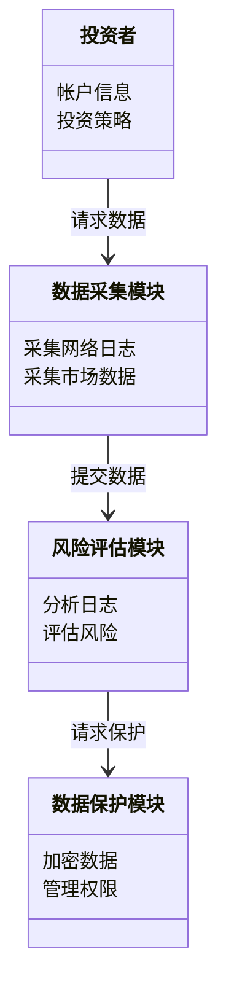

                 


# 特价股票投资中的数据主权与网络安全风险动态评估方法

> **关键词**：特价股票投资，数据主权，网络安全风险，动态评估，人工智能算法

> **摘要**：  
> 在当前金融市场的高度数字化背景下，特价股票投资因其高风险和高回报的特点，吸引了大量投资者的关注。然而，随之而来的是数据主权和网络安全风险的双重挑战。本文从数据主权和网络安全风险的动态评估方法入手，结合实际案例，详细探讨如何在特价股票投资中构建高效的安全评估体系。通过分析数据主权的核心概念、网络安全风险的动态评估算法，以及系统架构设计，本文为投资者提供了在数字化时代下保障数据安全和降低投资风险的有效策略。

---

## 第一部分: 特价股票投资中的数据主权与网络安全风险动态评估概述

### 第1章: 特价股票投资的背景与现状

#### 1.1 特价股票投资的定义与特点

##### 1.1.1 特价股票的定义
特价股票是指在市场波动、公司业绩不佳或其他特殊情况下，价格被低估的股票。投资者通常利用市场短期波动，以较低的价格买入股票，期望在价格回升时卖出获利。

##### 1.1.2 特价股票投资的特点
- **高波动性**：特价股票的价格波动较大，投资者需具备快速反应能力。
- **高风险**：市场波动可能导致重大损失，需要严格的风险控制。
- **高收益潜力**：潜在的高回报是吸引投资者的主要原因。

##### 1.1.3 特价股票投资的市场现状
当前市场中，特价股票投资逐渐从传统的人工分析向数字化、智能化方向转型。投资者利用大数据和人工智能技术，试图从海量数据中挖掘潜在的投资机会。

---

#### 1.2 数据主权与网络安全的重要性

##### 1.2.1 数据主权的定义与核心要素
数据主权是指数据的拥有者对其数据具有完全的控制权和使用权。核心要素包括：
- 数据所有权：数据的合法拥有者。
- 数据存储权：数据存储的地理位置和方式。
- 数据访问权：数据的访问权限和授权。
- 数据保护权：数据的安全性和隐私保护。

##### 1.2.2 网络安全风险的定义与分类
网络安全风险是指由于网络攻击、数据泄露或其他安全事件，导致数据损坏、泄露或系统崩溃的风险。常见的网络安全风险分类包括：
- **外部攻击风险**：如黑客攻击、钓鱼攻击。
- **内部操作风险**：如员工误操作或恶意泄密。
- **技术漏洞风险**：如系统漏洞、软件缺陷。

##### 1.2.3 特价股票投资中数据主权与网络安全的关系
在特价股票投资中，投资者依赖数据进行决策，因此数据的完整性和安全性至关重要。数据主权的保护能够防止数据被未经授权的第三方获取，而网络安全风险的控制则能够降低数据泄露和系统崩溃的风险。

---

### 第2章: 数据主权与网络安全风险动态评估的核心概念

#### 2.1 数据主权与网络安全风险动态评估的定义

##### 2.1.1 数据主权的核心概念
数据主权不仅仅是数据的拥有权，还包括数据的使用权、存储权和保护权。在特价股票投资中，数据主权的保护能够确保投资者的交易数据和策略不被泄露。

##### 2.1.2 网络安全风险动态评估的定义
网络安全风险动态评估是指通过对实时数据的分析，动态识别和评估网络安全风险的过程。该方法能够根据市场波动和攻击行为的变化，实时调整安全策略。

##### 2.1.3 两者结合的必要性
在特价股票投资中，数据主权和网络安全风险动态评估是相辅相成的。数据主权保护了投资者的隐私和数据安全，而网络安全风险动态评估则能够及时发现和应对潜在的安全威胁。

---

#### 2.2 核心概念的属性特征对比

##### 2.2.1 数据主权的属性特征
- **独立性**：数据主权不依赖于物理位置，只要有合法的授权即可。
- **动态性**：数据主权需要根据市场环境和法律法规的变化进行调整。
- **隐私性**：数据主权的核心是保护数据的隐私和安全。

##### 2.2.2 网络安全风险的属性特征
- **实时性**：网络安全风险需要实时监控和评估。
- **多样性**：网络安全风险来源多样，包括外部攻击和内部操作。
- **可变性**：网络安全风险会随着技术和攻击手段的变化而变化。

##### 2.2.3 对比分析与表格展示
| 属性 | 数据主权 | 网络安全风险 |
|------|----------|--------------|
| 核心目标 | 保护数据的所有权和隐私 | 降低数据泄露和系统崩溃风险 |
| 动态性 | 需要根据环境变化调整 | 需要实时监控和评估 |
| 技术手段 | 数据加密、访问控制 | 防火墙、入侵检测系统 |

---

#### 2.3 数据主权与网络安全风险的ER实体关系图

```mermaid
erDiagram
    actor 投资者 {
        <属性> 帐户信息
        <属性> 投资策略
    }
    actor 黑客 {
        <属性> 攻击工具
        <属性> 攻击目标
    }
    entity 数据 {
        <属性> 数据类型
        <属性> 数据存储位置
    }
    entity 风险评估系统 {
        <属性> 评估模型
        <属性> 评估结果
    }
    投资者 --> 数据 : 访问
    投资者 --> 风险评估系统 : 请求评估
    黑客 --> 数据 : 攻击
    黑客 --> 风险评估系统 : 发起攻击
    风险评估系统 --> 数据 : 保护
```

---

## 第二部分: 数据主权与网络安全风险动态评估的算法原理

### 第3章: 网络安全风险评估的算法原理

#### 3.1 网络安全风险评估的定义与目标

##### 3.1.1 定义与范围
网络安全风险评估是指对网络系统可能面临的安全威胁和漏洞进行识别、分析和评估的过程。其范围包括网络设备、数据存储和传输等多个方面。

##### 3.1.2 评估目标与意义
- **目标**：识别潜在的安全威胁，评估其影响和可能性。
- **意义**：通过评估，制定有效的安全策略，降低网络安全风险。

---

#### 3.2 网络安全风险评估的算法流程

##### 3.2.1 数据收集与预处理
- **数据收集**：收集网络日志、系统漏洞、攻击记录等数据。
- **数据预处理**：清洗数据，去除噪声，提取特征。

##### 3.2.2 风险评估模型的构建
- **模型选择**：基于机器学习的分类算法（如随机森林、支持向量机）。
- **特征选择**：提取关键特征，如攻击来源、攻击类型等。

##### 3.2.3 风险评分与排序
- **风险评分**：根据模型预测结果，对每个潜在风险进行评分。
- **风险排序**：按照评分高低排序，优先处理高风险事件。

---

#### 3.3 算法实现的数学模型与公式

##### 3.3.1 数据预处理公式
$$
\text{标准化公式}：Z = \frac{X - \mu}{\sigma}
$$
其中，$X$ 是原始数据，$\mu$ 是均值，$\sigma$ 是标准差。

##### 3.3.2 风险评估模型的数学表达
使用逻辑回归模型：
$$
P(Y=1|X) = \frac{1}{1 + e^{-(\beta_0 + \beta_1 X)}}
$$
其中，$Y$ 是目标变量（1表示高风险，0表示低风险），$X$ 是特征向量，$\beta$ 是回归系数。

---

#### 3.4 代码实现与解读

##### 3.4.1 环境安装
```bash
pip install scikit-learn
```

##### 3.4.2 核心代码实现
```python
import pandas as pd
from sklearn.model_selection import train_test_split
from sklearn.linear_model import LogisticRegression
from sklearn.metrics import accuracy_score

# 数据加载与预处理
data = pd.read_csv('network_risk.csv')
X = data.drop('label', axis=1)
y = data['label']

# 数据分割
X_train, X_test, y_train, y_test = train_test_split(X, y, test_size=0.2)

# 模型训练
model = LogisticRegression()
model.fit(X_train, y_train)

# 模型预测
y_pred = model.predict(X_test)

# 模型评估
print("准确率：", accuracy_score(y_test, y_pred))
```

---

#### 3.5 动态评估与实时监控

##### 3.5.1 动态评估的必要性
网络安全威胁是动态变化的，需要实时监控和评估。

##### 3.5.2 实时监控的实现
使用流数据处理技术（如Apache Kafka）实时采集网络日志，结合模型进行实时风险评估。

---

### 第4章: 数据主权保护的算法实现

#### 4.1 数据主权保护的核心算法

##### 4.1.1 数据加密算法
- **加密方法**：使用AES加密算法对数据进行加密。
- **密钥管理**：采用密钥分发中心（KDC）进行密钥管理。

##### 4.1.2 数据访问控制算法
- **访问控制模型**：基于角色的访问控制（RBAC）。
- **权限管理**：动态调整用户的访问权限。

---

#### 4.2 数据主权保护的代码实现

##### 4.2.1 环境安装
```bash
pip install cryptography
```

##### 4.2.2 核心代码实现
```python
from cryptography.hazmat.primitives import hashes
from cryptography.hazmat.primitives.asymmetric import padding
from cryptography.hazmat.primitives.asymmetric.rsa import (
    generate_private_key,
    PublicKey,
)

# 生成密钥对
private_key = generate_private_key(65537, 64)
public_key = private_key.public_key()

# 加密数据
def encrypt_data(data, public_key):
    encrypted_data = public_key.encrypt(
        data.encode(),
        padding.OAEP(
            mgf=padding.MGF1(salt_length=8),
            algorithm=hashes.SHA256()
        )
    )
    return encrypted_data

# 解密数据
def decrypt_data(ciphertext, private_key):
    plaintext = private_key.decrypt(ciphertext)
    return plaintext.decode()

# 示例
data = "Sensitive Investment Strategy"
encrypted = encrypt_data(data, public_key)
decrypted = decrypt_data(encrypted, private_key)
print("加密数据：", encrypted)
print("解密数据：", decrypted)
```

---

## 第三部分: 系统架构设计与项目实战

### 第5章: 系统架构设计

#### 5.1 项目介绍
本项目旨在构建一个基于数据主权保护和网络安全风险动态评估的特价股票投资系统。

---

#### 5.2 系统功能设计

##### 5.2.1 功能模块划分
- **数据采集模块**：实时采集市场数据和网络日志。
- **风险评估模块**：动态评估网络安全风险。
- **数据保护模块**：保障数据主权。
- **用户界面模块**：提供用户友好的操作界面。

##### 5.2.2 领域模型Mermaid类图


---

#### 5.3 系统架构设计Mermaid架构图


---

### 第6章: 项目实战

#### 6.1 环境安装与配置

##### 6.1.1 环境安装
```bash
pip install flask scikit-learn cryptography
```

##### 6.1.2 数据库配置
使用MySQL或MongoDB存储投资数据和日志。

---

#### 6.2 核心代码实现

##### 6.2.1 投资者数据保护模块
```python
from flask import Flask
from cryptography.hazmat.primitives import hashes
from cryptography.hazmat.primitives.asymmetric import padding

app = Flask(__name__)

@app.route('/protect_data', methods=['POST'])
def protect_data():
    data = request.json['data']
    # 加密数据
    encrypted_data = encrypt_data(data)
    return jsonify({'status': 'success', 'message': '数据已加密'})

if __name__ == '__main__':
    app.run(debug=True)
```

##### 6.2.2 风险评估模块
```python
from sklearn.ensemble import RandomForestClassifier
import pandas as pd

# 加载数据
data = pd.read_csv('risk_data.csv')
X = data.drop('label', axis=1)
y = data['label']

# 训练模型
model = RandomForestClassifier()
model.fit(X, y)

# 预测风险
def predict_risk(new_data):
    return model.predict(new_data)[0]
```

---

#### 6.3 案例分析与详细解读

##### 6.3.1 案例背景
假设某投资者在市场波动期间，希望利用特价股票投资获利。

##### 6.3.2 数据保护流程
1. 投资者提交投资策略。
2. 数据采集模块采集市场数据和日志。
3. 数据保护模块对数据进行加密。
4. 风险评估模块实时评估网络安全风险。

##### 6.3.3 案例结果
通过系统的保护和评估，投资者的数据得到了有效保护，风险得到了及时预警。

---

## 第四部分: 最佳实践与总结

### 第7章: 最佳实践与小结

#### 7.1 最佳实践

##### 7.1.1 数据主权保护
- 定期备份数据。
- 使用多因素认证（MFA）保护账户。
- 定期更新加密算法。

##### 7.1.2 网络安全风险动态评估
- 定期进行安全演练。
- 及时更新安全策略。
- 监控系统日志。

---

#### 7.2 小结

通过本文的详细讲解，读者可以了解到在特价股票投资中，数据主权和网络安全风险动态评估的重要性。通过合理的技术手段和算法实现，投资者可以在保障数据安全的同时，有效降低投资风险。

---

## 作者信息

作者：AI天才研究院/AI Genius Institute & 禅与计算机程序设计艺术 /Zen And The Art of Computer Programming

