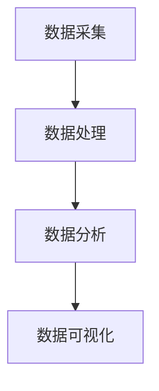

                 


# 特价股票投资中的数据分析和大数据应用

> 关键词：特价股票，数据分析，大数据应用，股票投资，数据挖掘

> 摘要：本文深入探讨了特价股票投资中的数据分析和大数据应用，从背景介绍、核心概念、算法原理到系统架构设计和项目实战，详细分析了如何利用数据分析和大数据技术提升股票投资决策的准确性和效率。通过实际案例分析和详细的技术实现，本文为读者提供了从理论到实践的完整指南。

---

## 第1章：特价股票投资概述

### 1.1 特价股票的定义与特点
#### 1.1.1 特价股票的定义
特价股票通常指价格低于市场平均水平的股票，可能由于公司业绩不佳、市场波动或其他特殊原因导致价格被低估。投资者认为这些股票具有潜在的增值空间，因此成为投资的目标。

#### 1.1.2 特价股票的特点
- **低估值**：市盈率、市净率等指标低于行业平均水平。
- **高波动性**：价格波动较大，可能带来较高的收益或风险。
- **周期性**：通常在市场低迷时出现，投资者需具备耐心和策略。

#### 1.1.3 特价股票与普通股票的区别
| 特性 | 特价股票 | 普通股票 |
|------|----------|----------|
| 价格 | 较低     | 市场水平 |
| 估值 | 低       | 市场水平 |
| 风险 | 较高     | 中等     |
| 机会 | 高       | 一般     |

### 1.2 数据分析在股票投资中的作用
#### 1.2.1 数据分析的基本概念
数据分析是通过对数据的收集、处理和分析，提取有价值的信息，用于支持决策的过程。

#### 1.2.2 数据分析在股票投资中的应用
- **市场趋势分析**：通过历史数据预测未来走势。
- **风险评估**：识别高风险股票，优化投资组合。
- **机会发现**：挖掘被低估的股票，寻找投资机会。

#### 1.2.3 数据分析的优势与挑战
优势：
- 提高决策的科学性。
- 降低人为情绪影响。
- 提升投资效率。

挑战：
- 数据质量差。
- 模型过拟合。
- 市场波动不可预测。

### 1.3 大数据在股票投资中的应用
#### 1.3.1 大数据的基本概念
大数据指数据量大、类型多样、处理速度快的海量数据。

#### 1.3.2 大数据在股票投资中的应用场景
- **实时监控**：利用大数据技术实时分析市场动态。
- **预测模型**：基于大数据构建预测模型，辅助投资决策。
- **风险管理**：通过大数据分析识别潜在风险。

#### 1.3.3 大数据技术对股票投资的影响
- 提高数据处理效率。
- 增强预测准确性。
- 开拓新的投资机会。

### 1.4 本章小结
本章介绍了特价股票的基本概念及其特点，并探讨了数据分析和大数据在股票投资中的重要性。数据分析能够帮助投资者发现市场趋势和投资机会，而大数据技术则提供了更高效的数据处理和分析手段。

---

## 第2章：数据分析的核心概念

### 2.1 数据分析的基本原理
#### 2.1.1 数据分析的定义
数据分析是通过收集、处理和分析数据，提取有价值的信息，用于支持决策的过程。

#### 2.1.2 数据分析的流程
1. 数据采集
2. 数据清洗
3. 数据分析
4. 数据可视化

#### 2.1.3 数据分析的分类
- **描述性分析**：描述数据的基本特征。
- **预测性分析**：预测未来趋势。
- **诊断性分析**：分析问题原因。
- **规范性分析**：提出解决方案。

### 2.2 数据分析的关键技术
#### 2.2.1 数据清洗
- **定义**：识别和处理数据中的错误或异常值。
- **方法**：删除、替换、插值等。

#### 2.2.2 数据特征提取
- **定义**：从数据中提取具有代表性的特征。
- **方法**：主成分分析（PCA）、线性判别分析（LDA）等。

#### 2.2.3 数据增强
- **定义**：通过增加数据的多样性来提高模型的泛化能力。
- **方法**：数据旋转、噪声添加等。

### 2.3 数据分析与大数据的关系
#### 2.3.1 大数据的特点
- **Volume**：数据量大。
- **Velocity**：处理速度快。
- **Variety**：数据类型多样。

#### 2.3.2 数据分析在大数据中的应用
- **数据挖掘**：从大数据中提取有价值的信息。
- **预测建模**：利用大数据构建预测模型。
- **实时分析**：实时处理大数据，提供及时反馈。

#### 2.3.3 大数据对数据分析的影响
- **数据来源多样化**：包括社交媒体、新闻等。
- **计算能力提升**：大数据技术提高了数据处理能力。
- **分析方法创新**：大数据推动了新的分析方法的发展。

### 2.4 本章小结
本章详细介绍了数据分析的基本原理和关键技术，并探讨了数据分析与大数据的关系。数据分析是大数据应用的重要组成部分，而大数据技术则为数据分析提供了更强大的支持。

---

## 第3章：数据分析算法基础

### 3.1 常见数据分析算法
#### 3.1.1 回归分析
- **定义**：研究变量之间的关系，预测目标变量的值。
- **公式**：
  $$ y = \beta_0 + \beta_1x + \epsilon $$
  其中，$\beta_0$ 是截距，$\beta_1$ 是回归系数，$\epsilon$ 是误差项。

#### 3.1.2 聚类分析
- **定义**：将数据分成若干组，每组内的数据具有相似性。
- **方法**：K-means算法、层次聚类等。

#### 3.1.3 分类分析
- **定义**：根据特征将数据分成不同的类别。
- **方法**：决策树、随机森林等。

### 3.2 时间序列分析
#### 3.2.1 时间序列的基本概念
- **定义**：按时间顺序排列的数据序列。
- **特征**：趋势、季节性、周期性。

#### 3.2.2 时间序列分析的方法
- **移动平均法**：计算过去若干期的平均值，预测未来值。
- **指数平滑法**：基于历史数据的加权平均，预测未来值。
- **ARIMA模型**：自回归积分滑动模型，用于预测未来值。

#### 3.2.3 时间序列分析的应用
- **股票价格预测**：利用历史价格数据预测未来走势。
- **市场趋势分析**：识别市场周期性变化。

### 3.3 数据挖掘算法
#### 3.3.1 K-means聚类算法
- **定义**：将数据分成K个簇，每个簇内的数据相似性较高。
- **流程图**：
  ```mermaid
  graph TD
      A[开始] --> B[初始化K个质心]
      B --> C[计算每个数据点到质心的距离]
      C --> D[将数据点分配到最近的质心]
      D --> E[更新质心位置]
      E --> F[检查收敛条件]
      F --> G[结束]
  ```

#### 3.3.2 决策树算法
- **定义**：通过构建树状结构，进行分类或回归预测。
- **代码示例**：
  ```python
  from sklearn.tree import DecisionTreeClassifier
  model = DecisionTreeClassifier()
  model.fit(X_train, y_train)
  ```

#### 3.3.3 支持向量机（SVM）
- **定义**：通过找到最优超平面，将数据分成不同类别。
- **公式**：
  $$ y = \text{sign}(w \cdot x + b) $$
  其中，$w$ 是权重向量，$b$ 是偏置项。

### 3.4 本章小结
本章介绍了常见数据分析算法，包括回归分析、聚类分析和分类分析，并详细讲解了时间序列分析和数据挖掘算法的工作原理和应用。

---

## 第4章：股票数据分析系统架构

### 4.1 系统功能设计
#### 4.1.1 数据采集模块
- **功能**：从多种数据源采集股票数据，如API接口、数据库等。
- **代码示例**：
  ```python
  import pandas_datareader as pdr
  data = pdr.get_datayahoo('AAPL', start='2020-01-01', end='2023-12-31')
  ```

#### 4.1.2 数据处理模块
- **功能**：对采集到的数据进行清洗、特征提取等预处理。
- **流程图**：
  ```mermaid
  graph TD
      A[数据采集] --> B[数据清洗]
      B --> C[特征提取]
      C --> D[数据增强]
      D --> E[数据存储]
  ```

#### 4.1.3 数据分析模块
- **功能**：利用算法对数据进行分析，生成分析结果。
- **方法**：回归分析、时间序列分析等。

#### 4.1.4 数据可视化模块
- **功能**：将分析结果可视化，帮助用户更好地理解数据。

### 4.2 系统架构设计
#### 4.2.1 分层架构
- **定义**：将系统划分为数据层、业务逻辑层和表现层。
- **优点**：层次分明，易于维护和扩展。

#### 4.2.2 微服务架构
- **定义**：将系统功能分解为多个独立的服务，通过API进行通信。
- **优点**：服务独立性高，便于扩展和部署。

#### 4.2.3 分布式架构
- **定义**：将系统部署在多个节点上，提高系统的可用性和性能。
- **优点**：负载均衡，容错能力强。

#### 4.2.4 系统架构图


### 4.3 系统接口设计
- **输入接口**：接收用户输入的股票代码和时间范围。
- **输出接口**：返回分析结果，如预测价格、风险评估等。

### 4.4 本章小结
本章详细设计了股票数据分析系统的架构，包括功能模块设计、系统架构选择和接口设计，为后续的系统实现奠定了基础。

---

## 第5章：项目实战——构建特价股票分析系统

### 5.1 环境搭建
- **工具安装**：安装Python、Jupyter Notebook、Pandas、Matplotlib等工具。
- **数据源选择**：选择可靠的股票数据源，如Yahoo Finance、Google Finance等。

### 5.2 系统核心实现
#### 5.2.1 数据采集
- 使用`pandas_datareader`库从Yahoo Finance获取股票数据。
  ```python
  import pandas_datareader as pdr
  data = pdr.get_datayahoo('AAPL', start='2020-01-01', end='2023-12-31')
  ```

#### 5.2.2 数据处理
- 数据清洗：处理缺失值、异常值。
- 特征提取：提取收盘价、成交量等特征。
- 数据增强：增加时间序列特征，如移动平均线、MACD等。

#### 5.2.3 数据分析
- 使用时间序列分析模型预测未来股票价格。
  ```python
  from statsmodels.tsa.arima_model import ARIMA
  model = ARIMA(data['Close'], order=(5,1,0))
  model_fit = model.fit(disp=0)
  ```

#### 5.2.4 数据可视化
- 使用Matplotlib绘制股票价格走势和预测结果。
  ```python
  import matplotlib.pyplot as plt
  plt.plot(data['Close'])
  plt.plot(model_fit.forecast(steps=30))
  plt.xlabel('Time')
  plt.ylabel('Price')
  plt.title('Stock Price Prediction')
  plt.show()
  ```

### 5.3 项目小结
本章通过实际案例展示了如何利用数据分析和大数据技术构建特价股票分析系统，从环境搭建到代码实现，详细讲解了每个步骤的具体操作和实现细节。

---

## 第6章：最佳实践与注意事项

### 6.1 最佳实践
- **数据来源可靠性**：选择可靠的股票数据源，确保数据准确性。
- **模型评估**：使用交叉验证等方法评估模型的性能。
- **风险管理**：设定止损点，避免过度投资。

### 6.2 小结
本章总结了在特价股票分析系统开发中的最佳实践，帮助读者在实际操作中避免常见错误，提高系统的稳定性和可靠性。

---

## 第7章：总结与未来展望

### 7.1 本文总结
本文详细探讨了特价股票投资中的数据分析和大数据应用，从背景介绍、核心概念、算法原理到系统架构设计和项目实战，为读者提供了从理论到实践的完整指南。

### 7.2 未来展望
随着大数据技术的不断发展，数据分析在股票投资中的应用将更加广泛和深入。未来，可以通过引入人工智能技术，进一步提升数据分析的效率和准确性，为投资者提供更精准的决策支持。

---

## 作者

作者：AI天才研究院/AI Genius Institute & 禅与计算机程序设计艺术 /Zen And The Art of Computer Programming

