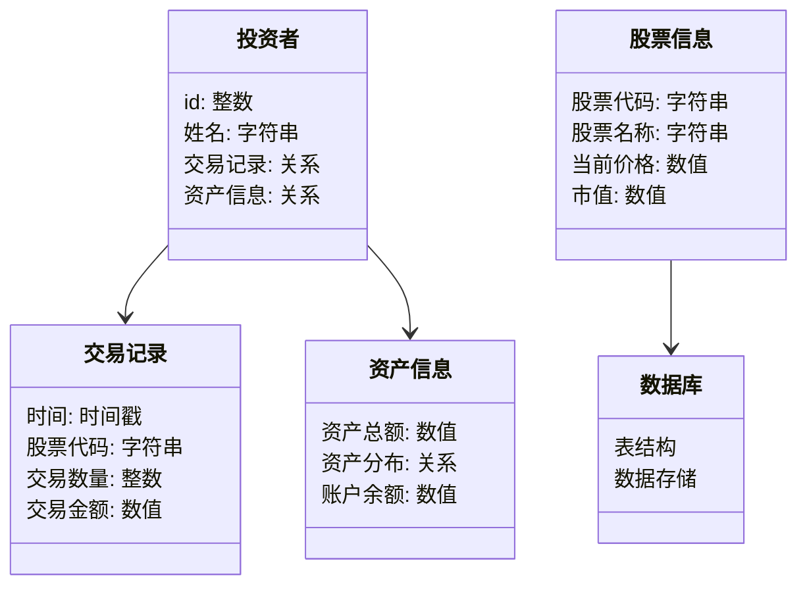
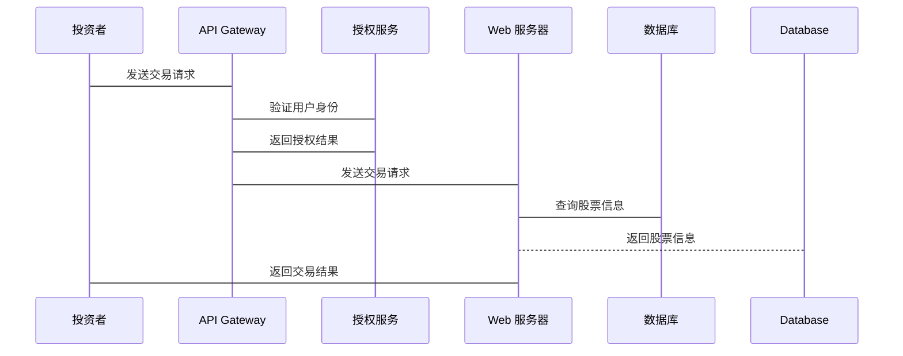

                 


# 特价股票投资中的数据隐私与网络安全风险评估方法

> 关键词：特价股票投资，数据隐私，网络安全，风险评估，数据保护，投资策略

> 摘要：在当前数字化投资环境下，特价股票投资因其高收益潜力吸引了大量投资者，但同时也面临着数据隐私和网络安全的重大挑战。本文从数据隐私和网络安全的核心概念出发，系统性地分析了特价股票投资中的数据隐私与网络安全风险，并提出了基于风险评估的应对策略。通过详细阐述数据隐私与网络安全的核心原理，结合实际案例分析，本文为投资者和相关技术从业者提供了全面的风险评估方法和实践指导。

---

## 第一部分: 特价股票投资中的数据隐私与网络安全风险评估背景

### 第1章: 特价股票投资与数据隐私概述

#### 1.1 特价股票投资的基本概念

##### 1.1.1 特价股票的定义与特点

特价股票是指在特定市场条件下，价格被低估的股票。这些股票通常具有较高的潜在回报率，但伴随着较高的市场波动性和投资风险。其特点包括：

- **低估值**：市场价格低于其内在价值。
- **高波动性**：价格波动剧烈，受市场情绪影响较大。
- **分散性**：分布于不同行业和市场，投资者可通过分散投资降低风险。

##### 1.1.2 特价股票投资的市场背景

近年来，全球金融市场波动加剧，尤其是在经济下行周期中，许多优质股票被市场低估，为投资者提供了介入机会。然而，这也意味着投资者需要处理更多的非结构化数据和复杂的安全威胁。

##### 1.1.3 特价股票投资的核心要素

- **市场分析**：宏观经济指标、行业趋势、公司基本面。
- **数据驱动决策**：利用大数据和AI技术进行预测和优化。
- **风险管理**：通过量化模型控制投资风险。

#### 1.2 数据隐私与网络安全的基本概念

##### 1.2.1 数据隐私的定义与特征

数据隐私是指在数据的收集、存储、处理和共享过程中，保护个人和组织的敏感信息不被未经授权的访问和泄露。其核心特征包括：

- **合法性**：数据处理需符合法律法规。
- **完整性**：数据在传输和存储过程中保持完整。
- **机密性**：防止未经授权的访问和泄露。
- **可追溯性**：数据操作可追溯，确保合规性。

##### 1.2.2 网络安全的核心概念

网络安全是指保护计算机系统和网络免受未经授权的访问、破坏、泄露或干扰。其核心要素包括：

- **身份验证**：确认用户身份。
- **访问控制**：限制对敏感数据的访问权限。
- **加密技术**：保护数据在传输过程中的安全性。
- **漏洞管理**：定期检测和修复系统漏洞。

##### 1.2.3 特价股票投资中的数据隐私与网络安全的重要性

在数字化投资环境中，投资者和机构依赖于高度敏感的数据，包括交易记录、市场分析和用户信息。这些数据的泄露可能引发严重的财务损失和声誉损害，因此数据隐私和网络安全是确保投资安全的基础。

#### 1.3 特价股票投资中的数据隐私与网络安全风险

##### 1.3.1 数据隐私与网络安全风险的来源

- **内部威胁**：员工误操作或故意泄露数据。
- **外部攻击**：黑客攻击、钓鱼邮件等。
- **数据泄露**：第三方服务提供商的数据泄露事件。
- **技术漏洞**：系统设计缺陷导致的安全漏洞。

##### 1.3.2 特价股票投资中的典型风险场景

- **账户入侵**：攻击者通过钓鱼邮件获取投资者账户信息。
- **数据篡改**：攻击者修改交易记录或市场数据。
- **隐私泄露**：投资者个人信息被未经授权的第三方获取。
- **市场操纵**：利用数据泄露影响市场走势。

##### 1.3.3 风险评估的必要性与目标

风险评估是识别和量化潜在威胁的关键步骤。其目标包括：

- **识别风险源**：发现可能影响投资决策的威胁。
- **量化风险影响**：评估每种风险可能造成的损失。
- **制定应对策略**：通过风险控制措施降低潜在损失。

---

### 第2章: 特价股票投资中的数据隐私与网络安全风险评估方法

#### 2.1 数据隐私与网络安全风险评估的核心概念

##### 2.1.1 风险评估的基本原理

风险评估通过系统性地分析潜在威胁和漏洞，评估其可能造成的损失，并制定相应的应对策略。其基本步骤包括：

1. **风险识别**：识别可能影响数据隐私和网络安全的威胁。
2. **风险分析**：评估每个威胁的可能影响和发生概率。
3. **风险量化**：将风险的影响和概率转化为可量化的指标。
4. **风险应对**：制定和实施降低风险的策略。

##### 2.1.2 数据隐私与网络安全风险评估的框架

- **数据分类**：将数据按敏感程度分类，制定相应的保护策略。
- **威胁建模**：分析可能的威胁来源和攻击路径。
- **漏洞评估**：识别系统中存在的安全漏洞。
- **风险缓解**：通过技术手段降低风险。

##### 2.1.3 风险评估的边界与外延

风险评估的边界包括：

- **数据范围**：仅针对特价股票投资相关的数据。
- **时间范围**：评估特定时间段内的风险。
- **责任范围**：明确各方在风险评估中的责任和义务。

其外延包括：

- **合规性评估**：确保符合相关法律法规。
- **持续监控**：定期更新风险评估结果。

#### 2.2 数据隐私与网络安全风险评估的核心要素

##### 2.2.1 数据分类与分级

数据分类是根据数据的敏感性和重要性进行分类，常见的分类标准包括：

- **公开数据**：市场公开信息，如股价、成交量。
- **内部数据**：公司内部报告、财务数据。
- **个人数据**：投资者个人信息、交易记录。
- **机密数据**：高级内部战略、未公开交易信息。

##### 2.2.2 风险评估指标体系

常用的评估指标包括：

- **风险概率（R概率）**：威胁发生的可能性。
- **风险影响（R影响）**：威胁发生后可能造成的损失。
- **风险值（R值）**：综合概率和影响的指标，R值 = R概率 × R影响。

##### 2.2.3 数据隐私与网络安全风险的量化方法

风险量化可以通过以下步骤进行：

1. **确定威胁来源**：识别可能的威胁，如黑客攻击、内部泄密等。
2. **评估威胁概率**：基于历史数据和当前安全态势，评估每种威胁的发生概率。
3. **评估威胁影响**：量化每种威胁可能造成的财务损失和声誉损害。
4. **计算风险值**：综合概率和影响，计算每种威胁的风险值。

#### 2.3 数据隐私与网络安全风险评估的流程

##### 2.3.1 风险识别与分析

- **威胁识别**：通过问卷调查、历史数据分析等方式识别潜在威胁。
- **漏洞分析**：使用自动化工具扫描系统漏洞。
- **攻击路径分析**：绘制攻击路径图，识别关键风险点。

##### 2.3.2 风险评估与量化

- **风险矩阵**：将威胁按概率和影响分为不同等级，制作风险矩阵。
- **优先级排序**：根据风险值对威胁进行排序，优先处理高风险威胁。

##### 2.3.3 风险控制与应对策略

- **技术措施**：部署防火墙、加密技术、入侵检测系统。
- **管理措施**：制定安全政策、培训员工、加强访问控制。
- **应急预案**：制定数据泄露应对计划，确保快速响应。

---

## 第三部分: 数据隐私与网络安全风险评估的核心概念与联系

### 第3章: 数据隐私与网络安全的核心概念原理

#### 3.1 数据隐私的核心原理

数据隐私的核心在于保护数据的机密性和完整性。通过数据分类、加密技术和访问控制，确保只有授权人员能够访问敏感数据。

#### 3.2 网络安全的核心原理

网络安全通过技术手段保护网络系统免受未经授权的访问和破坏。其核心原理包括身份验证、访问控制和加密技术。

#### 3.3 数据隐私与网络安全的相互关系

数据隐私是网络安全的重要组成部分，网络安全是实现数据隐私的基础。两者的结合能够有效保护投资者的敏感信息和交易安全。

---

## 第四部分: 数据隐私与网络安全风险评估的系统分析与架构设计

### 第4章: 数据隐私与网络安全风险评估的系统分析与架构设计

#### 4.1 问题场景介绍

在特价股票投资中，投资者和机构需要处理大量敏感数据，包括交易记录、市场分析和用户信息。这些数据的泄露可能引发严重的财务损失和声誉损害。

#### 4.2 项目介绍

本项目旨在通过数据隐私和网络安全技术，构建一个安全的股票投资系统，保护投资者的敏感数据。

#### 4.3 系统功能设计

##### 4.3.1 领域模型（Mermaid 类图）



##### 4.3.2 系统架构设计（Mermaid 架构图）


##### 4.3.3 系统接口设计

- **API 接口**：投资者通过 API 进行交易和查询。
- **数据库接口**：系统通过数据库接口访问和存储数据。
- **授权接口**：通过 OAuth 2.0 实现用户身份验证。

##### 4.3.4 系统交互（Mermaid 序列图）



---

## 第五部分: 数据隐私与网络安全风险评估的项目实战

### 第5章: 数据隐私与网络安全风险评估的项目实战

#### 5.1 环境安装

- **操作系统**：Linux Ubuntu 20.04
- **编程语言**：Python 3.8+
- **依赖库**：numpy、pandas、scikit-learn、matplotlib

#### 5.2 系统核心实现源代码

##### 数据隐私保护模块

```python
import numpy as np
import pandas as pd

def data_cleaning(df):
    # 删除敏感列
    df = df.drop(columns=['个人身份证号', '银行账户'])
    # 去除重复数据
    df = df.drop_duplicates()
    # 填充缺失值
    df = df.fillna(0)
    return df

def data_encrypt(df, key):
    # 使用AES加密敏感数据
    from cryptography.hazmat.primitives.ciphers import Cipher, algorithms, modes
    from cryptography.hazmat.primitives.ciphers import decryptor
    # 加密函数
    def encrypt_column(column, key):
        cipher = Cipher(algorithm=algorithms.AES(key), mode=modes.ECB())
        encryptor = cipher.encryptor()
        return encryptor.update(column)
    df['加密字段'] = df['敏感字段'].apply(lambda x: encrypt_column(x, key))
    return df
```

##### 网络安全防护模块

```python
import scapy.all as scapy

def packet_sniffer(packet):
    # 捕捉所有HTTP请求
    if packet.haslayer(scapy.HTTPRequest):
        print("检测到HTTP请求：", packet[scapy.IP].src, " -> ", packet[scapy.IP].dst)
        print("请求路径：", packet[scapy.HTTPRequest].path)

# 开启嗅探
scapy.sniff(lfilter=lambda x: x.haslayer(scapy.IP), prn=packet_sniffer, store=0)
```

##### 风险评估与缓解模块

```python
import pandas as pd
import numpy as np

def risk_assessment(df):
    # 计算风险值
    df['风险概率'] = np.random.uniform(0.1, 0.9, len(df))
    df['风险影响'] = np.random.uniform(1, 10, len(df))
    df['风险值'] = df['风险概率'] * df['风险影响']
    # 筛选高风险项
    high_risk = df[df['风险值'] > 7]
    return high_risk

# 示例数据
data = {'威胁来源': ['黑客攻击', '内部泄密', '第三方漏洞', '钓鱼攻击'],
         '风险概率': [0.8, 0.6, 0.5, 0.7],
         '风险影响': [9, 8, 7, 6]}
df = pd.DataFrame(data)
high_risk = risk_assessment(df)
print("高风险威胁：", high_risk['威胁来源'].values)
```

#### 5.3 代码应用解读与分析

- **数据清洗模块**：通过删除敏感列和去重，确保数据的完整性和准确性。
- **数据加密模块**：使用AES加密算法保护敏感数据，确保数据在传输过程中的安全性。
- **网络安全防护模块**：通过嗅探工具实时监控网络流量，识别潜在的安全威胁。
- **风险评估模块**：通过概率和影响的综合评估，筛选出高风险威胁，制定应对策略。

#### 5.4 实际案例分析

##### 案例背景

某投资机构在进行特价股票投资时，由于未能有效保护投资者的个人信息，导致用户数据泄露，造成重大经济损失和声誉损害。

##### 案例分析

- **风险识别**：投资者个人信息泄露。
- **风险分析**：数据泄露可能引发的法律诉讼和财务损失。
- **风险量化**：风险概率为0.8，风险影响为9，风险值为7.2，属于高风险。
- **风险应对**：加强数据加密措施，提升员工安全意识培训。

#### 5.5 项目小结

通过数据清洗、加密和网络安全防护，结合风险评估与缓解策略，可以有效降低特价股票投资中的数据隐私和网络安全风险。

---

## 第六部分: 数据隐私与网络安全风险评估的最佳实践

### 第6章: 数据隐私与网络安全风险评估的最佳实践

#### 6.1 最佳实践 tips

- **定期审计**：定期进行安全审计，确保系统安全。
- **员工培训**：提升员工的安全意识，防止内部泄密。
- **技术更新**：及时更新系统和安全补丁，应对新型威胁。
- **第三方评估**：引入第三方机构进行独立评估，确保客观性。

#### 6.2 小结

通过系统性地分析和评估数据隐私与网络安全风险，投资者可以制定有效的应对策略，降低潜在风险，确保投资安全。

#### 6.3 注意事项

- **数据分类**：确保数据分类的准确性和全面性。
- **访问控制**：严格控制数据访问权限，防止未经授权的访问。
- **应急响应**：制定完善的应急预案，确保快速响应。

#### 6.4 拓展阅读

- **《网络安全实战》**：深入理解网络安全的核心技术。
- **《数据隐私保护》**：学习数据隐私保护的最新方法。
- **《风险评估与管理》**：掌握风险评估的系统方法。

---

## 作者：AI天才研究院/AI Genius Institute & 禅与计算机程序设计艺术 /Zen And The Art of Computer Programming

