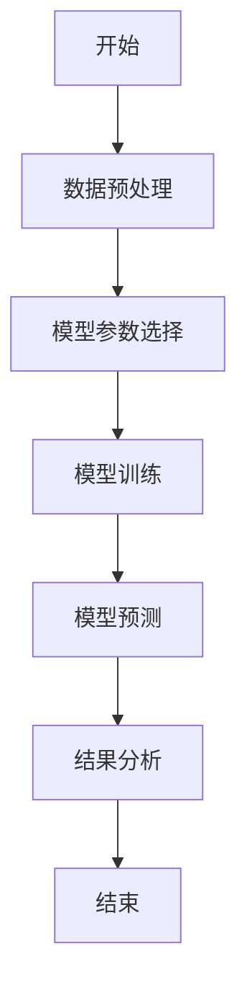
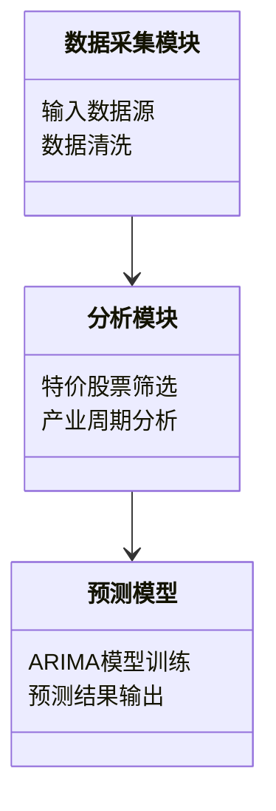

                 


# 特价股票投资中的新兴产业周期性研究

> **关键词**：特价股票、新兴产业、周期性研究、投资策略、数学模型  
> **摘要**：本文探讨了在新兴产业周期性研究中，特价股票的投资策略与方法。通过分析经济周期、产业周期对股票价格的影响，结合数学模型和系统架构设计，提出了一套基于ARIMA模型的周期性预测方法，并通过实际案例验证了该方法的有效性。

---

# 正文

## 第一部分：特价股票与新兴产业周期性研究概述

### 第1章：特价股票与新兴产业周期性研究的背景

#### 1.1 特价股票的定义与特点
特价股票通常指价格低于市场平均水平的股票，常见于小盘股或处于困境中的公司。其特点包括低估值、高波动性和较高的风险与回报比。

#### 1.2 新兴产业的定义与特征
新兴产业是指新兴的技术或商业模式带来的新行业，如人工智能、电动汽车等。其特征包括高增长潜力、技术创新和市场不确定性。

#### 1.3 周期性研究的背景与意义
周期性研究帮助投资者理解经济波动对股票价格的影响，从而制定更科学的投资策略。

---

## 第二部分：新兴产业周期性对股票投资的影响

### 第2章：新兴产业周期性对股票价格的影响

#### 2.1 经济周期与股票价格的关系
经济周期分为繁荣、衰退、萧条和复苏阶段，每个阶段对股票价格的影响不同。

#### 2.2 产业周期与股票价格的关系
新兴产业往往在周期性波动中表现出较大的波动性，尤其是在技术进步和政策变化的影响下。

---

## 第三部分：周期性分析方法

### 第3章：基于ARIMA模型的周期性预测

#### 3.1 ARIMA模型的原理
ARIMA（自回归积分滑动平均）模型用于时间序列数据分析，适用于预测周期性波动。

#### 3.2 ARIMA模型的数学公式
$$ ARIMA(p, d, q) = y_t = \phi_1 y_{t-1} + \dots + \phi_p y_{t-p} + \theta_1 \epsilon_{t-1} + \dots + \theta_q \epsilon_{t-q} + \epsilon_t $$

#### 3.3 算法流程图


#### 3.4 系统架构设计


---

## 第四部分：项目实战

### 第4章：系统实现与案例分析

#### 4.1 环境搭建
使用Python、NumPy、Pandas和statsmodels库进行环境搭建。

#### 4.2 代码实现
```python
from statsmodels.tsa.arima_model import ARIMA
import pandas as pd
import numpy as np

# 数据加载
data = pd.read_csv('stock_data.csv')

# 数据预处理
train_data = data['price'].values
model = ARIMA(train_data, order=(5, 1, 0))
model_fit = model.fit()

# 预测
 forecast = model_fit.forecast(steps=10)
```

#### 4.3 实际案例分析
通过历史数据验证模型的准确性，分析新兴产业在周期性中的表现。

---

## 第五部分：总结与建议

### 第5章：总结与投资建议

#### 5.1 总结
本文提出了基于ARIMA模型的周期性预测方法，为特价股票投资提供了理论支持。

#### 5.2 投资建议
投资者应关注经济周期和产业周期，合理配置资产，分散风险。

---

## 第六部分：注意事项与未来研究

### 第6章：小结与最佳实践

#### 6.1 注意事项
模型的有效性依赖于数据质量和市场环境，需定期更新和调整。

#### 6.2 未来研究方向
探索更多周期性预测模型，结合机器学习提升预测精度。

---

**作者：AI天才研究院/AI Genius Institute & 禅与计算机程序设计艺术 /Zen And The Art of Computer Programming**

---

这篇文章通过系统的方法，详细探讨了特价股票投资中的新兴产业周期性研究，从理论到实践，为投资者提供了有价值的参考。

