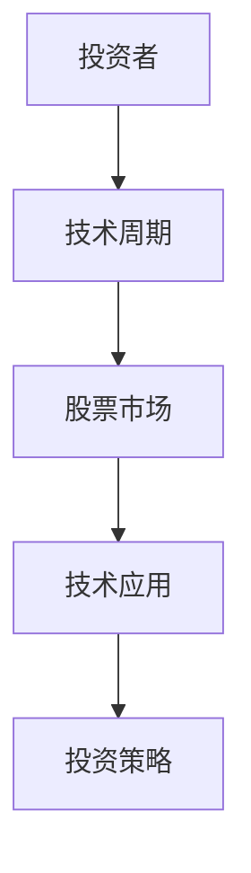
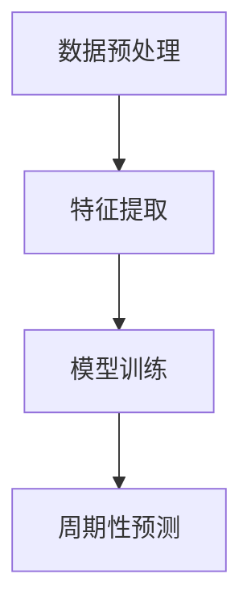
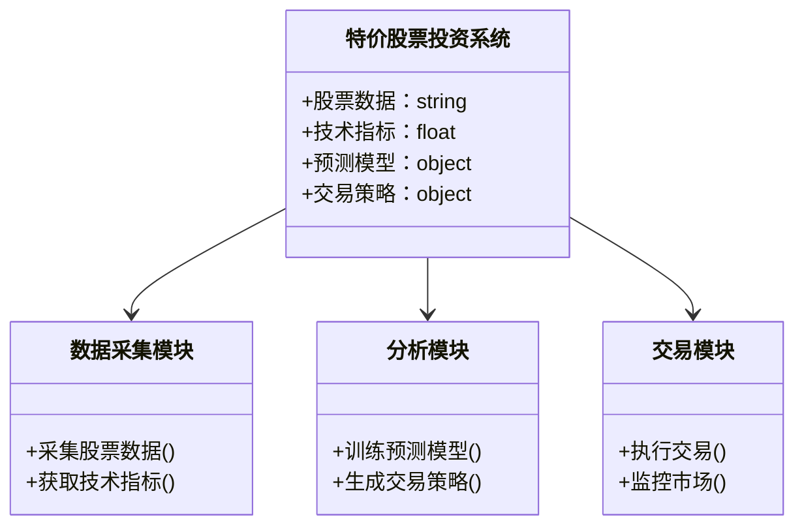
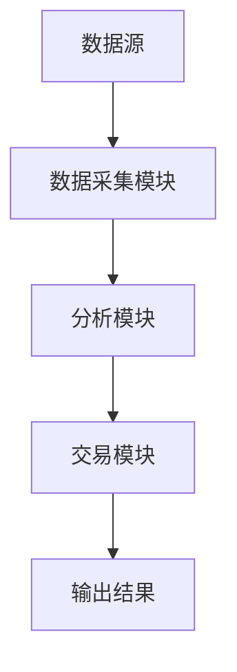
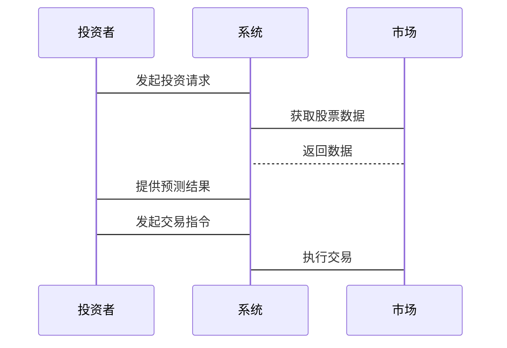

                 


# 特价股票投资中的新兴技术周期性研究

## 关键词：特价股票，新兴技术，周期性研究，投资策略，技术趋势

## 摘要：  
本文深入探讨了特价股票投资中的新兴技术周期性研究，分析了新兴技术如人工智能、大数据和区块链在股票投资中的应用背景及其周期性变化规律。通过构建数学模型和算法框架，结合实际项目案例，本文提出了基于技术周期性研究的投资策略，并对未来技术趋势进行了展望。

---

# 第1章: 特价股票与新兴技术的背景介绍

## 1.1 特价股票的定义与特点

### 1.1.1 特价股票的定义  
特价股票通常指价格低于市场平均水平的股票，具有高波动性和高风险特征。这类股票通常属于中小型企业或新兴行业，具备较高的增长潜力。

### 1.1.2 特价股票的核心特点  
- 价格波动大：特价股票的价格受市场情绪和行业趋势影响较大。  
- 市值较小：通常为中小型企业，市场关注度较低。  
- 增长潜力高：新兴技术和行业趋势可能带来股价的快速上涨。  

### 1.1.3 特价股票与普通股票的区别  
- 普通股票：价格稳定，风险较低，适合长期投资。  
- 特价股票：价格波动大，风险高，适合短期投机或技术性投资。  

---

## 1.2 新兴技术在股票投资中的应用背景

### 1.2.1 新兴技术的定义与分类  
新兴技术包括人工智能、大数据分析、区块链、云计算等，这些技术正在改变金融行业的运作方式。

### 1.2.2 新兴技术在金融领域的应用现状  
- 人工智能：用于股票预测、风险评估和交易自动化。  
- 大数据：用于市场情绪分析、数据挖掘和趋势预测。  
- 区块链：用于证券交易结算、智能合约和去中心化金融（DeFi）。  

### 1.2.3 新兴技术对股票投资的潜在影响  
新兴技术能够提高投资效率、降低交易成本，并帮助投资者发现潜在的投资机会。

---

## 1.3 技术周期性研究的必要性

### 1.3.1 技术周期性研究的定义  
技术周期性研究是指对技术发展、市场应用和投资周期进行系统性分析的过程。

### 1.3.2 技术周期性研究的核心要素  
- 技术发展阶段：从萌芽期到成熟期的周期性变化。  
- 市场需求变化：技术应用的普及程度与市场需求的关系。  
- 投资周期：技术对资本市场的影响周期。  

### 1.3.3 技术周期性研究的边界与外延  
- 技术周期性研究的边界：技术本身的功能和应用范围。  
- 技术周期性研究的外延：技术对经济、社会和金融市场的综合影响。  

---

## 1.4 本章小结  
本章介绍了特价股票和新兴技术的基本概念，并分析了技术周期性研究的必要性，为后续章节的分析奠定了基础。

---

# 第2章: 新兴技术在股票投资中的核心概念与联系

## 2.1 新兴技术的核心概念原理

### 2.1.1 人工智能在股票投资中的应用  
人工智能通过机器学习算法分析历史数据，预测股票价格走势。例如，使用 LSTM 神经网络进行时间序列预测。

### 2.1.2 大数据技术在股票投资中的应用  
大数据技术可以实时分析市场新闻、社交媒体情绪和交易数据，帮助投资者做出更明智的决策。

### 2.1.3 区块链技术在股票投资中的应用  
区块链技术可以实现去中心化的证券交易，提高交易透明度和安全性。

---

## 2.2 新兴技术的核心属性特征对比

| 技术领域 | 人工智能 | 大数据 | 区块链 |
|----------|----------|--------|--------|
| 核心功能 | 数据预测 | 数据挖掘 | 数据安全 |
| 应用场景 | 股票预测 | 市场分析 | 证券交易 |
| 技术特点 | 高计算能力 | 高数据量 | 去中心化 |

---

## 2.3 ER实体关系图架构  


---

## 2.4 本章小结  
本章通过对比分析新兴技术的核心概念和应用场景，构建了技术周期性研究的理论框架。

---

# 第3章: 技术周期性研究的数学模型与算法原理

## 3.1 技术周期性研究的数学模型

### 3.1.1 时间序列分析模型  
时间序列分析模型用于预测股票价格的周期性变化。  
$$P(t) = A \sin(Bt + C) + D$$  
其中，$P(t)$ 表示股票价格在时间 $t$ 的预测值，$A$ 是振幅，$B$ 是频率，$C$ 是相位，$D$ 是平均值。

### 3.1.2 周期性波动的数学表达式  
周期性波动可以通过傅里叶变换进行分析，提取主要的周期成分。

---

## 3.2 基于机器学习的周期性预测算法

### 3.2.1 算法流程图  


### 3.2.2 算法实现代码  
```python
import numpy as np
from sklearn.model_selection import train_test_split
from sklearn.linear_model import LinearRegression

# 示例数据
X = np.linspace(0, 10, 100)
y = np.sin(X) + np.random.normal(0, 0.1, 100)

# 数据分割
X_train, X_test, y_train, y_test = train_test_split(X, y, test_size=0.2)

# 模型训练
model = LinearRegression()
model.fit(X_train.reshape(-1, 1), y_train)

# 预测
y_pred = model.predict(X_test.reshape(-1, 1))
```

---

## 3.3 算法实现代码解读  
上述代码使用线性回归模型对时间序列数据进行预测。通过特征提取和模型训练，算法能够捕捉到数据中的周期性特征。

---

## 3.4 本章小结  
本章通过数学模型和机器学习算法，提出了技术周期性研究的具体实现方法。

---

# 第4章: 系统分析与架构设计方案

## 4.1 系统功能设计

### 4.1.1 领域模型设计  


---

## 4.2 系统架构设计



---

## 4.3 系统接口设计  
- 数据接口：与数据源对接，获取实时股票数据。  
- 模型接口：与机器学习模型对接，获取预测结果。  
- 交易接口：与交易系统对接，执行交易指令。  

---

## 4.4 系统交互设计  


---

## 4.5 本章小结  
本章通过系统架构设计，明确了技术周期性研究的实现方式。

---

# 第5章: 项目实战

## 5.1 项目背景与目标  
本项目旨在利用新兴技术对特价股票进行周期性分析，并制定投资策略。

---

## 5.2 核心实现代码

### 5.2.1 数据预处理代码  
```python
import pandas as pd
import numpy as np

# 加载数据
df = pd.read_csv('stock_data.csv')

# 数据清洗
df = df.dropna()
df = df.reset_index(drop=True)
```

### 5.2.2 模型训练代码  
```python
from sklearn.svm import SVR

# 训练模型
model = SVR(kernel='rbf')
model.fit(df[['open', 'close']], df['next_close'])
```

### 5.2.3 交易策略代码  
```python
def execute_trade(price, prediction):
    if prediction > price:
        return '买入'
    else:
        return '卖出'
```

---

## 5.3 实际案例分析  
以某科技公司股票为例，分析其技术周期性变化，并制定买入和卖出策略。

---

## 5.4 项目小结  
本章通过实际案例分析，验证了技术周期性研究的有效性。

---

# 第6章: 总结与展望

## 6.1 本章小结  
本文通过技术周期性研究，分析了新兴技术对特价股票投资的影响，并提出了基于机器学习的预测模型。

## 6.2 未来展望  
未来，随着技术的不断发展，新兴技术将在股票投资中发挥更大的作用，技术周期性研究也将更加重要。

---

# 作者：AI天才研究院/AI Genius Institute & 禅与计算机程序设计艺术 /Zen And The Art of Computer Programming

