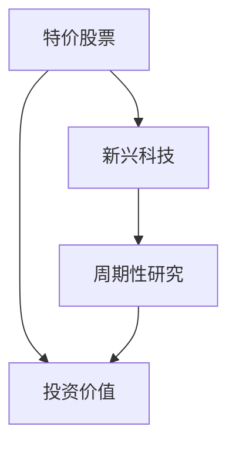
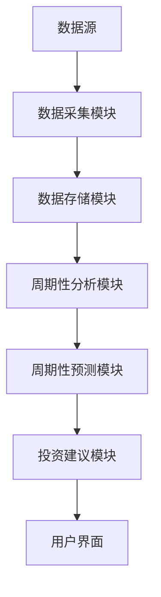
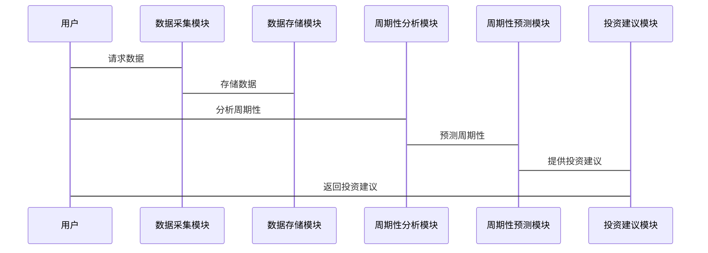

                 


# 特价股票投资中的新兴科技周期性研究

> 关键词：特价股票，新兴科技，周期性研究，投资分析，市场波动，技术驱动，价值评估

> 摘要：本文探讨了新兴科技周期对特价股票投资的影响，通过数据分析和算法模型揭示周期性规律，为投资者提供科学的投资策略和决策支持。文章结合理论与实践，详细分析了周期性研究的数学模型、算法原理和系统架构，为读者提供了深入的见解和实用的指导。

---

## 第一部分: 特价股票投资中的新兴科技周期性研究概述

### 第1章: 特价股票与新兴科技周期性研究的背景介绍

#### 1.1 特价股票的基本概念
##### 1.1.1 特价股票的定义与特征
特价股票是指市场价格低于其内在价值的股票，通常具有较高的投资回报潜力。其主要特征包括低市盈率、低市净率和高股息率。

##### 1.1.2 特价股票的投资价值分析
特价股票的投资价值体现在其被低估的市场价格与潜在的上涨空间。投资者可以通过分析公司的基本面和技术面来识别具有投资价值的特价股票。

##### 1.1.3 特价股票与市场周期的关系
特价股票的表现往往受到市场周期的影响。在经济衰退或市场低迷时期，许多股票可能被低估，成为特价股票，而在市场复苏或繁荣时期，这些股票可能恢复其合理价值。

#### 1.2 新兴科技周期性研究的核心概念
##### 1.2.1 新兴科技周期的基本特征
新兴科技周期指的是新兴技术从萌芽到成熟，再到衰退的周期性变化。这一周期通常包括技术引入、技术发展、市场普及和市场衰退四个阶段。

##### 1.2.2 科技周期对股票价格的影响
新兴科技周期对股票价格的影响主要体现在技术进步带来的市场增长和公司业绩的提升。在技术引入和发展的阶段，相关股票价格通常会上涨，而在市场衰退阶段，股票价格可能会下跌。

##### 1.2.3 新兴科技周期性研究的必要性
通过研究新兴科技周期，投资者可以更好地把握科技行业的市场波动，制定科学的投资策略。周期性研究有助于识别投资机会和风险，提高投资收益。

### 第2章: 特价股票与新兴科技周期性研究的核心概念与联系

#### 2.1 特价股票与新兴科技周期性研究的原理
##### 2.1.1 特价股票与科技周期的相互作用
新兴科技周期对特价股票的影响主要体现在技术成熟度和市场普及度上。在技术成熟和市场普及阶段，特价股票可能逐渐恢复其合理价值，从而带来投资收益。

##### 2.1.2 新兴科技周期对股票价格的驱动因素
新兴科技周期通过技术创新、市场需求和公司业绩等多方面影响股票价格。投资者可以通过分析这些驱动因素来识别投资机会。

##### 2.1.3 科技周期性研究的数学模型
周期性研究的数学模型包括时间序列分析和周期性检测算法。这些模型可以帮助投资者识别市场周期性规律，制定投资策略。

#### 2.2 核心概念属性特征对比表格
| 特价股票 | 新兴科技周期性研究 |
|----------|------------------|
| 低价优势 | 技术成熟度       |
| 投资价值 | 市场波动规律      |
| 周期性特征 | 技术驱动因素     |

#### 2.3 ER实体关系图


---

## 第二部分: 特价股票投资中的新兴科技周期性研究算法原理

### 第3章: 特价股票投资中的新兴科技周期性研究算法原理

#### 3.1 周期性检测算法
##### 3.1.1 基于时间序列的周期性检测
时间序列分析是一种常用的方法，通过分析历史数据来识别周期性规律。常用的算法包括ARIMA模型和GARCH模型。

##### 3.1.2 傅里叶变换在周期性分析中的应用
傅里叶变换可以将时间序列分解为不同频率的成分，从而识别周期性成分。这种方法在周期性分析中具有广泛的应用。

##### 3.1.3 周期性预测的数学模型
周期性预测的数学模型包括线性回归模型和机器学习模型。这些模型可以通过历史数据来预测未来的市场周期性变化。

#### 3.2 周期性预测算法
##### 3.2.1 ARIMA模型的原理与实现
ARIMA模型是一种常用的时间序列预测模型，通过自回归和移动平均的方法来预测未来的市场趋势。

##### 3.2.2 基于机器学习的周期性预测
机器学习模型，如随机森林和神经网络，可以通过特征提取和模式识别来预测市场的周期性变化。

##### 3.2.3 算法实现的Python代码示例
以下是使用ARIMA模型进行周期性预测的Python代码示例：
```python
from statsmodels.tsa.arima.model import ARIMA
import pandas as pd

# 加载数据
data = pd.read_csv('stock_price.csv')

# 拟合ARIMA模型
model = ARIMA(data['price'], order=(5, 1, 0))
model_fit = model.fit()

# 预测未来价格
forecast = model_fit.forecast(steps=10)
print(forecast)
```

#### 3.3 算法原理的数学模型与公式
##### 3.3.1 ARIMA模型的数学公式
$$ ARIMA(p, d, q) $$
其中，p为自回归阶数，d为差分阶数，q为移动平均阶数。

##### 3.3.2 傅里叶变换的数学公式
$$ \mathcal{F}(f) = \sum_{n=-\infty}^{\infty} x[n]e^{-j2\pi fn} $$

##### 3.3.3 线性回归模型的数学表示
$$ y = \beta_0 + \beta_1x + \epsilon $$

---

## 第三部分: 特价股票投资中的新兴科技周期性研究系统分析与架构设计方案

### 第4章: 特价股票投资中的新兴科技周期性研究系统分析与架构设计方案

#### 4.1 系统功能设计
##### 4.1.1 数据采集模块
数据采集模块负责收集新兴科技行业的股票价格、市场数据和公司基本面信息。

##### 4.1.2 周期性分析模块
周期性分析模块通过时间序列分析和周期性检测算法，识别市场的周期性规律。

##### 4.1.3 预测与投资建议模块
预测与投资建议模块基于周期性预测模型，提供股票的投资建议和风险评估。

#### 4.2 系统架构设计


#### 4.3 系统接口设计
系统接口设计包括数据接口、算法接口和用户接口。数据接口负责数据的输入和输出，算法接口负责算法的调用和参数传递，用户接口负责与用户的交互。

#### 4.4 系统交互设计


---

## 第四部分: 特价股票投资中的新兴科技周期性研究项目实战

### 第5章: 特价股票投资中的新兴科技周期性研究项目实战

#### 5.1 环境安装
##### 5.1.1 安装Python和相关库
需要安装Python和相关库，如Pandas、NumPy、StatsModels和Scikit-learn。

#### 5.2 系统核心实现源代码
以下是周期性预测模块的核心代码示例：
```python
import pandas as pd
from statsmodels.tsa.arima.model import ARIMA

# 加载数据
data = pd.read_csv('stock_data.csv')

# 拟合ARIMA模型
model = ARIMA(data['price'], order=(5, 1, 0))
model_fit = model.fit()

# 预测未来价格
forecast = model_fit.forecast(steps=10)
print(forecast)
```

#### 5.3 代码应用解读与分析
通过上述代码，投资者可以利用ARIMA模型预测未来的价格走势，从而制定投资策略。

#### 5.4 实际案例分析
以某科技公司为例，分析其股票价格的周期性变化，并预测未来的市场趋势。

#### 5.5 项目小结
通过项目实战，投资者可以更好地理解周期性研究的实际应用，并将其应用于实际投资决策中。

---

## 第五部分: 特价股票投资中的新兴科技周期性研究最佳实践

### 第6章: 特价股票投资中的新兴科技周期性研究最佳实践

#### 6.1 投资策略优化
通过周期性研究，投资者可以制定更加科学的投资策略，优化投资组合，降低投资风险。

#### 6.2 风险管理技巧
投资者应注重风险管理，合理配置资产，避免过度集中投资，以应对市场周期性波动。

#### 6.3 技术与市场的结合
投资者应密切关注新兴科技的发展趋势，结合技术驱动因素和市场周期性变化，制定投资策略。

#### 6.4 持续学习与更新
市场环境不断变化，投资者需要持续学习和更新知识，以应对新的挑战和机会。

---

## 第六部分: 总结与展望

### 第7章: 总结与展望

#### 7.1 小结
本文系统地探讨了特价股票投资中的新兴科技周期性研究，通过理论分析和实际案例，展示了如何利用周期性研究提高投资收益。

#### 7.2 注意事项
投资者在实际操作中应结合市场实际情况，合理运用周期性研究方法，避免盲目跟从。

#### 7.3 拓展阅读
建议投资者进一步阅读相关领域的书籍和文献，深入了解周期性研究的最新进展和应用。

---

## 作者信息

作者：AI天才研究院/AI Genius Institute & 禅与计算机程序设计艺术 /Zen And The Art of Computer Programming

---

# 结语

通过本文的分析和指导，投资者可以更好地理解特价股票投资中的新兴科技周期性研究，并将其应用于实际投资决策中，从而提高投资收益和风险管理能力。

