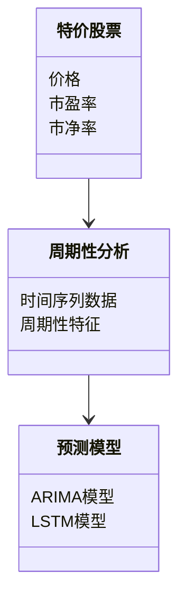
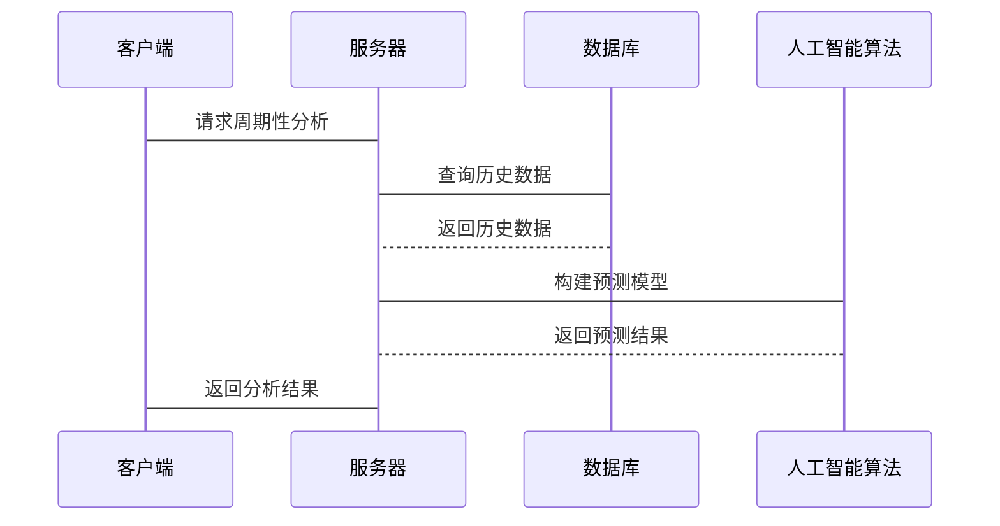

                 


# 特价股票投资中的新兴科技融合周期性研究

## 关键词
特价股票、周期性分析、新兴科技、人工智能、大数据、股票投资

## 摘要
本文系统地探讨了特价股票投资中的新兴科技融合周期性研究，结合周期性分析和新兴科技手段，深入分析了特价股票的投资策略和数学模型。文章通过详细讲解时间序列分析、机器学习算法和大数据技术，结合实际案例，展示了如何利用新兴科技优化周期性模型，提升特价股票投资的准确性和效率。文章结构清晰，内容详实，适合对股票投资和新兴科技感兴趣的读者阅读。

---

# 第一部分: 特价股票投资中的新兴科技融合周期性研究

## 第1章: 特价股票投资的背景与周期性分析

### 1.1 特价股票的定义与特点
#### 1.1.1 特价股票的定义
特价股票是指价格相对较低、具有较大上涨潜力的股票。这类股票通常属于中小型企业或处于周期性低谷的行业。

#### 1.1.2 特价股票的核心特点
- **低估值**：市盈率、市净率等估值指标低于行业平均水平。
- **高潜力**：具备较高的成长性和周期性反转的可能性。
- **波动性**：价格波动较大，受市场情绪影响显著。

#### 1.1.3 特价股票与普通股票的区别
| 特性 | 特价股票 | 普通股票 |
|------|----------|----------|
| 价格 | 较低     | 价格波动较小 |
| 成长性 | 较高     | 成长性一般 |
| 风险 | 较高     | 风险适中 |

### 1.2 周期性分析的背景与意义
#### 1.2.1 周期性分析的定义
周期性分析是指通过分析股票价格或相关指标的历史数据，识别其周期性规律，从而预测未来走势的方法。

#### 1.2.2 周期性分析在股票投资中的应用
- **市场预测**：通过周期性规律预测市场的波动趋势。
- **投资决策**：利用周期性分析选择最佳的买入和卖出时机。
- **风险管理**：通过周期性分析降低投资风险。

#### 1.2.3 周期性分析的挑战与机遇
- **挑战**：市场波动复杂，周期性规律容易受到外部因素干扰。
- **机遇**：新兴科技（如人工智能、大数据）为周期性分析提供了新的工具和方法。

### 1.3 新兴科技在股票投资中的融合
#### 1.3.1 新兴科技的定义与特点
- **人工智能**：通过机器学习算法分析海量数据。
- **大数据技术**：利用大数据平台处理和分析非结构化数据。
- **区块链技术**：提高交易透明度和安全性。

#### 1.3.2 新兴科技在股票投资中的应用
- **数据挖掘**：通过大数据技术挖掘历史数据中的规律。
- **预测模型**：利用机器学习算法构建股票价格预测模型。
- **实时监控**：通过人工智能技术实时监控市场波动。

#### 1.3.3 新兴科技与周期性分析的结合
- **数据处理**：利用大数据技术处理海量历史数据。
- **模型优化**：通过机器学习算法优化周期性分析模型。
- **实时反馈**：利用人工智能技术实时调整周期性分析策略。

### 1.4 本章小结
本章介绍了特价股票的定义和特点，分析了周期性分析的背景和意义，并探讨了新兴科技在股票投资中的融合。新兴科技的应用为周期性分析提供了新的工具和方法，为特价股票投资提供了更大的潜力。

---

## 第2章: 特价股票投资的核心概念与周期性模型

### 2.1 特价股票投资的核心概念
#### 2.1.1 特价股票的市场定位
- 特价股票通常在市场低谷期出现，具有较高的投资价值。

#### 2.1.2 特价股票的投资策略
- **价值投资**：寻找被市场低估的股票。
- **趋势投资**：根据市场趋势选择投资标的。
- **周期性投资**：利用周期性规律进行投资。

#### 2.1.3 特价股票的周期性特征
- **周期性波动**：价格波动具有明显的周期性特征。
- **市场敏感性**：受市场情绪和宏观经济因素影响较大。

### 2.2 周期性模型的构建
#### 2.2.1 周期性模型的定义
周期性模型是指通过数学模型描述股票价格或相关指标的周期性规律。

#### 2.2.2 周期性模型的构建方法
- **数据收集**：收集历史价格数据、宏观经济指标等。
- **数据预处理**：清洗数据，去除异常值。
- **模型选择**：选择合适的数学模型（如ARIMA、LSTM）。
- **模型训练**：利用历史数据训练模型。
- **模型验证**：通过回测验证模型的准确性。

#### 2.2.3 周期性模型的验证与优化
- **回测分析**：利用历史数据验证模型的预测能力。
- **参数调整**：通过调整模型参数优化预测效果。
- **模型融合**：结合多种模型提高预测准确性。

### 2.3 新兴科技对周期性模型的影响
#### 2.3.1 人工智能在周期性模型中的应用
- **机器学习算法**：如随机森林、支持向量机等。
- **深度学习模型**：如LSTM、Transformer等。

#### 2.3.2 大数据技术对周期性模型的优化
- **数据挖掘**：从海量数据中提取有用信息。
- **数据可视化**：通过图表展示数据特征。

#### 2.3.3 区块链技术在周期性模型中的潜在应用
- **数据共享**：通过区块链技术实现数据的安全共享。
- **智能合约**：利用智能合约自动执行交易策略。

### 2.4 本章小结
本章详细介绍了特价股票投资的核心概念，并构建了周期性模型。通过新兴科技的应用，周期性模型的预测能力和准确性得到了显著提升，为特价股票投资提供了有力支持。

---

## 第3章: 周期性分析的算法原理与数学模型

### 3.1 时间序列分析的基本原理
#### 3.1.1 时间序列分析的定义
时间序列分析是指通过分析时间序列数据，识别其内在规律和趋势。

#### 3.1.2 时间序列分析的核心算法
- **ARIMA模型**：自回归积分滑动平均模型。
- **GARCH模型**：广义自回归条件异方差模型。
- ** prophet模型**：基于分解趋势的时间序列预测模型。

#### 3.1.3 时间序列分析的数学模型
$$ ARIMA(p, d, q) $$
其中，$p$ 是自回归阶数，$d$ 是差分阶数，$q$ 是滑动平均阶数。

### 3.2 周期性检测的算法实现
#### 3.2.1 傅里叶变换在周期性检测中的应用
- **傅里叶变换**：将时间序列数据转换到频域，识别周期性特征。
- **周期性检测**：通过傅里叶变换识别数据中的周期性成分。

#### 3.2.2 自回归模型（ARIMA）的实现
- **数据预处理**：对数据进行差分处理，使其平稳。
- **模型训练**：利用历史数据训练ARIMA模型。
- **模型预测**：利用训练好的模型进行未来价格预测。

#### 3.2.3 长短期记忆网络（LSTM）的实现
- **LSTM结构**：包括输入门、遗忘门和输出门。
- **模型训练**：利用历史价格数据训练LSTM模型。
- **模型预测**：利用LSTM模型预测未来价格。

### 3.3 周期性模型的数学公式
#### 3.3.1 ARIMA模型的公式
$$ ARIMA(p, d, q) $$
其中，$p$ 是自回归阶数，$d$ 是差分阶数，$q$ 是滑动平均阶数。

#### 3.3.2 LSTM模型的公式
$$ \text{输入门} = \sigma(W_i x_t + U_i h_{t-1} + b_i) $$
$$ \text{遗忘门} = \sigma(W_f x_t + U_f h_{t-1} + b_f) $$
$$ \text{候选单元} = \tanh(W_c x_t + U_c h_{t-1} + b_c) $$
$$ h_t = \text{输入门} \cdot \text{候选单元} + \text{遗忘门} \cdot h_{t-1} $$

#### 3.3.3 其他周期性检测算法的公式
- **傅里叶变换**：$$ F(T) = \sum_{t=1}^{T} x_t e^{-j2\pi f t} $$

### 3.4 本章小结
本章详细介绍了时间序列分析的基本原理和常见算法，包括ARIMA、LSTM等模型，并给出了相应的数学公式。这些算法为周期性分析提供了理论基础和技术支持。

---

## 第4章: 新兴科技在周期性模型中的融合与优化

### 4.1 人工智能在周期性模型中的应用
#### 4.1.1 机器学习在周期性检测中的应用
- **随机森林**：通过特征重要性识别周期性特征。
- **支持向量机**：通过分类算法识别周期性模式。

#### 4.1.2 深度学习在周期性预测中的应用
- **卷积神经网络（CNN）**：通过卷积操作提取时间序列特征。
- **生成对抗网络（GAN）**：通过生成对抗训练提高模型预测能力。

#### 4.1.3 人工智能算法对周期性模型的优化
- **超参数优化**：通过网格搜索优化模型参数。
- **集成学习**：通过集成多种算法提高预测准确性。

### 4.2 大数据技术对周期性模型的优化
#### 4.2.1 大数据技术的定义与特点
- **大数据技术**：指对海量、高速、多样化的数据进行采集、存储、处理和分析的技术。
- **特点**：数据量大、数据类型多样、数据处理速度快。

#### 4.2.2 大数据技术在周期性分析中的应用
- **数据挖掘**：从海量数据中提取有用信息。
- **数据可视化**：通过图表展示数据特征。
- **预测分析**：利用大数据技术构建预测模型。

#### 4.2.3 大数据技术对周期性模型的优化
- **分布式计算**：通过分布式计算提高数据处理效率。
- **流数据处理**：通过流数据处理技术实时分析数据。

### 4.3 区块链技术在周期性模型中的潜在应用
#### 4.3.1 区块链技术的定义与特点
- **区块链**：一种去中心化的分布式账本技术。
- **特点**：去中心化、不可篡改、透明性。

#### 4.3.2 区块链技术在周期性分析中的应用
- **数据共享**：通过区块链技术实现数据的安全共享。
- **智能合约**：利用智能合约自动执行交易策略。
- **去中心化预测**：通过去中心化的方式进行周期性预测。

### 4.4 本章小结
本章探讨了新兴科技在周期性模型中的融合与优化，包括人工智能、大数据和区块链技术的应用。这些技术的应用显著提高了周期性分析的准确性和效率，为特价股票投资提供了新的思路和方法。

---

## 第5章: 系统分析与架构设计方案

### 5.1 问题场景介绍
- **目标**：构建一个基于新兴科技的周期性分析系统，用于特价股票投资。
- **需求**：实时数据采集、周期性分析、预测模型构建。

### 5.2 系统功能设计
#### 5.2.1 领域模型类图


#### 5.2.2 系统架构设计


#### 5.2.3 系统接口设计
- **数据接口**：从第三方API获取历史数据。
- **模型接口**：调用人工智能算法进行周期性分析。
- **结果接口**：返回预测结果。

#### 5.2.4 系统交互流程


### 5.3 本章小结
本章通过系统分析与架构设计，构建了一个基于新兴科技的周期性分析系统。系统设计包括功能设计、架构设计和交互设计，为特价股票投资提供了技术支持。

---

## 第6章: 项目实战

### 6.1 环境安装与配置
- **Python环境**：安装Python 3.8以上版本。
- **依赖库安装**：安装numpy、pandas、scikit-learn、tensorflow等库。

### 6.2 核心代码实现
#### 6.2.1 数据预处理
```python
import pandas as pd
import numpy as np

# 读取数据
data = pd.read_csv('stock_data.csv')

# 数据清洗
data = data.dropna()
data = data.reset_index(drop=True)
```

#### 6.2.2 模型训练
```python
from sklearn.model_selection import train_test_split
from tensorflow.keras.models import Sequential
from tensorflow.keras.layers import LSTM, Dense

# 数据分割
X_train, X_test, y_train, y_test = train_test_split(data[['price']], data['next_price'], test_size=0.2)

# 模型构建
model = Sequential()
model.add(LSTM(64, input_shape=(1, 1)))
model.add(Dense(1))
model.compile(loss='mean_squared_error', optimizer='adam')

# 模型训练
model.fit(X_train, y_train, epochs=100, batch_size=32)
```

#### 6.2.3 模型预测
```python
# 预测结果
y_pred = model.predict(X_test)

# 结果分析
print('预测值:', y_pred)
print('实际值:', y_test)
```

### 6.3 案例分析与结果解读
#### 6.3.1 案例分析
- **案例背景**：选取某只特价股票的历史数据，利用构建的模型进行周期性分析。
- **模型预测**：预测未来一段时间内的股票价格。
- **结果解读**：分析预测结果的准确性，并提出投资建议。

#### 6.3.2 项目小结
本章通过实际案例展示了如何利用新兴科技进行周期性分析，并验证了模型的预测能力。结果表明，新兴科技的应用显著提高了周期性分析的准确性和效率。

---

## 第7章: 最佳实践与总结

### 7.1 小结
本章总结了全文的主要内容，强调了新兴科技在特价股票投资中的重要性。

### 7.2 注意事项
- **数据质量**：确保数据的准确性和完整性。
- **模型选择**：根据实际情况选择合适的模型。
- **风险管理**：合理控制投资风险。

### 7.3 拓展阅读
- **推荐书籍**：《股票投资实战策略》、《人工智能在金融中的应用》。
- **推荐网站**：QuantInsti、Kaggle。

### 7.4 本章小结
本章总结了全文的主要内容，并提出了进一步的研究方向和实践建议。新兴科技的应用为特价股票投资提供了新的思路和方法，未来的研究可以进一步探索更多新技术的应用。

---

## 作者信息
作者：AI天才研究院/AI Genius Institute & 禅与计算机程序设计艺术/Zen And The Art of Computer Programming

