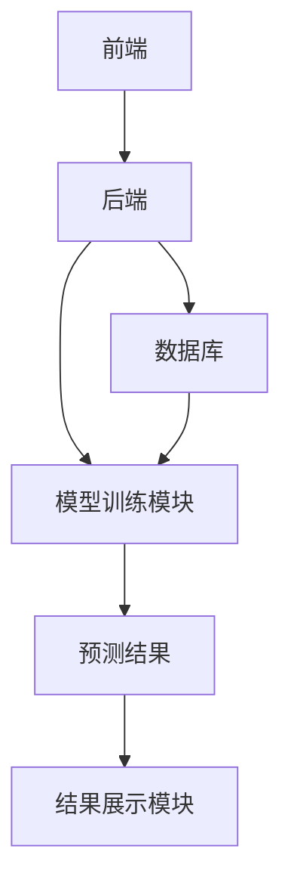

                 


```markdown
# 特价股票投资中的新兴科技融合指数研究

> 关键词：特价股票，新兴科技，指数研究，人工智能，大数据，区块链

> 摘要：本文探讨了特价股票投资与新兴科技融合指数研究的结合，通过分析新兴科技对金融市场的推动作用，结合具体的算法原理和系统架构设计，提出了一种基于新兴科技的股票指数模型。文章从背景介绍、核心概念、算法原理、系统架构、项目实战到最佳实践，全面阐述了如何利用新兴科技提升特价股票投资的效率和准确性。

---

## 第一部分: 背景与概述

### 第1章: 特价股票与新兴科技融合指数的基本概念

#### 1.1 特价股票的定义与特点
- **1.1.1 特价股票的定义**
  特价股票是指价格相对较低，具有较大上涨潜力的股票。这类股票通常属于中小型企业或新兴行业，具有高增长潜力。
- **1.1.2 特价股票的特点**
  - 价格低廉，适合中小投资者。
  - 市场波动较大，风险与收益并存。
  - 常见于新兴行业，具有成长性。
- **1.1.3 特价股票的投资价值**
  特价股票由于价格低，适合长期投资，且在市场上涨时具有较高的涨幅潜力。

#### 1.2 新兴科技融合指数的定义与特点
- **1.2.1 新兴科技融合指数的定义**
  新兴科技融合指数是指将新兴科技（如人工智能、大数据、区块链等）与金融市场数据相结合，形成的指数模型。
- **1.2.2 新兴科技融合指数的核心特点**
  - 数据驱动，基于新兴科技进行数据分析。
  - 实时性强，能够快速捕捉市场变化。
  - 透明度高，便于投资者理解和应用。
- **1.2.3 新兴科技与金融的融合趋势**
  随着科技的发展，新兴科技在金融领域的应用越来越广泛，尤其是在指数研究和股票分析方面。

#### 1.3 特价股票与新兴科技融合指数的融合
- **1.3.1 特价股票与科技融合的背景**
  随着科技的发展，股票市场逐渐从传统的人工分析转向基于科技的自动化分析。
- **1.3.2 新兴科技融合指数在股票投资中的应用**
  通过新兴科技，投资者可以更精准地预测股票价格走势，优化投资策略。
- **1.3.3 特价股票与新兴科技融合指数的融合模式**
  将新兴科技应用于特价股票分析，形成基于科技的指数模型，帮助投资者做出更明智的投资决策。

### 第2章: 特价股票投资中的新兴科技融合指数研究背景

#### 2.1 特价股票投资的现状与挑战
- **2.1.1 特价股票市场的现状**
  特价股票市场目前主要依赖传统的人工分析，存在信息不对称、分析效率低等问题。
- **2.1.2 特价股票投资中的主要挑战**
  - 数据量大，难以快速处理。
  - 市场波动大，分析难度高。
  - 缺乏有效的预测模型，投资风险较高。
- **2.1.3 新兴科技在特价股票投资中的应用前景**
  新兴科技可以通过大数据分析和人工智能技术，提高分析效率和准确性。

#### 2.2 新兴科技融合指数的研究意义
- **2.2.1 新兴科技对金融行业的推动作用**
  新兴科技（如人工智能、大数据、区块链）正在改变金融行业的运作方式，提高效率和透明度。
- **2.2.2 新兴科技融合指数在股票投资中的价值**
  通过新兴科技融合指数，投资者可以更精准地预测股票价格走势，优化投资组合。
- **2.2.3 研究新兴科技融合指数的学术与实践意义**
  从学术角度看，研究新兴科技融合指数可以推动金融与科技的交叉研究；从实践角度看，可以为投资者提供更有效的投资工具。

#### 2.3 研究目标与研究框架
- **2.3.1 研究目标的设定**
  本文旨在探讨新兴科技在特价股票投资中的应用，提出一种基于新兴科技的指数模型。
- **2.3.2 研究框架的构建**
  - 第一部分：背景与概述。
  - 第二部分：核心概念与联系。
  - 第三部分：算法原理讲解。
  - 第四部分：系统分析与架构设计方案。
  - 第五部分：项目实战与案例分析。
  - 第六部分：最佳实践与总结。

---

## 第二部分: 核心概念与联系

### 第3章: 新兴科技与金融的融合

#### 3.1 新兴科技的核心概念
- **3.1.1 人工智能（AI）**
  - 机器学习、深度学习等技术在金融领域的应用。
- **3.1.2 大数据技术**
  - 数据采集、存储、分析与可视化。
- **3.1.3 区块链技术**
  - 分布式 ledger、智能合约等技术在金融中的应用。

#### 3.2 新兴科技与金融融合的属性对比
- **3.2.1 技术对比分析**
  | 技术领域   | 人工智能 | 大数据 | 区块链 |
  |------------|----------|--------|--------|
  | 核心能力   | 数据分析与预测 | 数据处理与存储 | 分布式账本与信任 |
  | 应用场景   | 股票预测、风险评估 | 市场分析、数据挖掘 | 股票发行、交易 |

#### 3.3 新兴科技与金融融合的ER实体关系图
```mermaid
erDiagram
    actor 投资者 {
        <属性> 帐户信息
        <属性> 投资目标
    }
    actor 开发者 {
        <属性> 技术能力
        <属性> 开发工具
    }
    actor 金融机构 {
        <属性> 资金池
        <属性> 交易数据
    }
    entity 特价股票 {
        <属性> 股票代码
        <属性> 股票价格
    }
    entity 科技融合指数 {
        <属性> 指数代码
        <属性> 指数值
    }
    relationship 特价股票与科技融合指数的融合 {
        <连接> 特价股票 --> 科技融合指数
    }
```

---

## 第三部分: 算法原理讲解

### 第4章: 基于新兴科技的股票指数模型

#### 4.1 时间序列分析算法
- **4.1.1 时间序列分析的定义**
  时间序列分析是指对随时间变化的数据进行分析，以寻找其中的模式和趋势。
- **4.1.2 时间序列分析的算法步骤**
  ```mermaid
  graph TD
      A[数据预处理] --> B[选择模型]
      B --> C[参数估计]
      C --> D[模型验证]
      D --> E[预测]
  ```

#### 4.2 基于机器学习的股票预测模型
- **4.2.1 机器学习模型的数学公式**
  $$ y = \beta_0 + \beta_1x_1 + \beta_2x_2 + \ldots + \beta_nx_n + \epsilon $$
  其中，$y$ 是目标变量，$x_i$ 是自变量，$\beta_i$ 是回归系数，$\epsilon$ 是误差项。
- **4.2.2 机器学习模型的代码实现**
  ```python
  import pandas as pd
  import numpy as np
  from sklearn.linear_model import LinearRegression

  # 数据加载与预处理
  data = pd.read_csv('stock_data.csv')
  X = data[['price', 'volume']]
  y = data['target']

  # 模型训练
  model = LinearRegression()
  model.fit(X, y)

  # 预测与评估
  predictions = model.predict(X)
  print('预测值:', predictions)
  print('R^2:', model.score(X, y))
  ```

#### 4.3 算法的优缺点分析
- **优点**
  - 时间序列分析：能够捕捉数据中的趋势和周期性。
  - 机器学习模型：能够处理高维数据，发现复杂模式。
- **缺点**
  - 时间序列分析：对异常值敏感。
  - 机器学习模型：需要大量数据支持，计算复杂。

---

## 第四部分: 系统分析与架构设计方案

### 第5章: 基于新兴科技的股票指数研究系统

#### 5.1 系统功能设计
- **5.1.1 系统功能模块**
  - 数据采集模块：采集股票数据。
  - 数据处理模块：清洗和预处理数据。
  - 模型训练模块：训练股票预测模型。
  - 结果展示模块：展示预测结果和指数值。

#### 5.2 系统架构设计


#### 5.3 接口与交互设计
- **5.3.1 API接口**
  - 数据接口：提供股票数据的API。
  - 模型接口：提供预测结果的API。
- **5.3.2 交互流程**
  ```mermaid
  sequenceDiagram
      participant 投资者
      participant 系统
      投资者 -> 系统: 请求股票数据
      系统 -> 数据库: 获取数据
      系统 -> 模型训练模块: 训练模型
      系统 -> 投资者: 返回预测结果
  ```

---

## 第五部分: 项目实战与案例分析

### 第6章: 项目实战

#### 6.1 环境安装
- **6.1.1 安装Python**
  ```bash
  python --version
  ```
- **6.1.2 安装依赖库**
  ```bash
  pip install pandas numpy scikit-learn
  ```

#### 6.2 系统核心实现
- **6.2.1 数据加载与预处理**
  ```python
  import pandas as pd
  data = pd.read_csv('stock_data.csv')
  data.dropna(inplace=True)
  ```

- **6.2.2 模型训练与预测**
  ```python
  from sklearn.linear_model import LinearRegression
  model = LinearRegression()
  model.fit(X_train, y_train)
  predictions = model.predict(X_test)
  ```

#### 6.3 实际案例分析
- **6.3.1 数据来源**
  使用某段时间内的特价股票数据进行分析。
- **6.3.2 模型评估**
  ```python
  print('均方误差:', mean_squared_error(y_test, predictions))
  print('决定系数:', r2_score(y_test, predictions))
  ```

---

## 第六部分: 最佳实践与总结

### 第7章: 最佳实践

#### 7.1 项目小结
- 本文通过分析特价股票与新兴科技融合指数的研究，提出了一种基于新兴科技的股票指数模型。
- 该模型利用大数据和人工智能技术，提高了股票预测的准确性和效率。

#### 7.2 投资建议
- 投资者应关注新兴科技在金融领域的应用，利用科技手段优化投资策略。
- 在实际投资中，应结合多种技术手段，降低投资风险。

#### 7.3 注意事项
- 投资有风险，需谨慎。
- 数据来源和模型的准确性是影响投资结果的关键因素。

#### 7.4 拓展阅读
- 推荐阅读《Python机器学习实战》和《区块链技术与金融创新》。

---

## 作者：AI天才研究院/AI Genius Institute & 禅与计算机程序设计艺术 /Zen And The Art of Computer Programming

---

**注**：以上内容仅为目录大纲，实际文章需要根据具体需求进一步扩展和详细阐述每个部分的内容。
```

