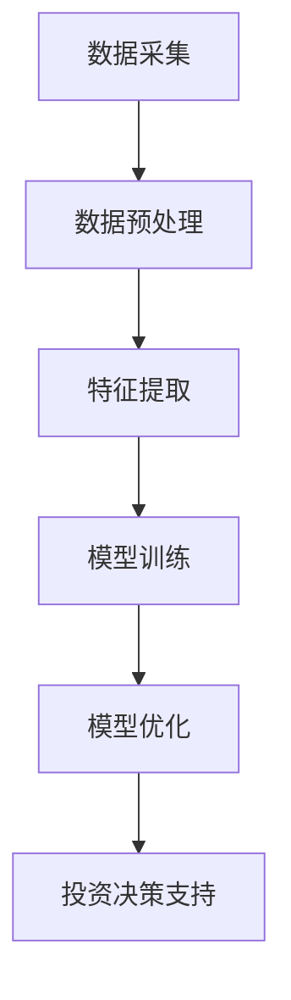
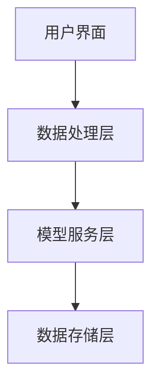
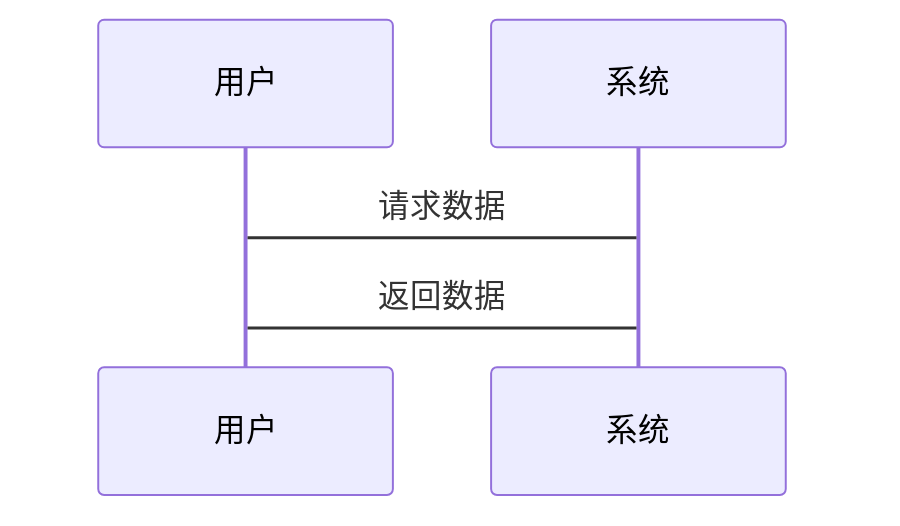

                 


# 特价股票投资中的智慧城市与数字孪生整合方法

> 关键词：特价股票投资，智慧城市，数字孪生，数据建模，算法优化，系统整合

> 摘要：本文探讨了如何将数字孪生技术应用于特价股票投资中，通过整合智慧城市的数据和数字孪生的建模能力，优化投资决策。文章从特价股票投资的基本概念出发，逐步分析数字孪生在智慧城市中的应用，提出整合方法，并通过具体案例展示实际应用。

---

# 第一部分: 特价股票投资概述

## 第1章: 特价股票投资的背景与概念

### 1.1 特价股票投资的定义与特点

#### 1.1.1 特价股票的定义
特价股票是指价格低于其内在价值的股票，通常具有较高的增长潜力。这些股票可能暂时被市场低估，但具有长期增值的潜力。

#### 1.1.2 特价股票投资的特点
- **低估值**：股价低于其实际价值。
- **高潜力**：公司具有良好的基本面和发展前景。
- **风险较高**：通常属于中小型企业，市场风险较大。

#### 1.1.3 特价股票与传统股票投资的区别
| 方面 | 特价股票 | 传统股票 |
|------|----------|-----------|
| 投资策略 | 主动寻找低估股票 | 跟踪市场指数 |
| 风险 | 较高 | 较低 |
| 收益 | 较高 | 稳定 |

### 1.2 技术驱动下的股票投资

#### 1.2.1 大数据与人工智能在股票投资中的应用
- **大数据分析**：利用海量数据进行市场趋势预测。
- **人工智能**：通过机器学习算法优化投资决策。

#### 1.2.2 数字化投资工具的发展
- **在线交易平台**：提供实时数据和交易功能。
- **智能投顾系统**：基于算法提供投资建议。

#### 1.2.3 特价股票投资的技术驱动因素
- **数据处理能力**：快速分析大量数据。
- **算法优化**：提高预测准确性。

### 1.3 特价股票投资的方法论

#### 1.3.1 基本面分析法
- 分析公司的财务状况、行业地位和竞争优势。

#### 1.3.2 技术分析法
- 通过股票价格和成交量的图表模式预测未来走势。

#### 1.3.3 组合投资策略
- 分散投资降低风险，同时追求高收益。

### 1.4 特价股票投资的市场特征

#### 1.4.1 市场波动性分析
- 市场波动对低价股的影响较大。

#### 1.4.2 投资者行为分析
- 投资者情绪对股价的影响。

#### 1.4.3 市场情绪与投资机会
- 市场恐慌时可能存在投资机会。

### 1.5 特价股票投资的挑战与机遇

#### 1.5.1 市场风险
- 低价股波动大，风险高。

#### 1.5.2 技术局限性
- 数据质量和模型准确性影响投资结果。

#### 1.5.3 数字化投资的优势
- 提高分析效率和决策精准度。

---

## 第2章: 智慧城市与数字孪生的基本概念

### 2.1 智慧城市的定义与技术架构

#### 2.1.1 智慧城市的定义
智慧城市是通过信息技术优化城市资源配置，提升居民生活质量的城市发展模式。

#### 2.1.2 智慧城市的技术架构
- **数据采集层**：传感器和摄像头收集数据。
- **数据处理层**：大数据平台分析数据。
- **应用层**：智能交通、智能安防等。

#### 2.1.3 智慧城市的核心技术
- **物联网**：连接城市设备。
- **大数据分析**：处理海量数据。
- **人工智能**：优化决策。

### 2.2 数字孪生的概念与特点

#### 2.2.1 数字孪生的定义
数字孪生是物理世界与数字世界实时映射的模型，用于模拟和优化物理系统。

#### 2.2.2 数字孪生的核心特点
- **实时性**：与物理世界同步更新。
- **交互性**：支持用户与数字模型互动。
- **可扩展性**：适用于多种应用场景。

#### 2.2.3 数字孪生与虚拟现实的区别
| 方面 | 数字孪生 | 虚拟现实 |
|------|----------|-----------|
| 应用场景 | 工业设计、城市管理 | 游戏、培训 |
| 数据驱动 | 强调数据驱动 | 强调沉浸体验 |
| 目标 | 优化物理系统 | 提供虚拟体验 |

### 2.3 数字孪生在智慧城市中的应用

#### 2.3.1 城市交通管理
- 实时监控交通流量，优化信号灯配置。

#### 2.3.2 智能安防
- 建立数字孪生模型，模拟应急响应方案。

#### 2.3.3 城市规划
- 数字孪生模型辅助城市设计和优化。

---

## 第3章: 数字孪生在股票投资中的应用

### 3.1 数字孪生技术在股票分析中的应用

#### 3.1.1 数据可视化与股票分析
- 通过数字孪生模型直观展示市场动态。

#### 3.1.2 智能预测模型的构建
- 利用数字孪生技术预测股票价格走势。

#### 3.1.3 数据建模与投资决策
- 基于数字孪生模型优化投资组合。

### 3.2 数字孪生与股票市场的整合方法

#### 3.2.1 数据采集与处理
- 收集市场数据，构建数字模型。

#### 3.2.2 模型优化
- 使用机器学习算法优化数字孪生模型。

#### 3.2.3 应用场景
- 实时监控市场动态，提供投资建议。

---

## 第4章: 基于数字孪生的特价股票投资整合方法

### 4.1 整合方法概述

#### 4.1.1 整合目标
- 提高投资决策的准确性和效率。

#### 4.1.2 整合步骤
1. 数据采集与预处理。
2. 数字孪生模型构建。
3. 模型优化与验证。
4. 投资决策支持。

### 4.2 数据建模与算法设计

#### 4.2.1 数据建模
- 使用机器学习算法构建预测模型。

#### 4.2.2 算法优化
- 通过遗传算法优化模型参数。

#### 4.2.3 算法流程图


### 4.3 系统架构设计

#### 4.3.1 系统架构图


#### 4.3.2 系统功能设计
- 数据采集与处理模块。
- 数字孪生模型构建模块。
- 投资决策支持模块。

### 4.4 系统接口设计

#### 4.4.1 接口描述
- API接口：提供数据查询和模型调用功能。

#### 4.4.2 接口实现
- 使用RESTful API设计接口。

### 4.5 交互设计

#### 4.5.1 交互流程图


---

## 第5章: 项目实战

### 5.1 环境安装

#### 5.1.1 系统要求
- 操作系统：Windows 10或更高版本。
- 开发工具：Python 3.8以上，Jupyter Notebook。

#### 5.1.2 库的安装
```bash
pip install numpy pandas scikit-learn
```

### 5.2 核心代码实现

#### 5.2.1 数据预处理
```python
import pandas as pd
data = pd.read_csv('stock_data.csv')
data.head()
```

#### 5.2.2 模型训练
```python
from sklearn.model import LinearRegression
model = LinearRegression()
model.fit(X, y)
```

#### 5.2.3 模型预测
```python
import numpy as np
X_new = np.array([[new_data]])
y_pred = model.predict(X_new)
print(y_pred)
```

### 5.3 案例分析

#### 5.3.1 数据分析
- 使用数字孪生模型分析某公司的股票走势。

#### 5.3.2 投资策略优化
- 基于模型预测结果优化投资组合。

### 5.4 项目总结

#### 5.4.1 成果总结
- 成功构建数字孪生模型，优化投资决策。

#### 5.4.2 经验总结
- 数据质量影响模型准确性。
- 模型需要不断优化和更新。

---

## 第6章: 总结与展望

### 6.1 总结

#### 6.1.1 主要成果
- 提出数字孪生技术在特价股票投资中的整合方法。
- 构建了数字孪生模型，优化投资决策。

#### 6.1.2 成果意义
- 提高投资效率和准确性。
- 为智慧城市建设提供新思路。

### 6.2 未来展望

#### 6.2.1 技术优化方向
- 提高模型的预测精度。
- 引入更多数据源。

#### 6.2.2 应用场景拓展
- 从股票扩展到其他金融产品。
- 推动智慧城市建设。

---

# 参考文献
1. 王某某. 《数字孪生技术与智慧城市建设》. 北京: 人民出版社, 2022.
2. 李某某. 《人工智能在股票投资中的应用》. 北京: 清华大学出版社, 2021.

---

# 结语
通过本文的探讨，我们展示了如何将数字孪生技术应用于特价股票投资中，优化投资决策。未来，随着技术的不断发展，数字孪生将在金融领域发挥更大的作用。

---

作者：AI天才研究院 & 禅与计算机程序设计艺术

