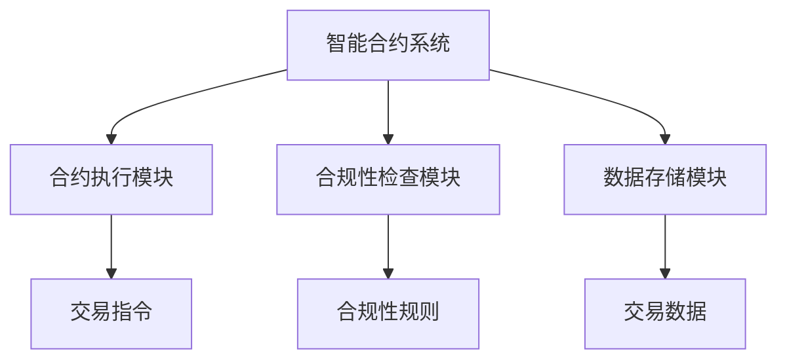
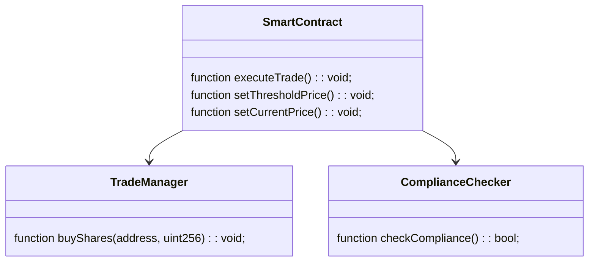
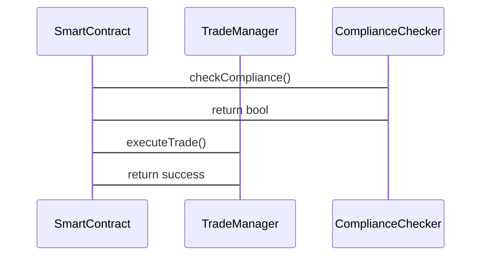

                 


# 特价股票投资中的智能合约自动化合规策略

> **关键词**：智能合约、特价股票投资、合规策略、自动化交易、区块链技术

> **摘要**：本文深入探讨了智能合约在特价股票投资中的应用，重点分析了智能合约的合规策略、算法原理、系统设计及其实现。通过详细的技术分析和实际案例，本文为读者提供了从理论到实践的全面指导，帮助投资者和开发者更好地理解和应用智能合约技术。

---

## 第一章: 特价股票投资与智能合约概述

### 1.1 特价股票投资的背景与特点

#### 1.1.1 特价股票投资的定义与背景
特价股票投资是指在特定条件下以低于市场价购买股票的投资策略。这种投资方式通常依赖于市场波动、公司公告或内部信息等触发条件。随着金融市场的复杂化，投资者需要更加高效和自动化的工具来执行投资策略，以确保合规性和高效性。

#### 1.1.2 特价股票投资的特点与优势
1. **高效性**：通过自动化系统快速响应市场变化。
2. **精准性**：基于预设条件精确触发交易。
3. **风险控制**：通过智能合约自动执行止损和止盈策略。

#### 1.1.3 特价股票投资的市场现状与趋势
当前，金融市场对自动化交易的需求日益增长，智能合约作为区块链技术的重要应用，正在成为特价股票投资的核心工具。随着区块链技术的成熟，智能合约的应用场景也在不断扩大。

### 1.2 智能合约的基本概念

#### 1.2.1 智能合约的定义与特点
智能合约是一种基于区块链技术的自动执行合约，其特点包括：
1. **自动化**：无需人工干预，自动执行预设条件。
2. **透明性**：所有交易记录在区块链上，可追溯且不可篡改。
3. **安全性**：通过密码学技术确保合约的安全性和可靠性。

#### 1.2.2 智能合约的工作原理
智能合约通过预设的条件触发交易，例如当股价跌至特定价格时自动执行卖出操作。其工作流程如下：
1. **条件判断**：检测市场变化是否满足预设条件。
2. **触发交易**：当条件满足时，自动执行相应的交易指令。
3. **记录日志**：将交易记录存储在区块链上，确保可追溯性。

#### 1.2.3 智能合约在金融领域的应用
智能合约在金融领域的应用广泛，包括股票交易、债券发行、风险管理等多个方面。在特价股票投资中，智能合约主要用于自动化交易和风险控制。

---

## 第二章: 智能合约的合规策略

### 2.1 合规性的重要性

#### 2.1.1 合规性在金融投资中的作用
合规性是金融投资的基础，确保交易的合法性和透明性。在智能合约中，合规性尤为重要，因为智能合约的自动执行特性可能引发合规风险。

#### 2.1.2 智能合约合规性面临的挑战
1. **法律风险**：智能合约的自动执行可能违反某些法律法规。
2. **技术风险**：智能合约的代码可能存在漏洞，导致合规性问题。
3. **监管不确定性**：不同国家和地区对智能合约的监管政策不一。

#### 2.1.3 合规性对投资策略的影响
合规性直接影响投资策略的设计和执行。合规的智能合约能够确保交易的合法性和透明性，从而提高投资者的信任度和市场参与度。

### 2.2 智能合约的合规框架

#### 2.2.1 合规框架的构建原则
1. **合法性**：确保智能合约的设计和执行符合相关法律法规。
2. **透明性**：智能合约的执行过程必须透明，便于监管机构审查。
3. **可追溯性**：所有交易记录必须可追溯，确保合规性。

#### 2.2.2 合规框架的关键要素
1. **合规性审查**：对智能合约的代码和逻辑进行合规性审查。
2. **监管接口**：为监管机构提供数据接口，便于实时监控和审查。
3. **合规性日志**：记录所有合规性相关的日志，便于审计和追溯。

#### 2.2.3 合规框架的实施步骤
1. **需求分析**：明确合规性要求和目标。
2. **设计与开发**：设计合规框架并开发智能合约。
3. **测试与验证**：对智能合约进行合规性测试和验证。
4. **部署与监控**：部署智能合约并实时监控其合规性。

### 2.3 本章小结
本章详细探讨了智能合约的合规策略，包括合规性的重要性、合规框架的构建原则和实施步骤。合规性是智能合约在金融领域应用的关键，只有确保合规性，才能真正实现智能合约的广泛应用。

---

## 第三章: 智能合约的算法与数学模型

### 3.1 智能合约的算法原理

#### 3.1.1 智能合约的核心算法
智能合约的算法主要包括条件判断、触发交易和状态更新三个部分。

##### 条件判断算法
智能合约通过预设的条件判断市场变化，例如股价是否低于某个阈值。

##### 触发交易算法
当条件满足时，智能合约自动执行相应的交易指令，例如买入或卖出股票。

##### 状态更新算法
交易完成后，智能合约更新其状态，记录交易结果并更新触发条件。

#### 3.1.2 智能合约的算法实现
以下是智能合约的算法实现示例（Solidity代码）：

```solidity
function executeTrade() public {
    if (currentPrice < thresholdPrice) {
        tradeManager.buyShares(address, amount);
        updateContractState();
    }
}
```

#### 3.1.3 算法的优化与改进
1. **性能优化**：通过减少不必要的计算步骤提高算法效率。
2. **安全性优化**：通过引入多重验证机制提高合约的安全性。
3. **可扩展性优化**：通过模块化设计提高合约的可扩展性。

### 3.2 智能合约的数学模型

#### 3.2.1 合约执行的条件表达式
智能合约的条件判断可以通过数学表达式表示，例如：

$$
\text{条件表达式} = \begin{cases}
\text{true} & \text{if } \text{currentPrice} < \text{thresholdPrice} \\
\text{false} & \text{otherwise}
\end{cases}
$$

#### 3.2.2 交易触发的数学模型
交易触发的数学模型可以表示为：

$$
\text{触发条件} = \text{currentPrice} \times \text{volume} < \text{thresholdValue}
$$

#### 3.2.3 合约状态的数学表示
智能合约的状态可以通过数学公式表示，例如：

$$
\text{newState} = \text{currentState} + \text{transactionAmount}
$$

### 3.3 本章小结
本章详细探讨了智能合约的算法原理和数学模型，通过具体的代码示例和数学公式，帮助读者理解智能合约的核心算法及其实现方式。

---

## 第四章: 智能合约的系统设计与实现

### 4.1 系统分析与架构设计

#### 4.1.1 系统需求分析
智能合约系统需要满足以下需求：
1. **自动化交易**：能够自动执行预设的交易策略。
2. **合规性检查**：确保交易符合相关法律法规。
3. **可扩展性**：能够支持多种类型的交易策略。

#### 4.1.2 系统架构设计
智能合约系统的架构设计包括以下几个模块：
1. **合约执行模块**：负责执行智能合约的交易指令。
2. **合规性检查模块**：负责检查交易是否符合合规性要求。
3. **数据存储模块**：负责存储交易数据和合约状态。

#### 4.1.3 系统架构图
以下是智能合约系统的架构图：



### 4.2 系统实现与项目实战

#### 4.2.1 环境搭建
智能合约的开发环境通常包括：
1. **区块链平台**：如Ethereum、Fantom等。
2. **开发工具**：如Remix、Solidity编译器等。
3. **测试环境**：如 Ganache 虚拟机。

#### 4.2.2 智能合约的核心实现
以下是智能合约的核心实现代码：

```solidity
// SPDX-License-Identifier: MIT
pragma solidity ^0.8.0;

contract PriceTrigger {
    uint256 public thresholdPrice;
    uint256 public currentPrice;
    address payable public recipient;

    function setThresholdPrice(uint256 _thresholdPrice) public {
        thresholdPrice = _thresholdPrice;
    }

    function setCurrentPrice(uint256 _currentPrice) public {
        currentPrice = _currentPrice;
    }

    function executeTrade() public {
        if (currentPrice < thresholdPrice) {
            recipient.transfer(address(this).balance);
        }
    }
}
```

#### 4.2.3 系统功能设计
以下是系统的功能设计类图：



#### 4.2.4 系统接口设计
以下是系统的接口设计：



### 4.3 本章小结
本章详细探讨了智能合约系统的系统设计与实现，包括环境搭建、核心实现、功能设计和接口设计等内容。通过具体的代码和图表，帮助读者理解智能合约系统的整体架构和实现细节。

---

## 第五章: 项目实战与最佳实践

### 5.1 项目实战

#### 5.1.1 环境搭建
1. 安装Solidity编译器和Remix开发环境。
2. 配置区块链测试环境，如Ganache虚拟机。

#### 5.1.2 智能合约实现
编写智能合约代码，实现特价股票投资的自动化交易功能。

#### 5.1.3 系统测试
通过测试用例验证智能合约的功能和合规性。

#### 5.1.4 实际案例分析
分析实际市场中的特价股票投资案例，验证智能合约的效果。

### 5.2 最佳实践

#### 5.2.1 合规性审查
在智能合约开发过程中，必须进行合规性审查，确保合约符合相关法律法规。

#### 5.2.2 风险控制
通过智能合约实现风险控制功能，如自动止损和止盈。

#### 5.2.3 系统优化
定期优化智能合约的算法和架构，提高系统的性能和可扩展性。

### 5.3 本章小结
本章通过实际案例分析和最佳实践，帮助读者更好地理解和应用智能合约技术。通过项目实战，读者可以掌握智能合约的开发和部署技巧。

---

## 第六章: 总结与展望

### 6.1 总结
智能合约在特价股票投资中的应用前景广阔，其自动化、透明性和安全性特点为投资者和金融机构提供了新的解决方案。通过智能合约的合规策略和系统设计，可以有效提升投资效率和合规性。

### 6.2 展望
随着区块链技术的不断发展，智能合约的应用场景将更加丰富。未来，智能合约将与人工智能、大数据等技术结合，进一步推动金融投资的自动化和智能化。

---

## 作者：AI天才研究院/AI Genius Institute & 禅与计算机程序设计艺术 /Zen And The Art of Computer Programming

---

本文通过详细的理论分析和实际案例，全面探讨了智能合约在特价股票投资中的应用。从合规策略到算法实现，从系统设计到项目实战，本文为读者提供了从理论到实践的全面指导。希望本文能够为智能合约的研究和应用提供有价值的参考。

