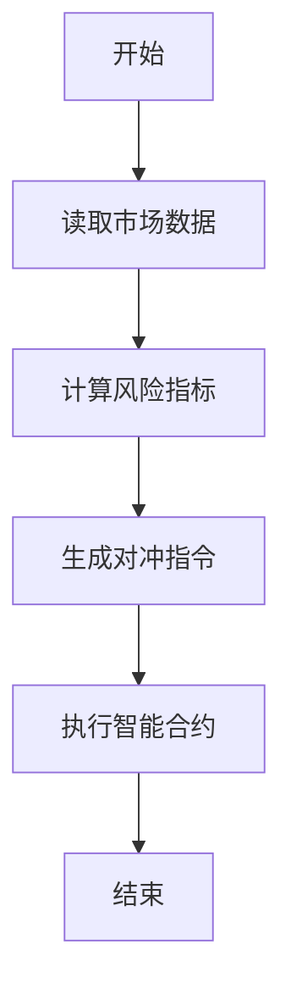
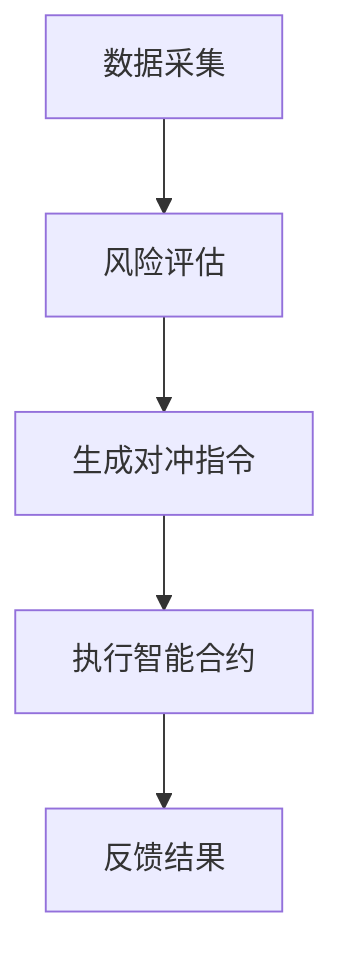
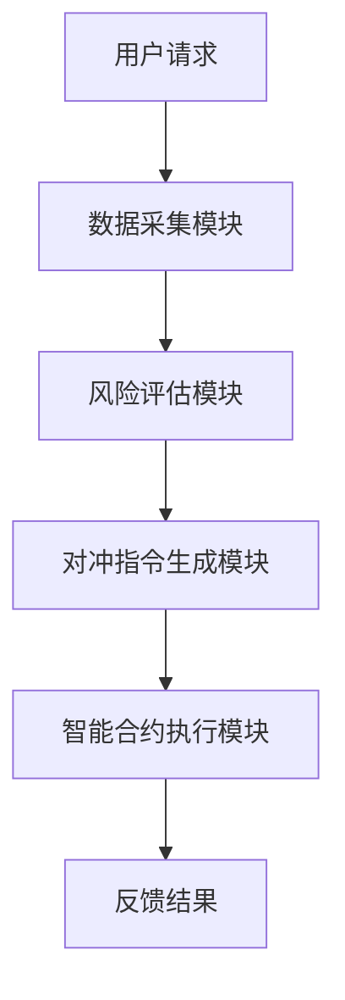

                 


# 特价股票投资中的智能合约自动化风险对冲策略

> 关键词：智能合约，风险对冲，特价股票，自动化投资，区块链技术

> 摘要：本文详细探讨了在特价股票投资中利用智能合约实现自动化风险对冲的策略。通过分析智能合约的核心原理、算法实现、系统架构以及实际案例，本文为投资者提供了一套高效的自动化对冲方案，帮助其在股票市场中降低风险、优化投资策略。

---

# 第1章: 特价股票与智能合约的背景介绍

## 1.1 特价股票的基本概念
### 1.1.1 特价股票的定义与特点
特价股票通常指价格低于市场平均水平的股票，具有低估值和高增长潜力的特点。这类股票通常来自中小型企业或处于困境中的企业，投资者通过长期持有或短期操作获利。

### 1.1.2 特价股票的投资价值分析
- 低估值：股价低于内在价值，具有上涨潜力。
- 高增长：部分特价股票来自高成长性企业。
- 市场波动性：特价股票价格波动较大，适合灵活操作。

### 1.1.3 特价股票的市场现状与发展趋势
当前市场中，特价股票因其高增长潜力和低估值特性，吸引了大量投资者的关注。随着市场波动加剧，投资者对自动化风险管理的需求日益增加。

## 1.2 智能合约的核心概念
### 1.2.1 智能合约的定义与特点
智能合约是基于区块链技术的自动执行合同，具有去中心化、不可篡改、自动执行的特点。

### 1.2.2 智能合约的工作原理
智能合约通过区块链技术实现自动执行，利用预设的条件触发相应的操作，确保合同条款的严格执行。

### 1.2.3 智能合约在金融领域的应用前景
智能合约在金融领域的应用前景广阔，特别是在自动化交易、风险管理等领域，能够提高交易效率和安全性。

## 1.3 自动化风险对冲策略的背景
### 1.3.1 风险对冲的基本概念
风险对冲是通过投资组合调整，降低市场波动带来的风险。

### 1.3.2 自动化对冲的优势与挑战
自动化对冲的优势在于快速响应市场变化，但同时也面临技术复杂性和市场波动性带来的挑战。

### 1.3.3 特价股票投资中的风险对冲需求
在特价股票投资中，市场波动大，投资者需要通过自动化对冲策略来降低风险。

## 1.4 本章小结
本章介绍了特价股票的基本概念、投资价值以及智能合约的核心概念和应用前景，为后续内容奠定了基础。

---

# 第2章: 智能合约与自动化风险对冲的核心概念

## 2.1 智能合约的原理与实现
### 2.1.1 智能合约的执行机制
智能合约通过区块链节点的共识机制自动执行，确保合同条款的严格执行。

### 2.1.2 智能合约的编程语言与开发框架
常用编程语言如Solidity，以及开发框架如Ethereum、Hyperledger等，为智能合约的开发提供了支持。

### 2.1.3 智能合约的安全性与可靠性
通过密码学技术确保智能合约的安全性，避免被篡改或攻击。

## 2.2 自动化风险对冲策略的设计
### 2.2.1 风险对冲的数学模型
利用回归分析、马科夫模型等数学工具，构建风险对冲模型。

### 2.2.2 自动化对冲的逻辑架构
通过预设的市场指标和阈值，智能合约自动触发对冲操作。

### 2.2.3 对冲策略的动态调整机制
根据市场变化实时调整对冲策略，确保风险控制的有效性。

## 2.3 智能合约与自动化对冲的结合
### 2.3.1 智能合约在对冲策略中的角色
智能合约作为执行工具，确保对冲策略的自动执行。

### 2.3.2 对冲策略的自动化执行流程
从市场数据采集、风险评估到对冲指令生成，整个流程由智能合约自动完成。

### 2.3.3 对冲策略的实时监控与反馈
通过区块链节点实时监控对冲效果，并根据反馈调整策略。

## 2.4 本章小结
本章详细讲解了智能合约的实现原理和自动化对冲策略的设计，为后续章节的算法实现奠定了基础。

---

# 第3章: 智能合约自动化风险对冲的算法原理

## 3.1 对冲策略的数学模型
### 3.1.1 风险评估的数学公式
$$ \text{风险值} = \alpha \times \text{市场波动率} + \beta \times \text{相关性指标} $$

### 3.1.2 对冲比例的计算公式
$$ \text{对冲比例} = \frac{\text{风险敞口}}{\text{对冲工具价值}} $$

### 3.1.3 对冲效果的评价指标
- Value-at-Risk (VaR)
- Conditional Value-at-Risk (CVaR)
- Sharpe比率

## 3.2 智能合约的算法实现
### 3.2.1 算法流程图（使用 Mermaid）


### 3.2.2 算法的Python实现
```python
def risk_assessment(data):
    # 计算市场波动率和相关性指标
    return risk_value

def generate_hedging_order(risk_value):
    # 根据风险值生成对冲指令
    return order

# 示例调用
market_data = read_market_data()
risk = risk_assessment(market_data)
order = generate_hedging_order(risk)
execute_order(order)
```

## 3.3 算法的优化与改进
### 3.3.1 算法的优化策略
- 引入机器学习模型提升风险评估精度。
- 增加市场数据的实时性，缩短数据采集周期。

### 3.3.2 算法的性能测试
通过回测历史数据，验证算法的稳定性和收益能力。

### 3.3.3 算法的鲁棒性分析
分析算法在极端市场情况下的表现，确保其在各种情况下的有效性。

## 3.4 本章小结
本章通过数学模型和算法实现，详细讲解了智能合约在风险对冲中的应用，为后续系统设计提供了技术支持。

---

# 第4章: 智能合约与自动化对冲的系统架构

## 4.1 系统功能设计
### 4.1.1 系统功能模块划分
- 数据采集模块：实时采集市场数据。
- 风险评估模块：计算风险指标。
- 对冲策略模块：生成对冲指令。
- 执行模块：通过智能合约执行对冲操作。

### 4.1.2 功能模块的交互流程


### 4.1.3 功能模块的实现方式
- 数据采集：通过API接口获取市场数据。
- 风险评估：基于数学模型计算风险值。
- 对冲指令生成：根据风险评估结果生成具体的操作指令。

## 4.2 系统架构设计
### 4.2.1 系统架构的总体设计
采用分层架构，包括数据层、业务逻辑层和应用层。

### 4.2.2 系统架构的分层设计
- 数据层：存储市场数据和对冲指令。
- 业务逻辑层：实现风险评估和对冲策略。
- 应用层：提供用户界面和交互功能。

### 4.2.3 系统架构的扩展性分析
通过模块化设计，便于后续功能扩展和升级。

## 4.3 系统接口设计
### 4.3.1 系统接口的定义
- 数据接口：提供市场数据的读取和写入功能。
- 对冲接口：生成和执行对冲指令。

### 4.3.2 系统接口的交互流程


## 4.4 本章小结
本章通过系统架构设计，详细描述了智能合约自动化对冲的整体结构和实现方式，为后续的项目实战提供了理论支持。

---

# 第5章: 项目实战

## 5.1 环境安装与配置
### 5.1.1 智能合约开发环境的搭建
安装Ethereum钱包、Solidity编译器等开发工具。

### 5.1.2 数据采集工具的安装
使用Python的requests库或第三方API获取市场数据。

## 5.2 系统核心实现
### 5.2.1 智能合约的编写与部署
编写Solidity智能合约，部署到Ethereum区块链。

### 5.2.2 对冲策略的实现
在Python中实现风险评估和对冲指令生成的逻辑。

## 5.3 代码实现与解读
### 5.3.1 智能合约代码
```solidity
// SPDX-License-Identifier: MIT
pragma solidity ^0.8.0;

contract RiskHedging {
    function calculateRisk(bytes memory data) external pure returns (uint) {
        // 实现风险评估逻辑
        return 100; // 示例返回值
    }

    function generateHedgingOrder(uint risk) external pure returns (bytes memory) {
        // 生成对冲指令
        return abi.encodePacked(risk);
    }
}
```

### 5.3.2 对冲策略的Python代码
```python
def risk_assessment(data):
    # 实现风险评估逻辑
    return risk_value

def generate_hedging_order(risk_value):
    # 生成对冲指令
    return order

# 示例运行
market_data = read_market_data()
risk = risk_assessment(market_data)
order = generate_hedging_order(risk)
execute_order(order)
```

## 5.4 实际案例分析
### 5.4.1 案例背景
假设市场出现剧烈波动，需要通过智能合约自动执行对冲操作。

### 5.4.2 案例分析
通过具体数据，展示智能合约在实际投资中的应用效果。

## 5.5 项目小结
总结项目实施过程中的经验与教训，提出改进建议。

---

# 第6章: 最佳实践与小结

## 6.1 最佳实践
### 6.1.1 系统安全性
确保智能合约代码的安全性，避免漏洞被利用。

### 6.1.2 系统性能优化
通过优化算法和架构设计，提升系统的运行效率。

### 6.1.3 风险管理
定期回顾和调整对冲策略，适应市场变化。

## 6.2 项目小结
通过本项目的实施，验证了智能合约在特价股票投资中的应用价值，为投资者提供了一种高效的风险对冲方案。

## 6.3 展望
随着区块链技术和人工智能的不断发展，智能合约在金融领域的应用前景将更加广阔。

---

# 作者：AI天才研究院/AI Genius Institute & 禅与计算机程序设计艺术 /Zen And The Art of Computer Programming

---

本文通过详细的技术分析和实际案例，展示了智能合约在特价股票投资中的应用潜力，为投资者和开发人员提供了重要的参考价值。

