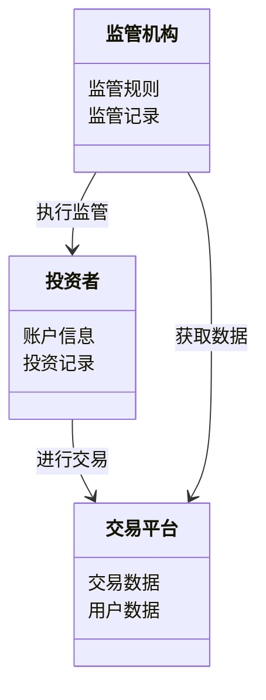
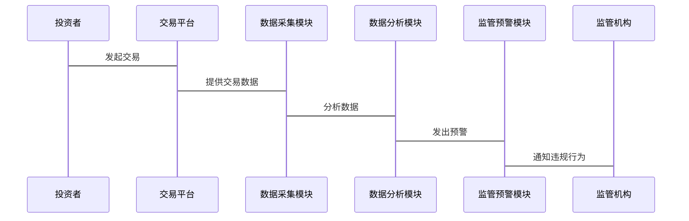

                 


# 特价股票投资中的智能监管合规策略

> 关键词：智能监管，合规策略，特价股票，算法原理，系统架构

> 摘要：本文探讨了在特价股票投资中如何利用智能监管合规策略，通过技术手段确保投资行为的合规性。文章从背景介绍、核心概念、算法原理、系统架构到项目实战，全面分析了智能监管在特价股票投资中的应用，并提出了具体的实现方案和注意事项。

---

## 第一部分: 特价股票投资中的智能监管合规策略背景与概述

### 第1章: 特价股票投资的背景与特点

#### 1.1 特价股票投资的背景
##### 1.1.1 特价股票的定义与特点
特价股票通常指价格低于市场平均水平的股票，具有高波动性和高风险回报比的特点。投资者希望通过低价买入高价卖出来获利。

##### 1.1.2 特价股票投资的市场现状
当前市场中，特价股票投资吸引了大量散户和机构投资者，但也面临监管不严、信息不对称等问题。

##### 1.1.3 特价股票投资的潜在风险
包括市场波动大、流动性差、信息不透明等风险，需要通过智能监管来控制风险。

#### 1.2 智能监管合规的背景
##### 1.2.1 监管合规的定义与重要性
监管合规是指投资行为符合相关法律法规，是保障市场公平和投资者利益的重要手段。

##### 1.2.2 智能监管的兴起与技术支撑
随着人工智能技术的发展，智能监管通过大数据分析和机器学习实现自动化监管，提高监管效率。

##### 1.2.3 智能监管在金融领域的应用
智能监管已应用于反欺诈、风险控制等领域，但在特价股票投资中的应用仍需进一步探索。

#### 1.3 特价股票投资与智能监管的结合
##### 1.3.1 特价股票投资中的监管需求
投资者需确保投资行为合规，避免违规操作。

##### 1.3.2 智能监管在特价股票投资中的应用前景
通过智能监管技术，实时监控交易行为，识别异常交易，确保合规性。

##### 1.3.3 特价股票投资中的合规策略框架
构建智能监管系统，包括数据采集、分析、预警和反馈机制，确保投资行为合规。

#### 1.4 本章小结
特价股票投资具有高风险和高回报的特点，智能监管通过技术手段确保投资行为的合规性，是提升投资效率和风险控制的重要手段。

---

## 第二部分: 智能监管合规策略的核心概念与联系

### 第2章: 智能监管合规策略的核心概念

#### 2.1 智能监管合规策略的定义
##### 2.1.1 智能监管的定义
智能监管是指利用人工智能技术对市场行为进行实时监控和分析，识别违规行为。

##### 2.1.2 合规策略的定义
合规策略是为确保投资行为符合相关法律法规而制定的一系列规则和措施。

##### 2.1.3 智能监管合规策略的内涵
通过智能技术实现监管策略的自动化和智能化，提高监管效率和准确性。

#### 2.2 智能监管合规策略的属性特征
##### 2.2.1 数据驱动性
智能监管依赖于大量数据的采集和分析，数据的准确性和完整性直接影响监管效果。

##### 2.2.2 智能性
通过机器学习等技术，智能监管能够自动识别异常行为，无需人工干预。

##### 2.2.3 合规性
智能监管策略必须符合相关法律法规，确保监管行为的合法性和有效性。

#### 2.3 智能监管合规策略的ER实体关系图
```mermaid
erDiagram
    actor 投资者 {
        <属性> 账户信息
        <属性> 投资记录
    }
    actor 监管机构 {
        <属性> 监管规则
        <属性> 监管记录
    }
    actor 交易平台 {
        <属性> 交易数据
        <属性> 用户数据
    }
    投资者 --> 交易平台 : 进行交易
    监管机构 --> 交易平台 : 获取数据
    监管机构 --> 投资者 : 执行监管
```

---

## 第三部分: 智能监管合规策略的算法原理

### 第3章: 监管合规策略的算法原理

#### 3.1 监管合规策略的算法选择
##### 3.1.1 监管合规问题的分类
包括市场操纵检测、内幕交易识别、虚假信息披露等。

##### 3.1.2 监管合规算法选择
常用算法包括监督学习（如随机森林、支持向量机）和无监督学习（如聚类分析）。

##### 3.1.3 监管合规算法的优缺点对比
监督学习适用于已知标签的数据，无监督学习适用于未知标签的数据。

#### 3.2 监管合规策略的算法实现
##### 3.2.1 监管合规算法的流程
1. 数据采集：收集交易数据、市场数据和投资者行为数据。
2. 数据预处理：清洗数据，处理缺失值和异常值。
3. 特征提取：提取关键特征，如交易频率、金额波动等。
4. 模型训练：使用机器学习算法训练模型。
5. 模型评估：通过准确率、召回率等指标评估模型性能。
6. 模型部署：将模型应用于实际监管场景。

##### 3.2.2 监管合规算法的数学模型
使用监督学习中的随机森林模型：
$$
\text{模型训练} = \sum_{i=1}^{n} (y_i - \hat{y}_i)^2
$$
其中，$y_i$是真实标签，$\hat{y}_i$是预测标签。

##### 3.2.3 监管合规算法的代码实现
```python
import pandas as pd
from sklearn.ensemble import RandomForestClassifier
from sklearn.metrics import accuracy_score

# 数据加载
data = pd.read_csv('transaction_data.csv')

# 特征工程
features = data[['交易金额', '交易频率', '投资者行为']]
labels = data['是否违规']

# 模型训练
model = RandomForestClassifier()
model.fit(features, labels)

# 模型预测
predictions = model.predict(features)

# 模型评估
print("准确率:", accuracy_score(labels, predictions))
```

#### 3.3 监管合规策略的算法优化
##### 3.3.1 参数调整
调整随机森林的参数，如n_estimators和max_depth，以提高模型性能。

##### 3.3.2 模型融合
结合多种算法，如集成学习，提高模型的准确性和稳定性。

##### 3.3.3 实时监控
通过流数据处理技术，实现对交易行为的实时监控和预警。

---

## 第四部分: 智能监管合规策略的系统架构

### 第4章: 系统架构设计

#### 4.1 问题场景介绍
##### 4.1.1 系统目标
构建智能监管系统，实现对特价股票投资的实时监控和合规管理。

##### 4.1.2 系统范围
涵盖交易数据采集、分析、预警和反馈的全过程。

##### 4.1.3 使用场景
包括实时监控、异常检测、合规报告生成等。

#### 4.2 系统功能设计
##### 4.2.1 领域模型设计


##### 4.2.2 系统架构设计


##### 4.2.3 系统接口设计
- 数据采集接口：从交易平台获取交易数据。
- 数据分析接口：对交易数据进行分析，识别异常行为。
- 监管预警接口：向监管机构发出预警信号。
- 合规报告接口：生成合规报告，供监管机构审查。

##### 4.2.4 系统交互设计


---

## 第五部分: 智能监管合规策略的项目实战

### 第5章: 项目实战

#### 5.1 环境安装
##### 5.1.1 安装Python和相关库
```bash
pip install numpy pandas scikit-learn matplotlib
```

##### 5.1.2 安装机器学习框架
```bash
pip install scikit-learn
```

#### 5.2 系统核心实现
##### 5.2.1 数据采集模块
```python
import requests
import pandas as pd

url = 'https://api.example.com/transactions'
response = requests.get(url)
data = response.json()
df = pd.DataFrame(data)
```

##### 5.2.2 数据分析模块
```python
from sklearn.ensemble import RandomForestClassifier

features = df[['amount', 'frequency', 'behavior']]
labels = df['is违规']

model = RandomForestClassifier()
model.fit(features, labels)
```

##### 5.2.3 监管预警模块
```python
import numpy as np

threshold = 0.9
predictions = model.predict(features)
alerts = np.where(predictions == 1, '异常交易', '正常交易')
```

##### 5.2.4 合规报告模块
```python
from datetime import datetime

report = {
    'timestamp': datetime.now().isoformat(),
    'alerts': alerts.tolist()
}
print(report)
```

#### 5.3 案例分析
##### 5.3.1 案例背景
某投资者在特价股票交易中频繁进行大额交易，触发监管预警。

##### 5.3.2 数据分析
通过模型分析，发现该投资者的交易行为符合市场操纵的特征。

##### 5.3.3 预警处理
监管机构收到预警后，进一步调查并确认该投资者的行为违规，对其进行处罚。

#### 5.4 项目小结
通过智能监管系统，能够实时监控交易行为，识别异常交易，有效防范违规行为，保障市场公平。

---

## 第六部分: 智能监管合规策略的最佳实践

### 第6章: 最佳实践

#### 6.1 小结
智能监管合规策略在特价股票投资中的应用，能够提高监管效率，降低投资风险。

#### 6.2 注意事项
- 数据隐私保护：确保交易数据的安全性和隐私性。
- 模型可解释性：选择可解释性较强的算法，便于监管机构审查。
- 模型更新：定期更新模型，适应市场变化。

#### 6.3 拓展阅读
建议读者进一步阅读相关文献，了解智能监管在其他金融领域的应用。

---

## 作者：AI天才研究院/AI Genius Institute & 禅与计算机程序设计艺术 /Zen And The Art of Computer Programming

---

通过以上内容，我们全面探讨了智能监管合规策略在特价股票投资中的应用，从背景介绍、核心概念、算法原理到系统架构和项目实战，为投资者和监管机构提供了有效的解决方案和实施指南。

