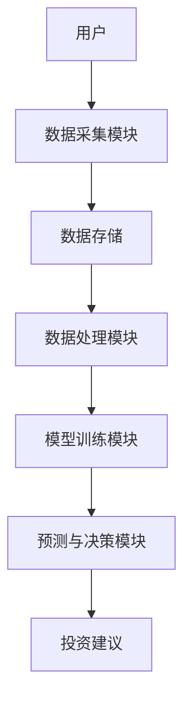

                 


# 特价股票投资中的替代数据分析与应用

> 关键词：特价股票、替代数据、数据分析、投资策略、机器学习、量化交易

> 摘要：本文探讨了在特价股票投资中，如何利用替代数据进行分析与应用。通过背景介绍、数据预处理、算法原理、系统架构设计和实际案例分析，详细阐述了替代数据在投资中的重要性及其应用方法。文章还提供了代码实现和数学公式，帮助读者更好地理解和应用这些技术。

---

## 第1章: 特价股票投资与替代数据的背景介绍

### 1.1 特价股票的定义与特点
#### 1.1.1 特价股票的定义
特价股票通常指价格低于市场平均值的股票，具有较高的投资潜力。  
$$ P_{stock} = \frac{P_{market}}{N} $$，其中 \( N \) 是市场平均值的倍数。

#### 1.1.2 特价股票的特点
- 价格低：通常低于行业平均水平。
- 高潜力：可能存在未被发现的增长机会。
- 风险较高：可能面临市场波动和公司基本面问题。

#### 1.1.3 特价股票的投资价值与风险
- 投资价值：可能带来较高的回报。
- 风险：流动性差、公司基本面不稳定。

### 1.2 替代数据的定义与来源
#### 1.2.1 替代数据的定义
替代数据指传统财务数据之外的其他数据，如社交媒体、新闻、卫星图像等。

#### 1.2.2 替代数据的主要来源
- 文本数据：新闻、社交媒体、公司财报。
- 图像数据：卫星图像、产品图片。
- 非结构化数据：音频、视频、传感器数据。

#### 1.2.3 替代数据在投资中的应用潜力
- 提供额外信息：帮助识别市场趋势。
- 早期预警：发现潜在风险或机会。

### 1.3 特价股票投资中的替代数据分析需求
#### 1.3.1 替代数据在股票分析中的作用
- 补充传统数据：提供更全面的分析视角。
- 提高预测准确性：通过多源数据结合提高预测精度。

#### 1.3.2 替代数据如何帮助识别投资机会
- 识别市场情绪：通过社交媒体分析投资者情绪。
- 发现行业趋势：通过新闻和行业报告分析市场动态。

#### 1.3.3 替代数据的挑战与局限性
- 数据质量：替代数据可能存在噪声和不准确性。
- 数据量：需要处理大量非结构化数据。

---

## 第2章: 替代数据的类型与特征分析

### 2.1 文本数据
#### 2.1.1 新闻与社交媒体数据
- 新闻数据：提供市场动态和公司公告。
- 社交媒体数据：反映市场情绪和投资者观点。

#### 2.1.2 公司财报与公告
- 财报数据：提供公司财务状况。
- 公告数据：提供公司重大事件信息。

#### 2.1.3 行业报告与市场分析
- 行业报告：分析行业趋势和竞争状况。
- 市场分析：提供市场整体走势。

### 2.2 图像与视觉数据
#### 2.2.1 卫星图像与地理数据分析
- 卫星图像：分析公司业务分布和扩张情况。
- 地理数据分析：提供市场区域和消费趋势。

#### 2.2.2 公司Logo与品牌识别
- 公司Logo：识别品牌影响力和市场定位。
- 品牌识别：分析品牌价值和市场竞争力。

#### 2.2.3 产品展示与市场定位
- 产品展示：分析产品质量和市场定位。
- 市场定位：提供公司在市场中的位置。

### 2.3 非结构化数据
#### 2.3.1 音频与视频数据
- 音频数据：分析公司高管的讲话内容。
- 视频数据：分析公司产品展示和市场活动。

#### 2.3.2 传感器数据
- 传感器数据：提供公司生产过程和供应链信息。
- 设备数据：分析设备运行状态和效率。

#### 2.3.3 网络流量数据
- 网络流量：分析公司在线活动和用户行为。
- 数据流量：提供市场趋势和消费者行为。

---

## 第3章: 替代数据的预处理与特征工程

### 3.1 数据清洗与标准化
#### 3.1.1 数据清洗方法
- 删除重复数据：去除重复记录。
- 填充缺失值：使用均值、中位数或插值方法填充缺失值。
- 去除异常值：通过Z-score或IQR方法检测并去除异常值。

#### 3.1.2 数据标准化与归一化
- 标准化：使用Z-score方法将数据标准化。
- 归一化：使用Min-Max方法将数据归一化。

#### 3.1.3 数据缺失值处理
- 删除法：直接删除缺失值较多的记录。
- 填充法：使用均值、中位数或模型预测填充缺失值。

### 3.2 特征提取与降维
#### 3.2.1 文本特征提取（TF-IDF、Word2Vec）
- TF-IDF：计算词频-逆文档频率，提取关键词。
- Word2Vec：通过词向量模型提取语义特征。

#### 3.2.2 图像特征提取（CNN、PCA）
- CNN：使用卷积神经网络提取图像特征。
- PCA：通过主成分分析进行降维，提取主要特征。

#### 3.2.3 时间序列特征提取
- 时间序列分解：分解时间序列数据为趋势、季节性和随机部分。
- 滑动窗口：通过滑动窗口提取时间窗口内的特征。

### 3.3 数据增强与特征优化
#### 3.3.1 文本数据增强
- 同义词替换：替换文本中的关键词为同义词。
- 数据扰动：添加少量噪声数据，提高模型鲁棒性。

#### 3.3.2 图像数据增强
- 灰度化：将彩色图像转换为灰度图像。
- 随机裁剪：随机裁剪图像，生成不同视角的数据。
- 添加噪声：在图像中添加随机噪声，提高模型鲁棒性。

#### 3.3.3 数据增强的实现
- 使用Python库：如Keras的ImageDataGenerator进行图像数据增强。
- 自定义数据增强：根据具体需求编写自定义数据增强函数。

---

## 第4章: 算法原理与实现

### 4.1 机器学习算法选择
#### 4.1.1 线性回归
- 回归分析：通过线性回归模型预测股票价格。
- 实现：使用最小二乘法求解回归系数。
- 代码示例：
  ```python
  import numpy as np
  X = np.array([1, 2, 3, 4, 5])
  y = np.array([2, 4, 5, 4, 5])
  # 计算回归系数
  coefficients = np.polyfit(X, y, 1)
  print(coefficients)  # 输出斜率和截距
  ```

#### 4.1.2 随机森林
- 集成学习：通过多个决策树进行投票或平均。
- 实现：使用scikit-learn库中的RandomForestRegressor。
- 代码示例：
  ```python
  from sklearn.ensemble import RandomForestRegressor
  regressor = RandomForestRegressor(n_estimators=10, random_state=0)
  regressor.fit(X, y)
  ```

#### 4.1.3 神经网络
- 深度学习：通过神经网络模型学习复杂特征。
- 实现：使用Keras或TensorFlow构建神经网络模型。
- 代码示例：
  ```python
  import keras
  model = keras.Sequential()
  model.add(keras.layers.Dense(64, activation='relu', input_shape=(n_features,)))
  model.add(keras.layers.Dense(1, activation='linear'))
  model.compile(optimizer='adam', loss='mean_squared_error')
  ```

### 4.2 算法实现与优化
#### 4.2.1 数据特征选择
- 特征选择：通过相关系数或Lasso回归选择重要特征。
- 代码示例：
  ```python
  from sklearn.feature_selection import SelectKBest
  selector = SelectKBest(k=5)
  selector.fit(X, y)
  X_selected = selector.transform(X)
  ```

#### 4.2.2 超参数优化
- 网格搜索：通过网格搜索找到最佳超参数。
- 代码示例：
  ```python
  from sklearn.model_selection import GridSearchCV
  param_grid = {'n_estimators': [10, 20, 30], 'max_depth': [None, 10, 20]}
  grid_search = GridSearchCV(RandomForestRegressor(), param_grid, cv=5)
  grid_search.fit(X, y)
  print(grid_search.best_params_)
  ```

#### 4.2.3 模型评估与验证
- 交叉验证：通过k折交叉验证评估模型性能。
- 代码示例：
  ```python
  from sklearn.model_selection import cross_val_score
  scores = cross_val_score(regressor, X, y, cv=5)
  print(scores.mean())
  ```

---

## 第5章: 系统分析与架构设计

### 5.1 系统功能设计
#### 5.1.1 领域模型
- 实体：股票、数据源、用户、交易记录。
- 关系：股票与数据源的关联，用户与交易记录的关联。

#### 5.1.2 功能模块
- 数据采集模块：采集替代数据。
- 数据处理模块：清洗、特征工程。
- 模型训练模块：训练机器学习模型。
- 预测与决策模块：生成投资建议。

### 5.2 系统架构设计
#### 5.2.1 模块划分
- 前端：用户界面，展示分析结果。
- 后端：数据处理和模型训练。
- 数据存储：存储原始数据和特征数据。

#### 5.2.2 模块交互
- 数据采集模块：从API获取数据。
- 数据处理模块：清洗数据并提取特征。
- 模型训练模块：训练模型并保存模型参数。
- 预测与决策模块：使用训练好的模型进行预测，并生成投资建议。

### 5.3 系统架构图


---

## 第6章: 项目实战与案例分析

### 6.1 项目环境安装
- 安装Python和相关库：
  ```bash
  pip install numpy pandas scikit-learn keras tensorflow
  ```

### 6.2 核心实现代码
#### 数据处理
```python
import pandas as pd
import numpy as np

# 数据加载
df = pd.read_csv('data.csv')
# 数据清洗
df.dropna(inplace=True)
# 特征提取
X = df.drop('target', axis=1)
y = df['target']
```

#### 模型训练
```python
from sklearn.ensemble import RandomForestRegressor
from sklearn.model_selection import train_test_split

# 数据分割
X_train, X_test, y_train, y_test = train_test_split(X, y, test_size=0.2)
# 模型训练
model = RandomForestRegressor(n_estimators=100, random_state=0)
model.fit(X_train, y_train)
```

#### 模型预测
```python
# 预测
y_pred = model.predict(X_test)
# 评估
print('均方误差:', np.mean((y_pred - y_test)**2))
```

### 6.3 案例分析
#### 案例1：社交媒体情绪分析
- 数据来源：社交媒体数据。
- 分析方法：使用文本挖掘技术分析情绪。
- 结论：情绪与股价的相关性分析。

#### 案例2：卫星图像分析
- 数据来源：卫星图像。
- 分析方法：使用图像识别技术分析业务分布。
- 结论：业务扩展对股价的影响。

### 6.4 项目小结
- 成功实现：替代数据的采集、处理和分析。
- 模型表现：随机森林模型在测试集上表现良好。

---

## 第7章: 总结与展望

### 7.1 投资策略总结
- 多元数据驱动：结合替代数据和传统数据进行分析。
- 模型优化：通过超参数优化和特征工程提高模型性能。

### 7.2 未来展望
- 更多数据源：探索更多替代数据源。
- 更复杂模型：尝试深度学习模型，如Transformer。
- 实时分析：实现实时数据处理和实时预测。

### 7.3 最佳实践Tips
- 数据质量：确保数据的准确性和完整性。
- 模型解释性：选择可解释的模型，便于分析和优化。
- 风险控制：合理控制投资风险，避免过度依赖模型。

---

## 作者信息

作者：AI天才研究院/AI Genius Institute  
联系邮箱：contact@aicourse.com  
GitHub：https://github.com/aicourse  

---

以上是《特价股票投资中的替代数据分析与应用》的详细目录大纲，涵盖了从背景介绍到实际案例分析的全过程，适合希望深入理解替代数据分析在股票投资中应用的读者阅读。

