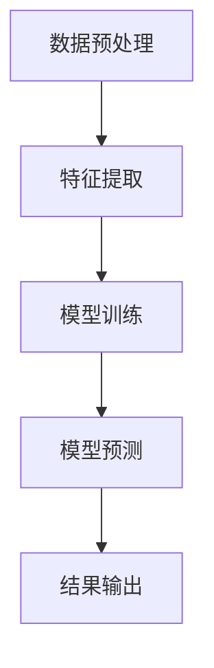
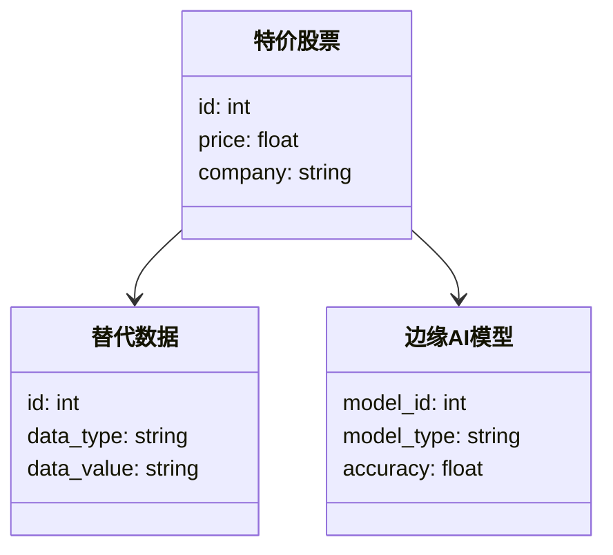

                 


```markdown
# 特价股票投资中的替代数据分析与边缘人工智能应用

> 关键词：特价股票、替代数据、边缘人工智能、金融数据分析、实时决策

> 摘要：本文深入探讨了特价股票投资中替代数据分析与边缘人工智能的应用，结合实际案例，系统地介绍了从数据采集到模型训练，再到实时决策的全过程。通过分析替代数据的特征提取与处理、边缘人工智能的优势与挑战，结合具体的算法实现与系统架构设计，展示了如何利用新兴技术提升股票投资的效率与准确性。

---

# 第一部分: 特价股票投资的背景与概念

## 第1章: 特价股票的定义与特征

### 1.1 特价股票的定义与特征

#### 1.1.1 特价股票的定义
特价股票通常指价格低于某一特定阈值的股票，例如低于5元的股票。这类股票通常被认为具有较高的投资潜力，但也伴随着较高的风险。

#### 1.1.2 特价股票的市场特征
- 价格波动较大
- 市值较小
- 投资者群体多样化

#### 1.1.3 特价股票投资的潜在机会与风险
- 机会：低价股票可能因公司业绩改善或市场波动而迅速升值。
- 风险：高波动性可能导致投资损失，且部分公司可能面临财务困境。

---

## 第2章: 替代数据的定义与分类

### 2.1 替代数据的定义与分类

#### 2.1.1 替代数据的定义
替代数据是指除传统财务数据之外的其他数据源，包括社交媒体、新闻、卫星图像等，用于辅助投资决策。

#### 2.1.2 替代数据的主要分类
| 数据类型 | 描述 | 示例 |
|----------|------|------|
| 文本数据 | 包括社交媒体帖子、新闻文章 | Twitter、新闻网站 |
| 图像数据 | 包括卫星图像、公司Logo | 卫星图像、公司官网 |
| 语音数据 | 包括电话会议录音 | 电话会议录音 |
| 结构化数据 | 包括公司供应链数据 | 供应链物流数据 |

#### 2.1.3 替代数据在金融领域的应用
- 社交媒体数据用于情绪分析
- 新闻数据用于市场趋势预测
- 公司基本面数据用于补充财务分析

---

## 第3章: 边缘人工智能的基本概念

### 3.1 边缘人工智能的核心特点

#### 3.1.1 边缘计算的定义
边缘计算是指在数据生成的地方（如设备端）进行计算和数据处理，而非将所有数据上传到云端。

#### 3.1.2 边缘人工智能的优势
- 低延迟：实时处理数据
- 高效率：减少数据传输成本
- 高安全性：数据不出本地

#### 3.1.3 边缘人工智能在金融领域的优势
- 实时监控市场波动
- 快速响应投资者需求
- 提高数据处理的安全性

---

# 第二部分: 替代数据分析的核心算法与实现

## 第4章: 替代数据的特征提取与处理

### 4.1 文本数据的特征提取

#### 4.1.1 自然语言处理技术
- 分词：将文本分割成词语或短语。
- 词袋模型：将文本表示为词语的出现频率。
- 词嵌入：使用如Word2Vec生成词语向量。

#### 4.1.2 文本情感分析的实现
- 使用情感分析模型（如BERT）对新闻文本进行情感分类。
- 情感分析结果用于预测市场情绪。

### 4.2 图像数据的特征提取

#### 4.2.1 图像处理技术
- 图像增强：调整图像亮度、对比度等。
- 图像分割：将图像分成多个区域，提取关键区域特征。

#### 4.2.2 图像识别技术
- 使用卷积神经网络（CNN）进行图像分类。
- 例如，识别公司Logo以辅助判断公司状态。

---

## 第5章: 边缘人工智能的核心算法与实现

### 5.1 边缘计算中的机器学习模型

#### 5.1.1 线性回归算法
- 算法流程图（使用 Mermaid）：



- Python代码实现：

```python
import numpy as np

# 数据预处理
X = np.array([1, 2, 3, 4])
y = np.array([2, 3, 4, 5])

# 模型训练
m = np.linalg.inv(np.dot(X.T, X))
b = np.dot(m, np.dot(X.T, y))
```

---

## 第6章: 边缘人工智能在股票投资中的应用

### 6.1 实时数据分析的效率提升

#### 6.1.1 边缘计算的实时性优势
- 数据在边缘端实时处理，减少延迟。
- 支持高频交易和实时市场监控。

#### 6.1.2 边缘人工智能的成本优势
- 减少数据传输到云端的成本。
- 边缘设备本地处理数据，节省带宽。

---

# 第三部分: 系统分析与架构设计

## 第7章: 系统功能设计

### 7.1 领域模型设计

#### 7.1.1 领域模型类图（Mermaid）



### 7.2 系统架构设计

#### 7.2.1 系统架构图（Mermaid）


---

## 第8章: 项目实战

### 8.1 环境安装

#### 8.1.1 安装必要的库
```bash
pip install numpy pandas scikit-learn tensorflow
```

### 8.2 系统核心实现

#### 8.2.1 数据处理代码

```python
import pandas as pd
import numpy as np

# 数据预处理
data = pd.read_csv('data.csv')
X = data[['feature1', 'feature2']]
y = data['target']
```

#### 8.2.2 模型训练代码

```python
from sklearn.linear_model import LinearRegression

model = LinearRegression()
model.fit(X, y)
```

---

## 第9章: 最佳实践与小结

### 9.1 小结

- 替代数据与边缘人工智能的结合为特价股票投资提供了新的视角。
- 通过实时数据分析和边缘计算，投资者可以更快地做出决策。

### 9.2 注意事项

- 数据隐私和安全问题需要特别注意。
- 模型的可解释性和准确性是投资决策的关键。

### 9.3 拓展阅读

- 《机器学习在金融领域的应用》
- 《边缘计算与实时数据分析》

---

# 作者

作者：AI天才研究院/AI Genius Institute & 禅与计算机程序设计艺术 /Zen And The Art of Computer Programming
```

