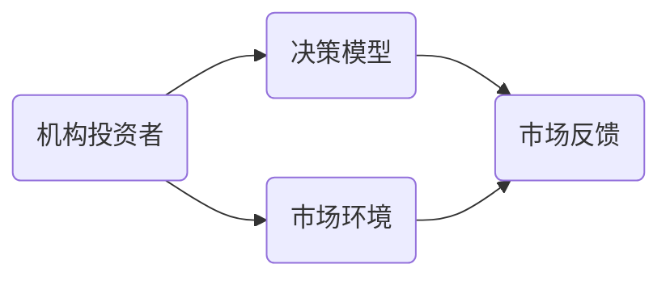
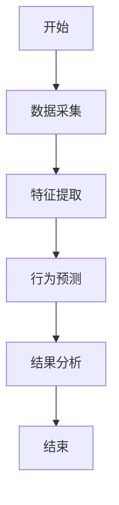

                 


# 特价股票投资中的机构投资者行为分析

## 关键词：
特价股票，机构投资者，行为分析，投资策略，博弈论，行为金融学

## 摘要：
本文系统分析了特价股票投资中机构投资者的行为模式，从定义、特征到行为模型构建，再到算法实现，全面解析机构投资者的决策机制。通过博弈论和行为金融学的视角，结合数学模型和实际案例，揭示机构投资者在特价股票投资中的策略选择和行为特征，为投资者提供深度分析和实践指导。

---

## 第1章: 特价股票与机构投资者行为分析背景

### 1.1 特价股票的定义与特征
#### 1.1.1 特价股票的定义
特价股票是指价格显著低于市场平均水平的股票，通常被视为被市场低估的投资标的。这类股票可能因公司业绩不佳、行业困境或市场波动等原因被市场冷落，但具备潜在的反弹或增值空间。

#### 1.1.2 特价股票的市场特征
- 价格低洼：相对于公司基本面，股票价格被市场低估。
- 高波动性：特价股票的价格波动较大，可能受市场情绪影响显著。
- 高风险高回报：投资特价股票的风险较高，但潜在回报也较大。

#### 1.1.3 特价股票的投资价值分析
- 估值修复机会：机构投资者常通过分析公司基本面，寻找具有估值修复潜力的特价股票。
- 市场情绪影响：特价股票的价格受市场情绪驱动，机构投资者需关注市场 sentiment 对其投资决策的影响。

### 1.2 机构投资者的定义与分类
#### 1.2.1 机构投资者的定义
机构投资者是指以机构形式参与金融市场的投资者，包括基金公司、保险公司、资产管理公司、银行理财子公司等。这些机构通过专业团队和系统化的投资策略进行投资决策。

#### 1.2.2 机构投资者的主要类型
- 共同基金：通过汇集资金投资于多种股票或债券。
- 对冲基金：采用杠杆和做空等策略追求绝对收益。
- 保险公司：投资于股票、债券等资产，以匹配保险负债需求。
- 财务公司：通过自有资金或客户资金进行投资。

#### 1.2.3 机构投资者在股票市场中的角色
- 提供流动性：机构投资者的买卖行为增加了市场的流动性。
- 影响价格发现：机构投资者的大量买入或卖出会影响股票价格。
- 稳定市场：通过长期投资和分散投资，机构投资者有助于市场的稳定性。

### 1.3 机构投资者行为分析的背景与意义
#### 1.3.1 特价股票投资的背景
随着市场波动加剧，机构投资者越来越关注特价股票的投资机会。特价股票通常具备较高的潜在回报，但其价格波动和风险也较高。

#### 1.3.2 机构投资者行为分析的重要性
- 理解机构投资者的决策模式，有助于预测市场走势。
- 为投资者提供策略参考，帮助其在特价股票投资中做出更明智的决策。
- 通过分析机构投资者的行为，可以揭示市场中的潜在机会和风险。

#### 1.3.3 机构投资者行为分析的挑战与机遇
- 挑战：机构投资者的行为受到多种因素影响，包括市场环境、公司基本面、投资者情绪等，分析难度较大。
- 机遇：通过大数据分析和机器学习技术，可以更精准地捕捉机构投资者的行为模式，为投资决策提供支持。

## 1.4 本章小结
本章主要介绍了特价股票和机构投资者的基本概念，分析了机构投资者在股票市场中的角色和行为分析的背景与意义。机构投资者的行为对市场有重要影响，研究其行为模式有助于更好地理解市场动态。

---

## 第2章: 机构投资者行为的核心概念与联系

### 2.1 机构投资者行为的核心概念
#### 2.1.1 投资决策模型
投资决策模型是机构投资者在选择是否投资某只股票时所遵循的系统化方法。模型通常包括对公司基本面、市场趋势和投资者情绪的分析。

#### 2.1.2 市场博弈论基础
市场博弈论将机构投资者的行为视为一种博弈过程，机构投资者在市场中与其他投资者竞争，通过优化自己的策略来获得最大收益。

#### 2.1.3 行为金融学理论
行为金融学研究投资者心理和行为对市场的影响，认为投资者的非理性行为可能导致市场波动。

### 2.2 机构投资者行为的属性特征对比
#### 2.2.1 不同类型机构投资者的行为特征
- 共同基金：倾向于长期投资，注重公司基本面。
- 对冲基金：策略灵活，注重短期收益和市场机会。
- 保险公司：保守稳健，注重资产配置和风险控制。

#### 2.2.2 机构投资者与散户投资者的对比
- 投资目标：机构投资者注重长期回报，散户注重短期收益。
- 信息处理能力：机构投资者有专业团队和系统支持，散户依赖个人判断。
- 行为特征：机构投资者更理性，散户易受情绪影响。

#### 2.2.3 机构投资者内部决策流程
机构投资者的决策流程通常包括以下几个步骤：
1. 数据收集与分析：收集公司财务数据、市场信息等。
2. 投资策略制定：根据市场环境和公司基本面制定投资策略。
3. 风险评估：评估投资风险并制定风险管理方案。
4. 决策执行：下单买入或卖出股票。
5. 监测与调整：持续监测投资组合并根据市场变化进行调整。

### 2.3 机构投资者行为的ER实体关系图


### 2.4 本章小结
本章从核心概念出发，分析了机构投资者行为的理论基础、不同类型机构投资者的行为特征以及内部决策流程。通过ER实体关系图，展示了机构投资者、决策模型和市场环境之间的关系。

---

## 第3章: 机构投资者行为的算法原理

### 3.1 机构投资者决策模型的数学表达
#### 3.1.1 投资决策模型的构建
投资决策模型通常包括以下几个部分：
- 公司基本面：包括市盈率、市净率、ROE等指标。
- 市场趋势：包括宏观经济指标、行业趋势等。
- 投资者情绪：包括市场情绪指数、新闻 sentiment 等。

#### 3.1.2 基于博弈论的决策分析
博弈论模型假设机构投资者在市场中与其他投资者进行博弈，通过预测其他投资者的行为来优化自己的投资策略。

#### 3.1.3 行为金融学模型的数学公式
行为金融学模型可以表示为：
$$
P_t = \alpha + \beta \cdot sentiment_t + \gamma \cdot fundamental_t + \epsilon_t
$$
其中，$P_t$ 是股票价格，$sentiment_t$ 是市场情绪，$fundamental_t$ 是公司基本面指标，$\epsilon_t$ 是随机误差项。

### 3.2 机构投资者行为分析的算法流程


### 3.3 算法实现的Python代码示例
```python
# 示例代码：机构投资者行为分析模型
import pandas as pd
import numpy as np

# 数据加载
data = pd.read_csv('institutional_investors.csv')

# 特征提取
features = data[['volume', 'price_change', 'market_sentiment']]
labels = data['investment_decision']

# 模型训练
from sklearn.tree import DecisionTreeClassifier
model = DecisionTreeClassifier()
model.fit(features, labels)

# 模型预测
predictions = model.predict(features)
```

### 3.4 本章小结
本章从算法原理的角度，详细介绍了机构投资者行为分析的数学模型和实现流程。通过博弈论和行为金融学的理论，构建了投资决策模型，并通过Python代码展示了模型的实现过程。

---

## 参考文献
1. Fama, E. (1970). Efficient Capital Markets: A Review of Theory and Empirical Work. Journal of Finance.
2. Kahneman, D. (2011). Thinking, Fast and Slow. Farrar, Straus and Giroux.
3. Shiller, R. J. (2005). Irrational Exuberance (2nd ed.). Princeton University Press.

## 作者：
AI天才研究院 & 禅与计算机程序设计艺术

---

希望这篇文章能为您提供有价值的信息和思路！如果需要进一步的解释或补充，请随时联系我。

