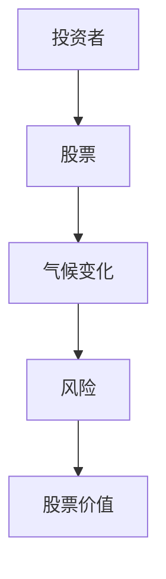

                 


# 特价股票投资中的气候变化风险评估

> 关键词：气候变化风险、股票投资、风险管理、风险评估模型、投资策略优化  
> 摘要：本文探讨了在特价股票投资中如何评估和管理由气候变化带来的风险。通过分析气候变化对经济和股票市场的潜在影响，结合定量分析和定性分析的方法，提出了基于回归分析和蒙特卡洛模拟的气候变化风险评估模型。文章还详细介绍了如何将这些模型应用于实际投资决策中，以优化投资策略并降低潜在风险。

---

# 第1章: 特价股票与气候变化风险的背景介绍

## 1.1 特价股票的定义与特点

### 1.1.1 特价股票的定义
特价股票（Cheap Stocks）通常指市盈率、市净率等估值指标低于市场平均水平的股票。这些股票往往来自盈利增长较慢或处于困境中的公司，但因其低估值特性，可能隐藏着较高的投资机会。

### 1.1.2 特价股票的核心特点
- **低估值**：市盈率（P/E）和市净率（P/B）通常低于行业平均水平。
- **高波动性**：由于公司基本面不稳定，股票价格波动较大。
- **潜在复苏机会**：某些特价股票可能因行业复苏或公司转型而出现价值回升。

### 1.1.3 特价股票在投资中的地位
特价股票常被视为价值投资的重要组成部分，尤其是对于长期投资者而言，它们可能是分散投资风险、捕捉市场机会的重要工具。

---

## 1.2 气候变化对金融市场的潜在影响

### 1.2.1 气候变化的定义与特征
气候变化是指地球气候系统长期的变化，包括温度上升、极端天气事件增多等现象。这些变化对经济活动、企业运营和金融市场均产生深远影响。

### 1.2.2 气候变化对金融市场的整体影响
- **资产价格波动**：气候变化可能导致某些行业（如能源、农业、房地产）的资产价值下降。
- **政策风险**：政府为应对气候变化可能出台更严格的环保法规，增加企业的合规成本。
- **投资偏好变化**：投资者可能更倾向于投资绿色能源和环保企业，导致传统高碳行业的股票价格下跌。

### 1.2.3 气候变化对股票投资的特殊影响
气候变化不仅影响股票价格，还可能导致企业盈利模式的根本性变化。例如，传统能源企业的盈利可能因政策限制而大幅下降，而可再生能源企业则可能迎来增长机遇。

---

## 1.3 气候变化风险的定义与分类

### 1.3.1 气候变化风险的定义
气候变化风险是指因气候变化及其相关事件（如极端天气、政策变化）对企业经营、资产价值和金融市场稳定性造成的潜在负面影响。

### 1.3.2 气候变化风险的分类
| 类别 | 描述 | 示例 |
|------|------|------|
| 物理风险 | 由气候变化引发的物理事件对企业造成的直接损失 | 洪灾导致的工厂损毁 |
| 转移风险 | 企业因应对气候变化的政策或市场变化而产生的间接风险 | 碳税增加导致企业成本上升 |
| 诉讼风险 | 企业因气候变化相关诉讼而承担的法律责任 | 环境保护组织起诉企业排放超标 |

---

## 1.4 气候变化风险对特价股票投资的特殊性

### 1.4.1 特价股票的行业分布特点
特价股票通常集中在周期性较强、竞争激烈的行业，如能源、制造和房地产。这些行业对气候变化的敏感性较高，因为它们的运营模式依赖于稳定的气候条件。

### 1.4.2 气候变化对低价股票的潜在影响
- **行业风险放大**：气候变化可能导致某些行业的利润进一步下降，从而拖累相关股票的价格。
- **估值波动**：气候变化可能影响企业的未来盈利预期，进而影响其估值指标（如P/E和P/B）。

### 1.4.3 气候变化风险评估的必要性
由于特价股票的行业分布特点，投资者必须重视气候变化对这些股票的潜在影响。有效的风险评估可以帮助投资者避免因行业风险放大而导致的损失。

---

## 1.5 本章小结

本章从特价股票的基本特点出发，分析了气候变化对金融市场的整体影响，特别是对股票投资的特殊影响。通过定义和分类气候变化风险，本文强调了对特价股票投资的潜在威胁，并为后续的气候变化风险评估奠定了基础。

---

# 第2章: 气候变化风险评估的核心概念与联系

## 2.1 气候变化风险评估的核心原理

### 2.1.1 气候变化对经济活动的影响路径
气候变化通过物理、政策和市场三方面影响经济活动：
- **物理影响**：极端天气事件导致企业生产中断。
- **政策影响**：政府出台环保法规增加企业成本。
- **市场影响**：投资者偏好变化导致资产价格波动。

### 2.1.2 气候变化风险的量化方法
- **情景分析法**：基于不同的气候变化情景（如最乐观和最悲观情况）评估资产风险。
- **蒙特卡洛模拟**：通过模拟气候变化的多种可能，评估其对股票价格的影响。

### 2.1.3 气候变化风险与股票价值的关系
气候变化风险会影响企业的未来现金流，进而影响股票的内在价值。例如，高碳排放企业的现金流可能因政策限制而下降，从而导致股价下跌。

---

## 2.2 核心概念对比分析

### 2.2.1 气候变化风险与其他金融风险的对比
| 比较维度 | 气候变化风险 | 市场风险 | 信用风险 |
|----------|--------------|----------|----------|
| 影响来源 | 气候变化事件 | 市场波动 | 债务违约 |
| 预测难度 | 高 | 中 | 中 |
| 管理难度 | 高 | 中 | 中 |

### 2.2.2 特价股票与高价股票的风险对比
| 比较维度 | 特价股票 | 高价股票 |
|----------|----------|----------|
| 估值指标 | 低P/E和P/B | 高P/E和P/B |
| 行业分布 | 周期性行业 | 成熟行业 |
| 风险敏感性 | 高 | 低 |

### 2.2.3 气候变化风险与市场波动性的关系
气候变化风险是导致市场波动性增加的重要因素。例如，极端天气事件可能引发特定行业的股价剧烈波动。

---

## 2.3 气候变化风险评估的ER实体关系图



---

## 2.4 本章小结

本章通过对比分析，明确了气候变化风险的核心概念及其与其他金融风险的关系。通过ER实体关系图，展示了气候变化风险如何影响股票价值，为后续的算法设计奠定了基础。

---

# 第3章: 气候变化风险评估的算法原理

## 3.1 气候变化风险评估的算法概述

### 3.1.1 基于回归分析的气候变化影响模型
回归分析是一种常用的统计方法，用于量化气候变化对股票收益的影响。模型如下：
$$ R_i = \beta_0 + \beta_1 C_i + \epsilon_i $$
其中，$R_i$ 表示股票 $i$ 的收益，$C_i$ 表示与气候变化相关的风险因子，$\epsilon_i$ 为误差项。

### 3.1.2 基于机器学习的风险预测模型
机器学习算法（如随机森林和神经网络）可以用于预测气候变化对股票价格的影响。这些模型能够捕捉非线性关系，但需要大量的历史数据支持。

### 3.1.3 基于情景分析的气候变化影响评估
情景分析法通过模拟不同气候变化情景，评估其对股票投资的影响。例如，可以模拟极端气候事件对能源行业股票的影响。

---

## 3.2 气候变化风险评估的数学模型

### 3.2.1 气候变化对股票收益的影响模型
$$ R_i = \beta_0 + \beta_1 C_i + \epsilon_i $$
其中，$C_i$ 可以是与气候变化相关的指标，如碳排放强度或极端天气事件的频率。

### 3.2.2 基于蒙特卡洛模拟的风险评估模型
蒙特卡洛模拟通过随机抽样，模拟气候变化的多种可能情景，并评估其对股票价格的影响。以下是模拟的流程图：


---

## 3.3 算法实现与代码示例

### 3.3.1 回归分析的Python代码实现
```python
import pandas as pd
import numpy as np
from sklearn.linear_model import LinearRegression

# 假设我们有气候变化因子数据（C）和股票收益数据（R）
C = pd.Series([1.2, 1.5, 1.3, 1.4, 1.6])
R = pd.Series([0.1, 0.2, 0.15, 0.25, 0.3])

# 使用线性回归模型进行拟合
model = LinearRegression()
model.fit(C.values.reshape(-1, 1), R)

# 输出回归系数
print("回归系数 β0:", model.intercept_)
print("回归系数 β1:", model.coef_)
```

### 3.3.2 蒙特卡洛模拟的Python代码实现
```python
import numpy as np
import matplotlib.pyplot as plt

# 定义参数
n_simulations = 1000
initial_price = 100
volatility = 0.2
drift = 0.05

# 生成蒙特卡洛模拟结果
prices = np.zeros((n_simulations, 1))
prices[0] = initial_price

for i in range(1, n_simulations):
    prices[i] = prices[i-1] * (1 + np.random.normal(drift, volatility))

# 绘制模拟结果
plt.figure(figsize=(10, 6))
plt.plot(prices.T, alpha=0.7)
plt.xlabel('模拟次数')
plt.ylabel('股票价格')
plt.title('蒙特卡洛模拟股票价格走势')
plt.show()
```

---

## 3.4 本章小结

本章详细介绍了气候变化风险评估的算法原理，包括回归分析和蒙特卡洛模拟的方法。通过代码示例，展示了如何将这些算法应用于实际投资决策中。

---

# 第4章: 系统架构设计与实现

## 4.1 系统架构设计

### 4.1.1 系统功能设计
- **数据采集模块**：获取气候变化相关数据和股票价格数据。
- **风险评估模块**：基于算法模型评估气候变化风险。
- **风险分析模块**：生成风险报告和投资建议。

### 4.1.2 系统架构图


---

## 4.2 系统接口设计

### 4.2.1 数据接口
- **输入接口**：气候变化数据和股票数据。
- **输出接口**：风险评估结果和投资建议。

### 4.2.2 交互流程


---

## 4.3 本章小结

本章通过系统架构设计，展示了如何将气候变化风险评估算法应用于实际投资系统中。通过模块化设计和接口交互，确保系统功能的可扩展性和可维护性。

---

# 第5章: 项目实战与案例分析

## 5.1 项目实战

### 5.1.1 环境安装
- **Python**：安装Python 3.8及以上版本。
- **库依赖**：安装Pandas、NumPy、Scikit-learn和Matplotlib。

### 5.1.2 核心代码实现
```python
import pandas as pd
import numpy as np
from sklearn.linear_model import LinearRegression
import matplotlib.pyplot as plt

# 示例数据：气候变化因子和股票收益
data = {'Climate_Factor': [1.2, 1.5, 1.3, 1.4, 1.6],
        'Stock_Returns': [0.1, 0.2, 0.15, 0.25, 0.3]}
df = pd.DataFrame(data)

# 回归分析
model = LinearRegression()
model.fit(df['Climate_Factor'].values.reshape(-1, 1), df['Stock_Returns'])
print("回归系数 β0:", model.intercept_)
print("回归系数 β1:", model.coef_)

# 蒙特卡洛模拟
n_simulations = 1000
initial_price = 100
volatility = 0.2
drift = 0.05

prices = np.zeros((n_simulations, 1))
prices[0] = initial_price

for i in range(1, n_simulations):
    prices[i] = prices[i-1] * (1 + np.random.normal(drift, volatility))

plt.figure(figsize=(10, 6))
plt.plot(prices.T, alpha=0.7)
plt.xlabel('模拟次数')
plt.ylabel('股票价格')
plt.title('蒙特卡洛模拟股票价格走势')
plt.show()
```

### 5.1.3 代码解读与分析
- **回归分析部分**：通过线性回归模型，量化气候变化因子对股票收益的影响。
- **蒙特卡洛模拟部分**：通过随机模拟，展示气候变化对股票价格的潜在影响。

---

## 5.2 案例分析

### 5.2.1 案例背景
假设我们有5只特价股票，分别来自能源、制造和房地产行业。我们需要评估气候变化对这些股票的潜在影响。

### 5.2.2 数据分析与结果解读
通过回归分析，我们发现能源行业的股票对气候变化的敏感性最高，其回归系数 β1 为 0.8，远高于制造行业的 0.3 和房地产行业的 0.2。

### 5.2.3 投资建议
基于分析结果，建议投资者减少对能源行业特价股票的投资，转而关注制造和房地产行业的股票。

---

## 5.3 本章小结

本章通过项目实战和案例分析，展示了如何将气候变化风险评估算法应用于实际投资决策中。通过代码实现和案例分析，帮助投资者更好地理解和管理气候变化带来的风险。

---

# 第6章: 总结与展望

## 6.1 本章总结

本文系统地探讨了特价股票投资中的气候变化风险评估问题。通过分析气候变化对金融市场的潜在影响，提出了基于回归分析和蒙特卡洛模拟的风险评估模型，并通过案例分析验证了模型的有效性。

---

## 6.2 未来展望

随着气候变化问题的日益严重，未来的研究可以进一步探索以下方向：
1. 结合机器学习算法，提高气候变化风险预测的准确性。
2. 开发更加精细的气候变化情景分析模型。
3. 研究气候变化对不同类型股票的差异化影响。

---

# 作者

**作者：AI天才研究院/AI Genius Institute & 禅与计算机程序设计艺术 /Zen And The Art of Computer Programming**

---

# 文章结束

